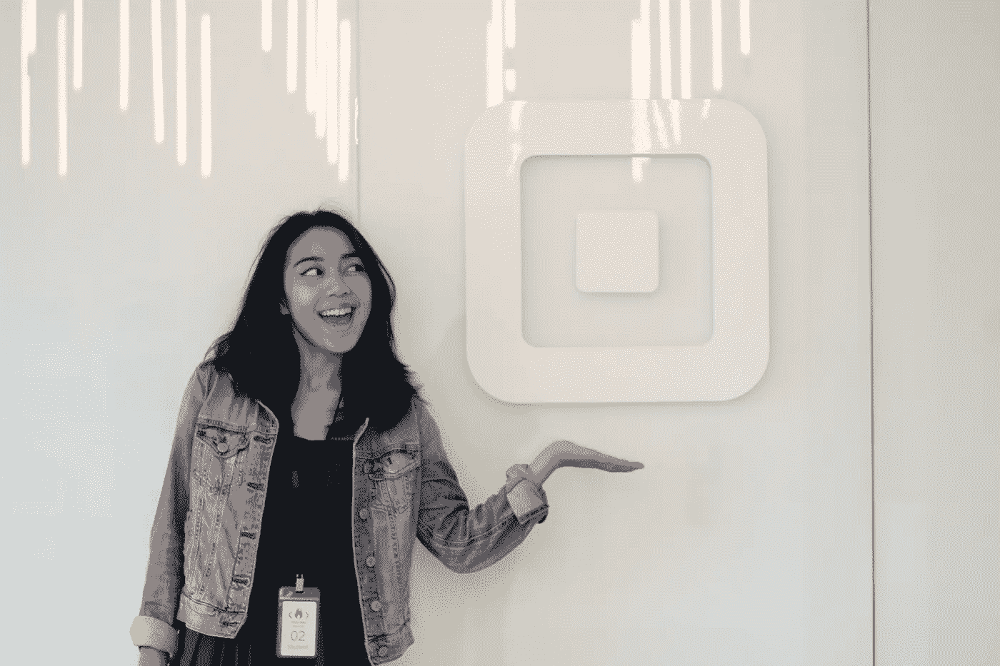
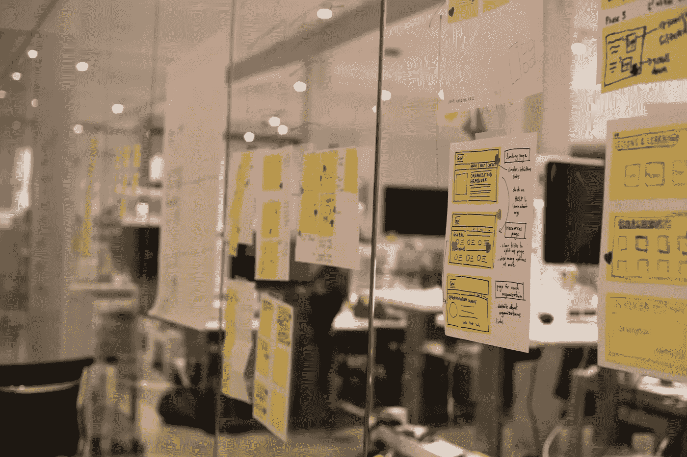
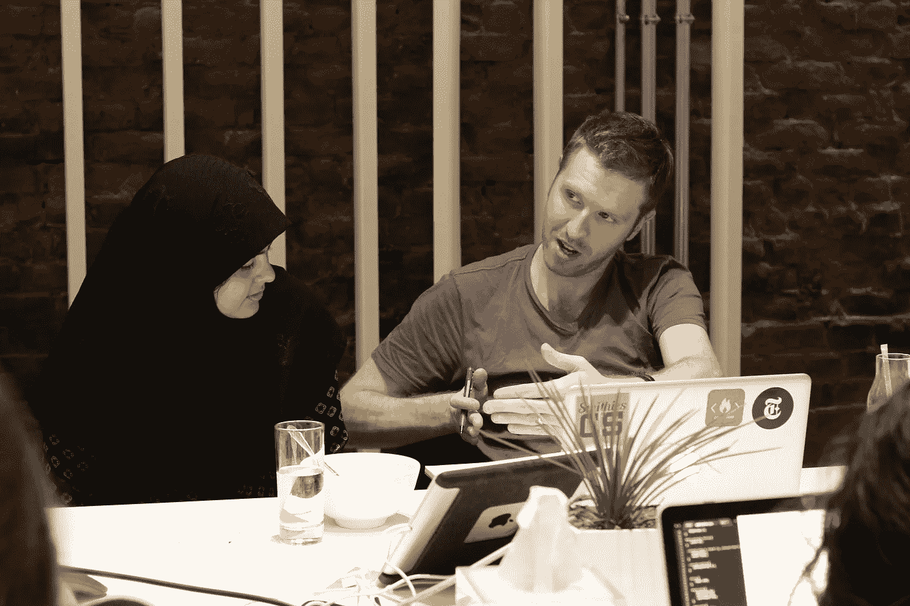
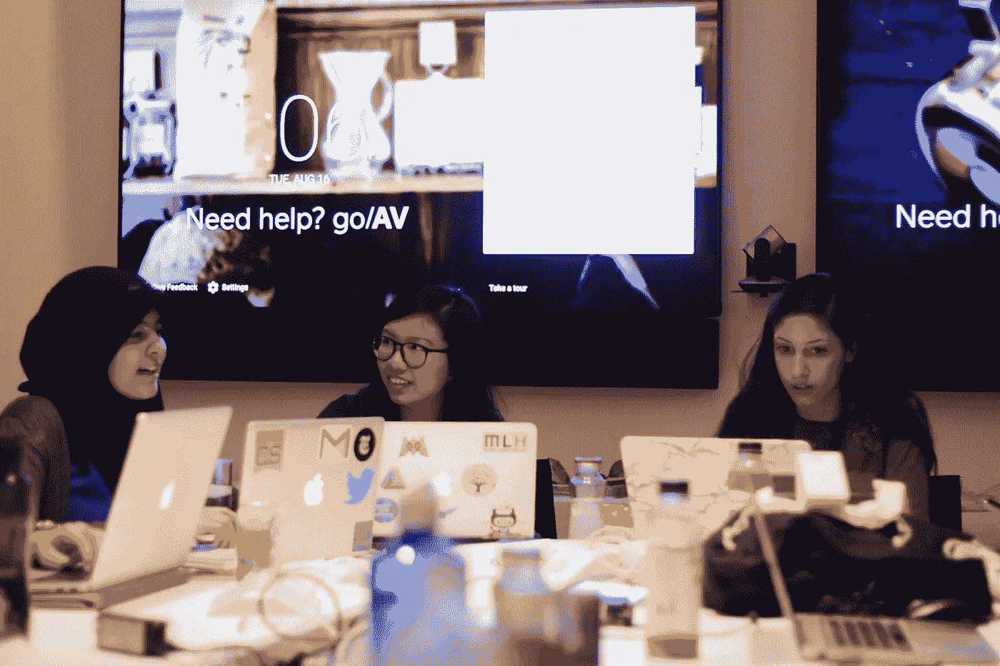
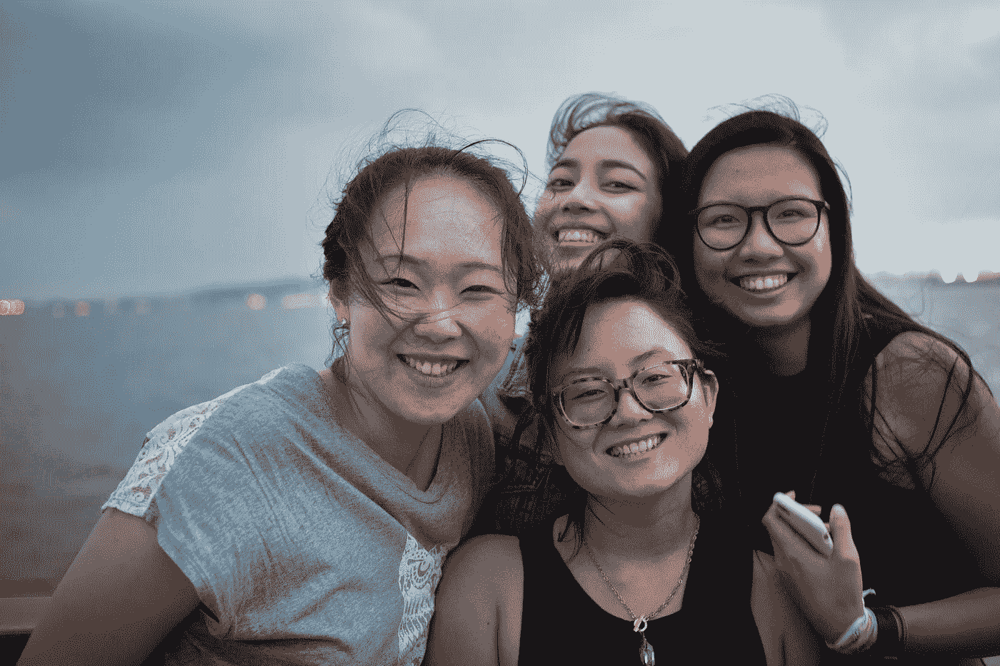
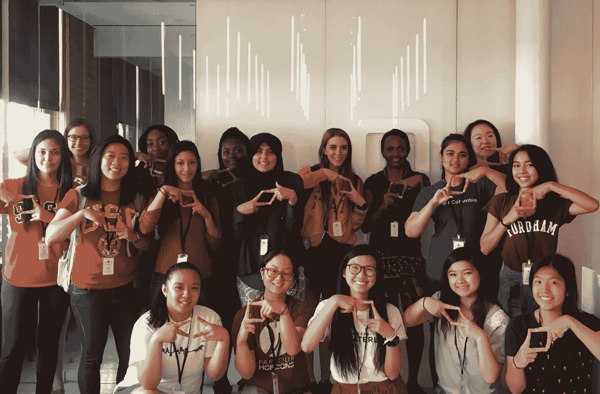

# 变成一个圆的正方形

> 原文：<https://medium.com/square-corner-blog/becoming-a-well-rounded-square-e1f57e3e40e1?source=collection_archive---------2----------------------->

## Square 大学代码营的经验教训

> 注意，我们已经行动了！如果您想继续了解 Square 的最新技术内容，请访问我们的新家[https://developer.squareup.com/blog](https://developer.squareup.com/blog)

The adorable Square logo in the NYC office’s lobby.

A 几周前，我有机会在[广场](https://squareup.com/)的纽约办公室与其他 16 名有才华的女性工程师一起参加[广场大学代码营](https://squareup.com/code-camp/college)，这是一个为学习工程的女性提供的为期五天的沉浸式项目，重点是发展技术和领导技能。

虽然这一周充满了关于 web 和移动应用程序开发、产品设计流程的研讨会，以及与有洞察力的 Square 开发人员的讨论，但我发现，我学到最多的时刻是我用来了解周围人的时刻。以下是我在节目中最喜欢的一些瞬间。

# 学习新技术

分散在这一周的是关于 Ruby、Rails、设计、iOS 和 web 开发的技术研讨会。每个研讨会都是对其主题的介绍，但足够深入，让我们学到了一些新的东西，我们可以在本周晚些时候的激情项目中使用。

劳拉用 Ruby 的方法 define_method 教我们“元编程”；Alyssa 向我们展示了 MVC 结构以及 Rails 应用程序如何像 Shake Shack 一样工作——也就是客户端和服务器；Nick 告诉我们，在做出伟大设计的过程中，需要大量的研究和不断的迭代；加桑帮助我们许多人创建了第一个 iPhone 应用程序；Marie 告诉我们网站幕后的神奇之处，也就是后端网络开发。

Hanging up the wireframes we sketched (that one’s mine!) and placing heart stickers on what we like about others’ designs. Photo by Ashley Chen.

# 师徒制

对我来说，指导经常发生；每当一个人告诉我关于他们自己的事情，激励我，或者激励我的时候，这种情况就会发生。当我问 Nick——一位广场设计师——如何为我们的激情项目证明我的设计选择的合理性时，他告诉我好的设计是如何传达想法的。他对这个主题的热情和舒适鼓励我对自己的想法更有信心。在我们交谈的那几分钟里，他是我的导师。

Zainab (left) and Nick (right) talking serious business.

Alyssa 是 Square 的一名软件工程师，一天午餐时，她被指定为我的导师，她告诉我她是如何创建 Square 的 WomEng group 的，这是一个由 Square 的女性工程师组成的社区，最初是一个小团体，但后来扩展成了 Square 以外的网络。艾丽莎不是我的导师，因为格洛丽亚把她和我配对作为项目的一部分；Alyssa 是我的导师，因为她提醒了我在学校创建一个类似团体的愿望，这在以前有点像白日梦，并激励我采取行动，改变我想看到的世界。

我觉得很幸运，那个星期在广场和这么多有才华的人交谈，因为我得到了比一个女孩所希望的更多的指导。

# 打击冒名顶替综合症

我们黑客马拉松的目标是与全球妇女协会合作，为他们网站的媒体库提供新的功能。当开始着手我们的激情项目时，我和我的队友们围坐在一张桌子旁，讨论我们的技能，以找出我们可以构建的东西。我们中的大多数人已经有了使用 HTML 和 CSS 的经验，所以我们决定使用我们刚刚获得的关于设计原则和 Ruby on Rails 的知识，重新创建一个具有更多功能的网站。

做出这个决定后不久，我的队友 Aida 提出了一个关于在我们的 web 应用程序中使用 Bootstrap 的想法，但这不仅仅是*的一个想法，她说，“嘿，我们也可以加入 Bootstrap——或者，我的意思是，*我*不能，但你们中的一个可能可以。”我清楚地记得，当我听到这句话时，我正在绘制一个线框，其中包括我们刚刚讨论的网页的所有新功能，我立即吃了一惊。我在一个满是才华横溢的女性的房间里，其中一个无意中侮辱了自己。*

听到这样一个有才华的人如此公然贬低自己，我感觉很糟糕，所以我必须和她当面对质。在阿依达继续说下去之前，我轻轻地打断了他，说道:“等等，别这么说，你也完全可以做到的！”接下来的感觉就像潮水般的好心情，我的其他队友热情地表示同意，并插话让他们的队友放心:“你能行！”和“是的，我们可以帮助你！”还有更多。在那一刻，我感到非常幸运，能够成为如此支持我的女性群体的一员。

Enjoying our last night together on a scenic boat cruise along the Hudson River! Photo by Ashley Chen.

本周晚些时候， [Gloria](https://twitter.com/gkimbwala) ，我们出色的营地负责人和个人爵士音乐推荐人，也举办了一个关于冒名顶替综合症的研讨会，在此期间，她要求我们反思我们自己的冒名顶替综合症经历，以及我们计划如何在未来与它作斗争。格洛丽亚也激励我们所有人意识到我们的成就，提醒我们在数百名代码营七号申请者中，*有人*(实际上是很多人)真的相信我们。我们讨论了其他几种克服冒名顶替综合症的方法，但我最喜欢的策略是学会注意你的语言；如果说我从之前与队友的对话中学到了什么，那就是当我们对自己说的话是鼓励而不是怀疑时，我们会更强大。

# 主要要点

我在 Code Camp 度过的五天过得太快了，直到我坐下来思考这个问题时，我才意识到我学到了什么。

Code Camp VII! Photo by Gloria.

我不仅结交了来自美国和加拿大各地的 16 个新的好朋友，而且我也学到了一些人生经验。以下是他们的名单:

1.  **冒巨大的风险** — 整整一周，格洛丽亚反复鼓励我们在余生中这样做。如果我没有申请代码营，我就不会遇到我有幸遇到的所有了不起的人，你现在也不会读到这篇文章。承担这些风险。
2.  相信自己——为了让别人知道你相信他们，你需要相信自己。一年前，在回答“我做不到，”我可能会说，“是的，我也做不到。”然而，今天我相信自己，正因为如此，我能够提醒我的朋友艾达，她是惊人的，现在我想提醒你，你也是惊人的。
3.  **你周围的人会影响你成为什么样的人**——当我和弹钢琴的朋友一起出去玩的时候，我会练习得更多。当我和经常去健身房的朋友在一起时，我锻炼得更多。一屋子坚强聪明的女工程师让我觉得自己几乎是不可战胜的。

我不太清楚等待我的是什么，也不知道一两年后我会去哪里，但有一点是肯定的:我打算张开双臂迎接每一个机会，就像我在百老汇的会议室里与我的朋友和导师一样无所畏惧。不用把一切都整理好，我也可以。