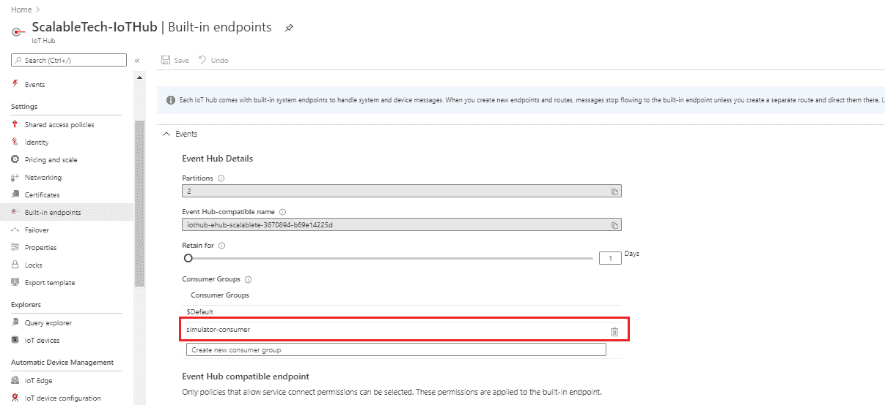

# 开始物联网——蔚蓝之路！！

> 原文：<https://medium.com/globant/begin-iot-the-azure-way-6bf3334f4989?source=collection_archive---------0----------------------->

这里我们有另一个有趣的话题，它在我们所处的数字和智能世界中引起了很多讨论。😀

当我们听到**‘物联网’**时，我们脑海中浮现出许多有趣的开放性问题，对吗？？

> *“物联网”中的“物”是什么？*
> 
> *为什么物联网中的“东西”很重要？*
> 
> *为什么选择物联网云？*
> 
> *物联网产生的信息如何创造价值？*
> 
> *物联网的范围是什么？*

现在，在缩小到'**如何使用物联网**'之前，我们首先需要了解'**什么是物联网**'，下一步是了解'**什么是 Azure 云上的物联网**'。在这篇文章中，我们将看到一个关于借助 Azure 服务实现物联网的端到端解决方案的小型演示。

**物联网**

> 物联网本身有如此多的定义，因为这个领域本身是如此广阔，但为了使它更简短，它是一种收集数据、连接设备、使设备更智能的方法

物联网基本上通过设备交换信息/数据，因为设备确实存储了大量对人类有用的数据，而互联网使设备能够相互通信。

随着互联网的兴起和在线产生的数据的增加，如我们的购物量、浏览量、点餐量和互联网上许多应用程序的使用量，**分析**进入了日常生活。

> 对于我们谈论的所有数据流和分析，解决方案是'**物联网** ' —这些设备收集数据，我们剩下的唯一工作就是使用这些信息
> 
> 我们可以将这些数据用于多种目的，比如更好地为客户服务，制造更好的药品，制造更好的机器。同样的事情是数据科学正在做的，也是互联网正在为我们做的。但尽管如此，我们需要以某种方式收集数据，当涉及到人类时，是的，我们是地球上最敏锐的人，但问题是当涉及到准确性时，唯一的问题是，人类不会像机器一样准确。所以我们需要机器来收集这些数据。

现在把点连接起来，因为互联网上的数据是巨大的，产生的数据量是巨大的，这就给了我们一个解决方案，这个解决方案就是 **IoT。😊**

> 物联网的一个未来例子是无人驾驶汽车
> 这些汽车没有司机，足够智能，可以自己带你去目的地。这些汽车配备了大量的设备，如传感器、陀螺仪、云架构、互联网等，可以感知大量的交通、行人和道路状况数据，如减速带、坑洼、弯道和急转弯，并立即以高速处理这些数据。该信息被传递给控制器，控制器做出相应的驾驶决策。人工智能和机器学习也是无人驾驶汽车的重要方面。

# Azure 上的物联网

现在，我们已经足够确信，是的，我们需要更智能的设备，是的，我们需要一个连接设备、收集数据的解决方案。下一步是缩小范围，找到一个可以为各种计算和服务提供解决方案的平台。

Azure 提供现成的服务来利用设备生成的数据。Azure 提供软件服务和计算，我们可以在特定时间租用这些服务。

从最初的头脑风暴查询中获得解决方案。

> **为何选择物联网云:**
> 易于调配、使用和管理
> 按需购买、按需扩展
> 它覆盖全球
> 它绝对能够提供端到端的安全性和隐私性
> 
> **物联网的范围**
> 如今，物联网正在人类关注的各个领域实施，如智慧城市、智慧环境、安全、智慧业务流程、智慧农业、家庭自动化和医疗保健。

**来自 Azure 物联网中心的物联网解决方案架构**

*物联网应用可以描述为* ***事物*** *(设备)发送数据即生成* ***洞察*** *。这些见解产生* ***行动*** *来改进一项业务或流程。一个例子是一个引擎(***)发送温度数据。该数据用于评估发动机是否按预期运行(***)。该洞察用于主动确定发动机维护计划的优先级(* ***【操作】*** )**

**【Azure IoT 解决方案演示**

**现在，让我们了解一下演示一个简单的物联网解决方案需要什么。**

> **首先，我们需要一个带有传感器的设备来产生遥测数据**
> 
> **我需要将此设备添加到 Azure 物联网中心。**
> 
> **一旦我们收到原始数据，我们需要将这些数据转换成有意义的信息来存储和可视化。**
> 
> **可视化可用于在传感器数据上寻找异常。**

**根据给定问题陈述的上述必要条件，我们将典型物联网解决方案的架构缩小到以下范围。**

****

**为了对其进行分类，我们使用了以下组件-**

**R **aspberryPi 模拟器:**它的湿度、温度等传感器数据很少。这是可用的在线模拟器。随机数据流被传递到在线模拟器。这是一个公开提供的预打包解决方案。**

> **这可以在 https://azure-samples.github.io/raspberry-pi-web-simulator/的**买到****

**A **zure 物联网 Hub:** 我们需要给 Azure 物联网 Hub 添加一个设备。集线器会生成一个连接字符串，设备必须使用该字符串在设备和物联网集线器之间建立安全连接。我们必须将这个连接字符串放在设备上运行的应用程序的源代码中。在我们的情况下，这是拉斯贝里 pi 在线模拟器。**

**D 为此，我们选择了 ADX (Azure Data Explorer)进行存储和可视化..因为从存储的角度来看，它是经济高效的，而且还需要将热数据和冷数据分开。当我在这里说热数据和冷数据时，ADX 附带了一个配置，我们可以在其中定义热周期和冷周期。它基于数据访问频率，如果数据访问频率高，则首选热存储，否则我们可以选择冷存储。使用 Kusto 查询语言有一个额外的好处，这是一种直观的查询语言，内嵌了我们使用的 sql 语义。**

**V**

> **首先，登录到[http://portal.azure.com](http://portal.azure.com/)**

**创建资源组→创建物联网中心→物联网设备→创建设备并注册到物联网中心**

****

**向物联网中枢添加内置端点。在下面的屏幕截图中，我们创建了一个消费者端点**

****

**向在 IoT Hub 中创建的资源组添加共享访问策略。这将生成一个连接字符串**

****

**将“**连接字符串**添加到在线 Raspberry pi 模拟器，以在设备和物联网集线器之间创建安全连接。**

****

**一旦连接字符串被添加到模拟器的源代码中，遥测数据就可以从 Raspberry pi 触发到 IoT hub。以下屏幕截图显示了遥测数据触发后生成的消息序列。**

****

> **我们刚刚从 Rasberry Pi 向物联网集线器发送了遥测数据，该遥测数据包括湿度和温度，作为传感器数据。这是从设备向物联网集线器生成的原始 json 数据包。我们将需要使用 **Azure 数据浏览器**来存储这些数据。这配置了洞察力，它是一种完全受管的分析、存储和可视化服务，使同时探索和分析数十亿个物联网事件变得简单。**

****在 Azure 中创建一个 ADX 集群****

**ADX 集群—创建数据库—添加数据接收—主数据(数据在此接收)**

****

**添加 ADX 集群并为数据接收创建数据库连接后。我们可以通过这个 URL*[*https://dataexplorer.azure.com*/](https://dataexplorer.azure.com/)建立到 azure data explorer 的连接来查询数据库，并使用 kusto 查询语言提取数据***

****

> **在这里，我使用 Kusto 查询语言创建了一个函数来创建一个文件夹，以可视化温度高于 25 和湿度高于 75 的高警报**
> 
> ****。create-or-alter function with(folder = " powerbi visualization ")highlalertdatafortempandweather {****
> 
> ****遥测|扩展 isHighAlert =温度> 25 和湿度> 75****
> 
> ****|其中 isHighAlert == true|项目 messageId，温度，湿度****
> 
> ****}****

**我们可以使用 PowerBi 工具来可视化这些数据，方法是在为从 Azure data explorer 接收数据而创建的数据库连接和 Power Bi 之间建立连接**

****

**这解释了一个端到端的解决方案，从使用传感器从设备收集原始数据，到分析和可视化原始信息。**

> ****希望这能给你一个好的触发，让你开始使用物联网 Azure 方式，并希望这能带来更多的热情来进一步探索这一点！！继续探索！！****