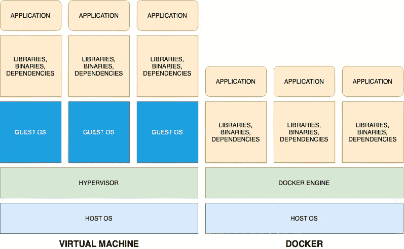

# 关于 Docker 的初学者指南

> 原文：<https://medium.easyread.co/beginners-guide-about-docker-b18db6951eaa?source=collection_archive---------4----------------------->

Docker 没有你想的那么混乱。现在就开始学习 Docker 吧，否则就太晚了，这里有一个指南给你。


Photo by [Dominik Lückmann](https://unsplash.com/@exdigy?utm_source=medium&utm_medium=referral) on [Unsplash](https://unsplash.com?utm_source=medium&utm_medium=referral)

Docker 是目前非常流行的许多技术之一，可能几乎所有的软件工程师都想了解它。你可以从他们的网站上看到 Docker 越来越多的使用。

[](https://www.docker.com/blog/docker-index-dramatic-growth-in-docker-usage-affirms-the-continued-rising-power-of-developers/) [## Docker 指数:Docker 使用量的大幅增长肯定了开发人员不断上升的实力…

### 开发人员一直是业务创新和转型不可或缺的一部分。随着…的大量增加

www.docker.com](https://www.docker.com/blog/docker-index-dramatic-growth-in-docker-usage-affirms-the-continued-rising-power-of-developers/) 

Docker 本身就是一项了不起的技术，解决了我们作为软件工程师的一些问题。在这篇文章中，我将尝试解释关于 Docker 的最简单的解释和指南。

# 为什么是 Docker？

> “它在我的机器上工作！”

每当您在不同的机器上运行应用程序时，您一定听过这句话很多次。导致该问题出现的可能性有很多，但其中一些是:

*   在另一台计算机上安装了不同版本的依赖项。
*   忘记了应用程序的“工作”配置。
*   忘记在另一台机器上安装某些依赖项。

那就是 Docker 成为**解**的时候了。

> "我们需要时间来为应用程序准备环境."

如果您的应用程序需要在多台机器上运行，作为工程师的您将向我们的老板要求时间来准备您的机器以便能够运行该应用程序。当你使用 **Docker** 时，这个“时间”可以**减少**或者可以**减少**。

> "我的机器规格不足以模拟虚拟机."

在很多情况下，您会想要在您的机器中模拟另一个操作系统来开发您的应用程序。我们知道，模拟另一个操作系统是一项繁重的任务，并不是所有的机器都能够做到这一点。Docker 可以*以某种方式* **取代**虚拟机的使用。

# Docker 是什么？


Docker logo.

[Docker](https://github.com/docker/docker) 是一个工具，旨在通过使用**容器**来简化应用程序的创建、部署和运行。容器允许我们在一个包中部署任何已经包含所需库和依赖项的应用程序。

Docker 在其主机内核机器上运行，但仍然在容器之间隔离，因此最好确保每个应用程序配置、库和依赖项不会影响其他应用程序。

## Docker VS 虚拟机

你可以说 Docker 是一个轻量级版本的虚拟机。一个主要原因是 Docker 没有为每个已经创建的容器创建一个单独的操作系统。Docker 仍然在所有运行的容器中使用和共享主机操作系统内核。



Difference between Docker and Virtual Machine

从上图中，你可以知道 Docker 去掉了第一层(客户操作系统内核),它使得 Docker 容器及其应用程序的内存使用量和启动时间减少。

即使 Docker 在内存和性能方面更好，但与虚拟机相比，Docker 仍然有自己的缺陷，那就是安全性。当 Docker 容器中运行的某个应用程序被黑客攻击或有漏洞时，它会影响主机，因为它们仍然共享同一个操作系统内核，即主机。

# 什么时候使用 Docker？


Photo by [Lukas Blazek](https://unsplash.com/@goumbik?utm_source=medium&utm_medium=referral) on [Unsplash](https://unsplash.com?utm_source=medium&utm_medium=referral)

Docker 确实是一个强大的工具，但是你需要知道我们到底什么时候需要使用 Docker，这样它不会让我们的开发和部署变得更加高效。

## 当您有一个应用程序用于多台机器时

在多台机器上运行一个应用程序是你可能需要使用 Docker 的标志之一。如果我们需要在所有需要运行应用程序的机器上重复安装应用程序、安装其依赖项和配置它，将会花费大量时间。

使用 Docker，你只需要在每台机器上安装 Docker，编写一个简单的 Docker 的相关文件，然后你就可以基于你已经编写好的文件运行我们的应用程序。该文件包含您的应用程序及其所需的依赖项。

## 当您想要测试分布式架构时

当你的公司变大了，你的应用也会变大。一个更大的应用程序最终会让你尝试实现分布式架构，或者俗称为**微服务**架构。

配置所有独立的机器在一个微服务架构内工作需要一些时间，Docker 可以帮助你减少时间。通过在您的主机上安装 Docker，您可以将我们的应用程序部署到多个容器中，作为一台单独的机器。

使用 Docker，在单台机器内测试微服务架构非常简单有效。Docker 的每个容器都将成为一台独立的机器，可以通过 Docker 自己的网络机制相互交互以及与我们自己的主机 OS 交互。

# Docker 怎么用？


Photo by [Matt Ridley](https://unsplash.com/@mattwridley?utm_source=medium&utm_medium=referral) on [Unsplash](https://unsplash.com?utm_source=medium&utm_medium=referral)

## 写一个文档

如果你想使用 Docker，Dockerfile 是主要的配置文件。它包含多种内容，如您的应用程序、应用程序的依赖项，甚至应用程序的操作系统要求。

要创建 docker 文件，您需要学习一些语法。下面是一个简单的 Dockerfile 文件，它包含了最常用的语法。

Dockerfile example.

*   **FROM —** 这个语法用在我们 Dockerfile 的开头。它将定义您的应用程序运行所需的基础环境。所提供的 Dockerfile 需要一个 Go 环境，所以它使用带有 Linux Alpine 内核的 1.14 版本的 Golang。
*   **运行—** 运行命令将根据之前的 FROM 语法执行您已经使用过的操作系统内核中的某些命令。
*   **WORKDIR —** WORKDIR 语法将改变 Docker 容器中的当前工作目录。这就像 Linux 中的`cd`导航到目标目录。
*   **复制<主机目标位置> <容器目标位置> —** 复制语法将数据从主机复制到创建的 Docker 容器中。目标位置可以写成相对路径或绝对路径。提供的示例是复制主机中与 Dockerfile 位于同一目录的所有文件，并将其放入之前声明的工作目录中。
*   **ENV —** 该语法用于在创建的容器中设置环境变量。
*   **EXPOSE <端口号> —** Expose，就像名字一样会把某个端口号暴露给外界，不管是主机还是另一个容器。
*   **CMD [command 1，arg 1，arg 2，...] —** 如果您的容器有一个默认命令，该命令需要在容器第一次运行时运行，则编写此语法。提供的示例是想要运行一个 Go 应用程序，因此它将执行一个用二进制文件自己的参数创建的二进制文件。

这些只是 Docker 文件中经常使用的语法，关于它的更多信息，你可以在 Docker [网站](https://docs.docker.com/engine/reference/builder/)上看到。

## 安装 Docker

安装 Docker 是一项非常简单的任务，按照[网站](https://docs.docker.com/get-docker/)上的指南，选择将安装 Docker 的主机操作系统。

## 建立码头工人形象

需要将一个完成的 Docker 文件构建到 Docker 映像中，这样它就可以在 Docker 容器中执行。构建 Docker 映像非常简单，下面是您需要在命令行中运行的最简单的 Docker CLI 命令。

```
docker build -t <application_name>:<application_version> .
```

点`.`字符定义了 docker 容器的上下文。它将把我们当前的目录作为上下文。`-t`标志是可选的，因为它将定义 Docker 图像的标签和版本。

## 查看现有图像

您可以在 CLI 上使用 Docker 命令查看主机中所有现有 Docker 映像的列表:

```
docker images
```

它将返回主机中的所有现有映像:

```
elasticsearch                             7.10.1                                           558380375f1a   3 weeks ago     774MB
openapitools/openapi-generator-cli        latest                                           097683db8380   6 weeks ago     136MB
qrunner-queue-connector_rabbitmq-worker   latest                                           8a3e43b8ddf8   7 weeks ago     93.6MB
<none>                                    <none>                                           8f2564949537   7 weeks ago     1.05GB
qrunner-api_dispatcher                    latest                                           22ea784fbef1   7 weeks ago     138MB
mariadb                                   10.3.25                                          5a5644205c65   2 months ago    388MB
rabbitmq                                  3.8.9-management-alpine                          727f04dff442   2 months ago    150MB
gcr.io/datadoghq/agent                    7                                                242ba6349d09   2 months ago    695MB
datadog/agent                             7                                                242ba6349d09   2 months ago    695MB
docker/desktop-kubernetes                 kubernetes-v1.19.3-cni-v0.8.5-critools-v1.17.0   7f85afe431d8   2 months ago    285MB
golang                                    1.15.3                                           4a581cd6feb1   2 months ago    839MB
debian                                    stretch-slim                                     fd6779905c35   2 months ago    55.3MB
ravioli                                   latest                                           b292a28a06f5   2 months ago    261MB
mongo                                     4.4.1                                            ba0c2ff8d362   3 months ago    492MB
```

## 码头集装箱

正如我们多次说过的，通过 Docker 运行的应用程序部署在 Docker 容器中。该容器可以使用我们机器内部构建的 docker 映像或存在于另一个服务器/存储库中的映像来运行。

要运行 Docker 容器，我们需要在 CLI 中键入最简单的命令:

```
docker run --name <container_name> -e "<ENV value that want to be set>" -p <HOST port:Container port> <image_name:image_tag>
```

*   **—名称**，这将是我们创建的容器的名称。如果不指定，Docker 会生成一个有趣的自定义名称。
*   **-e** ，这是一个设置 ENV 值的参数，运行容器时需要在启动时配置该值。
*   **-p** ，为了让你的应用程序可以在它自己的容器之外被访问，这是一个必须的参数。在用这个参数公开端口之前，确保已经公开了容器内部的端口。

## Docker 撰写

这是 Docker 的高级用法。您现在可以跳过这一步，但是如果您:

*   拥有多个相互依赖的应用程序。
*   运行容器时需要使用多个参数。

然后，您可能需要编写一个 Docker 合成文件，并使用它。Docker 合成文件以`yaml`或`yml`格式编写。由于 [YAML](https://yaml.org/) 的使用，确保文件的缩进格式正确，以防止任何错误。下面是一个 Docker 合成文件的例子。

Docker compose file example

*   **版本** —这将定义 Docker 编写的版本。
*   **网络** —这将定义容器之间使用的网络类型。
*   **服务** —这些都是我们的容器，当您执行 docker-compose 时，它们将会运行。

为了详细说明 YAML 文件中的关键和价值，下面是对它们的描述:

Docker compose file example explanation

编写完文件后，您可以使用 docker-compose 自带的简单 CLI 命令运行它，

```
# Running single container
docker-compose up <service_name># Running single container on background
docker-compose up -d <service_name># Running all the configured container
docker-compose up
```

## 查看现有容器

Docker 容器可以作为后台进程运行。您可以使用以下 Docker CLI 命令查看所有正在运行的容器:

```
docker ps
```

上面的命令只会返回当前运行的容器，如果你想看到主机内部的所有容器，你可以使用:

```
docker ps -a
```

他们都会给你一个类似这样的结果:

```
CONTAINER ID   IMAGE                          COMMAND                  CREATED         STATUS                            PORTS                                        NAMES
5e9cffe129e8   elasticsearch:7.10.1           "/tini -- /usr/local…"   10 days ago     Exited (255) About a minute ago   0.0.0.0:9200->9200/tcp, 9300/tcp             elastic7
94291be25f1a   elasticsearch:6.7.2            "/usr/local/bin/dock…"   10 days ago     Exited (143) 10 days ago                                                       elastic6
d08fb781be76   datadog/agent                  "/init"                  5 weeks ago     Exited (255) 4 weeks ago          8125/udp, 0.0.0.0:8125-8126->8125-8126/tcp   dd-agent
239b22fde708   mvertes/alpine-mongo:4.0.6-1   "/root/run.sh mongod…"   7 weeks ago     Exited (255) 6 weeks ago          28017/tcp, 0.0.0.0:27021->27017/tcp          qrunner_mongo
9c36d70b20fb   mariadb:10.3.25                "docker-entrypoint.s…"   2 months ago    Exited (255) 7 weeks ago          0.0.0.0:3307->3306/tcp                       mariadb
b75dee403e93   mongo:4.4.1                    "docker-entrypoint.s…"   2 months ago    Exited (255) 3 weeks ago          0.0.0.0:27018->27017/tcp                     mongo441
60f2aef5df79   aongko/pubsub-emulator         "gcloud beta emulato…"   2 months ago    Exited (137) 2 months ago                                                      ravioli_pubsub
8fff7f0531b9   93e193026f44                   "/bin/sh -c 'go buil…"   7 months ago    Exited (2) 7 months ago                                                        festive_chaum
3c04da386e4a   8b4515c22a70                   "/bin/sh -c 'go buil…"   7 months ago    Exited (2) 7 months ago                                                        condescending_hertz
0ae7dbc21f53   php:7.4                        "docker-php-entrypoi…"   10 months ago   Up About a minute                 9000/tcp                                     app
d69968af3b25   mysql:5.7                      "docker-entrypoint.s…"   10 months ago   Up About a minute                 0.0.0.0:3306->3306/tcp, 33060/tcp            db
bd32f5a031fc   nginx:alpine                   "nginx -g 'daemon of…"   10 months ago   Up About a minute                 0.0.0.0:80->80/tcp, 0.0.0.0:443->443/tcp     webserver
```

## 停止运行容器

停止运行容器的最简单方法是在主机上退出 Docker 应用程序。但是，如果您想停止单个正在运行的容器，可以使用下面的命令:

```
docker container stop <container_id>
```

## 删除现有容器

使用 Docker 最终会让你的主机存储变满。删除未使用的容器对你来说是一个很好的行为。

```
docker container rm <container_id>
```

## 码头枢纽

重复性的工作很枯燥，没有效果。Docker 的团队也知道这一点，他们为我们提供了一个“地方”来使用和共享另一位工程师经常使用的 docker 图像。

Docker Hub 是一个在线存储库，存放着由许多人和组织构建的 Docker 映像。当我们需要一个图像时，这个库是非常有用的，这个图像也被世界上其他工程师使用，这些工程师已经编写了 other 文件并从它构建了一个图像。这个存储库对公众和私人开放，所以如果我们认为我们的图像对其他人有用，将它上传到 Docker Hub 将是对社区的巨大贡献。

# 终审判决，该不该用 Docker？


Photo by [Tachina Lee](https://unsplash.com/@chne_?utm_source=medium&utm_medium=referral) on [Unsplash](https://unsplash.com?utm_source=medium&utm_medium=referral)

最终判决，该不该用 Docker？

Docker 是一个很棒的工具，但是如果你实际上并不需要它，它只会让你的开发和部署过程变得更加**复杂**，并且还会花费**更多的时间**。重新阅读这篇文章，和你的队友一起研究更多关于 Docker 的东西来决定它。

谢谢，祝编码愉快！😁

更多 Docker 参考:

[](https://docs.docker.com) [## 码头文件

### Docker 文档的主页

docs.docker.com](https://docs.docker.com)