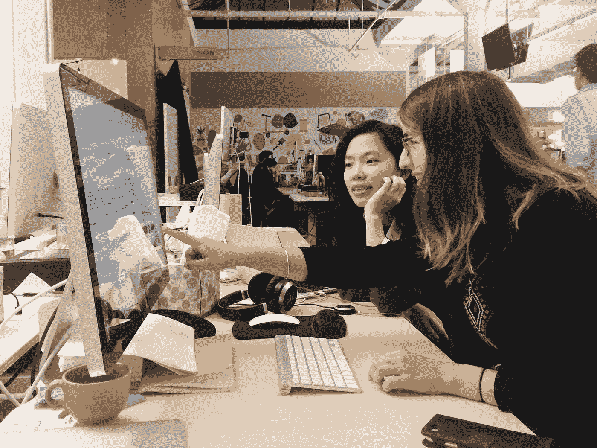
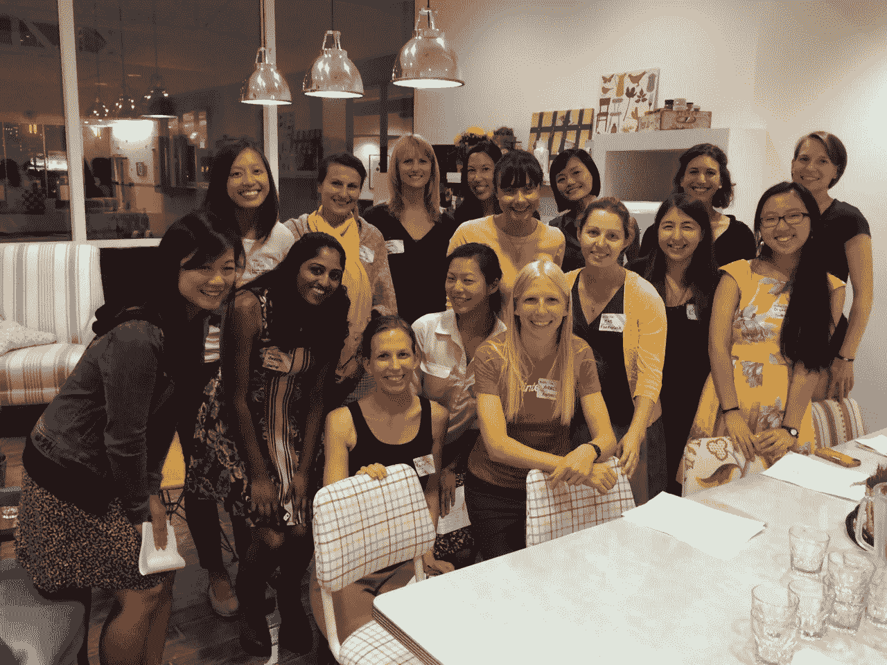
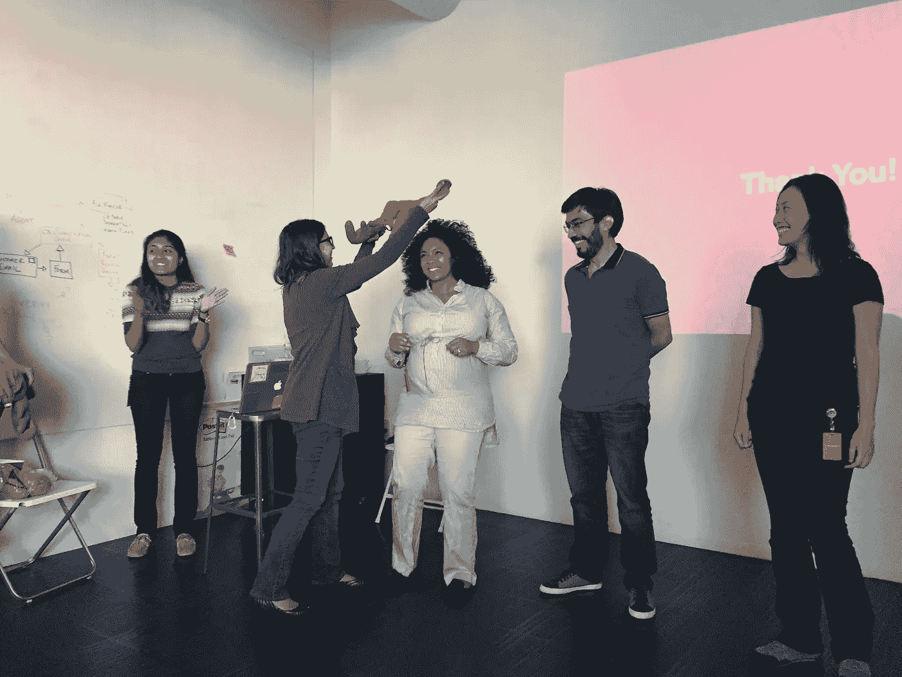
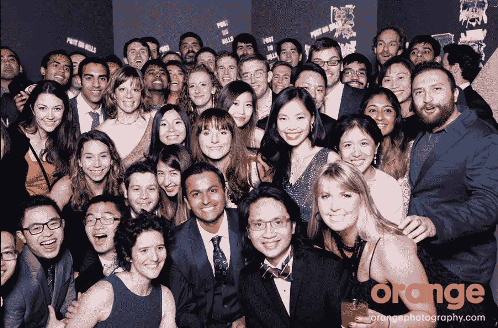

# 从我们自己开始

> 原文：<https://medium.com/airbnb-engineering/beginning-with-ourselves-48c5ed46a703?source=collection_archive---------2----------------------->

## 使用数据科学提高 Airbnb 的多样性

由赖利·纽曼和埃琳娜·格雷瓦尔分别出演

在[最近的一篇帖子](/airbnb-engineering/at-airbnb-data-science-belongs-everywhere-917250c6beba#.tigkxai7v)中，我们就如何在高速增长的背景下扩展 Airbnb 的数据科学团队提供了一些见解。我们渴望建立一个有创造力和影响力的团队，我们希望发展一种持久、积极的文化。这在很大程度上取决于前一篇文章中阐述的观点，然而故事的另一部分值得它自己的文章——关于一个一直受到全国关注的话题:*多样性*。

对我们来说，这一挑战在一年前成为焦点。就数量而言，我们这一年的招聘是成功的，但我们意识到，在推动增长的过程中，我们并没有像我们希望的那样关注文化和多样性。例如，我们的新数据科学家中只有 10%是女性，这意味着我们与我们的客人和主人社区不同步，并且 Airbnb 现有的女性数据科学家的数量正在迅速减少。这绝不是故意的，但这正是问题所在——我们的招聘工作没有强调性别平衡的团队。

当然，有许多方法可以考虑团队平衡；性别只是我们关注的一个方面。还有一些已知的结构性问题阻碍了性别平衡的进展。因此，在一个高速增长的环境中，你面临着组建团队的压力，很容易招募和雇佣更大比例的男性数据科学家。

但这不是我们想要建立的团队。同质化带来了更小范围的想法，并积聚了恶性循环的动力，在这种恶性循环中，随着少数群体的代表性越来越低，吸引和留住少数群体中的人才变得越来越困难。如果 Airbnb 渴望建立一个人们可以属于任何地方的世界，我们需要从我们的团队开始。

我们担心某种形式的无意识偏见已经渗透到我们的采访中，导致女性的转化率较低。但是在开始寻找解决方案之前，我们决定像对待我们正在处理的任何问题一样对待这个问题——从研究开始，识别机会，试验解决方案，然后迭代。

自那以后的一年中，结果是戏剧性的:47%的雇员是女性，使我们团队中女性数据科学家的总体比例从 15%增加到 30%。这对我们文化的影响是显而易见的——在最近的一次内部调查中，我们的团队被发现在公司中拥有最高的平均员工满意度。此外，我们团队中 100%的女性都表示，她们希望一年后还能留在这里，并觉得自己属于 Airbnb。

我们的工作远未完成。还有更多需要学习的地方，多样性的其他方面也需要改进，但我们对自己的进步感到满意，可以分享一些见解。我们希望其他公司的团队可以采取类似的方法，建立一个更加平衡的数据科学家行业。

# 解决漏斗顶端的问题

当我们分析客人或主人在 Airbnb 上的体验时，我们将其分为两个部分:漏斗顶端(是否有足够多的客人在寻找住宿的地方，是否有足够多的主人有可用的房间)和转换(我们是否找到了正确的匹配，是否导致了预订)。分析招聘经历也很相似。

像任何项目一样，我们的第一个任务是清理我们的数据。我们使用温室中的 EEOC 报告(我们的招聘工具)来更好地了解我们申请人的多样性，并对数据质量进行内部审计。我们面临的一个问题是，虽然 Greenhouse 收集了直接通过 Airbnb 工作页面申请的申请人的多样性数据，但它没有收集推荐人(由 Airbnb 当前员工推荐的候选人)的人口统计信息，而推荐人占了聘用的很大一部分。然后，我们将这些数据与我们团队历史的内部审计数据以及我们的人力资源工具 Workday 的数据结合起来，以便将申请人的构成与我们团队的构成进行比较。

当我们深入调查时，我们发现历史上大约 30%的申请者——漏斗顶端——是女性。这告诉我们，两方面都有改进的机会。我们的女性申请人的比例是员工的两倍，所以在我们的招聘过程中——转换部分——显然还有改进的空间。然而，在我们的申请人中没有男女平等，所以这也可能是一个有意义的杠杆。

此外，我们希望确保我们多元化数据科学团队的努力不会就此结束。改变漏斗顶端——改变有多少女性希望并认为有资格申请数据科学工作——可以帮助我们做到这一点。我们的最终目标是创造一个在整个数据科学领域都存在多样性的世界，而不仅仅是在 Airbnb。

我们决定，实现这些目标的最佳方式是超越我们自己的申请人，在更广泛的领域激励和支持女性。一个观察是，虽然有许多女性程序员聚会，也有许多伟大的工程界女性社区，但我们没有看到数据科学领域女性活动的同样激增。

我们决定在更广泛的 Airbnb“乘飞机”倡议下，创建一系列以数据中的女性为特色的闪电谈话。目标有两个:展示妇女在该领域的许多贡献，以及创建一个论坛来庆祝妇女对数据科学的贡献。与此同时，我们希望在多个维度上突出多元化。对于每个闪电谈话，我们都创建了一个由来自许多不同种族和民族背景的女性组成的小组，从事不同类型的数据科学。任何支持女性参与数据科学的人都可以参加这个讲座。

我们想出了“小对话，大数据”的标题，并从 2014 年 11 月的一次活动开始，在这次活动中，我们提供了食物，并创造了交流的空间和时间。活动门票售罄，收到了 100 多份回复。之后，我们进行了一项调查，看看我们的与会者认为我们可以在随后的活动中改进什么，并将“小型会谈，大数据”变成了一个系列，所有这些都继续销售一空。鉴于这种程度的兴趣，我们团队中的几位女性自愿撰写关于她们成就的博客帖子(例如，[丽莎对 NPS 的分析](http://nerds.airbnb.com/nps-rebooking/)和[阿里安娜对机器学习的概述](http://nerds.airbnb.com/designing-machine-learning-models/))，以便在三藩市以外传播她们的故事，并进行演讲和采访(例如，[结识数据科学小组成员艾琳娜·格雷瓦尔](http://women2.com/2014/09/09/get-know-data-science-panelist-elena-grewal-data-scientist-airbnb/))。我们团队的许多申请人都引用这些谈话和帖子作为考虑在 Airbnb 工作的灵感。

在举办这些大型社区活动的同时，我们还为该领域的资深女性举办了小型聚会，让她们能够见面、相互支持并分享最佳实践。我们在 Airbnb 举办了第一次晚宴，这次活动引发了多么精彩的对话和友谊，我们对此感到惊讶。该小组继续举行非正式会议，由来自其他公司的妇女带头在其公司举办活动，进一步让该小组接触到该领域的机会。

# 增加转化率

除了努力扩大我们的申请人才库，我们还仔细审查了我们的面试方法。与任何转换漏斗一样，我们将我们的过程分解成离散的步骤，使我们能够隔离掉发生的地方。

Airbnb 数据科学职位的面试基本上有三个阶段:一个带回家的挑战，用于评估技术性和对细节的关注；展示沟通和分析严谨性的现场演示；以及一系列与未来同事的一对一谈话，在这些谈话中，我们评估与我们的文化的兼容性以及是否适合该角色本身。第三步中的转化率相当，但第一步和第二步中的转化率完全不同。

我们希望避免无意识的偏见影响我们对带回家的挑战的评分，无论是与被候选人的名字和背景(通过访问他们的简历)左右的评论者有关，还是与对什么是成功的主观看法有关。为了解决这一问题，我们取消了对候选人姓名*【1】*的访问，并为挑战实施了一个二元评分系统，跟踪候选人是否完成了某些任务，以努力使评级更清晰、更客观。我们为评分者提供了详细的描述，告诉他们应该寻找什么和如何评分，并在允许他们在飞行中给候选人评分之前，对他们进行了过去挑战的培训。相同的挑战将在多个评分员之间循环，以确保一致性。

我们对现场演示的假设是，我们创造了一个更适合男性的环境。通常，候选人会被护送到一个房间，那里有一个主要由男性数据科学家组成的小组，他们会仔细检查他们解决现场挑战的方法。对落选候选人最常见的批评是他们“太年轻”，源于沟通不畅或缺乏信心。我们的假设是，这种看法是扭曲的，因为他们要么紧张，要么被我们创造的演示氛围所吓倒。

一些简单的改变极大地改善了这种体验。我们特意确保女性候选人的面试小组中至少有一半是女性。我们还开始在演讲前为候选人和小组成员安排一次非正式的咖啡聊天，这样他们就会在房间里有一个熟悉的面孔(我们对男性和女性候选人都这样做了，他们都表示赞赏这一变化)。此外，在演示后的总结讨论中，我们会将谈话重点放在演示的客观特征上，而不是对整体成功的主观解释。

总之，这些努力对转化率产生了巨大的影响。虽然我们的漏斗顶端计划增加了女性候选人的相对数量，但我们的面试计划有助于创造一种女性候选人与男性候选人一样有可能成功的环境。此外，我们流程的这些变化不仅仅有助于多样性；总体而言，他们改善了候选人的体验，提高了聘用数据科学家的效率。

# 为什么这很重要

去年我们采取的措施将我们团队的性别平衡从 15%提高到了 30%，这使得我们的团队更加强大，我们的工作更有影响力。怎么会？

首先，它允许不同的声音、观点和想法出现，让我们变得更聪明。随着 Airbnb 的扩张，它可以访问更多的数据，并越来越依赖数据科学团队的创造力和复杂性来制定关于我们未来的战略决策。如果我们要维持一个同质的团队，我们将继续依靠相同的方法来应对我们面临的挑战:投资于数据科学家的多样性就是投资于观点和想法的多样性，这将帮助我们从本地跳跃到全球最大值。Airbnb 是一家全球性公司，来自各种背景的人都在使用 Airbnb。当我们的团队更好地反映了客人和主人的不同背景时，我们可以更明智地理解这些数据。

其次，多元化的团队让我们能够更好地将我们的见解与公司联系起来。数据科学团队的影响力取决于其影响采纳建议的能力。对于该领域的新成员来说，通常假设统计学意义不言自明；然而，其他领域的同事倾向于假设数据科学家工作的统计巫术是有效的，而是关注他们的想法被传达的方式。因此，我们的影响受到我们与同事联系并让他们相信我们的建议具有潜力的能力的限制。事实上，数据科学家和合作伙伴之间的个性配对往往比技能配对更有影响力，特别是在领导层。增加多元化是对我们影响更广泛的公司领导层能力的投资。

最后，也许也是最重要的，增加我们团队的多样性改善了我们的文化。数据科学团队的女性觉得她们属于 Airbnb，她们的职业生涯可以在 Airbnb 发展。因此，他们更有可能留在公司，并更多地投入帮助建立这个团队，推荐他们网络中的人担任公开的角色。我们还没有结束，但是我们已经从恶性循环转向良性循环。此外，结果不仅仅局限于女性——在过去的几年里，团队文化作为一个整体有了显著的改善；在我们的年度内部调查中，数据科学团队在全公司员工满意度方面得分最高。

当然，性别只是我们希望在团队中保持平衡的多样性的一个方面。2015 年，这是我们的起点。展望 2016 年及以后，我们将利用本行动手册在其他方面加强多元化，我们希望这将加强我们的团队、文化和公司。

*[1]在使用温室遇到后勤问题后，我们在几个月后停止了这项工作。Greenhouse 不允许我们删除姓名，所以当我们切换到使用 Greenhouse 完全跟踪带回家的结果时，评分者在登录评分时能够看到姓名。*

## 在 [airbnb.io](http://airbnb.io) 查看我们所有的开源项目，并在 Twitter 上关注我们:[@ Airbnb eng](https://twitter.com/AirbnbEng)+[@ Airbnb data](https://twitter.com/AirbnbData)