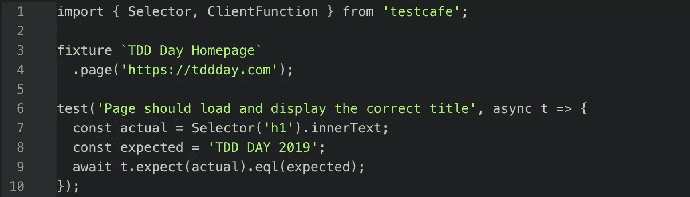

# 行为驱动开发(BDD)和功能测试

> 原文：<https://medium.com/javascript-scene/behavior-driven-development-bdd-and-functional-testing-62084ad7f1f2?source=collection_archive---------0----------------------->



单元测试是一种独立于应用程序的其他部分来测试代码单元的方法。单元测试可能测试特定的函数、对象、类或模块。单元测试对于了解应用程序的各个部分是否工作非常有用。美国国家航空航天局最好在发射火箭到太空之前知道隔热罩是否有效。

但是单元测试并不测试单元在组成一个完整的应用程序时是否能一起工作。为此，您需要集成测试，这可以是两个或更多单元之间的协作测试，或者整个运行应用程序的完整端到端功能测试(也称为系统测试)。最终，你需要发射火箭，看看所有部件组装起来会发生什么。

谈到系统测试，有多种思想流派，包括行为驱动开发(BDD)和功能测试。

# 什么是行为驱动开发？

**行为驱动开发** (BDD)是测试驱动开发(TDD)的一个分支。BDD 使用人类可读的软件用户需求描述作为软件测试的基础。像领域驱动设计(DDD)一样，BDD 的早期步骤是利益相关者、领域专家和工程师之间共享词汇表的定义。这个过程包括定义用户关心的实体、事件和输出，并给它们起一个大家都同意的名字。

BDD 实践者然后使用这个词汇表创建一个领域特定的语言，他们可以用它来编码系统测试，比如用户接受度测试(UAT)。

每个测试都基于一个以英语为基础的正式指定的通用语言编写的用户故事。(无处不在的语言是所有利益相关者共享的词汇。)

加密货币钱包中的转账测试可能如下所示:

```
Story: Transfers change balancesAs a wallet user
In order to send money
I want wallet balances to updateGiven that I have $40 in my balance
And my friend has $10 is their balance
When I transfer $20 to my friend
Then I should have $20 in my balance
And my friend should have $30 in their balance.
```

请注意，这种语言专门关注客户应该从软件中获得的商业价值，而不是描述软件的用户界面，或者软件应该如何实现目标。这种语言可以作为 UX 设计过程的输入。预先设计这些类型的用户需求可以帮助团队和客户就您正在构建的产品达成一致，从而节省大量的后续工作。

从这个阶段开始，有两条路可以走:

1.  通过将描述转换成领域特定语言(DSL)来赋予测试一个具体的技术含义，这样人类可读的描述就可以兼作机器可读的代码，(继续 BDD 路径)或者
2.  用通用语言，如 JavaScript、Rust 或 Haskell，将用户故事翻译成自动化测试。

无论哪种方式，将您的测试视为黑盒测试通常是一个好主意，这意味着测试代码不应该关心您正在测试的特性的实现细节。黑盒测试没有白盒测试那么脆弱，因为与白盒测试不同，黑盒测试不会耦合到实现细节，这些细节可能会随着需求的增加或调整，或者代码的重构而改变。

BDD 的支持者使用定制的工具，如 [Cucumber](https://github.com/cucumber/cucumber-js/) 来创建和维护他们的定制 DSL。

相比之下，功能测试的支持者通常通过模拟用户与界面的交互，并将实际输出与预期输出进行比较来测试功能。在 web 软件中，这通常意味着使用与 web 浏览器交互的测试框架来模拟打字、按钮按压、滚动、缩放、拖动等，然后从视图中选择输出。

我通常将用户需求转化为功能测试，而不是继续进行 BDD 测试，主要是因为将 BDD 框架与现代应用程序集成的复杂性，以及维护定制的、类似英语的 DSL 的成本，DSL 的定义可能最终跨越几个系统，甚至几个实现语言。

我发现通俗易懂的 DSL 作为涉众之间的交流工具对于非常高层次的规范非常有用，但是一个典型的软件系统将需要数量级更多的低层次测试，以便产生足够的代码和案例覆盖，从而防止引人注目的错误进入生产。

在实践中，你必须把*“我给我的朋友转了 20 美元”*翻译成这样:

1.  打开钱包
2.  单击转移
3.  填写金额
4.  填写收款人钱包地址
5.  点击`[Send money]`
6.  等待确认对话框
7.  点击“确认交易”

在这一层之下，您要维护“转账”工作流的状态，并且您需要单元测试来确保正确的金额被转移到正确的钱包地址，在这一层之下，您需要调用区块链 API 来确保钱包余额实际上被适当地调整了(这是客户端可能甚至没有看到的)。

不同层次的测试最能满足这些不同的测试需求:

1.  **单元测试**可以测试本地客户端状态是否被正确更新并正确呈现在客户端视图中。
2.  **功能测试**可以测试 UI 交互，确保用户需求在 UI 层得到满足。这也确保了 UI 元素被恰当地连接起来。
3.  **集成测试**可以测试 API 通信是否正常进行，以及用户钱包金额是否在区块链上正确更新。

我从来没有遇到过一个外行的利益相关者，他对所有的功能测试甚至是最顶层的 UI 行为都不了解，更不用说关心所有底层行为的人了。既然外行人不感兴趣，为什么要支付维护一个 DSL 的费用来为他们翻译呢？

不管你是否实践了完整的 BDD 过程，它有很多伟大的想法和实践，我们不应该忽视。具体来说:

*   形成一个**共享词汇表**，工程师和利益相关者可以用它来有效地交流用户需求和软件解决方案。
*   创建**用户故事**和场景，帮助为软件的特定特性制定验收标准和*完成定义*。
*   用户、质量团队、产品团队和工程师之间的**协作**实践，以就团队正在构建的内容达成共识。

系统测试的另一种方法是功能测试。

# 什么是功能测试？

术语“功能测试”可能会引起混淆，因为它在软件文献中有几种含义。

IEEE 24765 给出了两个定义:

> 1.忽略系统或组件的内部机制，只关注为响应选定的输入和执行条件而产生的输出的测试[即黑盒测试]
> 
> 2.为评估系统或组件是否符合规定的功能要求而进行的测试

第一个定义足够通用，几乎适用于所有流行的测试形式，并且已经有了一个非常合适的名字，为软件测试人员所熟知:“黑盒测试”。当我谈到黑盒测试时，我将使用这个术语。

第二个定义通常用于对比与应用的特性和功能不直接相关的测试，而是集中于应用的其他特征，例如加载时间、UI 响应时间、服务器负载测试、安全渗透测试等等。同样，这个定义太模糊了，它本身没有多大用处。通常，我们想要更具体地了解我们正在进行的测试类型，例如，单元测试、冒烟测试、用户验收测试？

出于这些原因，我更喜欢最近流行的另一种定义。IBM 的 Developer Works 说:

> 功能测试是从用户的角度编写的，关注用户感兴趣的系统行为。

这是非常接近目标的，但是如果我们要自动化测试，并且那些测试将从用户的角度来测试，这意味着我们将需要编写与 UI 交互的测试。

这种测试也可以称为“UI 测试”或“E2E 测试”，但这些名称并不能取代“功能测试”这一术语的必要性，因为有一类 UI 测试可以测试样式和颜色等内容，这些内容与“我应该能够给我的朋友转账”等用户需求没有直接关系。

使用“功能测试”来指测试用户界面，以确保它满足指定的用户需求，这通常与单元测试相对照，单元测试被定义为:

> 独立于应用程序的其余部分，对单个代码单元(如函数或模块)进行测试

换句话说，单元测试是为了测试独立于应用程序的单个代码单元(函数、对象、类、模块)，而功能测试是为了从用户与 UI 交互的角度测试与应用程序其余部分集成的单元。

我喜欢将开发人员视角的代码单元划分为“单元测试”，将用户视角的 UI 测试划分为“功能测试”。

# 单元测试与功能测试

单元测试通常由实现的程序员编写，并从程序员的角度进行测试。

功能测试由用户接受标准决定，应该从用户的角度测试应用程序，以确保满足用户的需求。在许多团队中，功能测试可能由质量工程师编写或扩展，但每个软件工程师都应该知道如何为项目编写功能测试，以及需要什么功能测试来完成特定功能集的“完成定义”。

编写单元测试是为了测试独立于代码其余部分的单个单元。这种方法有两个主要好处:

1.  单元测试运行非常快,因为它们不依赖于系统的其他部分，因此，通常没有异步 I/O 等待。与等待一个完整的集成套件运行相比，用单元测试找到并修复一个缺陷要快得多，也便宜得多。单元测试通常在几毫秒内完成，而不是几分钟或几小时。
2.  **单元必须是模块化的**，以便在与其他单元隔离的情况下测试它们。这有一个额外的好处，就是对应用程序的架构非常有利。模块化代码更容易扩展、维护或替换，因为改变它的影响通常局限于测试中的模块单元。随着时间的推移，模块化应用程序更加灵活，开发人员也更容易使用。

另一方面，功能测试:

1.  **运行时间更长，**因为他们必须对系统进行端到端的测试，与应用程序所依赖的所有不同部分和子系统集成，以支持被测试的用户工作流。大型集成套件有时需要几个小时才能运行。我听说过集成套件需要几天才能运行的故事。我建议高度优化您的集成管道，使其并行运行，这样它可以在 10 分钟内完成——但对于开发人员来说，等待每一次更改还是太长了。
2.  **确保各单位作为一个整体系统协同工作。**即使你有优秀的单元测试代码覆盖率，你仍然需要测试你的单元与应用程序的其余部分的集成。如果美国宇航局的隔热罩在重返大气层时不与火箭保持连接，那么它是否工作并不重要。功能测试是系统测试的一种形式，它确保当系统完全集成时，系统作为一个整体的行为符合预期。

没有单元测试的功能测试永远无法提供足够深的代码覆盖，以至于无法确信您有足够的回归安全网来持续交付。单元测试提供代码覆盖深度。功能测试提供用户需求测试用例覆盖广度。

> 功能测试帮助我们构建正确的产品。(验证)
> 单元测试帮助我们构建正确的产品。(验证)

你两者都需要。

> 注:参见[验证与验证](https://en.wikipedia.org/wiki/Software_verification_and_validation)。 [Barry Boehm](https://en.wikipedia.org/wiki/Barry_Boehm) 简洁地描述了构建正确的产品与构建正确的产品的区别。

# 如何为 Web 应用程序编写功能测试

有很多框架允许你为 web 应用程序创建功能测试。他们中的许多人使用一个名为 [Selenium](https://www.seleniumhq.org/) 的接口。Selenium 是一个跨平台、跨浏览器的自动化解决方案，创建于 2004 年，允许您自动化与 web 浏览器的交互。Selenium 的问题在于，它是一个依赖 Java 的浏览器外部的引擎，让它与您的浏览器协同工作可能比需要的更困难。

最近，出现了一个新的产品系列，它可以更流畅地与浏览器集成，安装和配置时需要担心的部分更少。其中一个解决方案叫做 TestCafe。这是我目前使用和推荐的一款。

让我们为[TDD 日网站](https://tddday.com/)写一个功能测试。首先，您需要为它创建一个项目。在终端中:

```
mkdir tddday
cd tddday
npm init -y # initialize a package.json
npm install --save-dev testcafe
```

现在我们需要在`scripts`块的`package.json`中添加一个`"testui"`脚本:

```
{
  "scripts": {
    "testui": "testcafe chrome src/functional-tests/"
  }
  // other stuff...
}
```

您可以通过键入`npm run testui`来运行测试，但是还没有任何测试要运行。

在`src/functional-tests/index-test.js`新建一个文件:

```
import { Selector } from 'testcafe';
```

TestCafe 自动使`fixture`和`test`功能可用。您可以使用`fixture`和带标签的模板文字语法来创建测试组的标题:

```
fixture `TDD Day Homepage`
  .page('https://tddday.com');
```

现在，您可以从页面中进行选择，并使用`test`和`Select`函数进行断言。当你把所有这些放在一起，它看起来像这样:

```
import { Selector } from 'testcafe';fixture `TDD Day Homepage`
  .page('https://tddday.com');test('Page should load and display the correct title', async t => {
  const actual = Selector('h1').innerText;
  const expected = 'TDD DAY 2019';
  await t.expect(actual).eql(expected);
});
```

TestCafe 将启动 Chrome 浏览器，加载页面，等待页面加载，并等待您的选择器匹配一个选择。如果什么都不匹配，测试最终会超时并失败。如果匹配，它将检查实际选择的值和期望值，如果不匹配，测试将失败。

TestCafe 提供了测试各种 UI 交互的方法，包括[点击](https://devexpress.github.io/testcafe/documentation/test-api/actions/drag-element.html)、[拖动](https://devexpress.github.io/testcafe/documentation/test-api/actions/drag-element.html)、[输入文本](https://devexpress.github.io/testcafe/documentation/test-api/actions/type-text.html)等等。

TestCafe 还提供了一个丰富的选择器 API ,让 DOM 选择变得轻松。

让我们测试注册按钮，以确保它在单击时导航到正确的页面。首先，我们需要一种方法来检查当前页面的位置。我们的 TestCafe 代码在 Node 中运行，但是我们需要它在客户机中运行。TestCafe 为我们提供了一种在客户端运行代码的方式。首先，我们需要将`ClientFunction`添加到我们的导入行:

```
import { Selector, ClientFunction } from 'testcafe';
```

现在我们可以用它来测试窗口位置:

```
const getLocation = ClientFunction(() => window.location.href);test('Register button should navigate to registration page',
async t => {
  // Flexible selectors let us select arbitrary things on the page,
  // regardless of how the page was marked up.
  const registerButton = Selector('span').withText('REGISTER NOW');
  const expected =
    'https://zoom.us/webinar/register/WN_rYdjYdXFTPiHCsiWsnq0jA'; // Wait for the button click navigation
  await t.click(registerButton); // Now check the location.
  await t.expect(getLocation())
    .eql(expected);
});
```

如果你不确定如何做你想做的事情，TestCafe Studio 可以让你记录和回放测试。TestCafe Studio 是一个用于交互式记录和编辑功能测试的可视化 IDE。它的设计是为了让一个可能不懂 JavaScript 的测试工程师可以构建一套功能测试。它自动生成的测试等待异步作业，如页面加载。像 TestCafe 引擎一样，TestCafe Studio 可以产生测试，这些测试可以跨许多浏览器并发运行，甚至可以跨远程设备运行。

TestCafe Studio 是一款免费试用的商业产品。您不需要购买 TestCafe studio 来使用开源 TestCafe 引擎，但是具有内置记录功能的可视化编辑器绝对是一个值得探索的工具，看看它是否适合您的团队。

TestCafe 为跨浏览器功能测试设立了新的标杆。在经历了多年尝试自动化跨平台测试之后，我很高兴地说，现在终于有了一种相当无痛的方法来创建功能测试，并且现在没有好的借口来忽视您的功能测试，即使您没有专门的质量工程师来帮助您构建您的功能测试套件。

# 功能测试的注意事项

*   **不要改变 DOM。**如果您这样做了，您的测试运行人员(例如 TestCafe)可能无法理解 DOM 是如何改变的，并且 DOM 的改变可能会影响其他依赖于 DOM 输出的断言。
*   **不要在测试之间共享可变状态。**因为它们非常慢，所以功能测试可以并行运行是非常重要的，如果它们竞争同一个共享的可变状态，就不能确定性地这样做，这可能会由于竞争条件而导致不确定性。因为您正在运行系统测试，所以请记住，如果您正在修改用户数据，您应该在数据库中为不同的测试准备不同的测试用户数据，这样它们就不会由于竞争条件而随机失败。
*   不要把功能测试和单元测试混在一起。单元测试和功能测试应该从不同的角度编写，并在不同的时间运行。单元测试应该从开发人员的角度来编写，并在开发人员每次做出更改时运行，并且应该在 3 秒内完成。功能测试应该从用户的角度来写，并涉及异步 I/O，这会使测试运行太慢，以至于开发人员无法对每一次代码更改做出即时反馈。在不触发功能测试运行的情况下，运行单元测试应该很容易。
*   **尽可能在无头模式下运行测试，**如果可以，这意味着实际上不需要启动浏览器 UI，测试可以运行得更快。无头模式是加速大多数功能测试的好方法，但是有一小部分测试不能在无头模式下运行，仅仅是因为它们所依赖的功能在无头模式下不能工作。一些 CI/CD 管道将要求您在无头模式下运行功能测试，因此如果您有一些测试不能在无头模式下运行，您可能需要将它们从 CI/CD 运行中排除。确保质量团队关注这种情况。
*   **在多种设备上运行测试。**您的测试还能在移动设备上通过吗？TestCafe 可以在远程浏览器上运行，而无需在远程设备上安装 TestCafe。但是，屏幕截图功能在远程浏览器上不起作用。
*   **抓取测试失败的截图。**如果您的测试未能帮助诊断出问题，截图会很有用。TestCafe studio 有一个运行配置选项。
*   务必将您的功能测试运行保持在 10 分钟以内。更长的时间会在开发人员开发一个特性和修复出错的东西之间产生太多的延迟。10 分钟足够开发人员忙于下一个功能，如果超过 10 分钟后测试失败，很可能会打断已经进入下一个任务的开发人员。一个被中断的任务平均需要两倍的时间来完成[，并且包含大约两倍的错误](https://dl.acm.org/citation.cfm?doid=985692.985715)。TestCafe 允许您同时运行许多测试，并且远程浏览器选项可以在一组测试服务器上这样做。我建议利用这些特性，尽可能缩短测试运行的持续时间。
*   **测试失败时，务必停止连续输送管道。**自动化测试的最大好处之一是能够保护您的客户免受回归——过去正常工作的特性中的错误。这个安全网过程可以自动化，这样您就可以对您的发布相对来说没有 bug 充满信心。CI/CD 管道中的测试有效地消除了开发团队对变更的恐惧，变更可能会严重消耗开发人员的生产力。

# 后续步骤

加入[TDD Day.com](https://tddday.com)—一个全天的 TDD 课程，包括 5 个小时的录制视频内容，学习单元测试和功能测试的项目，如何测试 React 组件，以及确保您掌握材料的交互式测验。

***Eric Elliott*** *是一位分布式系统专家，著有以下书籍:* [*【排版软件】*](https://leanpub.com/composingsoftware)*[*【编程 JavaScript 应用】*](http://pjabook.com) *。作为*[*devanywhere . io*](https://devanywhere.io)*的联合创始人，他教授开发人员远程工作和拥抱工作/生活平衡所需的技能。他为加密项目组建开发团队并提供建议，为 Adobe Systems、* ***、Zumba Fitness、*** ***、华尔街日报、*******【ESPN、*******BBC、*** *以及包括* ***亚瑟、弗兰克·奥申、金属乐队在内的顶级录音艺术家提供软件体验******

**他和世界上最美丽的女人享受着与世隔绝的生活方式。**