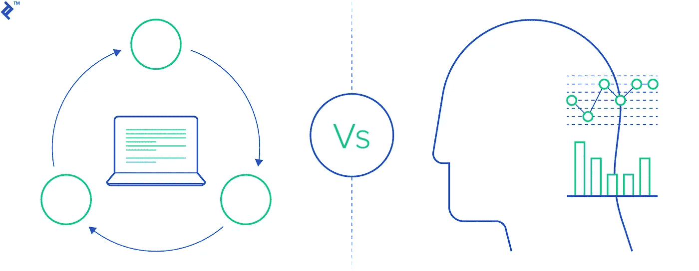
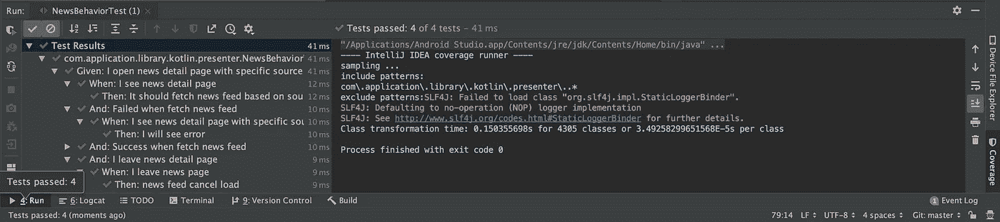
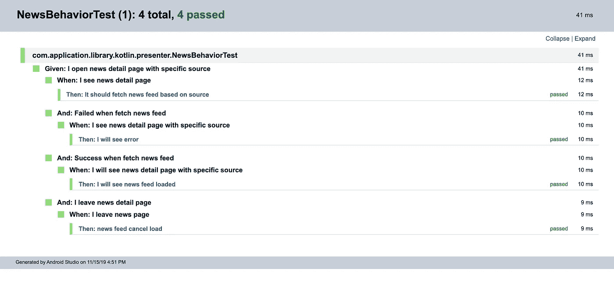

# Behavior Test: How to Test Your Android Apps

> 原文：<https://medium.easyread.co/behavior-test-how-to-test-your-android-apps-2e4aecdd3cea?source=collection_archive---------2----------------------->

## Introduction to Behavior Test

Photo by [Lee 琴](https://unsplash.com/@leeqin?utm_source=unsplash&utm_medium=referral&utm_content=creditCopyText) on [Unsplash](https://unsplash.com/s/photos/bloom?utm_source=unsplash&utm_medium=referral&utm_content=creditCopyText)

Melakukan pengujian pada saat mengembangkan aplikasi sering sekali menjadi hal terakhir yang akan dilakukan oleh para *developer* . Bahkan tidak jarang jika waktu untuk rilis semakin dekat, maka mereka akan memperkecil cakupan yang akan diuji atau malah tidak melakukan pengujian sama sekali. Padahal dengan adanya pengujian maka kita dapat menjadikan hal tersebut sebagai benteng kepercayaan diri kita untuk merilis sebuah aplikasi. Atau kita dapat menjamin aplikasi yang kita kembangkan akan memiliki *bug* seminimal mungkin.

Pengujian juga tidak hanya dilakukan oleh tim *Quality Assurance* (QA) saja, melainkan para *developer* sebaiknya yang lebih dulu melakukan pengujian pada saat pengerjaan aplikasi. *Nah* , biasanya pengujian yang dilakukan oleh tim *developer* berupa *unit test* , yaitu pengujian pada fungsi-fungsi yang ada pada aplikasi. Dengan berbagai skenario, maka *developer* akan mengetes satu persatu kemungkinan tersebut.

Salah satu contoh pengujian ialah pada saat mengembangkan aplikasi Android. Biasanya para *Android* *Developer* akan menggunakan unit test untuk melakukan pengujian. Mereka akan menuliskan barisan kode untuk menguji sebuah fitur dengan beberapa skenario dan flow sesuai dengan tujuan dari fitur.

Salah satu contoh pengujian fitur yang dimaksud ialah sebagai berikut:

Misalnya kita memiliki sebuah fungsi untuk *fetch* berita dari API dengan kode sebagai berikut

Presenter class include business logic

Fungsi ini seharusnya akan diuji oleh *developer.* Dengan menggunakan unit test yang biasa, maka kita dapat menguji fungsi diatas dengan potongan kode berikut.

Presenter test class

Potongan kode diatas adalah dua buah fungsi untuk menguji fitur yang ada. Satu fitur yang ada dipecah menjadi beberapa pengujian sesuai dengan *flow* atau *behavior* dari aplikasi. Hal ini dapat dilihat dari nama tes yang diberikan yaitu `**testLoadNewsBySources_Success()**` untuk menguji *flow* apabila fungsi tersebut memberikan detail dari berita yang dicari dan tidak *error* saat dijalankan dan `**testLoadNewsBySources_NotFound**` untuk menguji ketika fungsi tidak dapat menemukan berita yang dicari, atau mungkin kita dapat menambahkan satu *test case* lagi yaitu apabila fungsi tersebut *error* ketika dijalankan dan apa yang kita harapkan sebagai respon selanjutnya dari fungsi tersebut.

Potongan kode di atas sebenarnya sudah cukup baik dan sudah mencapai tujuan yang dimaksud pada awalnya, yaitu melakukan pengujian pada aplikasi yang sedang dikerjakan. Akan tetapi potongan kode pengujian di atas hanya dapat dimengerti oleh sebagian orang saja, yaitu *engineer* atau para *developer* atau orang-orang yang terlibat secara langsung dengan pengerjaan fungsi tersebut. Sedangkan bisa saja QA atau PM atau anggota tim yang lain tidak mengerti dengan pengujian yang kita lakukan dan bingung membaca report dari pengujian yang kita lakukan.

*Nah* , untuk menjawab permasalahan di atas, kita dapat menggunakan metode *Behavior Test* untuk melakukan pengujian fitur pada saat mengembangkan aplikasi.

**Apakah yang dimaksud dengan *Behavior Test* ?**

# Behavior Test

> Behavior-driven development should be focused on the business behaviors your code is implementing: **the “why” behind the code** . It supports a team-centric (especially cross-functional) workflow.

Berdasarkan pengertian di atas, maka pengujian akan dilakukan berdasarkan bagaimana *flow* yang terjadi dan *behavior* dari fitur tersebut. Menulis *unit test* dengan metode *behavior test* dapat bekerja dengan baik untuk setiap orang yang terlibat dalam pengembangan aplikasi tersebut.

Ketika setiap orang yang terlibat memutuskan untuk memulai *behavior test,* maka:

*   Orang-orang *non tech* yang bergerak di bagian bisnis atau *Product Manager* dan QA dapat menentukan bagaimana *behavior* atau *flow* yang terjadi pada aplikasi seharusnya, dan
*   *Developer* menuliskan tes berdasarkan *flow* dan *behavior* yang sudah dibicarakan sebelumnya, dan juga dapat menuliskan *behavior* tambahan yang diperlukan dari perspektif mereka.

Idealnya, kedua pihak dapat merujuk ke *behavior* aplikasi saat ini untuk melihat apakah fitur baru akan merusak fitur yang ada.

Image taken from [Toptal](https://www.toptal.com/freelance/your-boss-won-t-appreciate-tdd-try-bdd)

# Let’s see an example of Behavior-Test

***Skenario:*** kamu adalah *developer Android* di tim yang bertanggung jawab atas aplikasi berita. Pada aplikasi ini, terdapat banyak sumber berita, dan apabila salah satu sumber di klik, maka pengguna akan melihat daftar berita yang disajikan sumber tersebut. Dan apabila terjadi *error* , maka pengguna hanya melihat halaman kosong.

Fokus pada *flow* dan *behavior* ini dapat membantu *developer* untuk dapat menulis *behavior test* yang dapat dimengerti oleh *developer* dan orang yang berperan dalam pengembangan aplikasi. Hal ini menjadikan tes menjadi berguna sebagai verifikasi bahwa kita sebagai *developer* membangun fitur yang tepat, bukan hanya karena kode kita yang benar. Dalam *behavior test,* frasa penulisan kata-kata tes sangat diperlukan sehingga dapat menggambarkan *flow* yang terjadi pada aplikasi.

Contoh *behavior test* untuk menguji skenario di atas.

Presenter test class with behavior test

Berdasarkan test diatas, apabila kamu menjalankannya, maka *report* hasil pengujian yang diberikan benar-benar berbeda dan dapat dengan mudah dimengerti.

Hasil Pengujian dengan Behavior Test

Report Behavior Test

# Takeaways

Berdasarkan percobaan, maka melakukan pengujian dengan menggunakan metode *Behavior Test* akan memberikan dampak yang cukup signifikan bagi orang-orang yang terlibat dalam pengembangan aplikasi. Para orang-orang yang bergerak di bidang bisnis, ataupun PM dan QA dapat memahami *report* hasil pengujian yang dilakukan *developer* berdasarkan *behavior* dari aplikasi sehingga kedepannya tidak akan terjadi kesalahpahaman.

*Nah* , pada tulisan kali ini saya menjelaskan secara singkat apa itu *Behavior Test* dan contohnya. Untuk tulisan selanjutnya saya akan menjelaskan tahapan membuat *Behavior Test* pada aplikasi Android.

Semoga tulisan ini membantu kamu untuk mulai membuat *test* kamu ya~. Selamat mencoba!!

# Reference

[Your Boss Won’t Appreciate TDD: Try This Behavior-Driven Development Example](https://www.toptal.com/freelance/your-boss-won-t-appreciate-tdd-try-bdd)