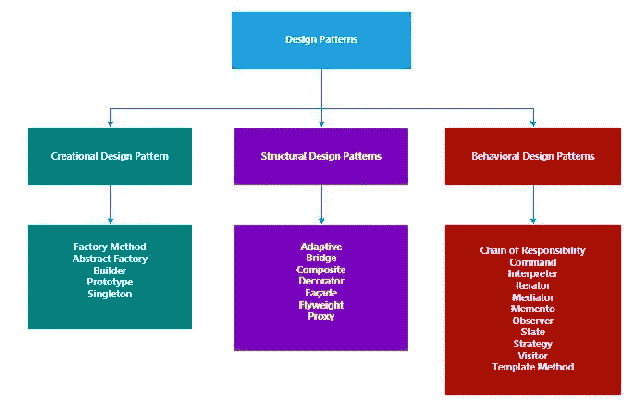
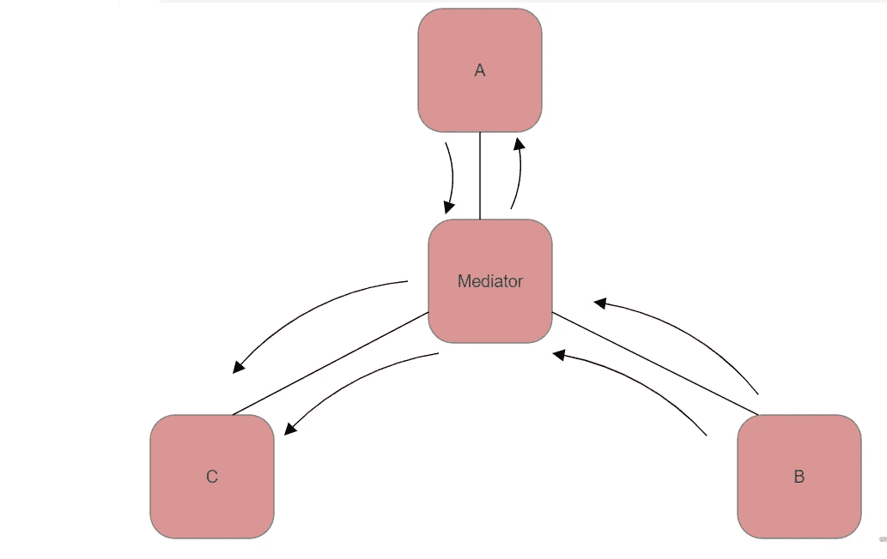
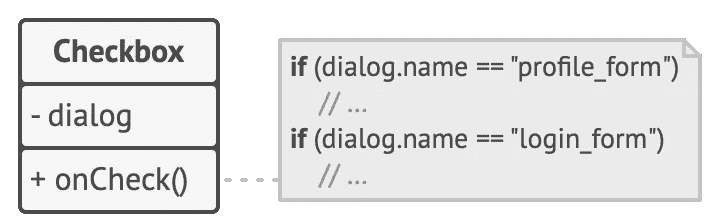
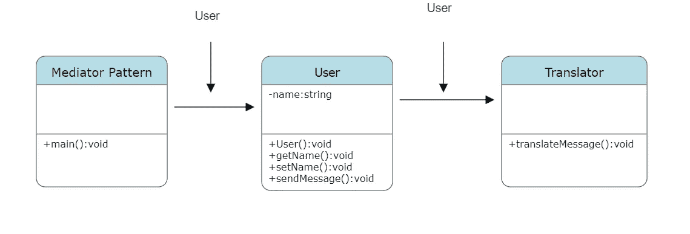

# 行为设计模式

> 原文：<https://medium.com/globant/behavioral-design-pattern-7b082d98165c?source=collection_archive---------1----------------------->

**中介行为设计模式**

**设计模式和软件开发中需要:**
***设计模式:***

1.设计模式用一个简单的术语来说:就是以模板或者描述的形式来解决不同情况下的问题。

2.模式是问题在上下文中的循环解决方案。

3.Christopher Alexander 的设计模式，一种模式语言

“每个模式描述了一个在我们的环境中反复出现的问题，然后描述了该问题解决方案的核心，
以这样一种方式，您可以使用该解决方案一百万次，而不必以同样的方式做两次。”

***四人帮(g of)设计模式:***
1。设计模式对于软件开发人员来说是一个非常强大的工具。
2。开发人员将模式用于他们的特定设计，以解决他们的问题。
以下是 23 种设计模式，也称为四人帮(g of)设计模式:



**行为设计模式在。NET:**
1。在软件工程中，通过识别通用的通信模式来实现软件对象间通信的灵活性。行为设计模式又名 ***行为链***
3。优点:
1。它简化了软件对象之间的通信。这是对象之间进行通信的最佳方式。通过节省资源在特定的时间内服务特定的客户。

**中介行为设计模式:**
***1。意图:***
1。为了减少对象之间的混乱依赖，中介器是最好的行为设计模式
2。对象之间直接通信会受到限制，它们之间的协作只能通过中介对象进行。



***2。问题:***
假设我们有一个创建和编辑客户档案的对话框。
由各种表单控件组成，如文本字段、复选框、按钮等。

一些表单元素可能会与其他元素交互。为了前任。要提交表单，提交按钮必须在保存数据之前验证所有字段的值。



*Elements can have lots of relations with other elements. Hence, changes to some elements may affect the others.*

如果我们将这种逻辑直接实现在表单元素的代码中，我们就不能在应用程序的其他表单中重用它们。

***3。解决方案:***
通过中介模式，组件必须通过调用一个特殊的中介对象来间接协作，这个中介对象将调用重定向到适当的组件。因此，组件只依赖于单个中介类。
在我们的概要文件编辑表单的例子中，对话框类本身可以充当中介。最有可能的是，dialog 类已经知道了它的所有子元素，所以你甚至不需要在这个类中引入新的依赖项。

最显著的变化发生在实际的表单元素上。让我们考虑一下提交按钮。以前，每次用户单击按钮时，都必须验证所有单个表单元素的值。现在它唯一的工作就是通知对话框关于点击的信息。收到通知后，对话框本身执行验证，或者将任务传递给各个元素。

因此，按钮只依赖于对话框类，而不是绑定到十几个表单元素。

***4。真实世界的 Ex。:***

接近或离开机场控制区的飞机飞行员之间不会直接交流。取而代之的是，他们与一名空中交通管制员通话，后者坐在飞机跑道附近的一座高塔上。如果没有空中交通管制员，飞行员将需要知道机场附近的每一架飞机，并与几十名其他飞行员组成的委员会讨论着陆的优先顺序。这可能会使飞机失事的统计数字暴涨。

塔台不需要控制整个飞行。它的存在仅仅是为了加强终端区域的约束，因为那里涉及的参与者数量可能会超出飞行员的承受能力。

***5。伪代码:***
为 Ex。考虑到一般情况，主持会议的人必须学习每一种语言，并找到一种方法同时相互交流。这将是一个非常复杂的过程。但是，调解人模式有助于消除通话中不同人员之间的相互依赖性。



尽管电话中的不同参与者似乎在直接交流，但他们并没有。相反，参与者只需要检查字幕系统来理解消息，然后在不知道其他参与者使用的单词及其含义的情况下发言。

由用户触发的元素不会直接与其他元素通信，即使它看起来应该这样做。相反，元素只需要让它的中介知道这个事件，传递任何上下文信息和通知。

```
*// The mediator interface declares a method used by components to notify the mediator about various events.* 
interface Mediator is
    method notify(sender: Component, language: string)

// The concrete mediator class. 
class Chat implements Mediator is
    private field message: string
    private field speaker, listener: User
    private field isLanguageAccepted: Checkbox
    constructor Chat() is
    // When something happens with a component, it notifies the mediator. Upon receiving a notification, the mediator may do something on its own or pass the request to another component.      
    method notify(sender, language) is
	// if the language is filled into the system and can be translated, then it will inform the mediator regarding this and accordingly proceed with translation.

// Components communicate with a mediator using the mediator interface. 
class Component is
    field message: Mediator
    constructor Component(message) is
        this. message = message
    method translate() is
        *// check the language to be translated and change the message based on the translated value*

*// Concrete components don't talk to each other. They have only one communication channel, which is sending notifications to the mediator. So our concrete components A and B (different people) share their message with each other after it getting translated using the mediator.*
class User extends Component is
    *// ...*
class Language extends Component is
    *// ...*
class Checkbox extends Component is
    *// ...*
```

***6。利弊:***
***1。优点:***
1。单一责任原则。
我们可以将各种组件之间的通信提取到一个单独的地方，这样更容易理解和维护。
2.Open/Closed 原理。
我们可以在不改变实际组件的情况下引入新的介体。
3。我们可以减少程序各部分之间的耦合。
4。我们可以更容易地重用单个组件。

**②*。缺点:***
随着时间的推移，一个中介可以演变成一个 God 对象(是一个引用大量不同类型的对象，有太多不相关或未分类的方法，或者两者的某种组合。)