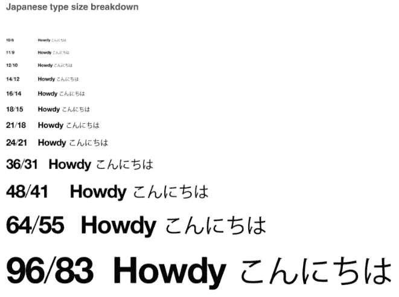
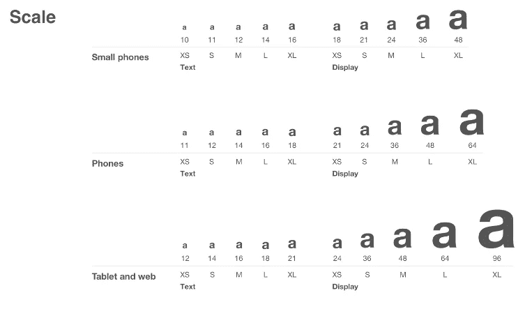
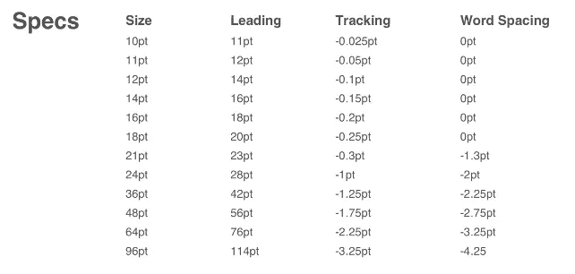
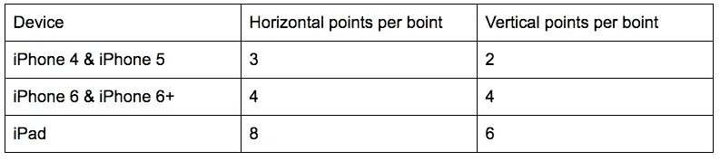
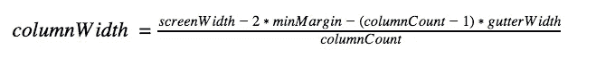
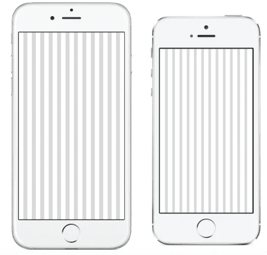
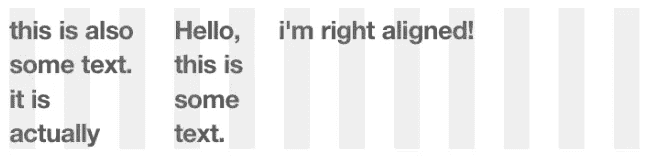
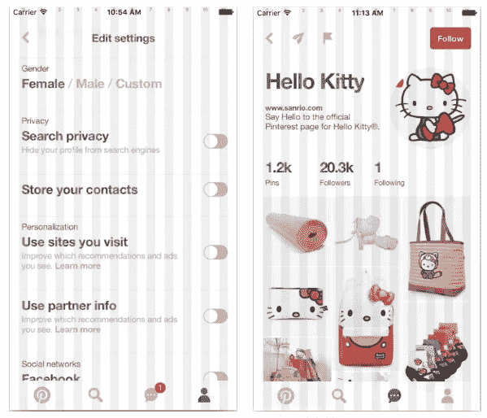

# Pinterest 设计标准发布的背后

> 原文：<https://medium.com/pinterest-engineering/behind-the-launch-of-pinterests-design-standards-dded4fa83578?source=collection_archive---------1----------------------->

Ricky Cancro | Pinterest 产品工程师

我们最近推出了一款[经过重新架构的 iOS 应用](https://engineering.pinterest.com/blog/re-architecting-pinterests-ios-app)，拥有更快的体验和全新的外观。正如应用程序的架构变化意义深远一样，视觉设计的变化也同样雄心勃勃。新系统将排版、对象放置标准化，并提供智能缩放，以便单一设计可以在所有 iOS 设备上使用。为了创建这个系统，设计和工程携手工作了几个月。我们的解决方案以自定义标签类、“boints”和布局列的形式出现。

## PITextNode:从 2016 年开始管理字体

新的 Pinterest 设计标准提供了一组默认设置来加速设计。字体被限制为五个“文本”和“显示”点大小(显示用于标题，而文本用于内容)。设计者用“中等文本”或“超大显示”这样的名称来指定这些点的大小为了让每个人都讲同一种语言，我们创建了一个 *ASTextNode* 子类 *PITextNode* ，并使用类似于 *mediumTextNode* 或*extraLargeDisplayTextNode*的名字来方便初始化。工程师将不得不额外努力工作来制作一个不被接受的字体的文本节点(哪个工程师喜欢努力工作呢？).另一方面，如果一个模仿者使用了不良的字体大小，工程师也可以对设计进行反推。

这可能令人震惊，但我们的一些设计师是相当大的字体爱好者。他们不仅指定了字体大小、单词间距、字距和行距，还要求对 CJK(中文、日文和韩文)语言进行特定的缩放。我们的默认字体，Helvetica 新，在与相同大小的默认 iOS CJK 字体混合时显得太大。 *PITextNode* 需要缩放 CJK 字体，以在相同的点大小下匹配 Helvetica 新的行高。幸运的是，由于我们构建在 *ASTextNode* 之上，我们可以访问标签的 *NSTextStorage* 用于呈现文本。 *NSTextStorage* 扫描*为 TextNode* 的内部*未分配字符串*用默认的 iOS 字体替换所有在 Helvetica Neue 中不存在的字符。我们迭代了 *NSTextStorage* 中的所有字体，并缩放了那些不是 Helvetica 新字体的字体(这甚至允许我们缩小表情符号，这样它们就不会引起行距问题)。



*图 1:Helvetica 新字体文本与日语字体文本的磅值对比*

随着应用程序窗口大小的变化，PITextNode 也处理缩放字体大小。例如，中等文本字体在较小的手机(如 iPhone 4 或 iPhone 5)上的磅值为 12，在 iPhone 6 或 iPhone 6+上的磅值为 14，在平板电脑上的磅值为 16。



*图 Pinterest 设计标准中如何定义字体*

根据窗口大小更新字体大小开始暗示新设计系统的真正力量。随着窗口大小的变化，对象位置和相对间距也会变化。这是通过两个关键特性实现的:我们称之为“boints”(点+BRIO[内部设计代码名] = boints)和列。

## 一个单位来统治他们所有人

新的设计系统描述了 boints 中所有对象之间的间距。一个点是与设备无关的点数。随着设备窗口大小的增加，一个窗口中的点数也会增加。我们区分水平和垂直，因为如果我们使用相同的水平间距值，对象在垂直方向上会看起来相距太远。这里有一个不同设备上垂直旋转和水平旋转的快速列表(我只是开个玩笑):



所有的设计模型都是以一定的间距创建的。如果两个物体在水平方向上相隔 2 磅，它们在 iPhone 4 上会相隔 6 磅，在 iPad 上会相隔 16 磅。

## 布局列:您在这里

布局列在画布上提供了放置对象和确定 Pinterest 网格大小的位置，比如 home feed。这些列是基于明确定义的设计系统规则动态计算的:

*   所有窗口大小的列数都是 12
*   列与列之间的空间称为檐槽，宽 4 英寸
*   屏幕的最小左边距和右边距是 4 磅
*   列宽必须是整数

有了这些知识，我们可以求解列宽:



对于 320 的屏幕宽度，解决这个问题得到 9.333 磅的列宽。因为我们想要整数列，所以我们取 slop (.3333 *列计数)并在左右列之间拆分它。下面是 iPhone 6 和 iPhone 4 上的列:



一旦我们解决了这些先决条件，我们就可以对设计系统中的对象放置做出如下陈述:

1.  所有对象都与列的开头左对齐*或
2.  所有对象都右对齐到一列的末尾，或者
3.  将一个对象放置在距离与布局列对齐的对象整数个角的位置

*所有与列对齐的文本都有一个磅的软缩进。

## 履行

如果有一件事是工程师可以支持的，那就是一堆明确的规则。我们的产品设计团队提交了一份 75 页的文件，详细说明了这一点。根据规范，我们创建了可插拔的 UI 组件，如 *PITextNode* 。我们还投入时间来创建组件，以帮助确保在 BRIO 网格上的布局快速而简单。

## 自定义布局规格

我们在 AsyncDisplayKit 的基础上重新设计了我们的 iOS 应用。为了处理布局，我们选择了 AsyncDisplayKit 新添加的 box 模型布局系统。箱式模型严重依赖于布局规格。布局规范描述了其子节点将如何布局以及如何计算它们的大小和位置。AsyncDisplayKit 中有几个内置的布局规范——包括 *ASStackLayoutSpec* 和*ASInsetLayoutSpec*——但是为了方便地在我们的列上显示对象，我们必须创建一个自定义布局规范。

我们的自定义规范的子级明确地声明了它们将被定位在哪个列上。默认情况下，假设对象是左对齐的(也支持右对齐)。可选地，子元素可以显式声明它的列跨度和垂直对齐方式。代码如下所示:

```
PIColumnAlignedLayoutSpec *columnSpec = [[PIColumnAlignedLayoutSpec alloc] init];
    self.textNode0.columnOffset = 0;
    self.textNode1.columnOffset = 3;
    self.textNode2.columnOffset = 8;
    self.textNode2.columnHorizontalAlignment = PIColumnHorizontalAlignmentRight;
    columnSpec.children = @[self.textNode1, self.textNode0, self.textNode2];
```



很简单，对吧？下面是 Pinterest 应用程序中列对齐规范的两个例子(请记住，文本从一列中软缩进一磅):



## 边界框

到目前为止，这个新系统听起来像一个跨学科的乌托邦，设计师和工程师们在和平和谐的环境中工作，分享波霸茶，一起对抗邪恶。但是像任何项目一样，在前进的道路上有坎坷，我们设计出了我们的出路。一个例子是决定使用草图来设计所有的模型。我喜欢 Sketch 的许多方面，但我不喜欢它的文本边框(事实上，这主要是一个内部文档的翻版，名为“为什么我讨厌 Ricky Cancro 的 Sketch 边框”)。首先让我们看看 iOS 中文本的边框:


注意基线下面有足够的空间给下行者。另一方面，这是 Sketch 的版本:


iOS 上的边框比 Sketch 上的大 6 磅。这是一个问题，因为我们的设计团队使用草图来布置屏幕。在草图中，位于文本下方 8 点(2 磅)的东西在 iOS 上会额外低 6 磅，所以我们必须想办法让 *PITextNode* 自动处理这些调整。

解决这个问题的第一次尝试包括查看我们的十种字体大小，并找到从 iOS 边界框到草图边界框的插入内容。一旦我们有了这些值，就创建了一个机制，使得每个 *PITextNode* 在被添加到布局规范之前都被放置在一个 *ASInsetLayoutSpec* 中，并带有适当的 insets。这看起来效果很好，但事实并非如此。

想象一下，你有一个水平堆栈的图像和文本。在这两个节点中，文本节点比图像节点高。您希望将图像置于文本节点的中央，如下所示:


问题是文本节点被包装在一个底部插入为负的插入规范中。虽然这使得垂直间距按预期工作，但这也意味着堆栈实际上没有灰色边界框那么高。堆栈规格实际上被计算为与下面的轮廓框一样高:


正如你所看到的，熊在轮廓框内居中，但是当我们移除所有背景颜色时，我们得到一个熊看起来不居中的布局:


第一个解决方案的问题是它影响了布局规格的计算大小。为了解决这个问题，我们需要让布局规格知道一个节点上的插入，从这个节点进行测量，但不影响计算布局的整体大小。这个想法类似于 UIKit 的布局指南。

我们实现了另一个定制的布局规范， *PIStackLayoutSpec* ，它是*assstacklayoutspec*的子类，第二次遍历子布局，并根据 layoutable 对象的 *layoutGuideInsets* 移动它们的位置。当 *PITextNodes* 被创建时，它们被赋予适当的布局指南，以在草图和 iOS 边界框之间转换。

以下是使用 *layoutGuideInsets* 而不是 *ASInsetLayoutSpec* 渲染时的上述示例:


对于一个更复杂的示例，这里有两个垂直堆叠的文本节点，它们放置在一个水平堆栈中，图像居中对齐:


灰色边界框是半透明的，因此您可以看到较小的文本节点位于较大文本节点的边界框内。最上面的水平堆栈规范将分别从大文本节点和小文本节点继承顶部和底部布局参考线。这允许我们在堆栈中嵌套文本节点，并继续传播正确的布局指南。

## 展望未来

新系统的承诺是一种适用于所有设备的设计——这意味着由于 boints 和 columns，iPhone 的设计在 iPad 上也会很好看。虽然在 BRIO(看着你，iPad Pro)的设计和实施过程中我们遇到了一些难题，但该系统总体上工作得非常好，并为 Pinterest 的严格设计标准奠定了基础。

*鸣谢:如果没有龙成、杰伊·马什、汤姆·沃森、加勒特·穆恩、斯科特·古德森以及任何听我抱怨过文本边框的人，我就不可能深入研究字体、分栏、行距和字距。*