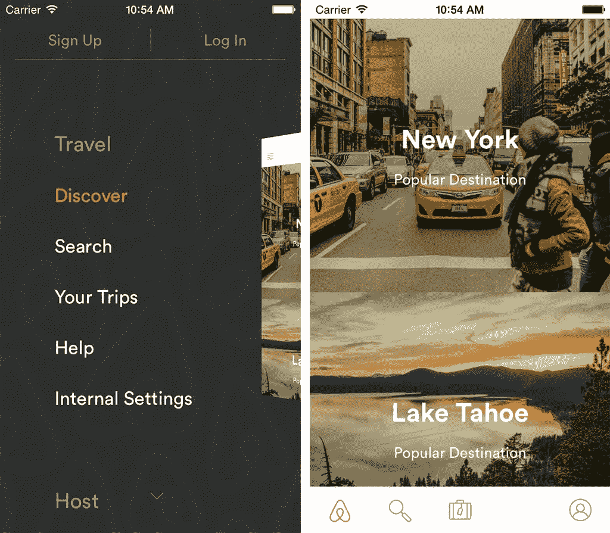
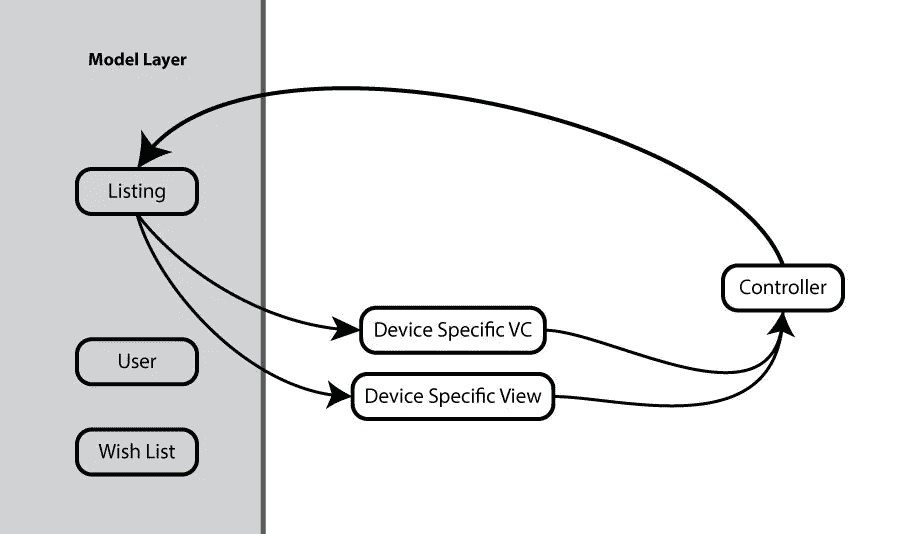
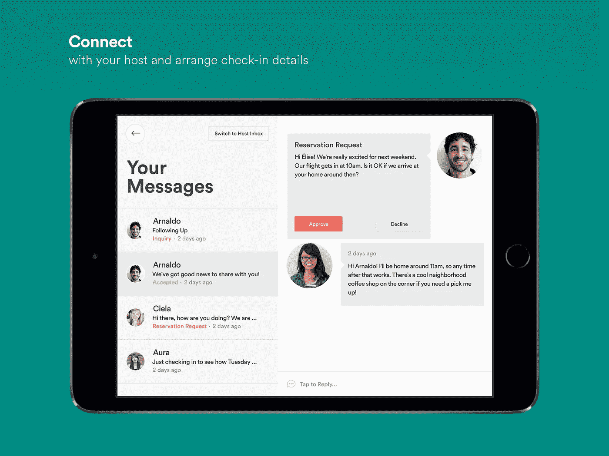
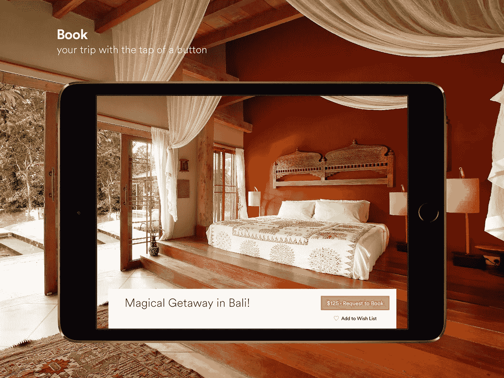
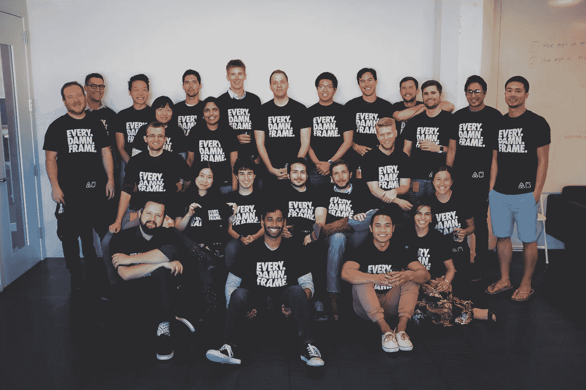

# 幕后:打造 Airbnb 首个原生平板电脑应用

> 原文：<https://medium.com/airbnb-engineering/behind-the-scenes-building-airbnb-s-first-native-tablet-app-608a9f50c2f4?source=collection_archive---------3----------------------->

由[布兰登 T Withrow](https://medium.com/u/cdb3aef15cc1?source=post_page-----608a9f50c2f4--------------------------------)

在 Airbnb，我们试图创造一个世界，在这里人们可以彼此联系，并属于任何地方。无论你是在旅行，计划和朋友一起旅行，还是躺在沙发上浏览你的下一次冒险，你最有可能使用移动设备在 Airbnb 上进行连接、预订或做梦。我们的平板电脑用户可能会惊讶地发现，到目前为止，我们还没有一个原生的平板电脑应用程序。去年夏天，一个小团队决定改变这种状况。我们开始探索 Airbnb 在平板电脑上会变成什么样，今天，我们很高兴与世界分享它。建立一个全新的平台，同时维护和发布一个不断发展的手机应用程序，这是一个具有挑战性的壮举；我们会告诉你更多关于什么是对的，什么是错的，以及我们最终是如何做到的。

# 第一小步至关重要

在去年夏天成功推出我们的[品牌 Evolution](http://nerds.airbnb.com/inside-airbnb-ios-brand-evolution/) 之后，我们组建了一个小团队，开始为平板电脑打基础。在开发平板电脑应用的过程中，我们从品牌重塑中汲取了许多技术知识。例如，就像品牌重塑一样，我们希望在几个版本的过程中构建应用程序，并最终发布官方的平板电脑应用程序。一个由设计师和三名工程师(两名 iOS，一名 Android)组成的小型团队开始构建应用程序的基础，并探索平板电脑领域。我们知道我们不能重写整个手机应用程序，如果我们想要发布，我们必须重用手机上已经存在的一些视图。我们审查了手机的每个屏幕和每个功能，以确定重建每个屏幕的工程设计成本。我们很快意识到，我们的顶级导航系统“AirNav”并不能很好地应用于平板电脑领域。相反，我们必须设计和建造新的东西。

# Airbnb 转到标签栏

在 Airbnb，我们努力获得跨平台的无缝体验，并保持功能的同等性，无论设备或外形如何。这意味着，无论我们为平板电脑选择什么样的导航系统，都必须能在手机上运行。为了快速找到解决方案，同时覆盖尽可能多的区域，团队分成几个小组，尽可能多地制作导航系统的原型。我们的设计师之一凯尔·皮克林甚至自学了斯威夫特，这样他就可以建造功能原型。在周末，我们有几个各种不同形式的原型，从我们的实时代码构建的全功能(尽管有些粗糙)原型，用烘焙数据在 Swift 中构建的功能原型，甚至还有一些 keynote 和 after-effects 原型。我们将这些带给我们的用户研究团队，以快速获得一些真实世界的用户对设计的反馈。Airbnb 的文化很大一部分是快速行动，一路进行实验，而不是等到最后。随着即将发布的手机，我们决定在手机上构建和发布 Tab Nav，包装在一个我们可以推出和测试的实验中。由于移动团队的大多数人仍在努力构建新功能，我们必须快速、安静地构建新的导航，以某种方式让团队的其他人在运行时打开或关闭它，而无需重新启动应用程序。我们在 2014 年 11 月推出了新的 nav，这给了我们几个月的时间来收集数据，并在构建平板电脑应用程序的同时迭代高级信息架构。

有趣的事实:直到平板电脑发布之前，这两个导航系统仍然是活跃的，可以通过实验标志打开或关闭。

# 在 MVVM 尝试一下(有点)

在 iOS 上，MVC 是游戏的名字。我们知道我们运送的是通用二进制文件；我们不会分割目标或发布两款应用。在代码架构方面，我们担心发布一个通用的应用程序会导致我们的应用程序分裂，随着时间的推移，这将变得难以处理。用不了多久，代码库就会被分割的逻辑、复制粘贴的实验代码和重复的跟踪调用弄得乱七八糟。同时，我们不希望有大量的视图控制器类在平台之间分割功能。这要求我们重新思考以前尝试过的 MVC 模式。我们意识到，我们的数据层中的几乎每个模型对象(列表、用户、愿望清单等。)有三个 UI 表示:一个表格视图单元格、一个集合视图单元格和一个视图控制器。

这些表示在不同的平板电脑和手机上会有所不同，因此我们没有在使用这些对象的任何地方都设置分支逻辑，而是决定询问模型它更喜欢如何显示。我们构建了一个视图模型协议，允许我们向任何模型对象请求它的“默认表示视图控制器”该模型返回一个完全分配的特定于设备的视图控制器进行显示。起初，这些视图模型对象只是返回手机视图控制器，但当我们最终开始构建平板电脑版本时，我们只需更改一行代码，让平板电脑视图控制器在应用程序范围内显示。一旦我们开始构建视图控制器，这就减少了我们必须做的重构的数量，并允许我们专注于完善视图控制器。此外，这使得我们所有的代码分割检查集中在几个类中。接下来，我们开始浏览现有的手机控制器，并将我们所有的跟踪和实验逻辑放入共享的逻辑控制器中，这些控制器将用于手机和平板电脑视图。这使得该团队可以继续在手机上工作，增加实验和功能，这些实验和功能会自动找到进入平板电脑应用程序的方法。

# 把足球踢上坡

到 2015 年 1 月，平板电脑团队已经准备就绪，设计已经到了可以开始开发平板电脑应用的阶段。我们有大约两个月的时间来开发这个应用程序，还有大约一个月的时间来完成最后的润色和错误修复。Design 已经制作了几个完整的演示应用程序来原型化交互和 UI 动画。在制作这些代码驱动的演示时，设计团队能够在工程加速之前很久就发现设计中的问题，这有助于整个平稳的开发周期。然而，有几个问题不可避免地出现了。对于整个应用程序中的几个滚动页面，design 要求轻量级滚动捕捉。这个想法是让滚动视图总是减速，以完美地框住内容。这不是一个新的或革命性的想法，但在一个大规模的平板设备上，我们发现，这种交互往往会惹恼用户。一位用户形容这就像“试图把足球踢上山”尽管最终的结果在视觉上令人愉悦，但是从用户那里获得控制权破坏了设计的美感。我们决定更深入地研究这个问题，而不是完全切断这个功能。以前，我们使用当用户完成滚动时触发的委托回调，然后将目标内容偏移调整到最接近的预先计算的对齐偏移。我们意识到这个系统的问题是它没有考虑用户的意图。如果用户滚动一个视图，并以一种摇摆的方式将手指从屏幕上滑下，这个系统会工作得很好。如果用户有意停止滚动，然后释放触摸，滚动视图会捕捉到最近的点，从而产生“上坡足球”效果。我们决定一旦滚动速度下降到某一点以下，就立即禁用滚动捕捉，让用户控制滚动体验。取得这些小小的胜利和真正考虑用户意图有助于将应用程序体验提升到一个全新的愉悦和可用性水平。

# 时刻做好准备

当我们跨过终点线并(大部分)按时完成项目时，我们花了一点时间来反思是什么完成了如此庞大的项目。我们想起了老童子军的口头禅:“时刻准备着。”尽管整个团队在短短几个月内就开发出了这款平板电脑应用，但如果没有之前一年默默耕耘的基础工作，这是不可能的。从设计师学习编码和构建原型，到在发布前几个月在手机上发布平板电脑导航系统，这一准备工作确保了当正式迈向我们的目标时，我们已经做好了准备。

## 在 [airbnb.io](http://airbnb.io) 查看我们所有的开源项目，并在 Twitter 上关注我们:[@ Airbnb eng](https://twitter.com/AirbnbEng)+[@ Airbnb data](https://twitter.com/AirbnbData)

*原载于 2015 年 4 月 29 日 nerds.airbnb.com**[*。*](http://nerds.airbnb.com/airbnb-tablet/)*