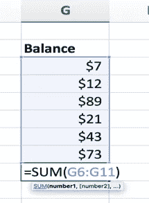
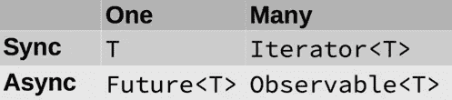
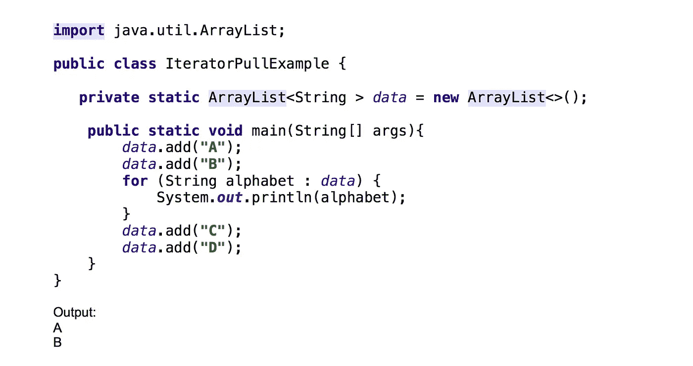
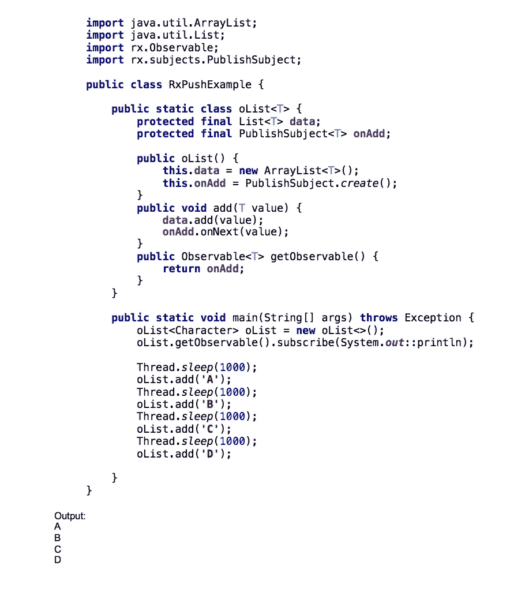
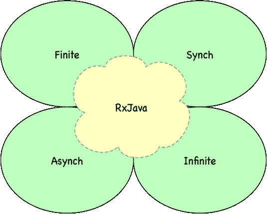

# 积极应对

> 原文：<https://medium.com/capital-one-tech/being-proactively-reactive-7e112abf1579?source=collection_archive---------3----------------------->

## 抽象出代码复杂性的新范例

实时事件无处不在——无论是 UI 事件还是数据事件——它们正在推动 web 和移动应用程序向用户提供高度互动的体验。作为一名开发人员，当试图提供高交互性时，很容易陷入实现细节的网络中。反应式编程范式在命令式回调系统上增加了一个抽象层次，帮助我们不再担心复杂的实现细节。

然而，实现这种抽象可能需要编码风格的重大改变。

# 什么是反应式编程？

每个人都至少有一点反应式编程的经验，因为我们大多数人以前都做过 Excel 电子表格。这看起来眼熟吗？

在上面的 Excel 表格中，如果任何数字发生变化，总和也会相应地更新。这在传统上被称为[数据流编程](https://en.wikipedia.org/wiki/Dataflow_programming)*，但已经被现代化并重新命名为*反应式编程。**

*在这个范例中，输入数据序列可以采取多种形式；它们可以是来自文件或 web 服务(如 Twitter feed)的数据流，也可以是一系列事件(如用户输入或鼠标点击)。人们可以将该流视为按时间顺序的事件/数据序列的*传输。本质上是非阻塞的异步编程使得能够将这些数据流序列委派给各种线程、系统和/或设备。**

**反应式编程是关于数据序列异步流动的编程。**

# *被动的心态…*

*JavaScript 诞生的时候，C、C++和 Java 在商业上流行于非大型机计算。像我一样，大多数 Java 开发人员继续呆在面向对象编程的舒适区，偶尔打破规则，比如在 JSP 中嵌入 JavaScript 片段。*

*JavaScript 社区真正腾飞是在 2005 年，当时杰西·詹姆斯·加勒特发布了一份白皮书，他创造了“Ajax”这个术语——JavaScript 是其支柱。这导致围绕 JavaScript 形成了过多的开源库和社区。函数式编程没有一个公认的定义；然而，通过将函数视为第一类对象，Javascript 使得面向对象的程序员改变了他们的思维。*

*如今，Java8、Scala、Groovy 和 Clojure 等 JVM 语言已经采用并集成了函数式编程作为其语言的关键部分。来自命令式编程的背景，从函数式编程开始可能会令人望而生畏。然而，在使用函数式编程技术的几周内，人们可以快速构建一组简单的模块化函数，并利用基于语言的并行计算。反应式思维需要类似的(如果不是更少的话)编程范式转变，以迫使您的大脑放弃旧的典型命令式和函数式编程习惯。*

# *…导致被动反应！*

*行为模式观察者和迭代器是现代 UI 框架和 MVC 模型中最流行的模式。很好地理解这两种模式是开始使用反应式编程的基础。*

***迭代器模式**提供了一种方法来遍历和访问或*拉取*容器(集合/数据源/生成器)对象的元素，而不暴露其底层表示。在**观察者模式**中，生产者知道新数据何时可用，并向消费者发送或*推送*该数据。*

*迭代器和观察器是*拉*和*推*模型的主要例子，它们是许多反应式编程讨论的基础，与*同步和异步*风格的编程直接相关。*

**

## ****拉****

*当您*拉动*时，您最终会重复数据集以检测变化。在下面的示例中，初始数据集有两个字符——A 和 b。第一次迭代提取并打印 A 和 b。然后我添加了两个新字符，但除非我再次迭代相同的数据集，否则看不到变化。这是一个势在必行的 T21 方法。*

**

*当然，可以通过使用*轮询*来实现*拉*的方法——例如每 1000 毫秒检查一次数组长度，如果数据有变化就遍历。换句话说，使用 *pull* 让开发人员负责明确请求数据中的任何变化，这通常需要启动多个线程，并且难以维护。*

## ****推****

*为了使用*拉*的方法获得最新的变化，开发人员最终会编写复杂的代码。*推送*可以使用*观察者模式*来实现，但是那涉及到开发者需要反复编写的大量锅炉板代码。*推*的实现也可以使用*回调*的方法来实现，但是与*观察者模式*不同，在回调中只有一个回调可以被告知变化。这意味着开发人员最终会编写复杂的代码，这违背了回调的目的。为了避免编写复杂的回调或样板观察者模式，我们可以从 *Rx 库*中获益。*

*在这个例子中，在 RX 类 **Observable** 和 **PublishSubject** 的帮助下，我们已经为 *ArrayList* 提供了向其订户推送更改的能力。人们可能仍然会争论代码是复杂的，但这正是开发人员需要范式转换的地方——随着我们的深入，它会变得越来越简单。学习 Observable 和 PublishSubject 的基础知识将有助于我们理解这个例子。*

## ***rx。可观察的***

*在 ReactiveX 中，一个观察者订阅了一个**可观察的**。然后，观察者对可观察物发出的任何项目或项目序列做出反应。通过调用 observers 方法，可观察对象向其观察者发出项目或发送通知。一旦[观察者](http://reactivex.io/RxJava/javadoc/rx/Observer.html)订阅了，“观察者有时被称为“订阅者”、“观察者”或“反应者”。*

## ***rx . subjects . publish subject；***

***主题**是一种桥或代理，在 ReactiveX 的一些实现中可用。它既是观察者又是被观察者。因为它是一个观察者，所以它可以订阅一个或多个观察值。因为是可观测的，所以它可以通过重新发射的方式穿过它所观测的项目，也可以发射新的项目。**发布主题**是为特定用例设计的*主题*的四个变种之一。它将所有后续观察到的项目发送给订阅者，并为观察者提供一个新的观察项目。*

**

## ***无功扩展(RX)***

*AJAX (Java 的非阻塞 I/O API)和 Node.js 在主流 web 开发中的流行确实帮助了同步/异步概念的发展。当涉及到数据结构时，大多数程序员通常使用**有限集合**如数组、映射或集合，而**无限集合**通常使用网络套接字处理。*

*反应式扩展或 RX 承诺为语言提供一致的 API，允许它在数据序列的这四个维度上无缝工作:**异步、同步、有限和无限。***

**

*简而言之，*

> *“它扩展了 observer 模式以支持数据和/或事件的序列，并添加了操作符，允许您以声明的方式将序列组合在一起，同时抽象出诸如低级线程、同步、线程安全、并发数据结构和非阻塞 I/O 等问题。”——http://reactivex.io/intro.html*

# ***为什么不无功？***

*如果您的代码只处理一个事件流，那么带有回调的命令式编程可能是一个不错的选择。即使您有多个独立的事件流，命令式编程可能仍然更好，因为它消除了反应式编程的抽象层，使您更接近操作系统和编译器优化。*

*然而，提供高度交互的体验通常需要您组合事件，拥有条件逻辑，并优雅地处理失败场景——这是反应式编程真正闪光的地方。*

# *摘要*

*反应式编程是一个编程术语，专注于对变化(如数据值或事件)做出反应，这些变化通常是强制性的。反应式编程实现提供了对命令式回调的额外抽象。这个抽象层为异步和非阻塞编程提供了一个非常强大的工具。然而，它需要对你的编码风格进行重大的改变。当你实现了这种改变，反应式编程被证明是一种非常有效的工具，和它的前辈们一起——面向对象和函数式编程。在简化企业级软件复杂性的任务中，每个都有自己的重要位置。*

****披露声明:以上观点为作者个人观点。除非本帖中另有说明，否则 Capital One 不属于所提及的任何公司，也不被其认可。使用或展示的所有商标和其他知识产权都是其各自所有者的所有权。本文为 2017 首都一。****

****欲了解更多关于 Capital One 的 API、开源、社区活动和开发人员文化，请访问我们的一站式开发人员门户网站 DevExchange。***[***developer.capitalone.com/***](https://developer.capitalone.com/)*