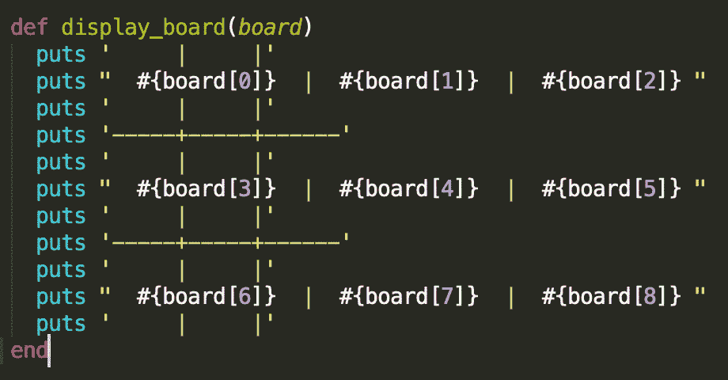
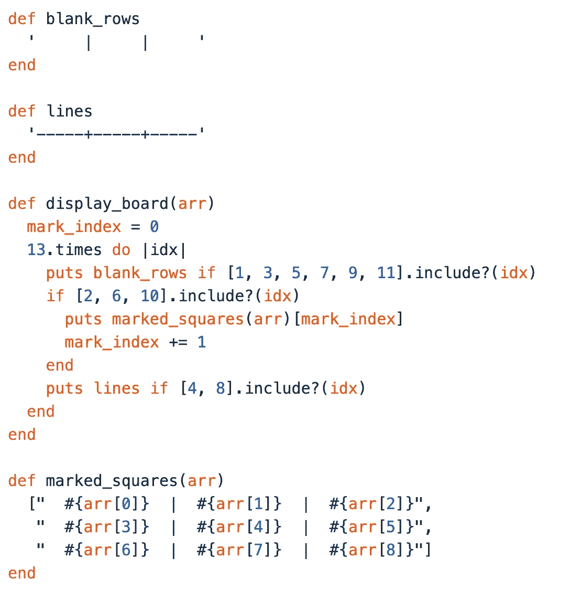
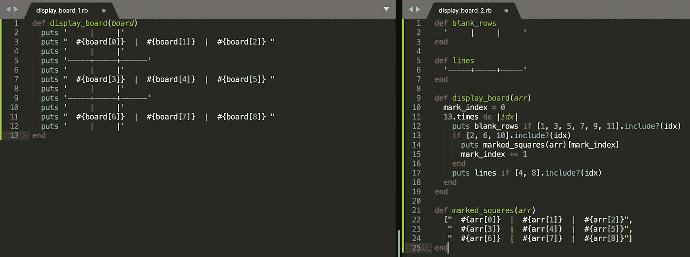
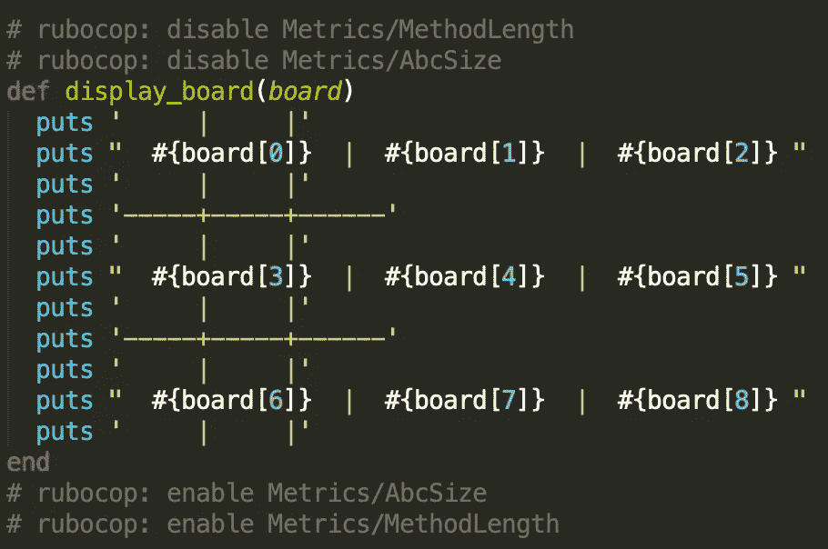

# 做你自己的 Rubocop

> 原文：<https://medium.com/quick-code/being-your-own-rubocop-9e617921ac6d?source=collection_archive---------6----------------------->

重构一个人的代码通常是一个乏味和令人沮丧的过程。作为程序员，我们的主要职责之一就是让我们的代码尽可能的易读和简洁。仅仅让您的代码按照您希望的方式运行是不够的。Rubocop 是一个 Ruby 静态代码分析器和格式化程序，它可以作为一个向导来确保你的代码没有错误，并遵循 Rubyists 所遵循的一系列语法约定。这是一个非常有用的重构工具，因为它列出了代码中的各种问题以及它们的位置。这使得重构的过程更加有效和有序。

虽然 Rubocop 无疑是有帮助的，但当涉及到它的违规列表时，保持相当程度的怀疑是很重要的。当涉及到重构时，我们需要使用我们更好的判断，否则我们最终会做出不必要甚至有害的调整。我在 Launch School 做编码练习时意识到了这一点。我被要求设计一个基本的井字游戏。这个程序最简单的一个方面是通过使用连字符、竖线、加号和数组的插值元素来显示棋盘。最终结果如下图所示:

Displaying the board

运行我的配置文件时会出现两种 Rubocop 违规情况:

*   方法的行数太多。
*   赋值分支条件太大。

对于有编程经验的人来说，第一次违反可能是不言自明的。该方法超出了我的 Rubocop 文件中指定的行数。(在这种情况下，限制为 10 行)。第二次违规就有点暧昧了。这取决于以下等式:√(A + B + C)。( **A** 赋值 **B** 分支 **C** 条件)【赋值】代表变量赋值的数量，“分支”代表方法调用的数量，“条件”代表条件语句(如 if/else 语句)的数量。在这种情况下，重复实现“puts”方法会提示这种特定的违规。

重要的是要记住，这些违规存在的原因是为了帮助 ruby 爱好者在他们的代码中保持一定程度的清晰和可读性。然而，我们不能总是从表面上接受 Rubocop 的所有建议。虽然“display_board”方法提示了这两个违规，但是它的目的和配置是非常明显的。电路板甚至在代码中也有描述！没有必要为这种方法构建一个替代框架来绕过前面提到的解决方案。事实上，它甚至会让你的解决方案变得更加复杂，让普通的 Rubyist 爱好者感到困惑，这就违背了使用 Rubocop 的初衷！我是吃了苦头才知道的。为了消除代码中的任何违规，我编写了以下解决方案:

Was this really necessary?

虽然所有这些代码有效地压制了 Rubocop，但它并没有取得多大成就。事实上，这只会让事情变得更糟！为了构建这个解决方案，我花了几个小时埋头研究我的 ruby 文件。虽然我的目录中的特定配置文件可能赞成这样做，但结果肯定不能证明方法是正确的。我必须构建四个独立的方法才能让它正常工作！目标应该是降低复杂性，而不是增加复杂性。让我们一起来看看这些解决方案，并比较两者:

“Buddy, relax. I’m a cop…a Rubocop.”

我相信，即使是零编程经验的人也有更好的机会剖析左边的解决方案，而不是右边的。许多人都熟悉井字游戏棋盘的样子。这应该是重构代码的目标；增加可及性。甚至 Rubocop 自己也知道它并不完美，这就是为什么它为用户提供了禁用/启用某些 cop 的方法。

*being above the law

虽然 Rubocop 仍然是重构的一个有用工具，但是在考虑它的建议时一定要谨慎。以此为指导，让你的代码更容易理解，但要运用你的演绎推理技巧，做出有意义的调整，避免吹毛求疵。否则，你可能会像我一样:3 个多小时深入到一个解决方案中，承受琐碎、费力的复杂性和自我强加的头痛。故事的寓意；做你自己的 Rubocop。

This is you.