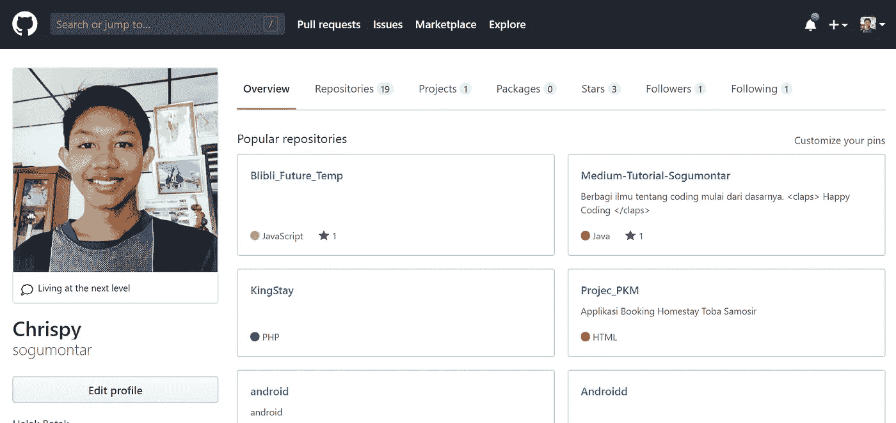
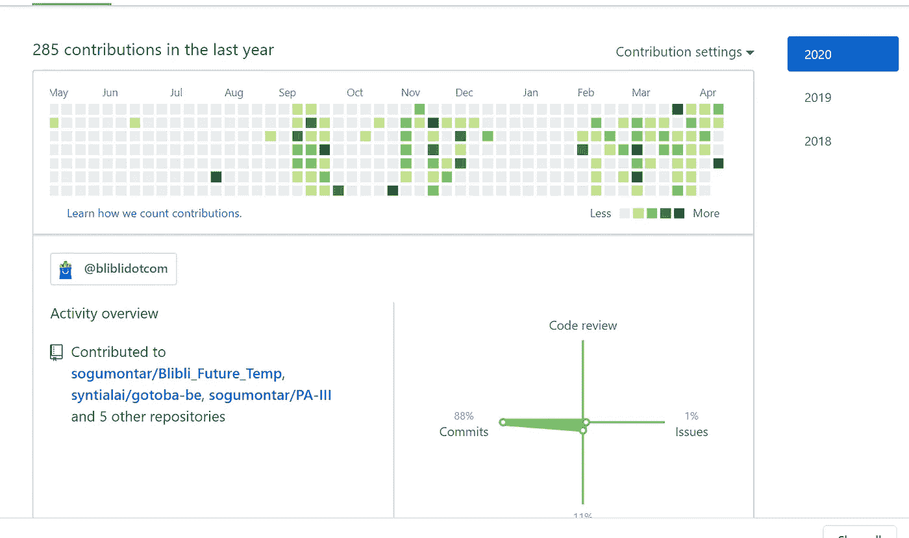
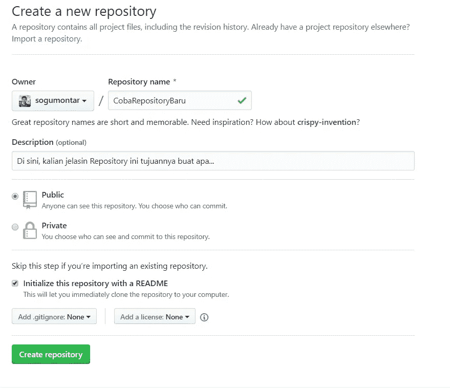
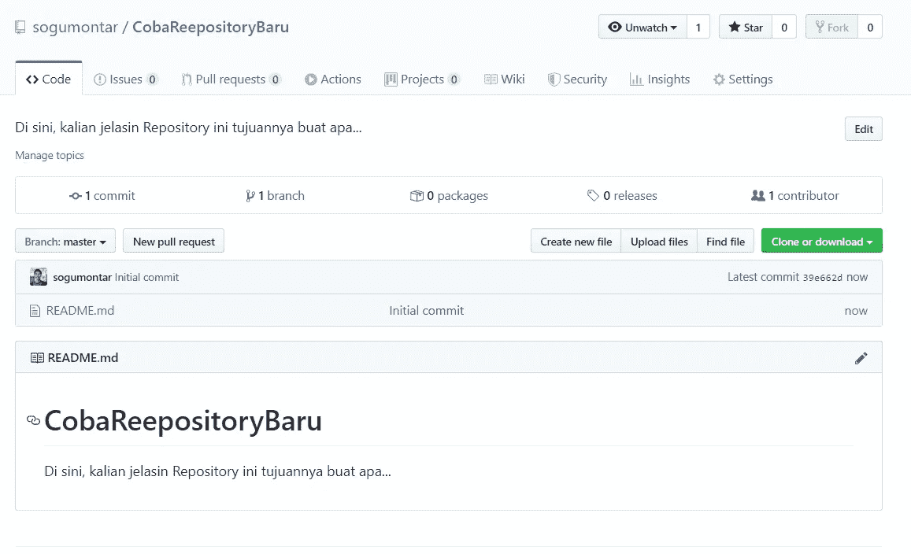
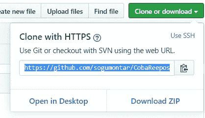
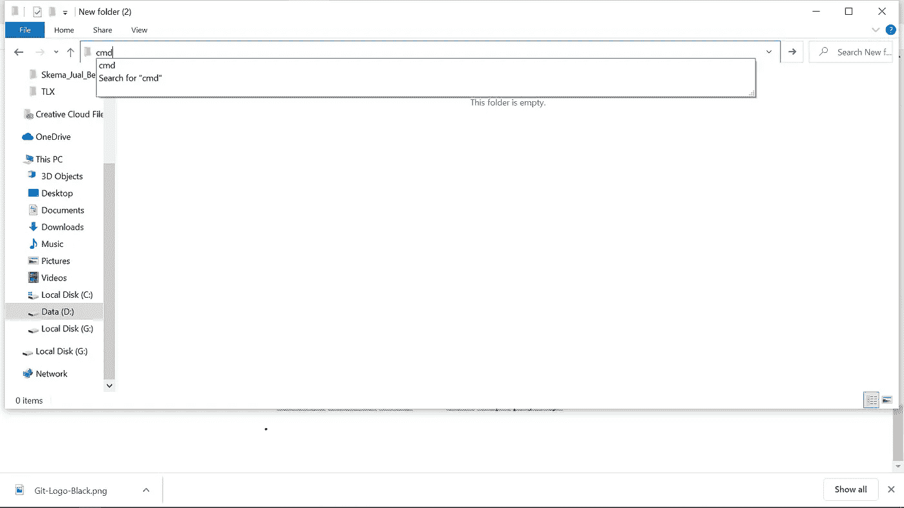
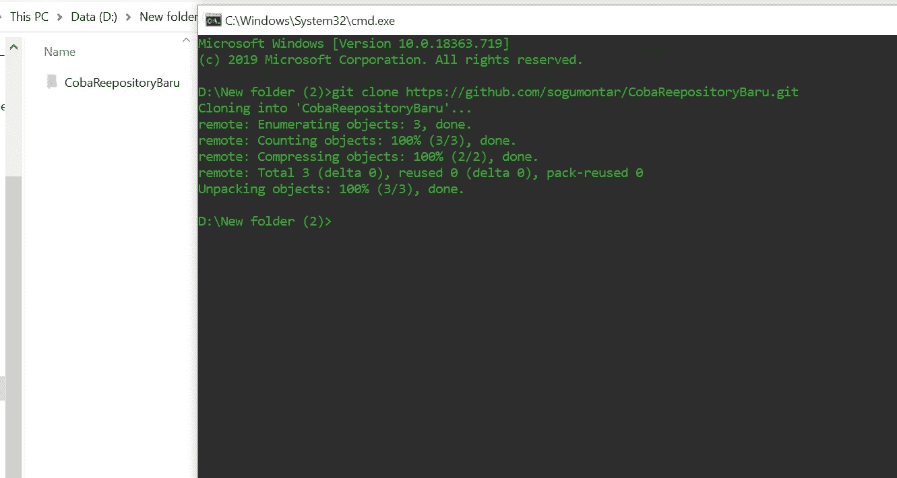
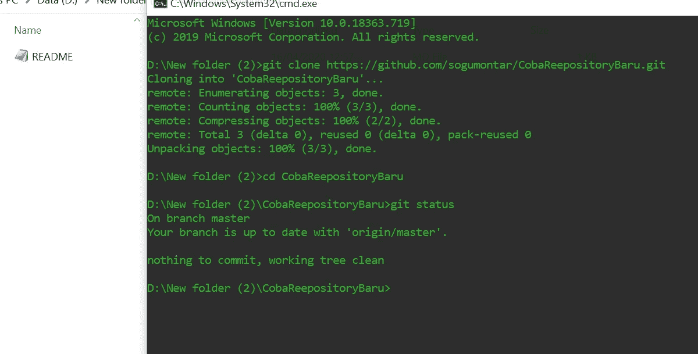

# Belajar Git Dalam Waktu Singkat (Studi Kasus: Github)

> 原文：<https://medium.easyread.co/belajar-git-dari-dasar-dalam-waktu-singkat-github-82e5e7880b4e?source=collection_archive---------0----------------------->

## Langkah-langkah penggunaan git bagi pemula

Salam sejahtera bagi kita semua kembali lagi bersama saya, [Sogumontar Hendra Simangunsong](https://medium.com/u/d6d74fde68be?source=post_page-----82e5e7880b4e--------------------------------) . Di tulisan kali ini, kita akan belajar bagaimana cara menggunakan git yang baik dan benar hanya dalam waktu singkat.

> Disini untuk belajar memahami penggunaan git, saya menggunakan ***Github*** sebagai wadahnya. Teman-teman dapat mencobanya pada ***Bitbucket*** , ***Gitlab*** ataupun tools git lainnya.

Sebelum masuk ke pembelajaran kali ini, mari berkenalan lebih dahulu dengan git.

# **Apa Itu Git?**

> Git merupakan sebuah software yang ditujukan untuk melakukan manajemen code/project (free dan opensource version control) yang dirancang untuk menangani segala sesuatu dari proyek kecil hingga sangat besar dengan kecepatan dan efisiensi. Git pertama kali diciptakan oleh THE SPECIAL ONE ***Linus Torvalds.***

Dia juga adalah pencipta OS Linux. Git dibuat khusus untuk para *programmer* , meskipun sebenarnya dapat dipakai oleh *non-programmer* juga *.* Dengan adanya git, kita dapat terbantu untuk melakukan manajemen kode. Kita bisa melakukan kolaborasi dengan orang lain, tanpa harus meng- *copy project* lagi, seperti yang orang awam ( ***MUGGLES*** ) lakukan.

## Keuntungan Memakai Git

Berikut saya paparkan keuntungan menggunakan git yang saya sudah rasakan sampai saat ini.

1.  Dapat menjadi repositori (penyimpanan *project* ), sehingga kita gak perlu takut lagi dengan dengan masalah “ **kehilangan data** ”.
2.  Mempermudah *programmer* dalam melakukan Kolaborasi Jarak Jauh (KJJ). Kita dapat membantu melakukan *problem solving* dengan orang lain, tanpa harus tatap muka secara langsung.
3.  *Project* akan terlihat jauh lebih rapi jika menerapkan aturan git.
4.  Kita juga dapat melakukan review terhadap perubahan code orang lain.
5.  Jika terjadi error dalam sistem, kita dapat mengetahui siapa pelakunya, biasanya *sih* disebut ***CODE BLAMING*** . Jadi gak perlu cari satu per satu lagi *deh* , tinggal lihat commit-an terakhir.

# Memulai Git

Sekarang kita mulai belajar Git, tapi sebelumnya, kita harus sudah memiliki Git nya. Untuk men-downloadnya bisa langsung ke *web* resminya yah. [***https://git-scm.com/downloads***](https://git-scm.com/downloads)

Setelah selesai instalasi, kita bisa masuk ke web [Github](https://github.com/) dan melakukan *login* . Kalau belum punya akun boleh daftar dulu ya!

Ini adalah tampilan *profile* github. Di sini kita dapat melihat semua repositori yang kita miliki, dan juga *project* yang sedang kita kerjakan.

*Nah* , di sini kita juga bisa melihat kontribusi kita selama kita bekerja menggunakan git. Yang menjadi penilaian *contribute* nya adalah *commit, code review, issues,* dan *pull request* .

Mari kita mulai dengan membuat *projec* t git dari awal, hingga *pull request* dan *merging* -nya nanti.

## 1\. Pilih menu *repositories*

Langkah pertama yang dilakukan yaitu pilih menu repositories dan klik tombol *new* (berwarna hijau di sebelah kanan).

Tampilan membuat repositori

## 2\. Langkah-langkah berikutnya:

*   Isi nama *repository* nya, sesuai keinginan kamu.
*   Isi bagian deskripsi (sesuai deskripsi *project* tersebut).
*   Untuk jenis *project* nya, ada dua, *public* supaya semua orang bebas mengakses repositori tersebut. Berbeda dengan *private,* hanya bisa di akses oleh *collaborators* (max hanya 4 untuk yang **gratisan** ).
*   Kemudian untuk bagian *init* with README, kalian bebas milih, kalau di centang, setiap *clone project* , akan langsung ada file README nya.
*   *GitIgnore* untuk menambahkan batasan yang bisa di *upload* ke dalam *git* .
*   *License* , untuk menambahkan *license* nya **jika ada.**
*   Setelah *setup project-* nya selesai, tekan tombol ***Create repository*** .
*   Kalau sudah di *create project* -nya, kita sudah punya repo baru deh, hehehehe.

## 3\. Cara meng-clone project

*   Tekan tombol *clone or download*
*   Kamu dapat menggunakan HTTPS ataupun SSH. Untuk penjelasan kali ini saya menggunakan HTTPS.

*   *Copy link* nya
*   Kemudian sediakan sebuah *folder* untuk tempat *project-* nya
*   Kemudian klik kanan di dalam *folder* tersebut, pilih *git bash here* .

**JIKA TIDAK ADA**

*   Buka *command prompt* dari *folder* tersebut
*   Dengan cara mengetikkan ‘cmd’ di dalam *root folder*

Berikut perbandingan menggunakan *command prompt* dan *git bash* .

Kali ini saya akan menggunakan *cmd.*

*   Kemudian, ketikkan ‘git clone’, lalu *paste link* github yang tadi kamu *copy*
*   Klik **Enter** dan *Voila* .. *project* kamu telah ter- *clone*

*   Selanjutnya, masuk ke dalam *folder* yang telah kamu *clone* tadi dengan cara ketik “cd namaprojectkamu” (contoh - > “ cd CobaReepositoryBaru” )

Kemudian coba ketik “git status”

*   Akan keluar *response* “On branch master”
    *Your branch is up to date with ‘origin/master’. Nothing to commit, working tree clean”.* Yang artinya, sekarang kamu berada dalam branch **master,** dan apa yang ada dalam *folder* *project* di PC kamu, sama dengan yang ada dalam repository di *git hub* .

## 4\. Cara memasukkan project ke github

Cara untuk memasukkan *project* ke dalam github adalah:

*   *Copy manual project* yang ingin di masukkan ke dalam *github* , ke dalam *folder* yang sudah di *clone* tadi.
*   Ketikkan “ *git status* ” kemudian akan muncul, apa saja yang kita perbarui dalam *project* tersebut.
*   Ketikkan “ *git add* ” di dalam *command prompt* yang tadi kita buka.
*   Ketikkan “ *git commit -am ‘ nama commitanmu’ ”.* Contoh - > **“git commit -am ‘init project’ ”**
*   Perubahan tersebut, telah tersimpan dalam repository *local-* mu.

Namun perubahan tersebut, belum dapat di lihat oleh *contributor* yang lain. Bagaimana cara supaya bisa di lihat contributor yang lain?

*   Caranya adalah dengan melakukan *push* , tapi sebelum *push* , kita harus melakukan *pull* terlebih dahulu untuk mencegah adanya *conflict* .
*   Ketikkan “ *git pull* ” / “ *git pull origin master* ” - > master di sini, menyatakan *branch* kamu saat ini.
*   Ketikk “ *git push* ”/ “ *git push origin master* ”
*   Selesai yeayyy!!

Sekarang *contributor* lain sudah dapat melihat *project* yang telah kamu masukkan tadi. Sekian penjelasan tentang *github.* Bakal ada lanjutan lagi kok, tungguin ya, hehehehe.

<claps>👏 Happy Coding 👏<claps></claps></claps>