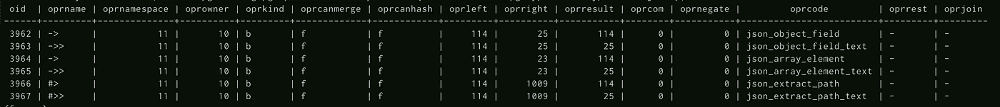

# Belajar JSONB di PostgreSql

> 原文：<https://medium.easyread.co/belajar-jsonb-di-postgresql-5b4eba5df0b8?source=collection_archive---------2----------------------->

## Dasar operator, json, dan jsonb di PostgreSql


PostgreSQL with JSON

Hi kawan kalian tahu PostgreSql ga? bagi yang belum tahu PostgreSql adalah salah satu database relasi yang open source, seperti yang kita tahu PostgreSql adalah database yang datanya di representasikan dalam bentuk tabel. Mungkin dulu sebelum kalian mengenal database yang menyimpan datanya dalam bentuk dokumen kalian sering menggunakan database yang berbentuk tabel, mungkin Mysql, MariaDB, atau Oracle.

# *Schemaless*

Ada beberapa alasan kenapa kita menggunakan database relasional, Seperti kita dapat melakukan join beberapa tabel, agregasi dan kita sudah tahu bahwa data yang akan kita simpan itu memiliki *schema* yang pasti. Namun, apa yang terjadi jika ternyata tiba-tiba ada suatu data yang *schemanya* belum jelas?, hal yang mungkin difikirkan adalah akan menggunakan database lain yang memang mendukung untuk struktur data yang *schemanya* belum pasti. Di Indonesia sendiri yang cukup populer adalah MongoDB, sebuah database NoSQl yang merepresentasikan datanya dalam bentuk dokumen(MongoDB menyebutnya BSON). Namun ingat tujuan dari NoSQL bukan hanya schemaless masih banyak keuntungan lain yang kita dapatkan menggunakan NoSQL.

# JSON dan JSONB

Salah satu jenis tipe data yang dapat digunakan untuk menyimpan data *schemaless* adalah JSON, PostgreSQL sendiri merilis dukungan untuk menyimpan data dalam bentuk JSON pada versi 9.2(CMIIW), dalam menyimpan data JSON PostgreSQL membuat suatu tipe data tersendiri lagi yang disebut JSONB lalu apa bedanya JSON dan JSONB?. JSON adalah suatu format data yang berbasis text dengan struktur sederhana yang mudah dibaca manusia, JSON ini tidak peduli jika ada whitespace, urutan key, duplikat antara key dan value. Untuk menghindari hal-hal tersebut maka dibuatlah JSONB, bentuk data sama seperti JSON namun disimpan dalam bentuk binary code serta dapat melakukan operasi-operasi yang tidak bisa dilakukan oleh JSON. PostgreSql sendiri mendukung kedua tipe data tersebut, bagi saya jika kalian hanya membutuhkan operasi dasar JSON saya sarankan menyimpan data dalam bentuk JSON saja, tetapi jika membutuhkan operasi yang tidak bisa dilakukan JSON maka JSONB dapat menjadi pilihan.

# Operator JSON dan JSONB

Apa saja sebenarnya operator yang dapat digunakan untuk tipe data json dan jsonb?. Untuk mengetahui operator apa saja kalian dapat membaca langsung dalam dokumentasi PostgreSql atau membacanya dalam database pg_catalog, dengan menjalankan query berikut:

```
-- Untuk melihat operator json
SELECT oid, * FROM pg_catalog.pg_operator WHERE oprleft = (SELECT oid FROM pg_type WHERE typname = 'json');-- Untuk melihat operator jsonb
SELECT oid, * FROM pg_catalog.pg_operator WHERE oprleft = (SELECT oid FROM pg_type WHERE typname = 'jsonb');
```



hasil query untuk operator json

Memang tidak ada penjelasan maksud dari operator tersebut, namun query tersebut menunjukan ke kita bahwa kita dapat menggunakan oprname untuk query data atau oprcode, kenapa kita perlu tahu tersebut? karena ketika kita membangun sebuah aplikasi kadang kita tidak bisa langsung menggunakan operator name dalam membangun query sebagai contoh ada operator `?|` yang mengecek apakah ada nilai string[] itu ada di data tersebut atau tidak, jika kita menggunakan `?|` secara langsung akan dibaca sebagai prepared statement di query yang mana ketika dijalankan kode kamu mungkin akan menyebabkan error karena kamu tidak memberikan value kepada prepared statement tersebut, maka dari itu untuk mencari alternatif lain kalian dapat menggunakan oprcode.

## Operator JSON dan JSONB:

## Operator JSONB:

Jadi berikut operator-operator yang ada di JSON dan JSONB biasanya operator tersebut digunakan ketika kalian `GET` data atau query `SELECT` , sebenarnya masih ada fungsi lain seperti fungsi untuk `creation` , dan `processing` yang dapat kalian baca di [dokumentasi](https://www.postgresql.org/docs/) postgresql.

# Kesimpulan

Jadi berikut tentang dasar-dasar JSON dan JSONB kapan kita harus memakai json dan jsonb? adalah berdasar dari akan ada operasi data seperti apa yang terjadi di dalam database kita, jika operasi tersebut operasi JSON dasar kita dapat menggunakan JSON dan jika ternyata membutuhkan operasi lain kita bisa menggunakan JSONB, selain itu JSONB punya keunggulan sbb:

*   Pemrosesan data lebih cepat
*   Mendukung indexing

Tapi juga memiliki kelemahan:

*   Input data menjadi lebih lambat karena di konversi ke bytecode
*   Kemungkinan memakan ruang penyimpanan lebih besar

See you guys selamat belajar :D