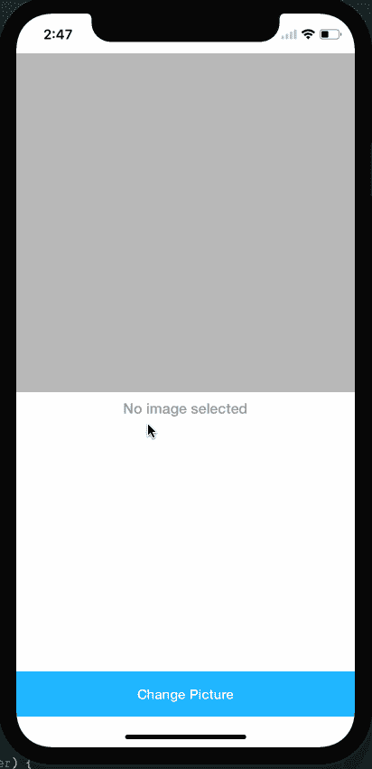

# Belajar Machine Learning pada iOS dengan Core ML: Image Recognition

> 原文：<https://medium.easyread.co/belajar-machine-learning-pada-ios-dengan-core-ml-image-recognition-48af15d2a726?source=collection_archive---------2----------------------->

Pada tulisan kali ini saya akan membahas salah satu Framework yang sangat menarik dari Apple, yaitu Core ML. Framework ini masih terbilang cukup baru mengingat ia dirilis pada acara WWDC 2017.

Tulisan ini akan bersifat lebih praktikal dalam mode *step by step* bagaimana kita menggunakan Core ML di dalam project iOS kita.

Singkatnya Core ML merupakan framework yang disediakan Apple untuk memudahkan developer dalam mengintegrasikan model-model Machine Learning yang telah di- *training* sehingga bisa digunakan pada aplikasi iOS dengan mengandalkan resource yang ada pada perangkat iPhone. Apple meng-klaim bahwa Core ML telah dioptimasi sehingga bisa dijalankan dengan optimal pada perangkat iPhone yang telah beredar.

Gambar di bawah ini cukup merepresentasikan apa saja yang bisa kita lakukan dengan framework Core ML ini


Di sini saya menyebutkan *model,* tapi apakah sebenarnya model yang saya maksud di sini? Model merupakan sebuat representasi dari *rules* yang dihasilkan dalam proses yang disebut *training* dengan menggunakan algoritma-algoritma *machine learning* .

Terdengan sangat rumit dan kompleks. Ya, ini memang merupakan salah satu bagian dari machine learning yang cukup rumit. Dan kita tentu tidak akan membahas ini pada tulisan kali ini :).

Untuk mulai bermain dengan Core ML, Apple telah menyediakan beberapa *model* siap pakai. Kita bisa memperoleh model-model ini pada link [ini](https://developer.apple.com/machine-learning/)


Beberapa model yang disediakan Apple

Pada tulisan ini saya akan menggunakan model berikut ini dalam project yang akan saya buat.


Bisa kita lihat pada deskripsinya bahwa model ini bisa kita gunakan untuk mengklasifikasikan Pepohonan, Hewan, Makanan, Kendaraan, dan lain-lain.

Jadi langsung saja kita mulai membuat project sederhana untuk melakukan Image Recognition.

# **Masukkan Model ke project**


Pastikan kita memilih(check) Target yang sesuai untuk file *.mlmodel yang baru saja kita masukkan ke project kita.

Bisa kita perhatikan pada GIF diatas setelah kita berhasil memasukkan model ke project kita, XCode secara otomatis meng- *generate* Swift class sebagai representasi dari model yang baru saja kita import.

Yang perlu kita perhatikan adalah bagian ini


Jadi model yang baru saja kita masukkan ini menerima input berupa *Image* yang mana harus memiliki size 224x224, dan akan menghasilkan output yang terdiri dari 2 field, yaitu nilai *probability* dan juga label.

# Menggunakan Model pada project

Berikutnya kita akan mencoba menggunakan Swift class yang telah digenerate XCode berdasarkan VGG16.mlmodel yang kita import barusan. Untuk memberikan sedikit gambaran, jadi pada project kali ini kita akan membuat aplikasi sederhana seperti ini


Jadi disini kita memiliki

*   UILabel untuk menampilkan hasil dari proses recognition yang akan kita lakukan.
*   UIImageView yang akan menampilkan image yang kita pilih.
*   UIbutton *Change Picture* yang pada saat diklik akan menampilkan action sheet yang terdiri dari 3 opsi yaitu *Phone Gallery* , *Camera* dan *Cancel* .

Kita akan mulai dengan kode seperti ini pada **ViewController** kita

Berikutnya langkah pertama yang perlu kita lakukan untuk menggunakan framework Core ML adalah menambahkan baris berikut

```
import CoreML
```

Setelah kita kita perlu membuat instance dari Class Model yang di-generate oleh XCode tadi.

```
let model = VGG16()
```

Nama class **VGG16** ini akan sesuai dengan nama file *.mlmodel yang kita import.

Selanjutnya kita akan menuliskan kode implementasi pada fungsi **classifyImage(_ image: UIImage)** yang masih kosong pada kode di atas. Pada fungsi ini saya menerima parameter image dengan tipe *UIImage* karena memang kita akan memperoleh sebuah object *UIImage* hasil dari *UIImagePickerController* .

Berikutnya kita perlu memastikan resolusi image kita sesuai dengan ketentuan dari model yang kita punya, yaitu 224x224.

```
let size = CGSize(width: 224, height: 224)UIGraphicsBeginImageContextWithOptions(size, false, CGFloat(0.0))image.draw(in: CGRect(origin: .zero, size: size))let scaledImage = UIGraphicsGetImageFromCurrentImageContext()UIGraphicsEndImageContext()
```

Pada kode di atas, saya melakukan scaling ke object *image* untuk memperoleh size 224x224 dan menyimpan hasilnya ke object baru yaitu *scaledImage.*

Inti dari tulisan ini ada pada fungsi berikut ini

```
/**Make a prediction using the convenience interface- parameters:- image: Input image to be classified as color (kCVPixelFormatType_32BGRA) image buffer, 224 pixels wide by 224 pixels high- throws: an NSError object that describes the problem- returns: the result of the prediction as VGG16Output*/
func prediction(image: CVPixelBuffer)
```

Ini merupakan fungsi yang ada pada class VGG16 yang di generate XCode untuk kita. Bisa kita lihat bahwa fungsi ini menerima satu parameter dengan tipe *CVPixelBuffer* . Karena itu kita perlu meng-convert *UIImage* kita menjadi *CVPixelBuffer* ini.

Kita bisa membuat *extension* dari *UIImage* untuk proses ini.

Selanjutnya kita tinggal menggunakannya pada object UIImage yang kita punya sebelumnya

```
if let scaledImage = scaledImage, let buffer = scaledImage.buffer(), let output = try? model.prediction(image: buffer) { let objectName: String = output.classLabel let possibility: Double = output.classLabelProbs[objectName]! * 100 resultLabel.text = "\(objectName) with \(String.init(format: "%.2f", possibility))% possibility"} else { resultLabel.text = "Sorry, Could not find anything!"}
```

Bisa kita lihat pada kode di atas, kita akan memperoleh hasilnya pada object *output* yang merupakan hasil dari fungsi **prediction(image: CVPixelBuffer)** .

Berikut adalah hasil yang bisa kita dapatkan dengan kode seperti di atas yang mana sangat sederhana



App ketika dijalankan

Bisa kita lihat hasilnya cukup akurat, walaupun tentu ada yang tidak tepat seperti Garpu Makan yang dianggap Spatula. :)

Demikian dulu tulisan saya untuk Core ML kali ini. Semoga bisa saya lanjutkan untuk mencoba mengimplementasikan Core ML untuk kasus-kasus yang lain.

Untuk source code pada contoh dalam tulisan ini bisa diperoleh pada github repository ini > [https://github.com/RR12/Simple-Image-Recognition](https://github.com/RR12/Simple-Image-Recognition)

Sekian.

Terima Kasih.