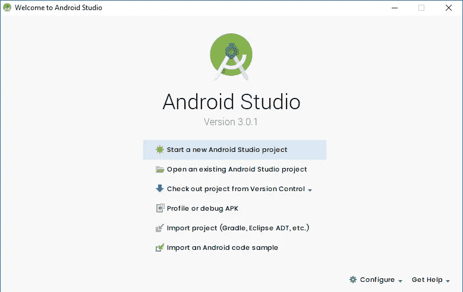
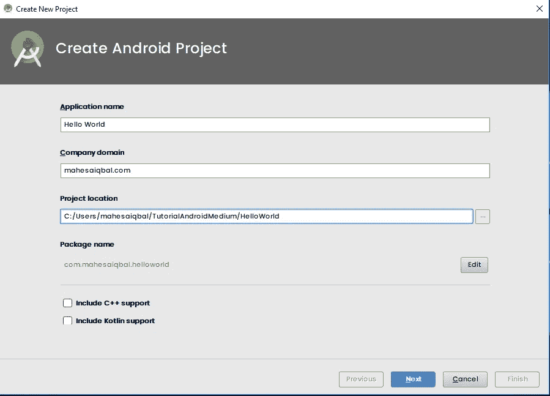
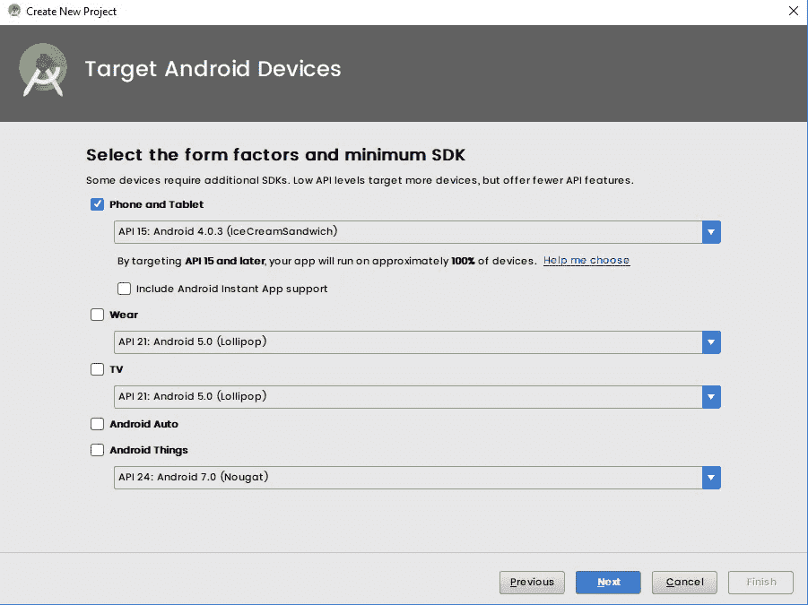
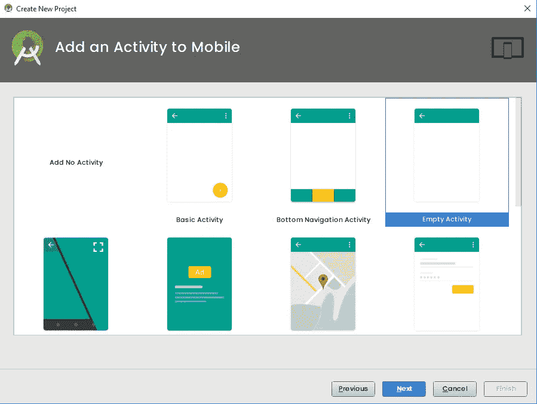
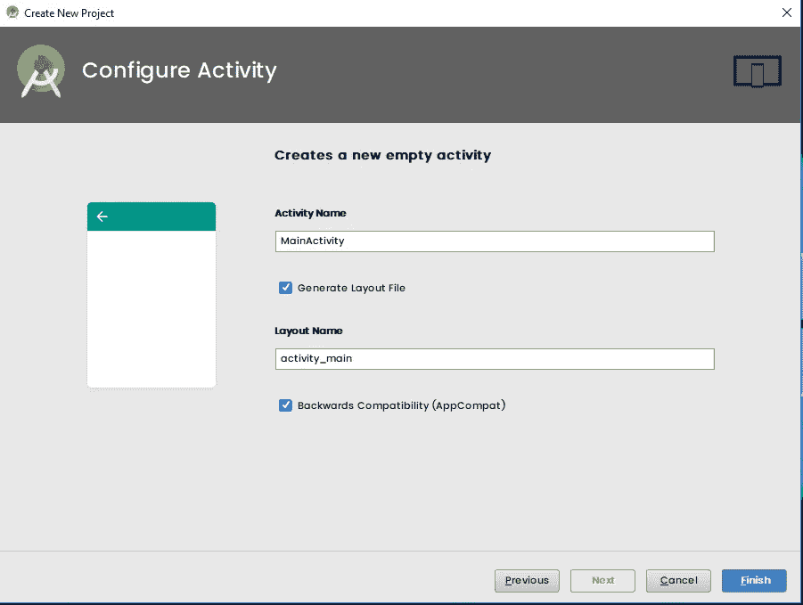
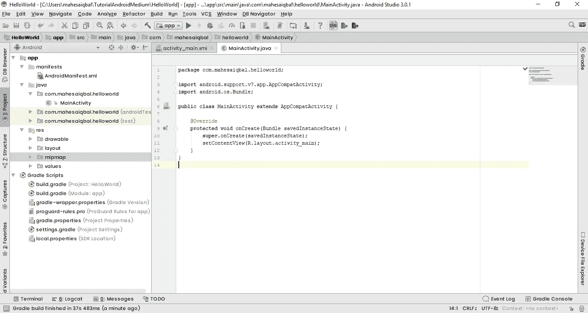
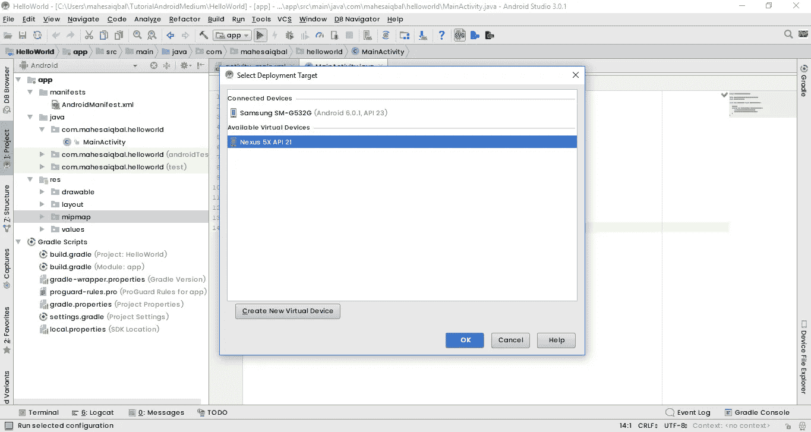
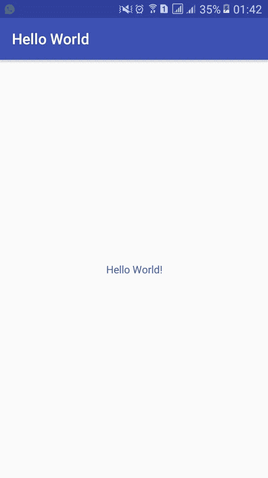

# Belajar Membuat Aplikasi Android (Hello World)

> 原文：<https://medium.easyread.co/belajar-membuat-aplikasi-android-hello-world-832968b3f37b?source=collection_archive---------4----------------------->

Hello World

*Hello Coders!* Pada kesempatan kali ini, saya mau bagi pengalaman saya membuat aplikasi Android pertama saya ketika saya mulai nyemplung di pemrograman Android hehe.

Semua *Programmer* memulai karirnya dengan membuat aplikasi Sederhana *Hello World.* Mereka belajar dengan sungguh-sungguh sampai mereka jadi *The Real Programmer* . Pencapaian ini akan sangat terasa ketika temen-temen sudah mau meluangkan waktunya untuk terus belajar mengembangkan skill koding temen-temen. Akan ada rasa senang yang tidak bisa diungkapkan dan digambarkan ketika temen-temen berhasil jadi *The Real Programmer* . Untuk itu, teruslah berusaha dan jangan lupa berdoa hehe.

Okey baik sebelum kita mulai tutorial kali ini, saya mau memberi tahu apa saja tools canggih yang bisa temen-temen gunakan untuk membuat aplikasi Android, yaitu :

1.  JDK 8
    [http://www.oracle.com/technetwork/java/javase/downloads/jdk8-downloads-2133151.html](http://www.oracle.com/technetwork/java/javase/downloads/jdk8-downloads-2133151.html)
2.  Android Studio
    [https://developer.android.com/studio/index.html?hl=id](https://developer.android.com/studio/index.html?hl=id)
3.  Emulator (Untuk menjalankan aplikasi yang kita buat)
    Ini opsional ya, di Android Studio sendiri sudah menyediakan Emulator khusus untuk menjalankan aplikasi yang kita buat langsung di PC/Laptop temen-temen. Nah, saya menggunakan emulator yang langsung *debug* ke *device* , namanya Vysor.
    [https://www.vysor.io/](https://www.vysor.io/)

Okey, untuk penginstalannya, temen-temen bisa cari sendiri di Google ya (agar terbiasa Googling) hehe.

Langsung saja, Buka Android Studio yang sudah terinstall, lalu pilih *Start a new Android Studio Project*

Tampilan Awal Android Studio 3.0.1

Setelah itu, isikan *Application Name* dengan nama *Hello World,* *Company Domain* bebas, untuk contoh saya tampilkan saja nama saya (mahesaiqbal.com kalo dicari tidak ada di internet, hanya sample saja), *Project Location,* temen-temen bisa sesuaikan lokasi proyeknya dimana, untuk contoh saya buat seperti ini.

Okey, klik *Next* . Nah, sekarang atur untuk *Target Android Devices* agar aplikasi kita bisa berjalan di standard minimum Android API 15 yaitu *IceCreamSandwich* (dibawah versi ini tidak akan mendukung).

Okey, klik *Next* . Lalu pilih *Activity* yang ingin digunakan, untuk contoh kita buat yang *Empty Activity* terlebih dahulu.

Okey, klik *Next* . Untuk konfigurasi *activity* utama kita, kita biarkan default dengan nama *MainActivity* dan *activity_main* . Klik *Finish* .

Nah, temen-temen tinggal tunggu proses Gradle yang sedang berjalan sampai *success* membangun *Gradle* . Nanti temen-temen akan berjumpa dengan tampilan seperti ini.

Seperti ini tampilan Android Studio, nanti kita akan bermain dengan sekumpulan kode disini. Okey, sekarang tinggal kita jalankan aplikasinya dengan cara klik tombol *Play* yang berwarna hijau di bagian atas. Ketika sudah di klik, maka akan tampil tampilan seperti ini

Nexus 5X API 21 ini adalah emulator bawaan Android Studio, jika belum ada maka temen-temen bisa pelajari lebih lanjut disini [https://developer.android.com/studio/run/emulator.html?hl=id](https://developer.android.com/studio/run/emulator.html?hl=id)

Kalau sudah terinstall Vysor, maka *device* yang sudah temen-temen hubungkan melalui kabel *USB* , maka akan tampil merek dan tipe *Handphone* temen-temen. Tutorial lebih lanjut [https://developer.android.com/studio/run/device.html?hl=id](https://developer.android.com/studio/run/device.html?hl=id)

Langkah terakhir yaitu klik *OK* . Tunggu proses pembangunan aplikasi dengan *Gradle* nya dan proses penginstalan APK secara otomatis, maka secara otomatis akan tampil di layar *Hanphone* temen-temen seperti ini

Aplikasi Sederhana Hello World

Yeay! sekarang temen-temen sudah berhasil membuat aplikasi Android pertama yaitu *Hello World* dan menjalankannya di *Handphone* temen-temen :)

Sekian dari saya, terima kasih dan salam *Coders!*