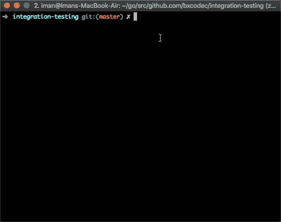
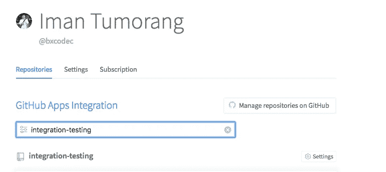

# Belajar membuat Integration Testing di Golang dengan Database

> 原文：<https://medium.easyread.co/belajar-membuat-integration-testing-di-golang-dengan-database-d7b3022fc4bc?source=collection_archive---------2----------------------->

## Membuat test-suite di Golang dengan real database/service yang aktif.


Photo by [ShareGrid](https://unsplash.com/@sharegrid?utm_source=medium&utm_medium=referral) on [Unsplash](https://unsplash.com?utm_source=medium&utm_medium=referral)

Software testing adalah salah satu proses yang bertujuan untuk meng-indentifikasi kebenaran, penyelesaian serta kualitas dari sebuah software yang dibangun. Terdapat banyak jenis software testing. Ada yang disebut dengan unit-testing, load-testing, stress-testing, integration-testing, UI-testing, e2e-tesing dan mungkin masih banyak lagi yang saya belum tahu.

Setiap jenis test memiliki tujuan yang berbeda-beda. Semisalnya unit-testing bertujuan untuk meng-test satuan unit terkecil sebuah fungsi, sehingga karena cakupannya hanya unit, disebut unit-testing. Load testing misalnya dilakukan untuk mengetahui seberapa mampu sistem kita menerima sebuah request yang sangat besar. Dan integration testing bertujuan untuk memastikan agar sistem kita dapat di integrate dengan external service tanpa ada issue ketika deploy.

## Integration Testing In Go

Dalam article ini, saya hanya akan membahas tentang integration-testing, dan praktiknya yang saya lakukan di Go (Golang). Seperti sebelumnya saya sebutkan di-atas, tujuan test ini adalah memastikan agar sistem kita dapat di integrasikan dengan external service tanpa ada issue ketika deploy nantinya.

Dengan adanya test ini, diharapkan kita dapat menghindari issue-issue yang simple khususnya ketika melakukan integrasi dengan database atau service di semua environment (production, staging).

Sebelum melangkah jauh, saya akan meng-klarifikasi beberapa hal. Yakni, berikut yang saya tulis adalah pure experience yang saya miliki dan saya lakukan di [Kurio](https://kurio.co.id) (kantor saya bekerja ketika menulis ini).

Ini adalah cara kami melakukan integration-testing di Kurio. Mungkin teman-teman pembaca memiliki cara lebih baik, maka sebuah kehormatan jika kiranya dapat memberikan saran yang lebih baik terhadap kami, disection komen artikel berikut.

## Preparation and Tools

Saya sudah listkan beberapa tools yang saya gunakan:

*   Docker dan docker-composed.
*   `github.com/stretchr/testify` untuk testing package
*   `github.com/go-redis/redis` untuk redis-driver
*   `github.com/golang-migrate/migrate` untuk migration tools.
*   dan beberapa library yang terdaftar di go.mod

Dalam project ini, saya menggunakan 2 database. Sesungguhnya aplikasi ini tidak benar-benar selesai, namun yang saya fokuskan adalah integration testing fungsi yang ada didalamnya terhadap real database yang aktif.

Saya menggunakan MySQL dan Redis. Lengkpanya dapat dilihat di source code project saya github: [https://github.com/bxcodec/integration-testing](https://github.com/bxcodec/integration-testing)

## Test Suite

Misalkan kita memiliki aplikasi, seperti aplikasi simple yang saya buat ini, lalu bagaimana melakukan integration-testingnya?

Jika kita melihat ke source-code saya, terdapat 2 package: `mysql` dan `redis` . Didalam masing masing pacakge ini, kita akan menemukan handler function masing-masing db, beserta file testnya.

Hal pertama yang saya lakukan adalah membuat test-suitenya yang kemudian di gunakan oleh function test.

Sebagai contoh, kita dapat lihat pada package `redis` , pada file `suite_test.go` saya mendefine sebuah struct `RedisSuite` yang akan digunakan oleh file test lainnya.

```
package redis_testimport (
 "github.com/go-redis/redis"
 "github.com/stretchr/testify/suite"
)type RedisSuite struct {
 suite.Suite
 Host     string
 Password string
 DB       int
 Client   *redis.Client
}func (r *RedisSuite) SetupSuite() {
 r.Client = redis.NewClient(&redis.Options{
  Addr:     r.Host,
  Password: r.Password,
  DB:       r.DB,
 })
}func (r *RedisSuite) TearDownSuite() {
 r.Client.Close()
}
```

Yah, saya hanya menggunakan package `testify` untuk membuat suite test. Package ini cukup sangat membantu saya untuk membuat suite test.

Suite struct ini hanya akan berurusan dengan preparation sebelum test. Seperti: buka databse connection, authentication, migrations dsb. Sehingga bisa dipisahkan jadi satu fungsi general jika hendak di-reuse

Selanjutnya adalah saya akan menggunakan test-suite struct yang saya buat untuk test function yang benar. Kita dapat melihat contoh yg lengkap di file: `cache_test.go`

Jika kita melihat file `cache_test.go` , sedikit berbeda secara pattern dengan test file yang normal biasanya.

Jika dalam file-test normal kita menemukan pattern seperti berikut:

```
func TestXXXX (**t *testing.T**){} // with testing param
```

Terdapat kewajiban untuk membuat parameter testing di setip test-function. Namun untuk kasus test-suite integration yang saya buat, saya menggunakan package testify, sedikit berbeda dalam membuat test-funciton. Patternya adalah sebagai berikut:

```
func (s TestSuite) TestXXXX(){} //without testing param
```

Untuk contoh nyatanya, dapat dilihat di file `cache_test.go` , terdapat 2 fungsi test: `TestSet` dan `TestGet` .

## Running The Test

Untuk menjalankan testnya, sama seperti test biasanya. Kita cukup menggunakan command `go test` . Namun karena kita melakukan integration testing, maka kita harus memiliki database yang aktif dan bisa digunakan untuk kebutuhan testing, (bukan database production ya :D).

Jika testnya di local, maka kita harus memiliki DB atau service yang dibutuhkan live di local kita. Jika testnya dilakukan di CI/CD server, maka kita harus menyediakan db atau service yang dibutuhkan untuk test tersebut di CI/CD server.

Untungnya, di zaman now, di zaman container dan dockerization, kita dapat menjalankan DB kita di atas docker container, jadi tidak perlu butuh server atau install DB hanya untuk kebutuhan testing, baik di local atau di CI/CD server.

Untuk melakukannya cukup mudah, saya akan menggunakan docker-compose. Berikut konfigurasinya.

Lalu dengan konfigurasi diatas, hanya dengan command `docker-compose up -d` , maka ke-dua DB saya akan aktif di container. Sehingga saya dapat melakukan test secara langsung dengan DB yang dibutuhkan.

Untuk kebutuhan kemudahan administratif dan command, saya masukkan semua command yang perlu kedalam Makefile.

Sehingga untuk melakukan integration testing, saya dapat dengan melakukannya dengan single command.

```
$ make integration-test //for integration test
$ make unittest // just for unit-testing
```



demo integration testing command with make file

# Using it With CI/CD (Travis)

Mungkin beda CI/CD beda implementasi, untuk artikel ini saya menggunakan Travis. Meski sesungguhnya, dikantor saya (Kurio) kami menggunakan BuddyWorks untuk CI/CD kami.

## Setup the travis.yml script

Sebelum melanjut, tentu pertama kali, kita harus tambahkan project kita di travis-ci.com, dan enable CI/CD pipelinenya.

Selanjutnya hanya tinggal menambah file konfigurasi ke repo-project kita. Kita harus mendefine file `.travis.yml` di repository kita . Kira-kira seperti inilah wujud scriptnya.

Sudah, itu saja. Jangan lupa enable di travisnya.



find and enable our repo in Travis

Dan setiap test seharusnya sudah bisa dilakukan di travis.

# Boilerplate!!!

Kami engineer Kurio, sudah memisahkan beberapa boilerplate yang kami gunakan untuk TestSuite intgration testing menjadi satu package. Dapat dilihat disini: [https://github.com/golangid/testada](https://github.com/golangid/testada)

Untuk menggunakannya, seharusnya sudah gampang. Semisal kita ingin melakukan integration testing dengan MySQL, kita dapat melakukannya dengan meng-import package testada/mysql. Lalu embed structnya ke test-suite kita.

```
import "github.com/golangid/testada/mysql"type youItemMysqlTestSuite struct {
 mysql.MysqlSuite **//embed from testada/mysql**
}func TestYourItemMysqlSuite(t *testing.T) {
 if testing.Short() {
  t.Skip("Skip you item mysql repository test")
 }
 dsn := os.Getenv("MYSQL_TEST_URL")
 if dsn == "" {
  dsn = "root:root-pass@tcp(localhost:3306)/testing?parseTime=1&loc=Asia%2FJakarta&charset=utf8mb4&collation=utf8mb4_unicode_ci"
 }
 yourItemSuite := &youItemMysqlTestSuite{
  MysqlSuite{
   DSN:                     dsn,
   MigrationLocationFolder: "migrations",
  },
 }suite.Run(t, yourItemSuite)
}
```

Setidaknya package boilerplate ini cukup membuang waktu kita yang percuma hanya untuk menulis redundant code ketika melakukan integration testings.

Namun sedikit saya tekankan, untuk menggunakan package boilerplate ini, diharapkan teman-teman sekalian sudah mengerti bagaimana cara bekerja `testify/suite` sebelum meng-implementasikannya ke test teman sekalian.

Kami di Kurio menggunakan Boilerplate ini untuk kebutuhan testing kami, sehingga bisa dibilang Boilerplate ini akan kami update sesuai kebutuhan, namun meskipun demikian, kami juga akan melihat jalan terbaik lewat kontribusi (Issue/PR) atau pun saran dari teman sekalian terhadap kami.

Akhir kata, ini adalah cara kami melakukan integration-testing di Kurio. Mungkin teman-teman pembaca memiliki cara lebih baik, maka sebuah kehormatan jika kiranya dapat memberikan saran yang lebih baik terhadap kami, disection komen artikel berikut.

Namun jika teman sekalian melihat ini cukup baik, mungkin bantu share ke teman lain yang membutuhkannya ^_^ :)