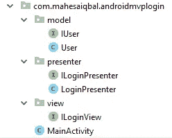
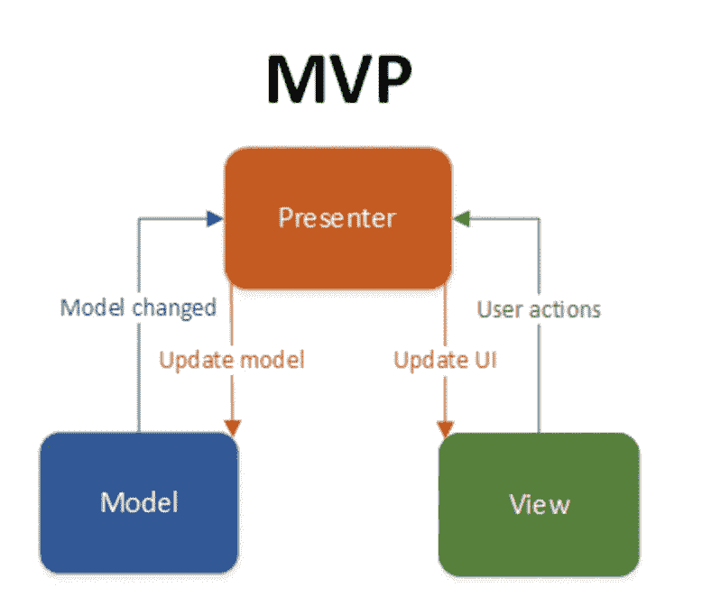

# Belajar Validasi Login dengan arsitektur MVP pada aplikasi Android

> 原文：<https://medium.easyread.co/belajar-validasi-login-dengan-arsitektur-mvp-pada-aplikasi-android-1ce1c230372c?source=collection_archive---------1----------------------->

Hello Coders! kembali lagi di medium saya, maaf untuk sebelumnya saya benar-benar sibuk dengan pekerjaan saya, kali ini saya sempatkan diri untuk kembali menulis lagi 😄, Okey pada pembahasan kali ini saya ingin menjelaskan dari proyek sederhana yang bisa kalian kembangkan nantinya. Okey tanpa perlu panjang lebar langsung saja kita ke intinya saja.

# Membuat Proyek Android Studio

1.  Buat proyek android studio seperti biasa (Jika belum tau bagaimana cara membuat proyek di android studio, anda bisa menuju ke link [disini](https://medium.com/easyread/belajar-membuat-aplikasi-android-hello-world-832968b3f37b) .
2.  Beri nama proyek AndroidMVPLogin atau bebas apapun yang anda mau. Untuk minimum SDK pilih API 16 yaitu Android 4.1 (Jelly Bean) untuk standarnya.
3.  Selanjutnya, pilih Empty Activity untuk Activity nya.
4.  Terakhir, untuk kelas mainnya, default saja yaitu MainActivity.java dan activity_main.xml, lalu finish.

Lengkapi struktur proyek anda menjadi seperti dibawah ini :

Dimana ada 3 package yang akan kita gunakan, yaitu model, view, dan presenter (MVP).

Sebelumnya, saya ingin menjelaskan penjelasan singkat tentang arsitektur MVP.

# Model-View-Presenter

MVP pada dasarnya yaitu memisahkan antara logika aplikasi dengan tampilan dari aplikasi. Biasanya, logika coding dan tampilan kita jadikan satu pada kelas activity kita. Dengan adanya arsitektur MVP ini, logika coding aplikasi akan kita pisahkan ke Presenter. Dimana Presenter itu akan mengolah proses logika pada aplikasi, beserta mengolah data yang bisa saja didapatkan dari inputan user (view), web service (api), maupun dari database. Kemudian akan diproses dengan Presenter, dan akan dikembalikan ke activity yang berfungsi sebagai View pada aplikasi untuk di tampilkan.

# Komponen pada MVP

Komponen dari arsitektur MVP yaitu ada Model, View, dan Presenter yang memiliki fungsinya tersendiri.

*   Model : Layer akses data seperti database atau web service
*   View : Layer yang menampilkan data dan interaksi dengan user
*   Presenter : Layer yang mengirimkan data ke View Presenter juga menangani background task

Mari kita mulai ngoding…

Buka file build.gradle (Module:app), tambahkan kode ini didalam blok dependencies

Buat 3 package dengan nama model, view, dan presenter.

Didalam package model, buat file dengan nama IUser (interface) dan User (class)

Didalam package presenter, buat file dengan nama ILoginPresenter (interface) dan LoginPresenter (class)

Didalam package view, buat file dengan nama ILoginView (interface)

Jangan lupa untuk desain tampilannya di file activity_main.xml edit seperti dibawah ini

Terakhir, buka file MainActivity.java dan edit kode nya seperti di bawah ini

Silahkan anda jalankan aplikasi anda dan lihat hasilnya 😄

Sekian postingan materi pada kali ini mengenai Belajar Validasi Login dengan arsitektur MVP pada aplikasi Android. Semoga bermanfaat buat anda sebagai pembaca di postingan saya ini 😃. Keep Learning, Keep Coding!

Sumber kode lengkapnya di [sini](https://github.com/mahesaiqbal/AndroidMVPLogin) .

Salam Coders!