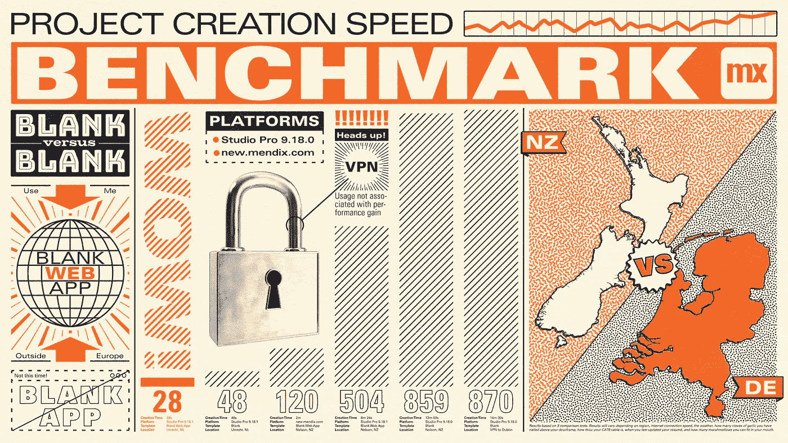
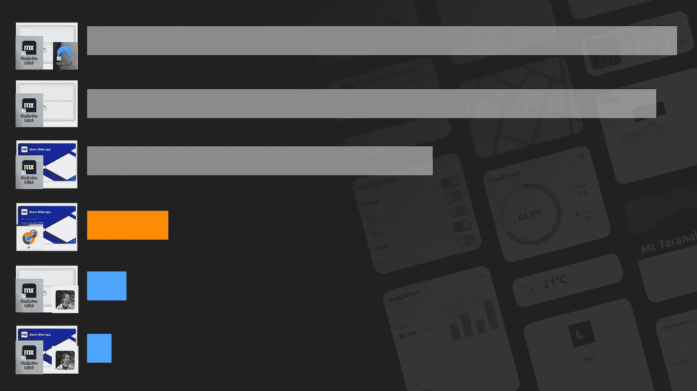
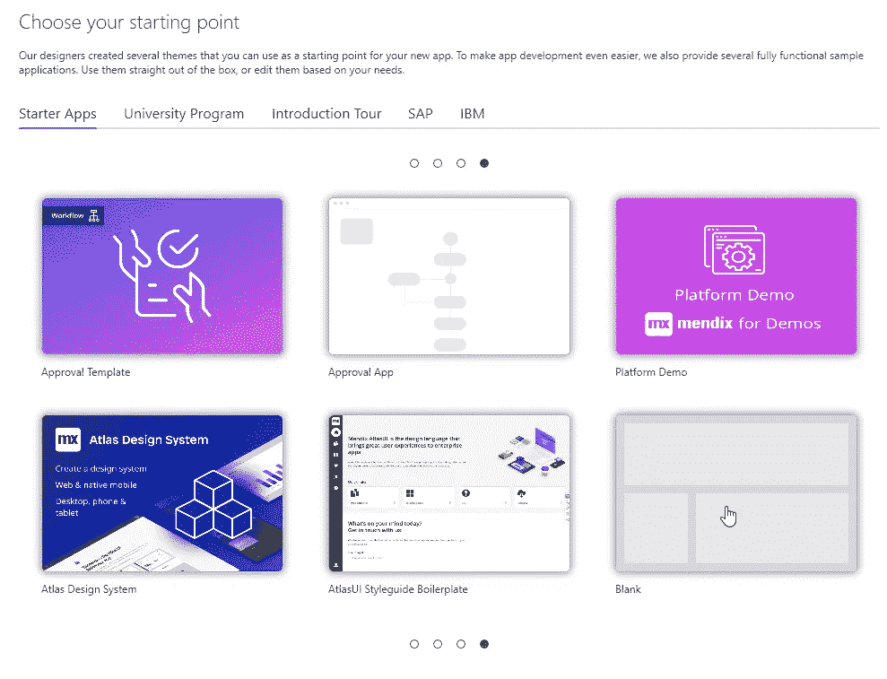
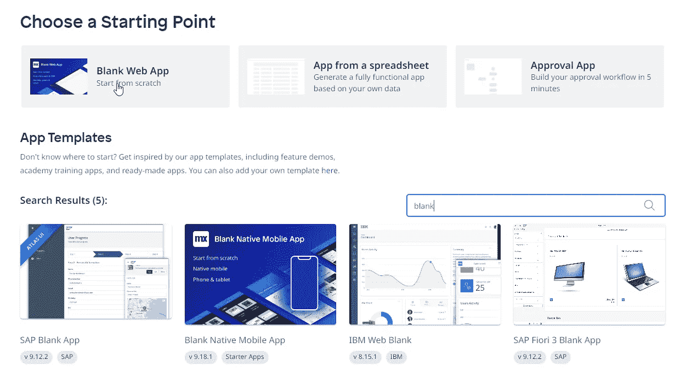
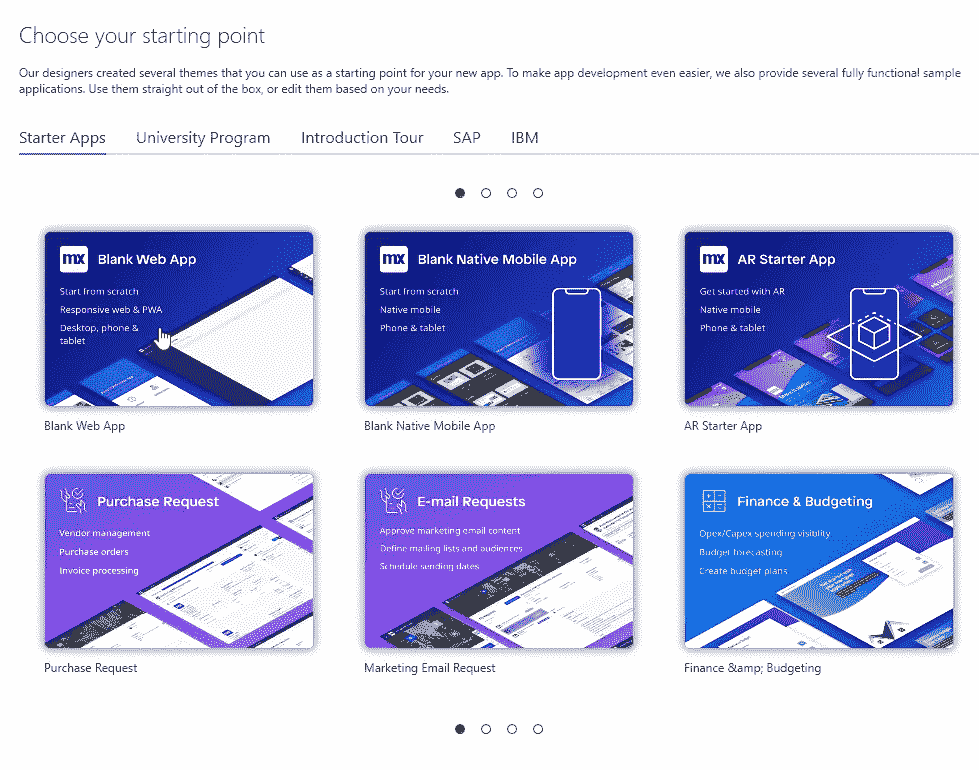

# Mendix 中的基准项目创建速度。

> 原文：<https://medium.com/mendix/benchmarking-project-creation-speeds-in-mendix-6bc4045b3bd3?source=collection_archive---------3----------------------->

## 我们的发现将永远改变你创建项目的方式。

Benchmarking Project Creation Speeds in Mendix.

如果你和我一样，你希望你的新应用没有任何臃肿的软件。
因为这个原因，我一直选择使用空白的 App 模板。
但现在我住在新西兰(NZ)，创建一个空白项目需要很多时间(15m)。

我想调查一下，看看我是否能解决这个问题。我们的发现将永远改变我们创建项目的方式。

Blank project

# 建立基线

我需要一些基准来理解和解决正在发生的问题。对于我的初始测试，**，我使用空白模板**在 Studio Pro v 9.18.0 中创建了一个项目。

**创作时间**13 米 59 秒。
**平台** StudioPro 9.18.0
**模板**空白
**位置**新西兰尼尔森

14m 太慢了！我认为使用 VPN 可能会通过某种方式重新路由数据来影响正在发生的事情。我错了，VPN 不工作实际上对速度有负面影响，多加了 30 秒。

**创作时间** 14m 30s。
**平台** StudioPro 9.18.0
**模板**空白
**地点**新西兰纳尔逊，VPN 到都柏林的黑夜

## 尝试不同的方法

因为我们能够从开发者门户创建项目，我想如果我使用开发者门户创建项目，然后在 Studio Pro 中下载它，我可能能够绕过依赖于我缓慢的新西兰网络速度的需要。

令我惊讶的是，这是可能的，而且真的很快。

不幸的是，对于基准测试来说，没有空白的模板，只有空白的 Web 应用程序模板。

[https://new.mendix.com/link/overview/](https://new.mendix.com/link/overview/)

**创建时间** 2m
**平台**[new.mendix.com](https://new.mendix.com/link/overview/)
**模板**空白 Web App
**地点**新西兰尼尔森

创建这个应用程序简直是闪电——仅仅是**31**！！！。

好吧，我仍然需要下载应用程序。但这也只花了 **1m 29s。**使该方法的总时间达到 **2m** 。

因为我同时改变了两个变量，所以我需要找出创建时间的变化来自哪里，以验证速度不是基于不同的模板。我决定回去**在 Studio Pro** 、**中重做最初的测试，但是** **这次使用空白的 Web 应用模板**而不是空白的应用模板。

**创作** **时间** 8m 24s。
**平台** StudioPro 9.18.1
**模板**空白 Web App
**地点**新西兰尼尔森

## 添加控件

为了控制这个实验，我还问了 Mendix MVP Eline Bijkerk 是否不介意在荷兰进行一次测试。 **Eline 执行了与我在 Studio Pro** 中相同的测试，使用了**空白 Web 应用**和**空白应用**模板。

Blank Web App

**时间** 28s。
**平台** StudioPro 9.18.1
**模板**空白 Web App
**地点**荷兰乌得勒支

Blank

**时间** 48s。
**平台** StudioPro 9.18.1
**模板**空白
**地点**荷兰乌得勒支

# 空白 vs 空白 Web App？

这就引出了一个问题——**无论从技术角度还是从功能角度，空白模板和空白 Web App 模板的区别**是什么？

## 技术的

幸运的是，Mendix 只是一个松散的消息。

> “这可能是入门应用程序类型的不同。例如，空白的 web 应用程序会被缓存，因此速度非常快。”
> 
> 丹尼·罗斯特|产品管理总监

我收到了另一个来自贾云馨的巨大反响。

> “空白 web 应用程序，我们用于入职的两个应用程序和其他几个应用程序已经过优化，可以更快地创建。”
> 
> 贾云馨·戈卢博维奇|产品经理

这回答了我关于为什么两者速度不同的问题。

## 特征

就我所见，这两个模板在功能上几乎没有区别。

**空白 Web App 模板**好像有更新版的 Atlas UI 和 MxSSO 模块，也就这些了。

# 结论

快速回答是，**不要用空白模板**。

和**在欧洲之外**，**使用开发者门户**创建项目，然后在 Studio Pro 中打开它。

## 阅读更多

 [## 开发者门户指南

### 描述了 Mendix 开发人员门户的各个部分，以及指向指南中更详细文档的链接。

docs.mendix.com](https://docs.mendix.com/developerportal/)  [## 打开项目

### 描述打开项目(应用程序)流程和打开应用程序对话框

docs.mendix.com](https://docs.mendix.com/refguide8/open-app-dialog/)  [## Atlas UI | Mendix

### 新的 Atlas 3.0 设计系统现代、时尚且简单。开箱即用，使用我们的模板、构建模块和…

www.mendix.com](https://www.mendix.com/atlas/) 

*来自发布者-*

如果你喜欢这篇文章，你可以在我们的 [*中页*](https://medium.com/mendix) *找到更多喜欢的。对于精彩的视频和直播会话，您可以前往*[*MxLive*](https://www.mendix.com/live/)*或我们的社区*[*Youtube PAG*](https://www.youtube.com/c/MendixCommunity/community)*e .*

*希望入门的创客，可以注册一个* [*免费账号*](https://signup.mendix.com/link/signup/?source=direct) *，通过我们的* [*学苑*](https://academy.mendix.com/link/home) *即时获取学习。*

有兴趣更多地参与我们的社区吗？加入我们的 [*Slack 社区频道*](https://join.slack.com/t/mendixcommunity/shared_invite/zt-hwhwkcxu-~59ywyjqHlUHXmrw5heqpQ) *。*