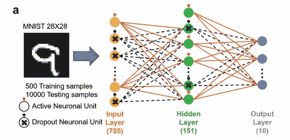
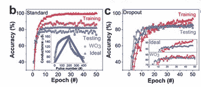
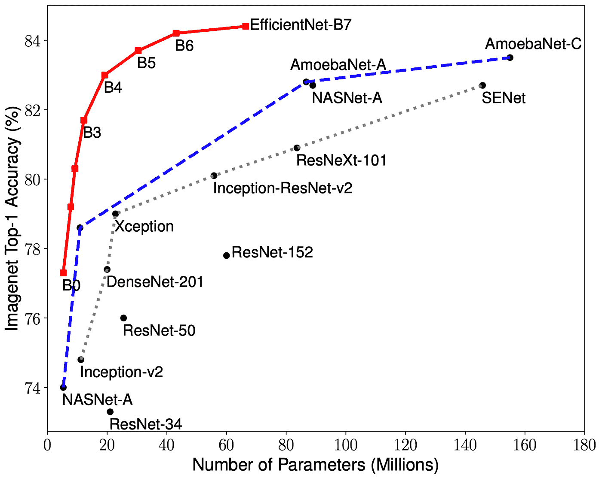
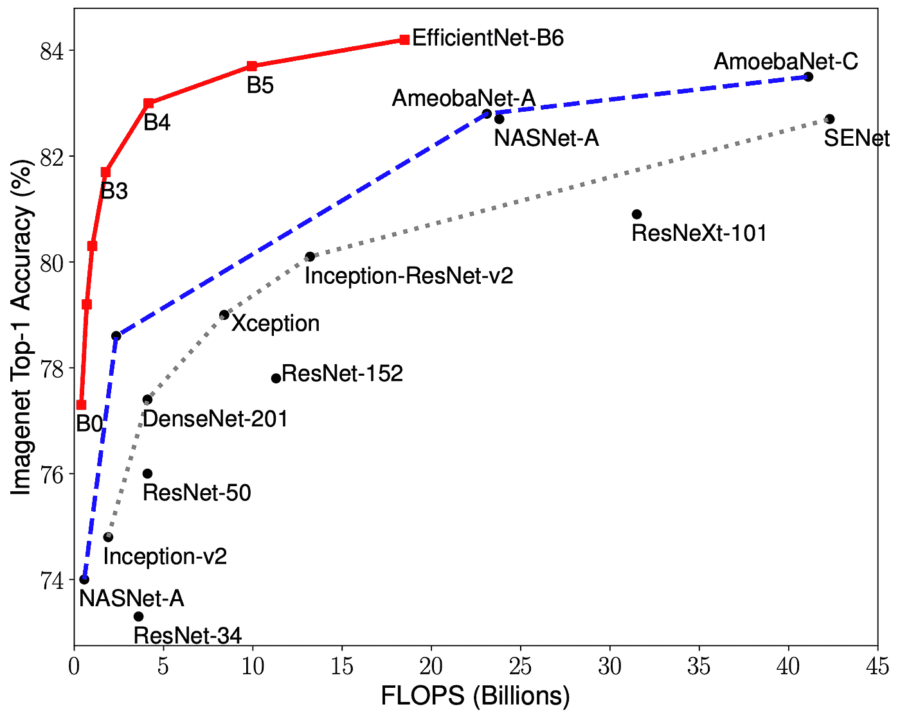
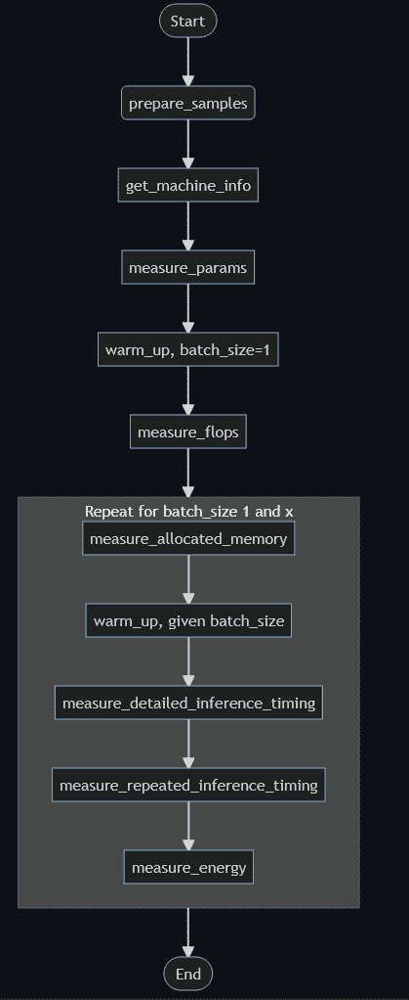
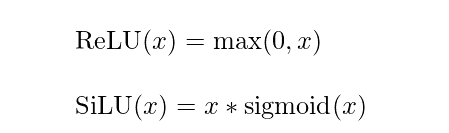

# 根据 OCI 和效率网的模型对 PyTorch 进行基准测试

> 原文：<https://medium.com/oracledevs/benchmarking-pytorch-on-oci-and-efficientnet-models-1d729b45d503?source=collection_archive---------0----------------------->

欢迎阅读本系列的第四篇文章，我们将深入探讨神经网络。

在本文中，我们将讨论 PyTorch 在不同参数下的效率和性能，以及这些参数如何影响模型的训练时间。

从受欢迎程度的角度来看，我从 Google Trends 中提取了这些信息来分析 PyTorch 和 Tensorflow 的受欢迎程度:


如我们所见，张量流现在统治着世界。让我们看看性能是否符合预期。

# 机器规格

为了进行这些测试，我们需要确保我们测试的硬件具有与下一篇文章中相同的规格，在下一篇文章中我们将分析 TensorFlow 的性能。

此外，建议在私有/专用基础设施中执行测试，这意味着我们理想情况下需要:

*   **专用基础设施，而不是使用共享基础设施—** 这意味着最好是只给你一个 OCI 计算实例，而不给其他人。例如，这会阻止 CPU 与其他 OCI 用户虚拟共享资源。这反过来会减少 I/O 中断，从而使我们的基准测试更加准确。
*   **一个共享笔记本会话—** 这样操作系统就不会通过 CPU 调度程序意外地给予一个 Jupyter / Zeppelin 项目比另一个更高的优先级。

该测试的机器规格如下:

*   **OCI 计算形状:** VM.Standard.E3.Flex 这是一个很棒的形状，可能是我最喜欢的形状之一，因为它允许我们选择可变数量的 CPU/DRAM(最多 100 个 OCPUs)。
*   OCPUs 数量: 16
*   **内存容量(GB):** 32
*   **块存储大小(GB):** 100。我们不需要那么多，但这是我们在 OCI 能选择的最低数量。当我们使用 OCI 数据科学时，我们可以创建高达 10，240 GB (10TB)的笔记本会话，如果您的使用案例需要这么大容量的话。

我选择使用 CPU 版本运行，不像以前的文章那样使用 GPU 实例，只是为了节省一些钱。如果您有兴趣找出大幅提高 GPU 吞吐量的细节，请告诉我，我会确保在未来的文章中写一些关于它的内容。

# 使用有效网络模型

为了提高任何模型的基准性能，我们还需要考虑我们的竞争对手是谁。当然，用几个层创建我们自己的模型并看到我们的工作在一些数据集的压力下进行是很棒的。但我相信数据科学的魅力，也是最困难的部分，是知道在哪里寻找更好的东西，也许是由更有经验的人来做。让我们面对现实:在我们尝试的任何事情上，总会有比我们更好的人，所以为什么不利用这个事实呢？互联网让我们不断寻找更好的东西。

为了衡量 PyTorch 的性能，我们将使用[一种叫做 EfficientNet](https://arxiv.org/abs/1905.11946) 的深度神经网络，它已经在几个图像处理数据集上进行了测试。这是一个预训练的卷积神经网络，它试图系统地改变人们如何设计和构建他们自己的模型。在这种情况下，EfficientNet 专注于使用称为 c 的系数在图像的所有维度(深度、宽度、分辨率)上应用自己的特定缩放。使用该系数已被证明效果非常好(其变体之一称为 EfficientNet 7，在 ImageNet 数据集上具有最高的准确性)，比顶级列表中的其他模型小约 8 倍(快约 6 倍)。除了能够根据 ImageNet 数据集准确预测结果(这本身可以被认为是一项极其困难的任务)，它在其他众所周知的数据集上表现非常好，如 [CIFAR100，一个包含动物图像的数据集](https://paperswithcode.com/dataset/cifar-100)，Flowers datase，t 和其他三个参数比该模型的竞争对手少得多的数据集。

将 EfficientNet 模型视为 NNs 的设计和架构部分的自动化。这种自动化非常有帮助，不仅对于我们的特定用例，而且对于您在作为数据科学家、数据分析师或类似角色的职业生涯中会发现的一些图像处理问题也是如此。

EfficientNet 使用数百万个参数，因此可以被视为深度神经网络。我想提一下漏失层(我们在上一篇文章中应用的)对显著提高神经网络精度的影响。在这里，我们可以通过观察哪些神经元被激活，哪些神经元被去激活，以及这种隐藏层实现如何试图减少由不准确的预测产生的噪声，从而提高模型的训练/测试准确性，来图形化地观察当实现时丢弃层的效果。[样本图像](https://www.researchgate.net/publication/343232588_Implementation_of_Dropout_Neuronal_Units_Based_on_Stochastic_Memristive_Devices_in_Neural_Networks_with_High_Classification_Accuracy/figures?lo=1)使用 MNIST 数据集进行测量:



人们可能会认为 EfficientNet 是一个“简单”的模型，但在现实中，我们需要考虑到，由于训练是由计算机自动完成的，每秒钟执行数百万次操作，这导致像这样的模型有数百万个参数。我从[最初的 TensorFlow 资源库](https://github.com/tensorflow/tpu)(其中有[一些关于 EfficientNet](https://github.com/tensorflow/tpu/tree/master/models/official/efficientnet) 的文档)中提取了一些可视化效果，并在这里展示给你，这样你就可以对像这样的模型的“规模”有一个感觉。希望这也能让你看到 EfficientNet 的新系数 C 与其他模型相比有多好。

与其他模型相比，第一幅图考虑了数百万个参数。第二张图比较了模型进行预测时所执行的浮点运算的数量。



# 可用的基准工具

执行基准测试有几个选项。当然，我们总是可以使用 Python 提供的标准库来帮助我们，或者选择像 [PerfZero](https://github.com/tensorflow/benchmarks/tree/master/perfzero) 这样更高级的方法。在这种情况下，我们将避免复杂的库，因为学习如何以正确的方式执行基准测试比学习如何使用特定的库/工具更重要。随着技术的变化，我总是说最重要的事情是在思想上回到我们头脑中的基本概念和基本想法，然后深入探索和尝试我们用例中需要的细节。

在本文中，我测试了一个非常适合初学者的包，它是我从 PyPi 找到的，名为 [pytorch-benchmark](https://pypi.org/project/pytorch-benchmark/) ，使用标准的时间度量。给[卢卡斯·赫泽高](https://github.com/LukasHedegaard/)的大礼包的道具。

首先，让我们安装库:

```
pip install pytorch-benchmark
```

接下来，让我们将必要的模块加载到代码中:

```
import numpy as np
import torch
import torch.nn as nn
import datetime
from torchvision.models import efficientnet_b0, efficientnet_b1 # b0...b7
from pytorch_benchmark import benchmark # benchmarking library
```

我们创建将执行基准测试的函数:

```
import yamldef benchmark_efficientnet(): model = efficientnet_b0() # change to whichever model you want to benchmark its performance
    # also, I discovered it's possible to perform benchmarking to your own custom models.
    # check this URL out from Lukas Hedegaard: https://github.com/LukasHedegaard/pytorch-benchmark/blob/main/tests/test_custom_class.py if torch.cuda.is_available():
        model = model.cuda() sample = torch.randn(2, 3, 224, 224)  # (B, C, H, W) results = benchmark(
        model=model,
        sample=sample,
        num_runs=1000,
        batch_size=8,
        print_details=True
    ) for prop in {"device", "flops", "params", "timing"}:
        assert prop in results return yaml.dump(results)Warming up with batch_size=1: 100%|██████████| 1/1 [00:00<00:00, 21.34it/s]
Warming up with batch_size=1: 100%|██████████| 10/10 [00:00<00:00, 30.06it/s]
Measuring inference for batch_size=1: 100%|██████████| 100/100 [00:03<00:00, 32.58it/s]
Warming up with batch_size=8: 100%|██████████| 10/10 [00:01<00:00,  8.05it/s]
Measuring inference for batch_size=8: 100%|██████████| 100/100 [00:11<00:00,  8.50it/s]
```

我们用这个库来帮助我们衡量表现。

```
result = benchmark_efficientnet()
print(result) # beautify it
```

在执行函数之后，我们看到[输出(在我们的例子中非常长)](https://github.com/jasperan/pytorch-tensorflow/blob/main/benchmark_out.txt)。基准测试流程如下(图片取自 Lukas Hedegaard 的 GitHub ):



我们的高效网络模型有 529 万个参数，我们可以看到不同的步骤。

像所有现代卷积神经网络(CNN)一样，高效网络模型的结构(它们是如何在内部构建的)如下:

*   卷积(基本上，将图像分成更小的部分，以便神经网络可以分别尝试和学习图像的每个部分)
*   批处理规范化(BatchNorm2D)
*   一个激活函数，在这种情况下是路斯(我们之前见过 ReLU，区别可以在下图中看到)



该过程通常重复几次，并与其他模块混合(如[挤压和激励(SE)模块](https://arxiv.org/abs/1709.01507))。听到这些术语不要慌！它们只是改进模型内部性能的奇特方法。如果你想的话，你可以在 SE blocks 上免费查看这篇论文。

在这个过程中要做很多次，每次我们都会看到这个模型是如何在 CNN 的每一层中考虑更多/更少的参数的。

# 衡量绩效

此外，在文件的结尾，我们有许多设备信息。请注意，我们无法提取已分配的 DRAM 数量，因为只有在支持和使用 CUDA 架构的机器上执行基准测试时，这些信息才可用。同样，我们无法收集能耗统计数据，因为官方仅支持 NVIDIA Jetson 设备。

这里有一些关于执行的信息:

*   MFLOPS(每秒百万次浮点运算):~401
*   已用 DRAM: 3.56 GB
*   [27.01，42.20]中每秒的平均批数(批大小= 1)
*   [18.06，27.73]中每秒的平均批数(批大小= 8)
*   [23.697，37.018]毫秒内的批处理延迟(batch_size = 1)
*   [36.067，55.365]毫秒内的批处理延迟(batch_size = 8)

正如预期的那样，以 1 为一批进行计算时的性能高于以 8 为一批进行计算时的性能。然而，我们可以清楚地看到它并没有大 8 倍，这意味着使用批处理实际上是有益的。

请注意，批处理延迟代表我们最感兴趣的指标，即**一行数据/样本在同一时间**遍历神经网络需要多长时间。

# 结论

正如我们所看到的，使用 PyTorch 测试 EfficientNet 模型的性能并不困难。

考虑到我们的机器规格，使用 16 个英特尔至强白金 8167M @ 2.00GHz OCPUs，我们可以产生 0.28 毫秒/ OCPU /行数据。

此外，在以下时间跨度内计算了 401 个 MFLOPS:批量大小= 1: 26 秒，批量大小= 8: 42 秒

这意味着大约 15.4 MFLOPS /秒，也就是大约 0.96 MFLOPS /秒/ CPU。

在下一篇文章中，我们将使用 TensorFlow 进行类似的练习，希望尝试比较这两个库，并测试我们在以前的文章中提出的假设，即 TensorFlow 由于在 TensorFlow 本身的基础上使用 Keras 生态系统而有点“慢”。

我已经附上了[这篇文章中使用的代码的笔记本](https://github.com/jasperan/pytorch-tensorflow/blob/main/article4.ipynb)，以防你有兴趣下载并亲自尝试。

敬请期待！

# 我如何开始学习 OCI？

请记住，你可以随时免费注册 OCI！您的 Oracle Cloud 帐户提供多项始终免费的服务和 300 美元免费积分的免费试用，可用于所有符合条件的 OCI 服务，最长 30 天。这些永远免费的服务在**无限期**内有效。免费试用服务可能会一直使用到您的 300 美元免费点数用完或 30 天到期，以先到者为准。你可以[在这里免费注册](https://signup.cloud.oracle.com/?language=en&sourceType=:ow:de:te::::&intcmp=:ow:de:te::::)。

# 加入对话！

如果你对 Oracle 开发人员在他们的自然环境中发生的事情感到好奇，请加入我们的公共休闲频道！我们不介意成为你的鱼缸🐠

# 许可证

由[伊格纳西奥·吉尔勒莫·马丁内兹](https://www.linkedin.com/in/ignacio-g-martinez/)[@贾斯珀兰](https://github.com/jasperan)撰写，由[艾琳·道森](https://www.linkedin.com/in/dawsontech/)编辑

版权所有 202 Oracle 和/或其附属公司。

根据通用许可许可证(UPL)1.0 版进行许可。

详见[许可证](https://github.com/oracle-devrel/leagueoflegends-optimizer/blob/main/LICENSE)。