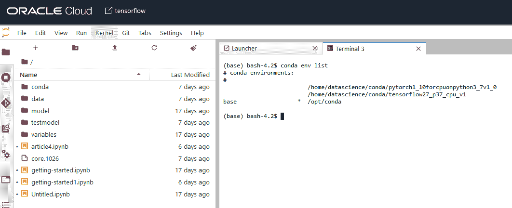
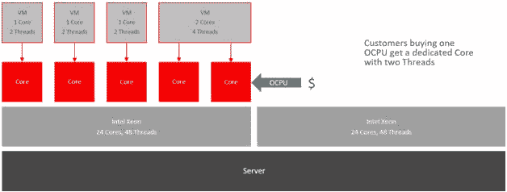
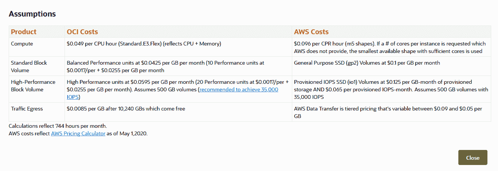

# OCI 张量流基准测试

> 原文：<https://medium.com/oracledevs/benchmarking-tensorflow-on-oci-70c781287b7d?source=collection_archive---------1----------------------->

# 介绍

欢迎阅读本系列的第五篇也是最后一篇文章！我们将讨论 TensorFlow 相对于 PyTorch 的效率，这一点我们已经在上一篇文章中讨论过了。

# 性能零点

由于我们上次已经使用了 **pytorch 基准**库，我们将使用我提到的另一个开源库，名为 **PerfZero** 。主要目的是执行 TensorFlow 测试来调试回归/分类性能。

PerfZero 使得执行预定义的测试变得非常容易。理想情况下，我们希望使用以下三种方法之一:

*   在专用基础设施计算实例中使用 PerfZero(使用 Docker)
*   在任何计算机上本地使用 PerfZero(带 Docker)
*   使用不带 Docker 的 PerfZero

第一个选项具有最高的抽象性(因为我们将程序容器化，所有资源都被虚拟化了)，而最新的选项具有最低的抽象性。我们需要考虑在代码执行期间尽量避免中断、阻塞调用和其他类型的异常/中断，以获得尽可能低中断的准确基准。使用哪种方法由你决定。在本指南中，我将着重于重用我们在以前的文章(我们的 DS 笔记本会话)中已经使用过的资源来执行这些测试。我们将逐步安装 PerfZero、Python、一个初始虚拟环境和必要的软件包，以开始在 OCI 上对 TensorFlow 进行基准测试。

# 在 OCI 上创建实例和设置

在这里，我们可以选择做两件事:

*   从头开始使用计算实例，并安装我们开始所需的一切。
*   使用数据科学笔记本会话，这将对我们有所帮助。幸运的是，数据科学笔记本会议的部署方式与计算实例类似。这意味着，通过使用像 Terraform 这样的 CI/CD 语言，计算实例(以及其中的一些东西)的部署已经自动化；因此，每次我们创建 DS 笔记本会话时，我们基本上都是在创建一个“超级英雄计算实例”。

这导致底层计算实例安装了许多东西。这包括我们可以通过终端访问的默认 conda 环境:



由 AnaConda 创建的 conda 允许我们互换使用几个 Python 环境，因此我们可以轻松地在 TensorFlow 和 PyTorch 环境之间切换(如上图所示)。

因为我们在本文中使用 TensorFlow，所以让我们切换到那个环境:

```
conda activate /home/datascience/conda/tensorflow27_p37_cpu_v1
```

现在，让我们检查安装的 Python 版本，以及我们的 TensorFlow 版本:

```
python --version
>>> Python 3.7.12pip freeze | grep tensor
>>> tensorboard==2.7.0
>>> tensorboard-data-server==0.6.1
>>> tensorboard-plugin-wit==1.8.0
>>> tensorflow==2.7.0
>>> tensorflow-estimator==2.7.0
>>> tensorflow-io-gcs-filesystem==0.22.0
```

看起来我们需要的一切都是最新的。现在，让我们继续安装 PerfZero。如果你在运行 TensorFlow 时遇到麻烦，请参考本文中的[部分，了解 OCI tensor flow 的介绍以及如何开始。](https://github.com/jasperan/pytorch-tensorflow/blob/main/3_working_with_data_in_tensorflow.md)

我们将存储库克隆到我们的机器中:

```
git clone [https://github.com/tensorflow/benchmarks.git](https://github.com/tensorflow/benchmarks.git)
```

我们可以构建 Docker 映像，以便随时执行。但在此之前，我们需要在我们的机器上安装 Docker。我使用了[这个非常方便的](https://github.com/docker/docker-install)库，它有一个根/非根用户脚本来自动安装和设置我们机器内部的 Docker 守护进程:

```
curl -O https://github.com/docker/docker-install/blob/master/install.sh
# or
curl -O https://github.com/docker/docker-install/blob/master/rootless-install.sh
# execute whichever script you decided, depends on your machine permissions
# NOTE: if using DS notebook session from OCI, you'll need the rootless install
# then execute the Docker image build
python3 benchmarks/perfzero/lib/setup.py
```

在建立我们的映像之后，我们可以通过将虚拟卷附加到数据目录中，以交互模式运行映像(我们附加到 shell 进程，可以像访问我们自己的操作系统一样访问机器)。

注意[我们可以使用 TensorFlow](https://github.com/tensorflow/models/tree/master/official) 的任何预训练模型(就像我们在上一篇文章中使用 [EfficientNet](https://arxiv.org/abs/1905.11946) 一样)，以及第三方社区模型。当使用 PerfZero 时，所有这些模型都会产生一个结果。

下面是需要遵循的命令:

```
nvidia-docker run -it --rm -v $(pwd):/workspace -v /data:/data perfzero/tensorflow \
python3 /workspace/benchmarks/perfzero/lib/benchmark.py --gcloud_key_file_url="" --git_repos="https://github.com/tensorflow/models.git;benchmark" --python_path=models --benchmark_methods=official.r1.resnet.estimator_benchmark.Resnet50EstimatorBenchmarkSynth.benchmark_graph_1_gpu --root_data_dir=/data
```

请注意，您可能会在使用谷歌图书馆时遇到一些麻烦。我所做的是修改原始代码，忽略运行时抛出错误的 **gsutils** 和其他库。请注意，这些问题的根源是该库是由 TensorFlow 团队开发的，因此他们进行了集成，以自动部署在谷歌云实例中，而不是 OCI。如果你想避免这些问题，你可以在文档中找到解决方案。不需要访问 Google Cloud 来获取任何数据的例子在任何情况下都适用。

我们可以观察我们的模型性能，在本例中是一个 CIFAR-10 回归器，以及一些模型指标。这里有一个例子:

```
{
  "ml_framework_info": {                         # Summary of the machine learning framework
    "version": "1.13.0-dev20190206",             # Short version. It is tf.__version__ for TensorFlow
    "name": "tensorflow",                        # Machine learning framework name such as PyTorch
    "build_label": "ml_framework_build_label",   # Specified by the flag --ml_framework_build_label
    "build_version": "v1.12.0-7504-g9b32b5742b"  # Long version. It is tf.__git_version__ for TensorFlow
  },
  "execution_timestamp": 1550040322.8991697,     # Timestamp when the benchmark is executed
  "execution_id": "2022-05-25-02-41-42-133155",  # A string that uniquely identify this benchmark execution "benchmark_info": {                            # Summary of the benchmark framework setup
    "output_url": "gs://tf-performance/test-results/2022-05-25-02-41-42-133155/",     # Google storage url that contains the log file from this benchmark execution
    "has_exception": false,
    "site_package_info": {
      "models": {
        "branch": "benchmark",
        "url": "https://github.com/tensorflow/models.git",
        "hash": "f788046ca876a8820e05b0b48c1fc2e16b0955bc"
      },
      "benchmarks": {
        "branch": "master",
        "url": "https://github.com/tensorflow/benchmarks.git",
        "hash": "af9e0ef36fc6867d9b63ebccc11f229375cd6a31"
      }
    },
    "harness_name": "perfzero",
    "harness_info": {
      "url": "https://github.com/tensorflow/benchmarks.git",
      "branch": "master",
      "hash": "75d2991b88630dde10ef65aad8082a6d5cd8b5fc"
    },
    "execution_label": "execution_label"      # Specified by the flag --execution_label
  }, "system_info": {                            # Summary of the resources in the system that is used to execute the benchmark
    "system_name": "system_name",             # Specified by the flag --system_name
    "accelerator_count": 2,                   # Number of GPUs in the system
    "physical_cpu_count": 8,                  # Number of physical cpu cores in the system. Hyper thread CPUs are excluded.
    "logical_cpu_count": 16,                  # Number of logical cpu cores in the system. Hyper thread CPUs are included.
    "cpu_socket_count": 1,                    # Number of cpu socket in the system.
    "platform_name": "platform_name",         # Specified by the flag --platform_name
    "accelerator_model": "Tesla V100-SXM2-16GB",
    "accelerator_driver_version": "410.48",
    "cpu_model": "Intel(R) Xeon(R) CPU @ 2.20GHz"
  }, "process_info": {                           # Summary of the resources used by the process to execute the benchmark
    "max_rss": 4269047808,                    # maximum physical memory in bytes used by the process
    "max_vms": 39894450176,                   # maximum virtual memory in bytes used by the process
    "max_cpu_percent": 771.1                  # CPU utilization as a percentage. See psutil.Process.cpu_percent() for more information
  }, "benchmark_result": {                       # Summary of the benchmark execution results. This is pretty much the same data structure defined in test_log.proto.
                                              # Most values are read from test_log.proto which is written by tf.test.Benchmark.report_benchmark() defined in TensorFlow library. "metrics": [                              # This is derived from `extras` [test_log.proto](https://github.com/tensorflow/tensorflow/blob/master/tensorflow/core/util/test_log.proto)
                                              # which is written by report_benchmark().
                                              # If the EntryValue is double, then name is the extra's key and value is extra's double value.
                                              # If the EntryValue is string, then name is the extra's key. The string value will be a json formated string whose keys
                                              # include `value`, `succeeded` and `description`. Benchmark method can provide arbitrary metric key/value pairs here.
      {
        "name": "accuracy_top_5",
        "value": 0.7558000087738037
      },
      {
        "name": "accuracy_top_1",
        "value": 0.2639999985694885
      }
    ],
    "name": "official.resnet.estimator_cifar_benchmark.EstimatorCifar10BenchmarkTests.unit_test",    # Full path to the benchmark method, i.e. module_path.class_name.method_name
    "succeeded": true,                        # True iff benchmark method execution finishes without exception and no metric in metrics show succeeded = false
    "wall_time": 14.552583694458008           # The value is determined by tf.test.Benchmark.report_benchmark() called by the benchmark method. It is -1 if report_benchmark() is not called.
  }
}
```

# 测量 OCI 性能

既然我们已经评估了 TensorFlow 和 PyTorch 在 OCI 上的工作情况，我们应该把注意力集中在为什么 OCI 是开发您自己的 NN 项目(或 AI/ML)的更好的解决方案上。

# 虚拟 CPU 与 OCPUs

每个云供应商经常将他们的处理单元称为虚拟 CPU，因为从客户的角度来看，硬件是虚拟化的，我们可以“虚拟地”访问机器和相应的资源。此外，一些云供应商将 vCPUs 作为他们的性能衡量标准。一个 vCPU 相当于一个[线程](https://www.geeksforgeeks.org/difference-between-process-and-thread/)，它实际上运行我们的代码(不管是否是 Python)并顺序执行它。



问题是，许多云供应商并不谈论线程，而是谈论 vCPUs。这对于理解 OCI 的优势是必不可少的:OCPU 相当于 CPU 单元中的一个物理核心，但它有 **2 个线程**而不是 1 个(这是由于英特尔开发的超线程技术才可能实现的，而且这很难实现，因为你必须在同一处理单元中协调两个线程的操作而不发生冲突)。因此，默认情况下，我们机器中收缩的线程数量将是其他厂商中可用线程数量的两倍**。这导致:**

*   更高的并行化机会
*   CPU 负载降低
*   CPU 调度程序工作得更多，但是根本没有达到导致瓶颈的程度。(如果发生这种情况，我们可以随时动态增加 OCI 的资源！)

如果代码不能并行化[(阅读我们之前提到的关于 GIL 的内容)](https://github.com/jasperan/pytorch-tensorflow/blob/main/1_getting_started_with_pytorch_on_oci.md#why-we-need-pytorch)，拥有额外的线程并不一定有益；然而，TensorFlow 和 PyTorch 是考虑到并行化而实现的库，这对于我们、我们的基准和我们的模型来说实际上是很重要的。

当然，这适用于其他云提供商网站中的非裸机实例，其中线程数可能高于 1；可以推断，由于超线程是由英特尔创建和设计的，因此在我们的计算实例中使用非英特尔处理单元不会产生本节所述的结果。

# 成本和性能

如果我们将 OCI 成本与 AWS(可以说是当今最受欢迎的云提供商)进行比较，我们会发现不同领域存在巨大差异:

*   网络:在 AWS 每收取 1 美元，Oracle 就收取 0.26 美元。
*   高性能计算(HPC):甲骨文便宜约 44%
*   存储:Oracle 本地固态硬盘的价格是其一半
*   RAM: Oracle 的价格只有一半
*   冷藏(块存储):在 IOPS 的 2000%的改进，成本的一半。

这意味着我们之前在本系列文章中创建的模型，以及它们的度量标准，只能在 OCI 使用。

如果我们要在 AWS 中为我们的项目部署类似的硬件基础设施，我已经用[这个在线工具](https://www.oracle.com/webfolder/workload-estimator/index.html)生成了一个成本节约器，看看我们节省了多少(更不用说上面提到的其他原因了)。如果我们回想一下，最后两篇文章是以这些特征部署的:

*   英特尔至强白金 8167m @ 2.00 GHz ocpu(x16)



这在 OCI 要花掉我们 588 美元，在 T2 每月要花掉 1153 美元(进入 OCI 时节省 49%)。

我希望这个系列文章对你来说和我写它时一样有趣。考虑订阅我们的社交媒体，关注未来的文章/酷项目、黑客马拉松和有丰厚福利的比赛！

敬请关注…

# 我如何开始学习 OCI？

请记住，你可以随时免费注册 OCI！您的 Oracle Cloud 帐户提供多项始终免费的服务和 300 美元免费积分的免费试用，可用于所有符合条件的 OCI 服务，最长 30 天。这些永远免费的服务在**无限期**内有效。免费试用服务可能会一直使用到您的 300 美元免费点数用完或 30 天到期，以先到者为准。你可以[在这里免费注册](https://signup.cloud.oracle.com/?language=en&sourceType=:ow:de:te::::&intcmp=:ow:de:te::::)。

# 加入对话！

如果你对 Oracle 开发人员在他们的自然环境中发生的事情感到好奇，请加入我们的公共休闲频道！我们不介意成为你的鱼缸🐠

# 许可证

由[伊格纳西奥·吉尔勒莫·马丁内兹](https://www.linkedin.com/in/ignacio-g-martinez/)[@贾斯珀兰](https://github.com/jasperan)撰写，由[艾琳·道森](https://www.linkedin.com/in/dawsontech/)编辑

版权所有 2022 Oracle 和/或其附属公司。

根据通用许可许可证(UPL)1.0 版进行许可。

详见[许可证](https://github.com/oracle-devrel/leagueoflegends-optimizer/blob/main/LICENSE)。