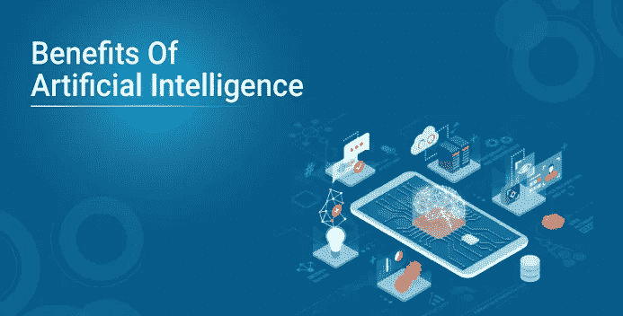
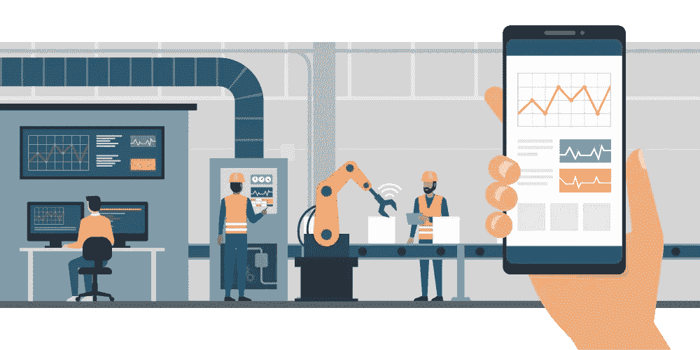
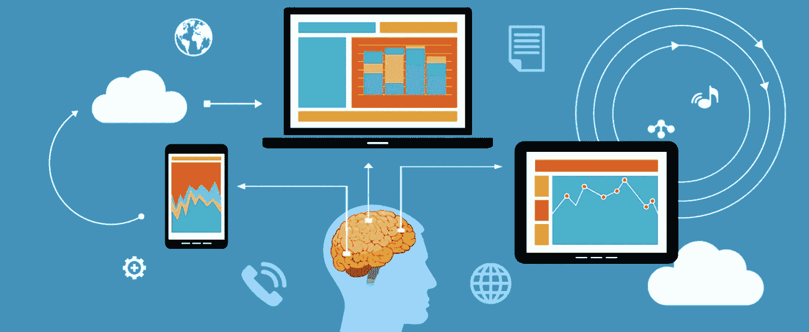
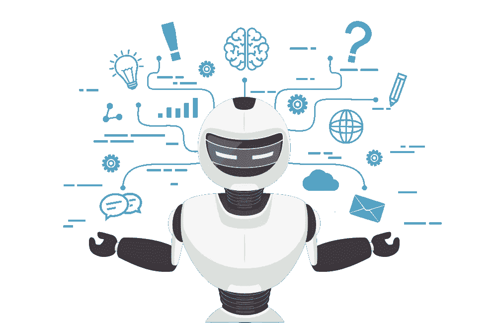
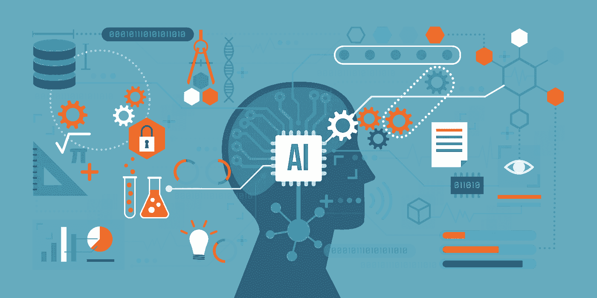
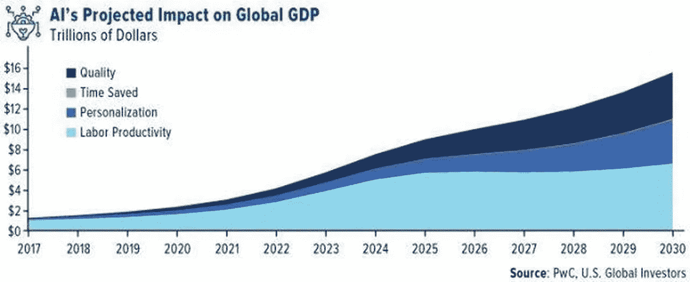
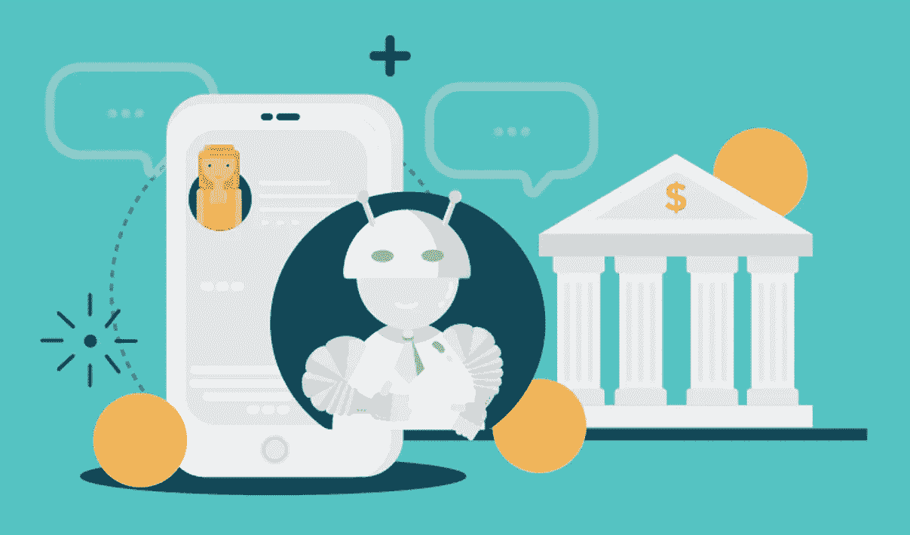
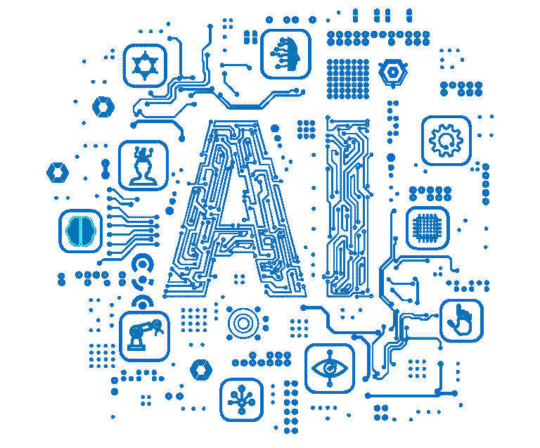

# 人工智能的十大好处

> 原文：<https://medium.com/edureka/benefits-of-artificial-intelligence-dc2d3e64ba80?source=collection_archive---------1----------------------->

你知道吗，到 2030 年，人工智能将为全球经济贡献高达 15.7 万亿美元的收入！？除了经济效益，AI 还负责让我们的生活变得更简单。这篇关于人工智能好处的文章将帮助你理解人工智能如何影响我们生活的所有领域，并最终造福人类。

我将讨论人工智能在以下领域的优势:

1.  自动化
2.  生产力
3.  决策
4.  解决复杂的问题
5.  经济
6.  管理重复性任务
7.  个性化
8.  全球防御
9.  灾难管理
10.  生活方式

# 自动化程度提高

人工智能可以用于自动化从涉及极端劳动的任务到招聘过程的任何事情。没错！

有许多基于人工智能的应用程序可以用来自动化招聘过程。这些工具有助于将员工从繁琐的手动任务中解放出来，让他们专注于复杂的任务，如制定战略和决策。

*Increased Automation — Benefits Of Artificial Intelligence — Edureka*

这方面的一个例子是对话式人工智能招聘人员 MYA。该应用程序侧重于自动化招聘流程的繁琐部分，如安排筛选和采购。

Mya 通过使用先进的机器学习算法进行训练，它还使用自然语言处理(NLP)来捕捉对话中出现的细节。Mya 还负责创建候选人档案，执行分析，并最终确定候选人名单。

# 提高生产率

人工智能已经成为商业世界的必需品。它被用来管理需要最大努力和时间的高度计算性任务。

您是否知道 64%的企业依靠基于人工智能的应用程序来提高生产力和实现增长？

*increased Productivity — Benefits Of Artificial Intelligence — Edureka*

这种应用的一个例子是法律机器人。我称之为虚拟世界的哈维幽灵。

这个机器人使用深度学习和自然语言处理等机器学习技术来理解和分析法律文件，找到并修复代价高昂的法律错误，与经验丰富的法律专业人士合作，通过实施基于人工智能的评分系统来澄清法律术语等等。它还允许你将你的合同与同行业的合同进行比较，以确保你的合同是标准的。

# 明智的决策

人工智能最重要的目标之一是帮助做出更明智的商业决策。Salesforce Einstein 是用于 CRM(客户关系管理)的*综合人工智能，*已经非常有效地做到了这一点。

正如阿尔伯特·爱因斯坦所说:

*“天才的定义是化繁为简。”*

*Smart Decision Making — Benefits Of Artificial Intelligence — Edureka*

Salesforce Einstein 正在消除人工智能的复杂性，并使组织能够提供更智能、更个性化的客户体验。在先进的机器学习、深度学习、自然语言处理和预测建模的驱动下，Einstein 在大规模企业中实施，用于发现有用的见解、预测市场行为和做出更好的决策。

# **解决复杂问题**

这些年来，AI 已经从简单的机器学习算法发展到深度学习等先进的机器学习概念。人工智能的这种增长帮助公司解决了复杂的问题，如欺诈检测、医疗诊断、天气预报等。

*Solve Complex Problems — Benefits Of Artificial Intelligence — Edureka*

考虑一下 PayPal 如何使用人工智能进行欺诈检测的用例。由于深度学习，PayPal 现在能够非常精确地识别可能的欺诈活动。

PayPal 处理了超过 1.7 亿客户的 40 亿笔交易，支付金额超过 2350 亿美元。

机器学习和深度学习算法除了审查存储在其数据库中的可能欺诈模式之外，还从客户的购买历史中挖掘数据，并可以判断特定交易是否欺诈。

# 加强经济

不管人工智能是否被视为对世界的威胁，据估计，到 2030 年，它将为世界经济贡献超过 15 万亿美元。

根据普华永道最近的一份报告，从现在到 2030 年，人工智能的进步将使全球 GDP 增加 14%，相当于为世界经济增加 15.7 万亿美元的贡献。

*Strengthens Economy — Benefits Of Artificial Intelligence — Edureka*

也有人说，人工智能带来的最显著的经济收益将在中国和北美。这两个国家将占据全球经济影响的 70%。同一份报告还揭示，人工智能的最大影响将是在医疗保健和机器人领域。

该报告还指出，大约 6.6 万亿美元的预期国内生产总值增长将来自生产率的提高，特别是在未来几年。这一增长的主要贡献者包括日常任务的自动化以及智能机器人和工具的开发，这些机器人和工具可以执行所有人类级别的任务。

目前，大多数科技巨头已经在使用人工智能作为费力任务的解决方案。然而，迟迟不采用这些基于人工智能的解决方案的公司将发现自己处于严重的竞争劣势。

# 管理重复性任务

执行重复的任务会变得非常单调和耗时。使用人工智能完成令人厌倦的日常任务可以帮助我们专注于待办事项列表中最重要的任务。

这种人工智能的一个例子是美国银行使用的虚拟金融助理，称为 erica。

Erica 实施人工智能和人工智能技术来满足银行的客户服务需求。它通过创建信用报告更新，促进账单支付和帮助客户进行简单的交易来做到这一点。

Erica 的能力最近得到了扩展，通过为客户提供个性化的见解，帮助他们做出更明智的财务决策。

截至 2019 年，Erica 已超过 600 万用户，服务了超过 3500 万次客户服务请求。

# 个性化

麦肯锡(McKinsey)的研究发现，擅长个性化的品牌可以带来五到八倍的营销投资回报率，并比不个性化的公司提高 10%以上的销售额。个性化可能是一项艰巨而耗时的任务，但可以通过人工智能来简化。事实上，用正确的产品瞄准客户从未如此简单。

这方面的一个例子是英国时装公司“Thread ”,它使用人工智能为每个客户提供个性化的服装推荐。

*Personalization — Benefits Of Artificial Intelligence — Edureka*

大多数顾客都喜欢私人造型师，尤其是免费的。但为 65 万名顾客配备足够的造型师会很昂贵。相反，总部位于英国的时尚公司 Thread 使用人工智能为其每位客户提供个性化的服装推荐。顾客接受风格测验来提供关于他们个人风格的数据。

每周，客户都会收到个性化的建议，他们可以投票赞成或反对。Thread's 使用一种名为 Thimble 的机器学习算法，该算法使用客户数据来寻找模式，并了解买家的喜好。然后，它会根据顾客的品味推荐服装。

# 全球防御

世界上最先进的机器人都是为全球防御应用而制造的。这并不奇怪，因为任何尖端技术都是首先在军事应用中实现的。虽然这些应用中的大多数还没有出现，但是我们知道的一个例子是 AnBot。

*Global Defense — Benefits Of Artificial Intelligence — Edureka*

由中国人开发的基于人工智能的机器人是由中国国防大学设计的武装警察机器人。该机器最大速度可达 11 英里/小时，旨在巡逻地区，在危险情况下，可以部署“带电防暴工具”

这种智能机器身高 1.6 米，可以识别有犯罪记录的人。AnBot 通过跟踪其附近发生的任何可疑活动，为加强安全做出了贡献。

# 灾难管理

对我们大多数人来说，精确的天气预报使假期计划变得更容易，但是即使是天气预报方面最小的进步也会对市场产生重大影响。

准确的天气预报使农民能够做出关于种植和收获的关键决定。它使运输更加容易和安全。最重要的是，它可以用来预测影响数百万人生活的自然灾害。

*Weather Forecast — Benefits Of Artificial Intelligence — Edureka*

经过多年的研究，IBM 与气象公司合作，获得了大量的数据。这种合作关系让 IBM 获得了天气公司的预测模型，这些模型提供了大量的天气数据，可以输入 IBM 的人工智能平台 Watson，以尝试改善预测。

2016 年，气象公司声称他们的模型每天使用超过 100 的第三方数据。

这次合并的产品是基于人工智能的 IBM Deep Thunder。该系统通过使用超本地预报，以 0.2 到 1.2 英里的分辨率，为商业客户提供高度定制的信息。这些信息对运输公司、公用事业公司甚至零售商都很有用。

# 提升生活方式

在最近的过去，人工智能已经从科幻电影情节发展成为我们日常生活中必不可少的一部分。自从 20 世纪 50 年代人工智能出现以来，我们已经看到它的潜力呈指数增长。我们使用基于人工智能的虚拟助手，如 Siri、Cortana 和 Alexa，与我们的手机和其他设备进行交互；它被用来预测致命疾病，如 ALS 和白血病。

*Enhanced Lifestyle — Benefits Of Artificial Intelligence — Edureka*

亚马逊监控我们的浏览习惯，然后提供它认为我们想购买的产品，甚至谷歌也根据我们的搜索活动决定给我们什么结果。

尽管被认为是一种威胁，人工智能仍然继续在许多方面帮助我们。就像机器智能研究所的联合创始人兼研究员 Eliezer Yudkowsky 引用的那样:

迄今为止，人工智能最大的危险是人们过早地断定他们理解它

带着这份笔记，我想问你一个问题作为结束，*你认为人工智能将如何帮助我们创造一个更美好的世界？*

那么就这样，我们来结束这个人工智能博客的好处。敬请关注更多关于最热门技术的博客。

如果你想查看更多关于人工智能、DevOps、道德黑客等市场最热门技术的文章，那么你可以参考 [Edureka 的官方网站。](https://www.edureka.co/blog/?utm_source=medium&utm_medium=content-link&utm_campaign=benefits-of-artificial-intelligence)

请留意本系列中的其他文章，它们将解释深度学习的各个其他方面。

> *1。* [*TensorFlow 教程*](/edureka/tensorflow-tutorial-ba142ae96bca)
> 
> *2。* [*PyTorch 教程*](/edureka/pytorch-tutorial-9971d66f6893)
> 
> *3。* [*感知器学习算法*](/edureka/perceptron-learning-algorithm-d30e8b99b156)
> 
> *4。* [*神经网络教程*](/edureka/neural-network-tutorial-2a46b22394c9)
> 
> *5。* [*什么是反向传播？*](/edureka/backpropagation-bd2cf8fdde81)
> 
> *6。* [*卷积神经网络*](/edureka/convolutional-neural-network-3f2c5b9c4778)
> 
> *7。* [*胶囊神经网络*](/edureka/capsule-networks-d7acd437c9e)
> 
> 8。 [*递归神经网络*](/edureka/recurrent-neural-networks-df945afd7441)
> 
> *9。* [*自动编码器教程*](/edureka/autoencoders-tutorial-cfdcebdefe37)
> 
> *10。* [*受限玻尔兹曼机教程*](/edureka/restricted-boltzmann-machine-tutorial-991ae688c154)
> 
> *11。*[*PyTorch vs tensor flow*](/edureka/pytorch-vs-tensorflow-252fc6675dd7)
> 
> *12。* [*深度学习用 Python*](/edureka/deep-learning-with-python-2adbf6e9437d)
> 
> *13。* [*人工智能教程*](/edureka/artificial-intelligence-tutorial-4257c66f5bb1)
> 
> *14。* [*张量流图像分类*](/edureka/tensorflow-image-classification-19b63b7bfd95)
> 
> *15。* [*人工智能应用*](/edureka/artificial-intelligence-applications-7b93b91150e3)
> 
> *16。* [*如何成为一名人工智能工程师？*](/edureka/become-artificial-intelligence-engineer-5ac2ede99907)
> 
> *17。* [*问学*](/edureka/q-learning-592524c3ecfc)
> 
> *18。* [*Apriori 算法*](/edureka/apriori-algorithm-d7cc648d4f1e)
> 
> *19。* [*马尔可夫链与 Python*](/edureka/introduction-to-markov-chains-c6cb4bcd5723)
> 
> *20。* [*人工智能算法*](/edureka/artificial-intelligence-algorithms-fad283a0d8e2)
> 
> *21。* [*最适合机器学习的笔记本电脑*](/edureka/best-laptop-for-machine-learning-a4a5f8ba5b)
> 
> *22。* [*十二大人工智能工具*](/edureka/top-artificial-intelligence-tools-36418e47bf2a)
> 
> 23。 [*人工智能面试问题*](/edureka/artificial-intelligence-interview-questions-872d85387b19)
> 
> *24。*[*Theano vs tensor flow*](/edureka/theano-vs-tensorflow-15f30216b3bc)
> 
> *25。* [*什么是神经网络？*](/edureka/what-is-a-neural-network-56ae7338b92d)
> 
> 26。 [*模式识别*](/edureka/pattern-recognition-5e2d30ab68b9)
> 
> *27。*[*tensor flow 中的物体检测*](/edureka/tensorflow-object-detection-tutorial-8d6942e73adc)

*原载于 2019 年 5 月 27 日*[*https://www.edureka.co*](https://www.edureka.co/blog/benefits-of-artificial-intelligence/)*。*