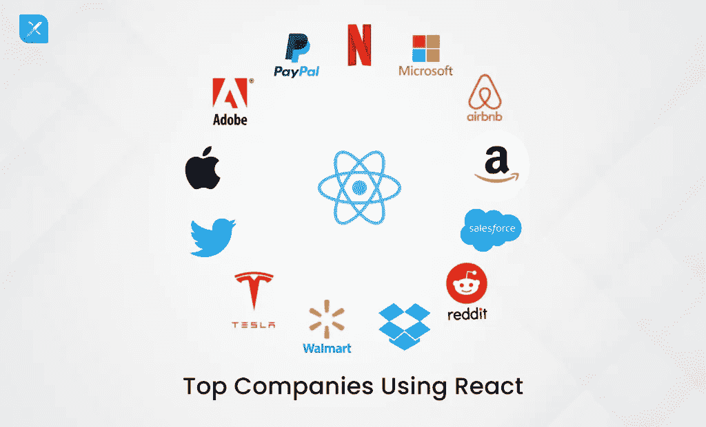
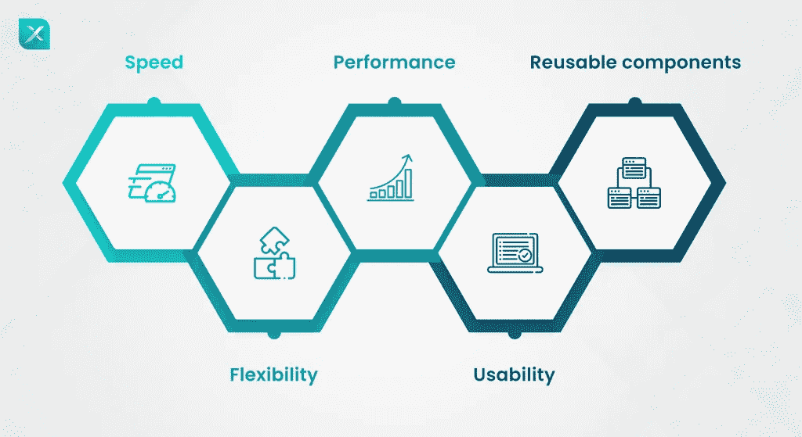
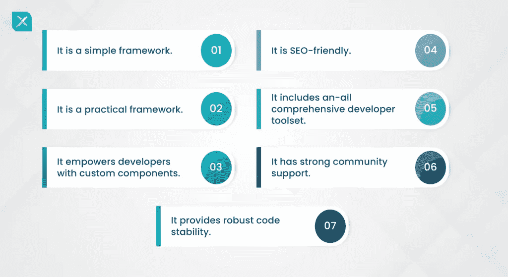

# 为您的项目选择 React JS 的好处

> 原文：<https://medium.com/quick-code/benefits-of-choosing-react-js-for-your-projects-47f13e9ae647?source=collection_archive---------2----------------------->

脸书、BBC、网飞、Salesforce、Paypal、Flipboard、苹果、特斯拉和 Dropbox——你在这些超受欢迎的网站中发现了哪些相似之处？优步-用户友好，超高速，超级迷人的界面..是的，我们都同意。

但是，你想过是什么因素导致了网站的多样性吗？

这些大品牌已经将 React JS 整合到他们的生产环境中。

# 反应:概述

React 于 2013 年问世，其唯一目的是构建 web 应用程序组件——可以是从按钮到文本或标签的任何东西。

ReactJS 是一个开源的、声明式的、高效的、基于组件的前端 JavaScript 库，由社交网络巨头脸书维护。它用于构建只为 web 和移动应用程序的视图层定制的用户界面。

在早期阶段，开发人员发现在标准文件中使用标记和 JavaScript 很不舒服，这是一个艰难的开始。当他们发现其以组件为中心的方法的多功能性时，它逐渐改变了。React JS 就这样开始在 web 开发领域流行起来。

目前，企业寻求一个 [ReactJS 开发公司](https://www.inexture.com/services/react-js-development/)而不是其他结构框架**是很正常的。**但这是怎么发生的呢？为什么全世界和开发者都转投 ReactJS？毫无疑问，一些额外津贴会影响到一个显著的位置。

# 以下是使 ReactJS 成为公司选择的关键特征

*   **发展更快**

React 开发人员可以在客户端和服务器端利用应用程序的各个部分，从而加快开发过程。换句话说，ReactJS 允许几个开发人员编写一个 web 应用程序的不同部分，而不会产生任何 web 应用程序逻辑。

*   **能够节省时间和成本的灵活性**

与其他前端框架相比，React 的维护要方便得多，因为它具有模块化结构。这是一个灵活的框架，可以减少大量的项目时间和商业成本。

*   **创建高效快速的应用**

React JS 的特点是虚拟 DOM 程序和服务器端渲染，负责 web 应用程序的快速性能；同时，它使复杂的应用程序能够更快、更高效地工作。

*   **易学易用且高效**

ReactJS 很容易操作，只要对 JavaScript 有基本的了解。事实上，一个专家级的 JavaScript 用户可以在很短的时间内理解这个框架。

*   **可重用组件省时省力**

ReactJS 框架的一个重要特性是它具有可重用的组件。它帮助开发人员在构建相似的特性时使用相同的代码，从而节省他们的时间。此外，在一个部分所做的更改不会对应用程序的其他部分产生任何影响。

# 让我们讨论为什么部署 ReactJS 可以帮助您的项目

我们理解您在寻找最好的 [ReactJS 开发服务](https://www.inexture.com/services/react-js-development/) **之前，希望获得尽可能多的关于框架的知识。**牢记这一点，我们列出了一系列理由，我们认为这些理由可以作为你进入市场前的指南。

记住这一点，我们带来了一系列理由，我们相信这些理由可以成为你进入市场前的手册。对于在反应和角度之间选择的[困境，我们也有了答案。](https://www.inexture.com/angular-vs-react-2022/)看看它，现在，让我们深入了解 React 将如何帮助您的项目。

*   **简单而有效**

与其他前端框架不同，它易于使用但很有效，因此在开发人员社区中很受欢迎。这就是为什么市场巨头喜欢在他们的 web 和移动应用程序中部署 ReactJS 来更快地启动他们的开发过程。

*   **非常简单，非常实用**

如前所述，ReactJS 在构建富用户界面方面简单而有效。我们都知道用户友好的界面对于 web 应用程序是多么重要；易于导航的界面与其在用户中的受欢迎程度成正比。该框架使开发人员能够使用其声明性组件创建高质量且可浏览的界面。

*   **为开发人员提供定制组件。**

ReactJS 有一个称为 JSK 的补充语法扩展，它允许开发人员编写他们的组件。这些组件理解 HTML 引用，允许开发人员快速部署子组件呈现。它最大的优点是可以高效地构建大容量的应用程序。

*   **包括全面的开发人员工具集**

ReactJS 框架包括 React 和 Chrome 开发工具，帮助开发人员发现、观察和检查 web 应用程序中的不同组件。这些知识使他们能够正确地学习和应用新技术。

*   **支持开发高度稳定的代码**

该框架遵循向下的数据流，为应用程序提供了更好的代码稳定性。这意味着当孩子的结构改变时，父母的结构不会受到影响。

*   **支持搜索引擎优化以更好地接触网络应用**

DOM 模型不仅有助于应用程序快速渲染，实现高应用程序性能和高用户体验，还能显著缩短页面加载时间。这使得应用程序在结果页面上获得更高的排名。

*   **强大而可靠的社区支持，推动每个人变得更好**

随着越来越多的开发者站出来使用 ReactJS，社区越来越大，知识贡献也越来越大。专家们不断在不同的在线平台上分享如何操作的文章、博客和视频，在遇到障碍时为初学者提供可靠的支持。

# 总之，

React 是开发人员构建交互式 web 应用程序的优秀框架。通过一些提示和技巧，你可以[很好地提升你的网络开发游戏](https://www.inexture.com/reactjs-web-development-complete-guide/)。

它的流行归功于上述原因；熟悉 JavaScript 的开发人员可以高效地部署这个框架，为 web 开发世界带来更好的工作。这就是为什么当你[雇佣一个 React 开发者](https://www.inexture.com/hire-reactjs-developers/)时，你会受益的原因之一。

通过 Inexture 的 ReactJs 开发服务，您可以获得一个拥有多年 React 工作经验的熟练团队，并在您的 web 应用程序中获得上述好处，而无需花费大量资金。如果你手头有一个项目，并希望它及时启动，我们有最好的人为你工作。

最初发布于[https://www . in ture . com/choosing-react js-for-your-projects/](https://www.inexture.com/choosing-reactjs-for-your-projects/)