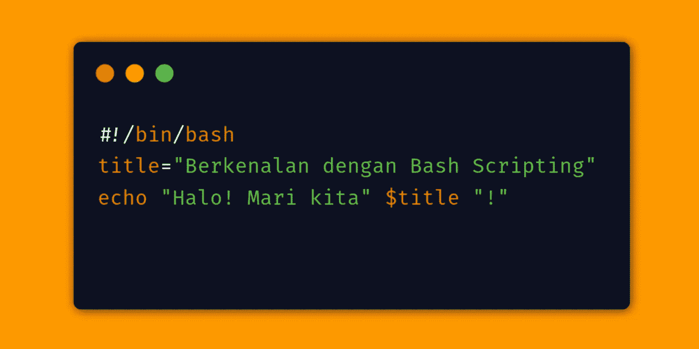
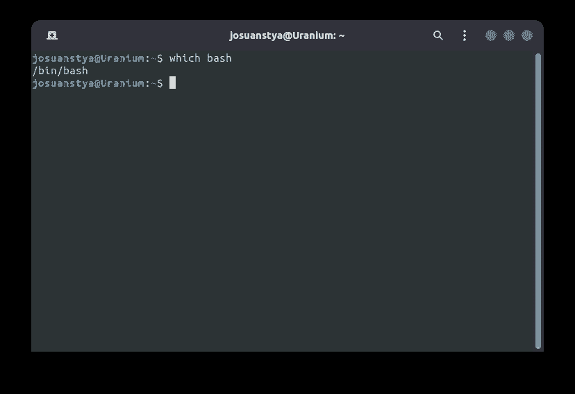
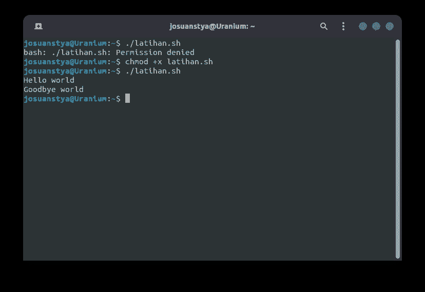
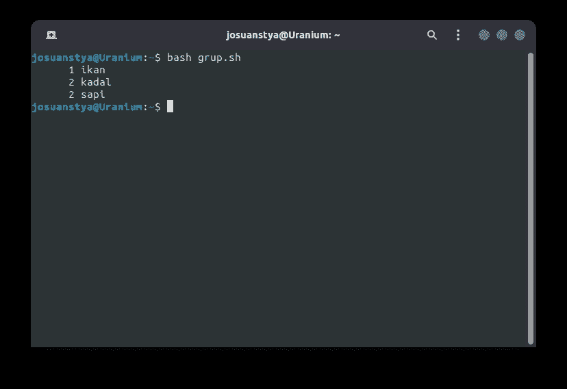
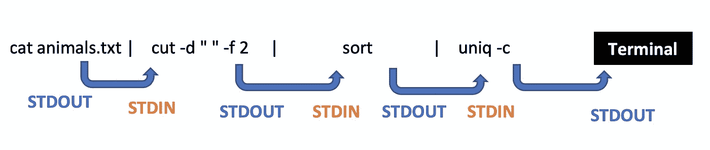
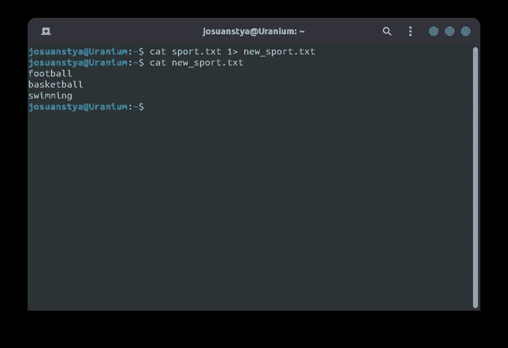
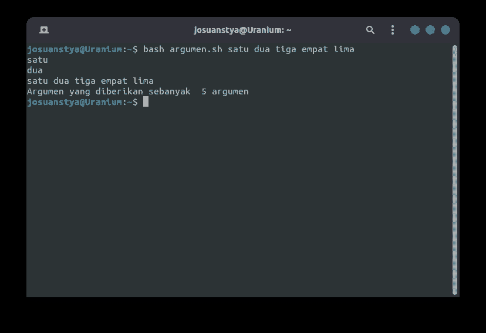

# Berkenalan dengan Bash Scripting (Part 1)

> 原文：<https://medium.easyread.co/berkenalan-dengan-bash-scripting-part-1-f64a44ce625d?source=collection_archive---------2----------------------->



## Salah satu hal ajaib yang wajib dipahami oleh pengguna Linux/Unix.

Saat ini, Linux adalah sistem operasi yang cukup populer digunakan oleh berbagai orang, terutama yang berkecimpung di bidang administrasi server dan jaringan. Salah satu keunggulan linux adalah tersedianya banyak command yang dapat dijalankan pada **terminal.**

**Terminal** sendiri adalah interface penghubung user dengan sistem yang nantinya bisa diinputkan berbagai macam command seperti `***mv*, *rm*, *cp***` , dan berbagai perintah lainnya yang dapat memudahkan pengguna.

Di dalam terminal sendiri terdapat program lain yang disebut **shell. Shell** -lah yang nantinya akan memproses input yang diberikan oleh user melalui terminal. Salah satu jenis shell yang cukup populer adalah **Bash** (kepanjangan dari “ ***Bourne Again Shell*** ”).

# 😕 Jadi Apa Itu Bash Scripting?

Setelah kita membahas dari linux hingga shell, lalu apa sebenarnya **Bash scripting** itu?

> A **script** or **scripting language** is a computer language with a series of commands within a file that is capable of being executed without being compiled. — [computerhope.com](https://www.computerhope.com/jargon/s/script.htm)

Jadi, intinya **scripting** itu adalah **kumpulan command** dalam **sebuah file** , yang dapat dieksekusi **tanpa harus di-compile** . Karena yang dimaksud di sini adalah Bash scripting, maka **shell dan command** yang digunakan adalah **Bash** .

# ❗️Prasyarat

*Nah* , sebelum belajar Bash scripting ada baiknya kamu memenuhi beberapa prasyarat berikut:

*   Kemampuan untuk mengoperasikan [perintah-perintah pada linux](https://www.howtogeek.com/412055/37-important-linux-commands-you-should-know/) .
*   Sebaiknya kamu juga sudah berkenalan dengan beberapa command seperti `**cat**, **grep**, **sed**` .
*   Akan sangat powerful jika kamu sudah mengenal [**file globbing**](https://www.tecmint.com/use-wildcards-to-match-filenames-in-linux/) atau bahkan [**regular expressions**](https://www.digitalocean.com/community/tutorials/using-grep-regular-expressions-to-search-for-text-patterns-in-linux) **.**

Sebenarnya yang terpenting dari point di atas adalah kemampuan untuk mengoperasikan perintah pada linux. Jika kamu mampu mencukupi point lainnya maka akan semakin bagus.

# **📚 Review Beberapa Perintah Penting**

Beberapa command pada linux yang cukup penting (dalam belajar Bash scripting) yaitu:

*   `**(e)grep**` memfilter input berdasarkan kecocokan pola regular expressions
*   `**cat**` melihat, membuat, menggabungkan isi file
*   `**tail**` / `**head**` menampilkan `**-n**` (sebuah flag) baris pertama maupun terakhir
*   `**wc**` menghitung jumlah kata atau baris (menggunakan flag `**-w**` atau `**-l**` )
*   `**sed**` melakukan penggantian string yang cocok dengan suatu pola

# 📏 Mengetahui Anatomi Bash Script

Sebuah Bash script memiliki beberapa fitur penentu utama:

*   Biasa diawali dengan `**#!/bin/bash**` **,** jadi intrepeter / shell tahu itu adalah Bash script dan untuk menggunakan Bash lokasi programnya adalah `**/bin/bash**` **.** Path bisa jadi berbeda jika kamu menginstall Bash di lokasi yang berbeda, untuk mengeceknya masukkan perintah `**which bash**` pada terminal:



**which bash** (menentukan lokasi program Bash)

*   Bisa berupa command baris demi baris maupun berupa struktur pemrograman
*   Memiliki ekstensi file `**.sh**` , secara teknis bisa tidak menggunakan ekstensi tersebut jika baris pertama sudah ditulis she-bang dan path menuju Bash **(** `**#!/bin/bash**` **)** , tetapi hal ini sudah menjadi [*convention*](https://en.wikipedia.org/wiki/Coding_conventions)
*   Program yang dibuat dengan Bash script bisa dijalankan lewat terminal dengan menggunakan command:

```
**bash nama_script.sh**
```

*   Atau, jika sudah dicantumkan `**#!/bin/bash**` pada baris pertama kamu dapat menjalankannya dengan command:

```
**./nama_script.sh**
```

# 📝 Menulis Bash Script

## Latihan 1 - Menampilkan Kalimat

Sekarang kita mulai dari yang mudah terlebih dahulu, buat sebuah file dengan nama `**latihan.sh**` dan masukkan baris berikut:

```
**#!/bin/bash
echo “Hello world”
echo “Goodbye world”**
```

Pastikan terlebih dahulu apakah lokasi Bash kamu sama dengan di atas (jalankan `**which bash**` ). Jalankan pada terminal dengan cara `**./latihan.sh**` :



**./latihan.sh**

Sebelum dapat dieksekusi, file tersebut harus ditambahkan permisi *execute* ( `**chmod +x**` ). Atau kamu dapat menjalankannya tanpa ditambahkan permission apa pun dengan perintah `**bash latihan.sh**` .

## Latihan 2 - Pipelining

Selanjutnya buat sebuah file dengan nama **hewan.txt** dan masukkan nama-nama hewan di bawah ini:

```
**kucing, kadal
belalang, sapi
anjing, kadal
burung, ikan
hiu, sapi**
```

Jadi tugas kita adalah menghitung jumlah hewan pada setiap grup.

Sebenarnya pada shell kamu dapat membuat *chained command* pada terminal, tetapi kali ini kita akan membuatnya dalam sebuah script. Buat file dengan nama `**grup.sh**` :

```
**#!/bin/bash
cat hewan.txt | cut -d “ “ -f 2 | sort | uniq -c**
```

Lalu jika dijalankan, akan menghasilkan output seperti berikut:



**bash grup.sh**

Jika kamu belum paham isi dari file `**grup.sh**` , cobalah untuk mencari maksud dari perintah tersebut satu-persatu.

# 🔍 Standard IO Stream dan Argumen

## STDIN-STDOUT-STDERR

Dalam Bash scripting, terdapat tiga ‘streams’ pada suatu program:

*   `**STDIN**` (standard input). Sebuah aliran (stream) data ke dalam program
*   `**STDOUT**` (standard output). Sebuah aliran data yang keluar dari program
*   `**STDERR**` (standard error). Error pada suatu program

Secara default, ‘streams’ ini akan datang dari dan muncul ke terminal.

Mungkin kamu pernah melihat sesuatu seperti `**2> /dev/null**` dalam sebuah script, yang artinya menghapus STDERR yang seharusnya muncul ke terminal. Dan `**1> /dev/null**` artinya menghapus STDOUT.

Berikut adalah gambar standard streams dari pipeline yang sudah kita buat sebelumnya:



Standard Stream

## Contoh STDIN

Misal terdapat suatu text dengan nama `**sport.txt**` dengan 3 baris data:

```
**football
basketball
swimming**
```

Perintah berikut adalah contoh mengambil data dari sebuah file dan
menulis STDOUT ke file baru:

```
**cat sport.txt 1> new_sport.txt**
```

Jika dilihat isi file baru tersebut maka hasilnya akan sama dengan file lama:



Melihat Isi File sport.txt

## ARGV

Salah satu hal yang cukup penting dalam Bash scripting adalah argumen.
Bash script dapat mengambil argumen dari luar untuk digunakan di dalam program dengan menambahkan spasi setelah menjalankan file script.

*   `**ARGV**` adalah array dari semua argumen yang diberikan kepada program.
*   Setiap argumen dapat diakses melalui notasi `**$**` . Pertama sebagai `**$1**` , yang kedua sebagai `**$2**` dan seterusnya.
*   `**$@**` dan `**$***` akan memberikan **semua** argumen di dalam ARGV.
*   `**$#**` adalah jumlah argumen yang diberikan.

## Contoh ARGV

Perhatikan contoh script berikut ( `**argumen.sh**` ):

```
**#!/usr/bash
echo $1
echo $2
echo $@
echo “Argumen yang diberikan sebanyak “ $# “argumen”**
```

Sekarang script tersebut akan saya coba jalankan dengan perintah berikut:

```
**bash argumen.sh satu dua tiga empat lima**
```

Maka hasilnya akan seperti ini:



**argumen.sh**

# 😤 Let’s Wrap It Up!

Sejauh ini, kita seharusnya sudah belajar beberapa hal berikut:

*   Struktur dasar Bash script
*   Bagaimana cara membuat dan menjalankan Bash script
*   Standar IO stream dan argumen pada Bash script

Point di atas masih sedikit bagian dari proses mengenal Bash script. Jadi tunggu beberapa tutorial tentang Bash script lainnya di medium saya!

Sumber: [https://learn.datacamp.com/courses/introduction-to-bash-scripting](https://learn.datacamp.com/courses/introduction-to-bash-scripting)

# About Me

Hai, Saya Josuanstya Lovdianchel, seorang bocah yang menyukai banyak bidang ( *generalist* ) dan masih mencari jati dirinya. Beri *clap 👏* jika kamu suka artikel ini.

*Cheers!*