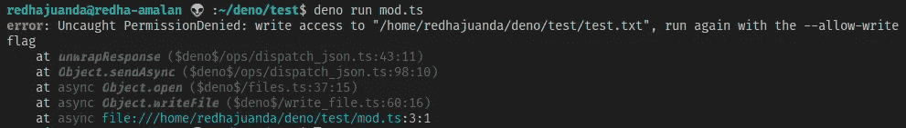
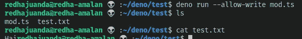

# Berkenalan Dengan Deno

> 原文：<https://medium.easyread.co/berkenalan-dengan-dengan-deno-c48cdf3aa31e?source=collection_archive---------0----------------------->

## Perbedaan mekanisme Deno dibanding Node.js


Kalau kamu seorang *javascript /nodejs developer* , kemungkinan besar pasti sudah pernah mendengar sekilas tentang Deno. [**Deno**](https://deno.land/) adalah sebuah *platform* untuk menjalankan kode *javascript* dan *typescript* di sisi *server* . Deno diperkenalkan dan dikembangkan oleh Ryan Dahl pada tahun 2018 yang juga sang pencipta Node.js.

Deno awalnya ditulis dengan Go, lalu di *rewrite* menggunakan Rust untuk menghindari masalah *garbage collector* , karena adanya kemungkinan bentrokan antara *garbage collectornya* V8 dan Go.

Deno dijadwalkan merilis versi 1.0.0 pada tanggal 13 Mei 2020.

# Perbedaan Dengan Node.js

Kedua *platform* tersebut, Deno dan Node.js mempunyai fungsi dan tujuan yang sama, hanya saja menggunakan mekanisme yang berbeda. Yuk kita lihat apa saja perbedaannya:

## Syntax

Deno menggunakan ES Modules sebagai *default* sedangkan Node.js menggunakan CommonJS.

Deno juga mendukung *top level await* , jadi kamu tidak perlu membungkus await didalam *async function* lagi seperti di Node.js

```
**const data = await fetch('https://google.com')**
```

## Package Manager

Deno tidak menggunakan **npm** sebagai *package manager* nya, tetapi menggunakan modul yang direferensikan via URL atau *file path* (terinspirasi dari Go)

```
**import * as log from "https://deno.land/std/log/mod.ts";**
```

Ketika *script* dijalankan pertama kali maka Deno akan *mendownload file* tersebut ke *local machine* dan menyimpannya sebagai *cache* .

Deno juga menyediakan database *third party libraries* yang bisa kamu akses di [deno.land/x](https://deno.land/x/) . Kamu juga bisa men-submit *library* kamu sendiri dengan mengedit *file database.json* (membuat *pull request* ) [disini](https://github.com/denoland/deno_website2/blob/master/src/database.json) .

## Security

Deno dijalankan di *sandbox* , yang berarti *runtim* enya tidak mempunyai akses ke *network, file system,* dan *environment* . Akses harus diberikan terlebih dahulu ketika dijalankan (yang berarti lebih aman).

Misalkan, buat sebuah *file* `mod.ts` yang berisi *script* untuk *write* sebuah *file* txt dengan nama *file* `message.txt` dan *content* “Hai Deno”. Kita bisa membuat scriptnya seperti berikut:

```
**const encoder = new TextEncoder()
const message = encoder.encode("Hai")****await Deno.writeFile('test.txt', message)**
```

Lalu jalankan *script* tersebut dengan *command*

```
**deno mod.ts** 
```



Kita akan mendapatkan *error* yang memberitahukan bahwa Deno tidak mempunyai akses untuk membuat *file* . Kita sebagai *developer* harus memberikan akses tersebut secara eksplisit ketika menjalankan *script* tersebut.

Coba jalankan ulang dengan *command* :

```
**deno run — allow-write mod.ts**
```



Untuk melihat *full list permission* beserta contoh-contohnya, kamu bisa jalankan command `**deno run -h**`

## Built-in TypeScript

Deno mendukung *built-in TypeScript* , yang berarti kita tidak perlu menginstall dan mengkonfigurasinya secara manual seperti di Node.js

## Tooling

Deno menyediakan banyak *built-in tools* , jadi tidak perlu pusing lagi mengkonfigurasi *third party tool* . *Tooling* yang disediakan antara lain:

*   [test runner](https://github.com/denoland/deno/blob/master/docs/testing.md) ( `**deno test**` )
*   [code formatter](https://github.com/denoland/deno/blob/master/docs/tools/formatter.md) ( `**deno fmt**` )
*   [bundler](https://github.com/denoland/deno/blob/master/docs/tools/bundler.md) ( `**deno bundle**` )
*   [debugger](https://github.com/denoland/deno/blob/master/docs/tools/debugger.md) ( `**--debug**` )
*   [documentation generator](https://github.com/denoland/deno/blob/master/docs/tools/documentation_generator.md) ( `**deno doc**` )
*   [dependency inspector](https://github.com/denoland/deno/blob/master/docs/tools/dependency_inspector.md) ( `**deno info**` )
*   linter ( `**deno lint**` ) [coming soon](https://github.com/denoland/deno/issues/1880)

# Instalasi

## Instalasi

Pertama, kita harus menginstall **Deno** di komputer kita, kamu bisa mengikuti langkah-langkah untuk install Deno di [https://deno.land](https://deno.land) . Untuk meng- *upgrade* ke versi terbaru jalankan command `**deno upgrade**` . Lalu kamu bisa melihat versi Deno yang sudah terinstall dengan command `**deno --version**`

## Struktur Folder

Berdasarkan *convention* Deno, terdapat dua *file* penting yang akan kita bahas disini yaitu:

*   mod.ts
*   deps.ts

*File* `**mod.ts**` adalah *entry point* dalam sebuah aplikasi Deno, sama seperti `**index.js**` di Node. Tergantung dari kompleksitas proyek kamu, sebaiknya file `**mod.ts**` diusahakan agar bisa seminimal mungkin, dan hanya meng *import* modul dari *file* lain.

Sedangkan *file* `**deps.ts**` adalah untuk mensentralisasi *dependency* yang ada pada aplikasi kita, di *file* ini kita bisa mengimport semua *dependency* beserta *version* nya, lalu kita mengekspor kembali untuk bisa digunakan di program kita.

Jika kamu ingin meng- *update* versi dependencynya, kamu tinggal langsung mengubah urlnya ke versi yang diinginkan. Misalnya kamu bisa langsung mengubah `**@v0.39.0**` dengan `**@v0.41.0**` dan versi baru pun akan digunakan.

Intinya, selalu *import* modul eksternal kedalam *file* `**deps.ts**` . Ini akan memudahkan kamu untuk melihat semua *depency* yang terdapat pada aplikasi kamu daripada harus melihat ke setiap *file* yang ada.

# Membuat API (Web Server)

Untuk membuat *web server* , kita akan menggunakan salah satu *framework* yang bernama [oak](https://github.com/oakserver/oak) , oak sendiri adalah salah satu *middleware framework* untuk membangun *http server* di Deno yang terinspirasi dari koa.js di Node.js

## Hello World

Di baris pertama, kita mengimport *class Application* dari modul oak, lalu dibaris ketiga kita membuat sebuah *instance* dari *class Application* tersebut.

Dibaris kelima, kita menambahkan *middeware* melalui method `**use**` . Setiap *middleware function* akan menerima sebuah *context* ketika dipanggil. *Context* merepresentasikan semua yang *middleware* butuhkan tentang *request* dan *response* yang sedang di *handle* oleh aplikasi.

Terakhir, kita memulai *server* dengan memanggil metode `**listen**` dan memasukan *port* sebagai parameter.

Coba jalankan dengan *command* `**deno run — allow-net mod.ts**` dan buka *browser* , ketikkan url `[**http://localhost:8000**](http://localhost:8000,)` [,](http://localhost:8000,) kamu akan melihat pesan “Hello World”.

## Rest API

Pertama, kita akan membuat data *dummy* untuk digunakan API, buat sebuah *file* bernama resource.ts dengan kode berikut:

Lalu, kita perlu meng *import class Router* dari modul oak, dan mendefinisikan *path* yang diinginkan.

Jalankan aplikasi tersebut, lalu coba buka kembali *browser* , dan ketikkan url `[**http://localhost:8000/book**](http://localhost:8000/book)` , maka data semua buku pun akan ditampilkan dalam format *json* . Dan satu lagi coba tambahkan id di ujung url, menjadi `[**http://localhost:8000/book**](http://localhost:8000/book)**/1**` , maka Deno hanya akan menampilkan data dengan id 1.

# Kesimpulan

Walaupun masih banyak yang perlu diperbaiki dan pada saat ini Deno masih bisa dikatakan belum *production ready.* Tetapi menurut saya, Deno sudah jauh lebih baik daripada Node.js. Berikut beberapa kelebihan Deno menurut saya:

*   Sangat mudah diinstall (Cukup dengan satu *file binary* )
*   Kompatibel dengan *browser* , jadi kita bisa me- *reuse* modul di *browser* dan aplikasi Deno
*   *Desentralisasi package* (Tidak ada *node modules* , tidak ada npm, tidak ada yarn) kamu bisa meng *hosting package* kamu dimana saja, dan mengimportnya langsung dengan url
*   *Built-in TypeScript*
*   *内置工具*，不需要安装工具*，捆绑器，* dll
*   安全 lebih terjamin。

# **参考文献**

1.  [**Deno 手动**](https://deno.land/manual)
2.  [**Deno —更好的 Node.js？| Krzysztof Piechowicz**](https://www.youtube.com/watch?v=mzfw9TwBiQc&feature=emb_title)