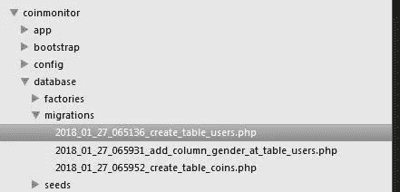
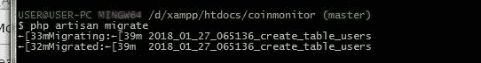

# Berkenalan dengan fitur Migration di Laravel

> 原文：<https://medium.easyread.co/berkenalan-dengan-fitur-migration-di-laravel-e36189dffb5c?source=collection_archive---------0----------------------->


Image by Hackernoon’s Medium page

Mulai tahun ini saya punya misi untuk lebih sering menulis. Nah agar misi tersebut istiqomah, saya mau mulai dari hal yang ringan-ringan dulu. Kali ini saya mau membahas tentang salah satu fitur di Laravel, yaitu Migration. Fitur Migration sendiri memang bukan merupakan fitur spesifik dari Laravel, karena fitur ini juga tersedia di beberapa framework PHP atau bahasa pemrograman lainnya. Namun pembahasan saya kali ini akan lebih spesifik membahas Migration di Laravel.

# Apa itu Migration ?

Menyadur dokumentasi Laravel, Migration bekerja seperti version control untuk database yang membuat anggota tim lebih mudah dalam memodifikasi skema database yang digunakan oleh aplikasi kita.

# Kenapa perlu menggunakan Migration ?

Bagi developer yang sudah nyaman menggunakan phpMyAdmin atau aplikasi manajemen database (HeidiSQL, DBeaver) ketika ingin membuat tabel / memodifikasi tabel di database mungkin merasa belum perlu menggunakan Migration karena kebutuhan mereka sudah tercukupi oleh tools-tools tersebut. Oleh karena itu saya ingin menjelaskan beberapa alasan yang mungkin bisa jadi motivasi untuk menggunakan Migration.

## 1\. Migration membuat kerja tim menjadi lebih efisien.

Zaman sekarang developer sering bekerja secara tim untuk menyelesaikan sebuah project. Klien yang requestnya sangat dinamis memungkinkan kita melakukan modifikasi (perubahan field, penambahan field) tabel pada database ketika project sedang dikerjakan. Daripada anggota tim saling mengirimkan SQL file hasil perubahan tabel atau memberi tahu tim mereka bahwa perubahan di Tabel A baru saja dilakukan, maka lebih efisien ketika mereka menggunakan fitur Migration di Laravel. Dengan Migration, anggota tim lain hanya perlu melakukan perintah php artisan migrate untuk mengupdate database mereka agar sesuai dengan perubahan yang baru saja dilakukan oleh anggota tim lainnya. Dengan demikian waktu mereka bisa digunakan untuk hal lain yang lebih berfaedah.


## 2\. Migration seperti version control untuk database kita.

Kalau kita membuat program baik secara individu maupun dalam tim, kita sering memanfaatkan VCS (Version Control System) seperti Git untuk mengetahui perubahan-perubahan apa saja yang dilakukan di code kita. Mirip seperti itu, Migration memungkinkan kita untuk mengetahui perubahan dan penambahan apa saja yang telah dilakukan di database project kita dengan mudah. Dengan begitu anggota tim lain bisa lebih aware apabila ada code mereka yang perlu diadjust terkait dengan perubahan tabel tersebut.



## 3\. Memudahkan ketika pindah environment coding.

Semisal seorang developer mengerjakan project A di Laptop perjuangan dia semasa kuliah. Setelah bekerja, strata sosialnya meningkat drastis dan dia berinisiatif membeli laptop Macbook Pro. Apabila dia menggunakan Migration, dia tidak perlu membackup semua database-database di Laptop lama nya dan mengimport semuanya di Macbook Pro barunya secara manual. Dengan bantuan Git dan fitur Migration di Laravel dia hanya perlu menyimpan code nya di cloud repository seperti GitHub dan clone repository tersebut di Macbook Pro barunya. Setelah itu dia hanya tinggal menjalankan perintah php artisan migrate untuk mengimport skema database project A tersebut di Macbook Pro barunya.

# Bagaimana cara menggunakan Migration di Laravel ?

1.  **Set file .env**

```
DB_CONNECTION=mysql
DB_HOST=127.0.0.1
DB_PORT=3306
DB_DATABASE=db_experiment
DB_USERNAME=root
DB_PASSWORD=
```

Sebelum melakukan migration, pastikan kita sudah memiliki database untuk aplikasi kita. Apabila belum punya database, silahkan buat terlebih dahulu. Setelah itu sesuaikan file .env dengan nama dan pengaturan database kita.

**2\. Buat file migration**
Ketikkan perintah untuk membuat file migration di dalam root directory project kita.

Untuk membuat tabel :

```
$ php artisan make:migration create_users_table --create=users
```

Untuk memodifikasi tabel :

```
$ php artisan make:migration add_gender_to_users_table  --table=users
```

Setelah menjalankan perintah untuk membuat file migration, maka file migration akan di generate pada directory ***database/migrations.***

```
- your_project_name
--- app
--- bootstrap
--- config
--- database
------- factories
------- migrations
----------- **(lokasi file migrationmu)
-------** seeds
--- public
--- ....
```

**3\. Set field tabel baru atau perubahan-perubahan tabel.**

Setelah file migration di generate, definisikan kolom-kolom tabel yang ingin dibuat atau modifikasi tabel yang ingin dilakukan pada migration file yang dibuat.

A. Contoh file migration untuk membuat tabel.

Sedikit penjelasan untuk code diatas, pada function up() kita definisikan bahwa kita akan membuat tabel *users* dengan beberapa field, yaitu : id, name, email, password, rememberToken dan timestamp ala Laravel (created_at & updated_at). Pada bagian function down() kita definisikan action apa yang akan dilakukan ketika rollback untuk migration ini dilakukan, yaitu menghapus tabel users.

B. Contoh file migration untuk memodifikasi tabel.

Sedikit penjelasan untuk code diatas, pada function up() kita definisikan bahwa kita akan menambahkan 3 field pada tabel *tickets* , yaitu : processed_at, completed_at, dan scheduled_by . Pada bagian function down() kita definisikan action apa yang akan dilakukan ketika rollback untuk migration ini dilakukan, yaitu menghapus 3 field tersebut.

**4\. Menjalankan Migration**

Setelah mendefinisikan perubahan pada file migration, selanjutnya jalankan perintah untuk melakukan migration.

```
$ php artisan migrate
```

Apabila migration berhasil dilakukan, seharusnya notifikasi sukses akan muncul



**5\. Membatalkan Migration**

Atas dasar jiwa yang labil atau request klien yang berubah ubah, mungkin saja kita ingin membatalkan migration yang baru saja kita lakukan. Tenang, kita bisa kok melakukan rollback. Untuk menjalankan perintah rollback, kita harus membuat kode pada function down seperti sudah dijelaskan pada **penjelasan nomor 3** .

Untuk melakukan rollback jalan kan perintah berikut :

```
$ php artisan migrate:reset
```

# Recap

Demikian itu tadi alasan kenapa kita perlu menggunakan Migration versi saya dan sekilas bagaimana cara menggunakan Migration di Laravel. Untuk penjelasan detail mengenai Migration di Laravel bisa dibaca di [Dokumentasi official Laravel](https://laravel.com/docs/5.5/migrations) . Oh ya, Lebih mantab lagi jika Migration dipadukan dengan [DB Seedernya Laravel](https://laravel.com/docs/5.5/seeding) , terkait DB Seeder dibaca sendiri dulu ya. Buat yang ingin menambahkan alasan menggunakan Migration atau mengkoreksi tulisan saya, langsung sampaikan di kolom komentar saja ya gan.

*Artikel ini di tulis oleh* [*Derta Isyajora*](https://medium.com/u/a53b7359e568?source=post_page-----e36189dffb5c--------------------------------) *beliau sering menulis tentang Software Engineering dan Programming. Follow profilnya untuk mendapatkan update-an terbaru artikel-artikel beliau.*

*Jika anda merasa artikel ini menarik dan bermanfaat, bagikan ke lingkaran pertemanan anda, agar mereka dapat membaca artikel ini.
Atau jika anda tertarik untuk membagikan cerita anda pada publikasi ini, anda boleh mengirimkan cerita anda ataupun mengikuti langkah-langkah yang ada* [***disini***](https://medium.com/easyread/about-easyread-74b20960e180) *.*