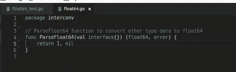

# Unit Testing Golang + Travis CI + TDD

> 原文：<https://medium.easyread.co/bermain-dengan-unit-testing-golang-dan-mengintegrasikan-dengan-travis-ci-sedikit-tdd-juga-2fa7221bda3d?source=collection_archive---------6----------------------->

## Bermain dengan Unit Testing, integrasi Travis CI dan TDD. Bagaimana yah?

Halo teman. Sudah sekitar 2 minggu dari [artikel pertama saya](https://medium.com/@muftiismirizqi/pengalaman-saya-belajar-golang-94478b98331d) . Kali ini saya akan berbagi ilmu yang saya dapat di tempat [kerja](http://ketitik.com) , yang sebelumnya selama di [SMK](http://smktelkom-pwt.sch.id) saya tidak mendapat ini, tetapi di tempat [kerja](http://ketitik.com) , saya banyak mendapat ilmu baru dan pengalaman tentunya.

Jadi kali ini saya akan berbagi mengenai unit testing di golang dan mengintegrasikan dengan [travis CI](https://travis-ci.org/) . Penjelasan singkat, mengenai Travis CI itu sendiri adalah *tools* untuk integrasi *test* dan *deploy* , tetapi untuk kali ini kita akan menggunakan travis hanya untuk test code saja. Sama dengan bitbucket-pipelines milik bitbucket yang fungsinya kurang lebih sama.

## **Pengertian Unit Testing**

Pengertian unit testing menurut wikipedia itu metode [pengujian](https://id.wikipedia.org/wiki/Pengujian_perangkat_lunak) perangkat lunak. Pada metode ini unit individu dari [kode sumber](https://id.wikipedia.org/wiki/Kode_sumber) , kumpulan dari satu atau lebih modul program komputer bersama-sama dengan kontrol data terkait, prosedur penggunaan, dan prosedur operasional, diuji untuk menentukan apakah mereka layak dipakai. [[1]](https://id.wikipedia.org/wiki/Pengujian_unit#cite_note-kolawa-1) . Jadi bisa disimpulkan kalo unit testing adalah bagian test yang paling kecil karena sampai ke level *function* , menurut saya itu sih, bagaimana dengan pendapat teman-teman?

## **Unit Testing di Golang**

*Golang* merupakan bahasa yang bisa *dicompile* dimana terdiri kumpulan beberapa paket ( *package* ). Untuk unit testing di *golang* adalah dengan mengecek atau mentest *package* tersebut dengan internal atau eksternal testing.

Golang mempunyai *package* testing yaitu [“testing” bisa dilihat disini](https://godoc.org/testing) . Ada beberapa aturan yang harus diikuti juga agar unit testing yang kita buat berjalan dengan baik.

1.  Testing code harus terpisah dengan *actual* *code* .
2.  Penamaan file testing harus diakhiri dengan `_test` , misal `sum_test.go` .
3.  Jika akan membuat internal test maka nama *package* bisa sama dengan *package* *actual* *code* .
4.  Jika akan membuat *external* test maka nama *package* unit testing ditambah dengan `_test` .
5.  Penamaan fungsi testing diawali kata “Test”

5 poin diatas perlu diketahui dalam membuat unit testing di golang. Daripada bingung akan lebih baik melihat langsung saja implentasi unit testing di golang. Oh iya [di tempat kerja saya](http://ketitik.com) diusahakan membiasakan untuk [TDD (test driven development)](https://en.wikipedia.org/wiki/Test-driven_development) , secara singkatnya tdd adalah kita menulis test *code* terlebih dahulu baru *actual* *code* , jadi langsung saja yah.

Pada contoh kali ini saya akan membuat sebuah *package* yang berfungsi memparsing `interface` ke type data tertentu. *Package* ini saya buat sekitar 2 minggu yang lalu untuk meramaikan event Hacktoberfest.

Pertama saya mengawali *package* ini dengan membuat fungsi parsing `interface` ke `float64` , jadi saya bikinlah dua file dengan nama `float64.go` dan `float64_test.go` .


contoh penamaan testing

Hal yang penting dari proses *TDD* adalah kita harus tau skenario fungsi yang kita buat, dalam kasus ini saya menskenariokan:

*   *input-* an kosong dan *return* 1
*   *input-* an `json.Number` dan *return* `float64`
*   *return* *error* jika *input* selain angka

Langkah pertama adalah kita menuliskan fungsi yang akan kita buat dan mengembalikan return kosong terlebih dahulu.



membuat fungsi awal

Setelah kita membuat fungsi dengan *return* kosong kemudian kita mulai menulis test codenya secara bertahap dengan skenario yang sudah kita buat tadi.


Penamaan fungsi test wajib diawali kata Test

Saya sudah membuat test code skenario pertama kemudian kita coba jalankan `go test` di terminal (cmd), jika dijalankan makan akan PASS 100%(berhasil) tetapi fungsi yg kita inginkan bukan seperti itu.


fungsi test pass karena return yang diinginkan benar, namun fungsi belum berjalan dengan semestinya

Setelah membuat testcode skenario pertama kita coba membuat *actual* *codenya* sekaligus membuat default error nya.


Jika kita jalankan go test -cover maka coverage akan menurun.


coverage turun karena fungsi default belum ada testcode

Saya bisa tahu fungsi default belum di test dengan menjalankan perintah ini

```
go test -coverprofile=coverage.out
go tool cover -html=coverage.out
```

Fungsi perintah tersebut adalah membuka browser dan menampilkan kode yang sudah tercover dan belum tercover.


dengan melihat ini kita bisa tau kode mana yang belum tercover

Setelah mengetahui kode mana yang belum tercover kemudian kita bisa menuliskan testcodenya agar kode tersebut tercover.

Kurang lebih cara membuat unit testing di golang seperti itu. Ada beberapa perintah yang biasa digunakan dalam membuat test code seperti ini.


t.Run

`t.Run` adalah perintah dari package testing untuk membuat fungsi. Daripada kita mendifinisikan banyak fungsi misal `TestParseFloat64Nil` , `TestParseFloat64OK` , bisa kita potong saja dengan membuat satu fungsi dan didalamnya terdapat sub fungsi dengan penulisan

```
t.Run(“penjelasan testcode ini ngapain”, func(t *testing.T){
    test code kamu
}
```

Jadi kurang lebih gambaran unit testing di golang seperti itu. Biasanya coverage menjadi acuan di tempat kerja. Di tempat kerja saya mematok setiap package min memiliki 80% coverage. Jadi lumayan tinggi dan sebenernya semua kode bisa sampai 100% coverage jika kita mengikuti *Design* *Pattern* .

## **Intergrasikan dengan** [**Travis CI**](https://travis-ci.org/)

Biasanya untuk memudahkan seorang maintainer, unit test di integrasikan dengan platform testing di repository. Di bitbucket bisa dengan bitbucket-pipelines, di github bisa dengan travis CI. Untuk saya sendiri, saya menggunakan ini untuk memantau Pull Request dari orang-orang yang sedang meramaikan hacktoberfest. Harapannya dengan terintegrasinya unit test kita bisa langsung tau PR yg datang apakah sudah pass kodenya atau fail tanpa kita harus menclone ke komputer lalu menjalankan secara manual.

1.  Langkah pertama kalian mendaftar di website travis ci [https://travis-ci.org/](https://travis-ci.org/) (sync dengan github sekalian agar lebih mudah)
2.  Klik tanda + untuk menambahkan repository mana yang akan kita integrasikan


3\. Lalu aktifkan repo yang kalian ingin di integrasikan


4\. Setelah di aktifkan travis ci belum bisa berjalan karena belum ada file build untuk menjalankan travis ci

5\. Makadari itu kita bikin filenya, taruh di root repo kita dengan nama “.travis.yml” dan kita isikan seperti ini


perintah language, & go diatas adalah perintah default dari documentation travis ci untuk go language

6\. Ada perintah script yang berfungsi menjalankan script bash, jadi kita buat script bash untuk travis CI dengan skenario sbb

*   Script `cibuild` berisi perintah untuk menjalankan bash script `go get` dan `go test`
*   Buat dua file dinamai terserah kalo saya aku namain `goget` dan `gocover` tanpa ekstensi, begitu pula `cibuild`
*   Isi perintah script cibuild

```
#!/usr/bin/env bash# Usage: script/cibuild# run testsset -escripts/gogetscripts/gocover
```

*   Isi perintah gocover


*   Isi perintah goget


7\. Setelah membuat file tersebut kalian push ke repo github kalian dan travis CI akan menjalan testcode disetiap ada commit.


dengan travis CI dapat dengan mudah tau orang yang berkontribusi sudah implement testcode dengan baik atau tidak

Itulah sekian artikel mengenai unit testing dan cara integrasi ke travis CI. Dengan travis CI saya bisa memantau orang orang yang ikut *contribute* meramaikan repo yang saya buat untuk hacktoberfest dan seru juga bisa berkolaborasi dengan orang — orang diluar sana. Semoga tulisan ini bermanfaat bagi teman — teman jika ingin melihat repo hacktoberfest ini reponya.

[](https://github.com/mufti1/interconv) [## mufti1/interconv

### Golang convert interface into any data type. Contribute to mufti1/interconv development by creating an account on…

github.com](https://github.com/mufti1/interconv) 

Jika ingin menghubungi saya bisa lewat facebook

[](https://www.facebook.com/rizqy.mufti) [## Mufti

### Mufti is on Facebook. Join Facebook to connect with Mufti and others you may know. Facebook gives people the power to…

www.facebook.com](https://www.facebook.com/rizqy.mufti) 

Terimakasih 😃