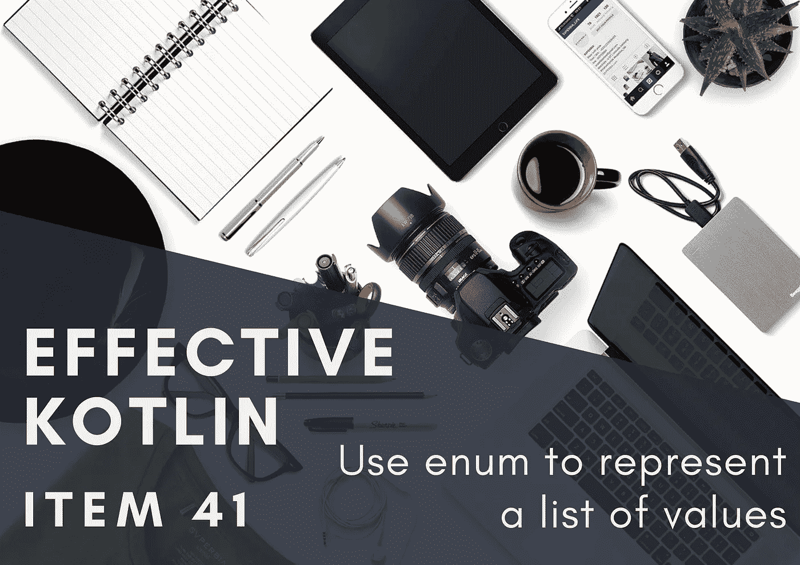
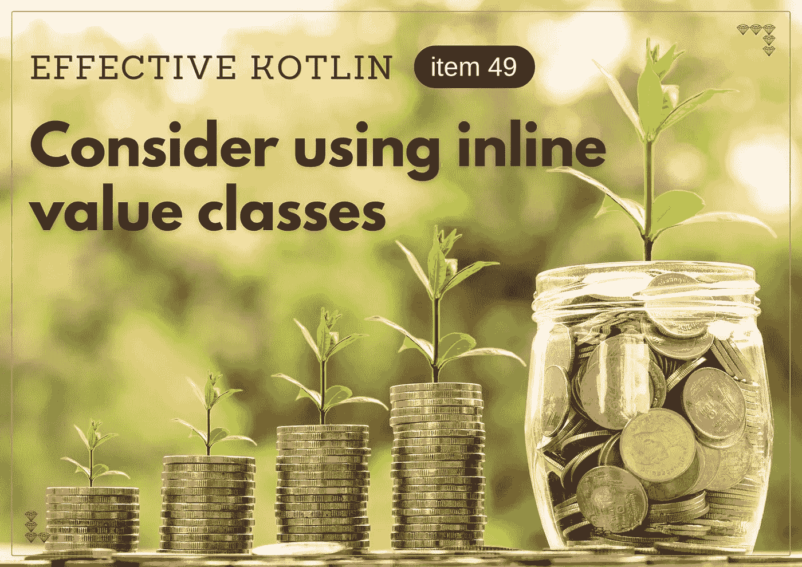
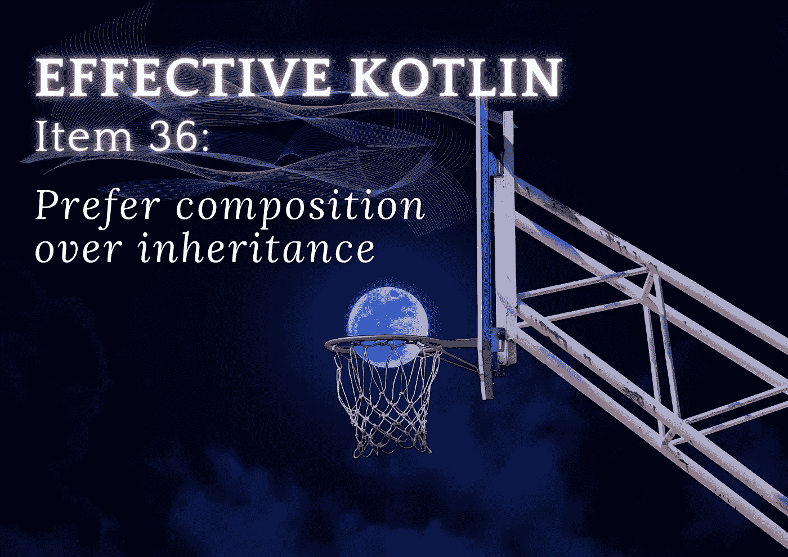

# 2021 年最佳文章，作者:马尔钦·莫斯卡拉和来自卡帕头的《快乐的圣诞节》。学院🎁

> 原文：<https://blog.kotlin-academy.com/best-articles-from-2021-by-marcin-moskala-merry-xmas-from-kt-academy-6719e9a2a36f?source=collection_archive---------2----------------------->

嗨，代码爱好者们！🎅

这真是紧张的一年，但我们希望这些圣诞节充满和平、欢乐和休息
…当然还有一些好吃的东西！🤤

科特林降临节的最后一部分将于周四到来。我们不能等待结果，为了纪念这一时刻并让你从圣诞节的工作中得到一些休息，我们分享了马尔钦·莫斯卡拉写的 2021 年的黄金七篇文章，这是你最喜欢的！

👉[在 Kotlin 协程中，挂起是如何工作的？](http://kt.academy/article/cc-suspension)
👉[使用 enum 来表示一个值列表](http://kt.academy/article/ek-enum)
👉[科特林协程调度程序](http://kt.academy/article/cc-dispatchers)👉[考虑使用内联值类](https://kt.academy/article/ek-value-classes)
👉[兜帽下的花冠](https://kt.academy/article/cc-under-the-hood)
👉[考虑工厂函数而不是构造函数](https://kt.academy/article/ek-factory-functions)
👉[喜欢组合胜过继承](https://kt.academy/article/ek-composition)

祝你阅读愉快⏬

下面是对 Kotlin 协程中挂起如何工作的深入解释。

**在 Kotlin 协程中，挂起是如何工作的？**👇

[How does suspension work in Kotlin Coroutines?](http://kt.academy/article/cc-suspension)

🔻这是《科特林协同程序》一书中的一章。你可以在 LeanPub 上找到早期访问。

什么时候应该使用枚举类，什么时候应该使用密封类？两者各有什么优点？🧐

要找到答案，请阅读这篇文章。

**使用枚举来表示值列表**👇

[Use enum to represent a list of values](http://kt.academy/article/ek-enum)

🔻这是有效的科特林书中的一章。你可以在 [LeanPub](https://leanpub.com/effectivekotlin) 或者[亚马逊](https://www.amazon.com/Effective-Kotlin-practices-Marcin-Moskala/dp/8395452837/ref=sr_1_1?dchild=1&keywords=effective+kotlin&qid=1615033955&sr=8-1)上找到。

Kotlin 协同程序库提供的一个重要功能是让我们决定一个协同程序应该运行哪个线程。这是使用调度程序完成的。

要了解应该在哪里使用 Kotlin Coroutines 库中的每个调度程序，请阅读本文

**科特林协程调度员**👇

[Kotlin Coroutines dispatchers](http://kt.academy/article/cc-dispatchers)

🔻这是《T2》一书中的一章。你可以在 [LeanPub](https://leanpub.com/coroutines/) 上找到早期访问。

什么是值类，如何使用和内联它们？

**考虑使用内联值类**👇

[Consider using inline value classes](https://kt.academy/article/ek-value-classes)

🔻这是有效的科特林书中的一章。你可以在 [LeanPub](https://leanpub.com/effectivekotlin) 或者[亚马逊](https://www.amazon.com/Effective-Kotlin-practices-Marcin-Moskala/dp/8395452837/ref=sr_1_1?dchild=1&keywords=effective+kotlin&qid=1615033955&sr=8-1)上找到。

深入探究暂停和延续在幕后是如何工作的。

**引擎盖下的花冠**👇

[Coroutines under the hood](https://kt.academy/article/cc-under-the-hood)

🔻这是《科特林协同程序》一书中的一章。你可以在 LeanPub 上找到早期访问。

什么是工厂函数，为什么它们对对象创建如此重要。

考虑工厂函数而不是构造函数👇

[Consider factory functions instead of constructors](https://kt.academy/article/ek-factory-functions)

🔻这是有效的科特林书中的一章。你可以在 [LeanPub](https://leanpub.com/effectivekotlin) 或者[亚马逊](https://www.amazon.com/Effective-Kotlin-practices-Marcin-Moskala/dp/8395452837/ref=sr_1_1?dchild=1&keywords=effective+kotlin&qid=1615033955&sr=8-1)上找到。

思考什么时候我们应该在科特林使用组成和继承。
**重组合轻继承**👇

[Prefer composition over inheritance](https://kt.academy/article/ek-composition)

🔻这是有效的科特林书中的一章。你可以在 [LeanPub](https://leanpub.com/effectivekotlin) 或者[亚马逊](https://www.amazon.com/Effective-Kotlin-practices-Marcin-Moskala/dp/8395452837/ref=sr_1_1?dchild=1&keywords=effective+kotlin&qid=1615033955&sr=8-1)上找到。

❄️❄️❄️❄️❄️❄️❄️❄️❄️❄️❄️❄️❄️❄️❄️❄️❄️❄️❄️❄️❄️❄️❄️❄️❄️❄️❄️❄️❄️❄️❄️❄️

你同意我们的列表吗？马尔钦·莫斯卡拉写的你最喜欢的文章是什么？请回复此邮件让我们知道！

圣诞快乐，新年快乐，愿代码与你同在！🤶
Kt。学院团队

www: [kt.academy](https://kt.academy/)
博客:[blog.kotlin-academy.com](http://blog.kotlin-academy.com/)
Twitter EN:[@ ktdotsacademy](https://twitter.com/ktdotacademy)
Twitter PL:[@ ktdotsacademypl](https://twitter.com/ktdotacademyPL)
FB:[@ ktdotsacademy](https://www.facebook.com/KtDotAcademy)
LinkedIn:[@ Kt。学院](https://www.linkedin.com/company/kt-academy/)

