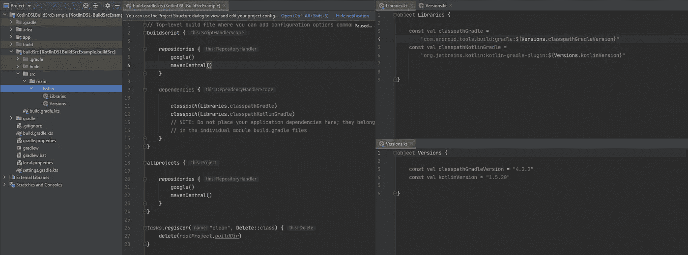

# 来自我们博客的 2021 年最佳文章&来自 Kt 的新年快乐。学院🎆

> 原文：<https://blog.kotlin-academy.com/best-articles-from-2021-from-our-blog-happy-new-year-from-kt-academy-91f5fc8a0444?source=collection_archive---------1----------------------->

欢迎光临！🍾

你的圣诞节过得怎么样？你休息好了吗？如果是这样，我们希望你准备好迎接新的一年的新经历和挑战。💪

新年决心呢？您想编写更多代码吗？⌨

无论如何，我们希望你所有的梦想都能实现，所以
…为 2022 干杯！🥂

总结过去的一年，我们为你准备了一些特别的东西！由于我们收到了来自世界各地不同作者的许多关于 Kotlin 和 Android 的出版物，这次我们分享【2021 年的前七篇文章，你最喜欢的！🏆

👉理解如何在 Android 上编写单元测试变得前所未有的简单——第 1 部分
👉[科特林](/thinking-functionally-in-kotlin-1928c9995643)中的思维功能
👉[如何保护机密🔑在安卓—安卓安全—01](/how-to-secure-secrets-in-android-android-security-01-a345e97c82be)👉[如何保护机密🔑在安卓(深入)—安卓安全-02](/secure-secrets-in-android-using-jetpack-security-in-depth-android-security-02-4026b8e012f4)
👉[科特林 DSL，BuildSrc，产品口味， 风味图标还有更多](/kotlin-dsl-buildsrc-product-flavors-flavor-icon-and-more-abf30c65e8fd)和
👉[如何用 Spring Boot 和科特林构建一个 GraphQL 网关](/how-to-build-a-graphql-gateway-with-spring-boot-and-kotlin-97a186d93d46)
👉[科特林系列与序列比赛仅用 5 分钟](/kotlin-collections-vs-sequences-in-just-5minutes-70a3c3ec94a8)

你可以在我们的[博客](https://blog.kotlin-academy.com/)上找到更多文章！📃
享受⏬

在本文中，**begüm yaz \u c\u\u**将尝试解释什么是单元测试，为什么要编写单元测试，以及如何编写单元测试。

理解如何在 Android 上编写单元测试变得前所未有的简单——第 1 部分👇

[It has never been easier to understand how to write Unit Tests on Android — Part 1](/it-has-never-been-easier-to-understand-how-to-write-unit-tests-on-android-part-1-5ed1e5d8112b)

在这篇由 Kauserali Hafizji 撰写的文章中，我们将与 Kotlin 一起工作。凡是用 Java 的地方都可以用 Kotlin！

👉**在科特林进行功能性思维**

[Thinking functionally in Kotlin](/thinking-functionally-in-kotlin-1928c9995643)

在构建处理 API、从服务器接收的令牌、在本地数据库中存储凭证、将安全数据发送到网络上以及许多其他场景的应用程序时，安全性是一个关键要求。

阅读文章**如何保护机密🔑在安卓-安卓安全-01** 由**阿里·阿扎兹·阿拉姆**

第一部👇

[How to Secure Secrets 🔑 in Android — Android Security-01](/how-to-secure-secrets-in-android-android-security-01-a345e97c82be)

在 google I/O 2019 中，Android 团队发布了名为 Jetpack Security 的安全加密库，以方便开发人员构建安全的应用程序。

**保护秘密🔑在 Android 中使用 Jetpack 安全(深入)-Android Security-02**作者 **Ali Azaz Alam**

第二部分👇

[How to Secure Secrets 🔑 in Android(In-Depth)— Android Security-02](/secure-secrets-in-android-using-jetpack-security-in-depth-android-security-02-4026b8e012f4)

检查依赖项和版本非常重要。特别是在有多个模块的应用程序中，我们可以用 buildSrc 模块来防止每个模块中不同的依赖管理。让我们看看，在文章中我们如何做到这一点

**Kotlin DSL、BuildSrc、产品风味、风味图标等**由**Mustafa yi it**👇

[Kotlin DSL, BuildSrc, Product Flavors, Flavor Icon and more](/kotlin-dsl-buildsrc-product-flavors-flavor-icon-and-more-abf30c65e8fd)

使用 Spring Boot +科特林+协同程序+ GraphQL-java-kickstart，您可以用最少的样板文件构建一个 GraphQL 网关。

要了解如何做到这一点，请阅读 Jean-Michel Fayard 写的文章。

**如何用 Spring Boot 和科特林构建一个 GraphQL 网关**👇

[How to build a GraphQL Gateway with Spring Boot and Kotlin](/how-to-build-a-graphql-gateway-with-spring-boot-and-kotlin-97a186d93d46)

让我们通过**莫妮卡·库马尔·杰塔尼**撰写的《5 分钟❗️》文章来了解科特林系列和序列之间的区别。

**科特林系列 vs 序列仅 5 分钟**👇

[Kotlin Collections vs Sequences in just 5 minutes](/kotlin-collections-vs-sequences-in-just-5minutes-70a3c3ec94a8)

🎆🎆🎆🎆🎆🎆🎆🎆🎆🎆🎆🎆🎆🎆🎆🎆🎆🎆🎆🎆🎆🎆🎆🎆

你同意我们的选择吗？2021 年你最喜欢的文章是什么？请回复此邮件让我们知道！💌

2022 年万事如意！🍸敬请期待！👌
Kt。学院团队

www: [kt.academy](https://kt.academy/)
博客:[blog.kotlin-academy.com](http://blog.kotlin-academy.com/)
Twitter EN:[@ ktdotsacademy](https://twitter.com/ktdotacademy)
Twitter PL:[@ ktdotsacademypl](https://twitter.com/ktdotacademyPL)
FB:[@ ktdotsacademy](https://www.facebook.com/KtDotAcademy)
LinkedIn:[@ Kt。学院](https://www.linkedin.com/company/kt-academy/)

