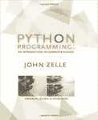

# 学习和实践 Python 的十大最佳书籍

> 原文：<https://medium.com/edureka/best-books-for-python-11137561beb7?source=collection_archive---------0----------------------->

Best Books for Python — Edureka

书籍是获取信息的一种很好的方式，因为它们帮助你以自己的**步调**掌握概念，你可以在自己的**方便的**泡泡里阅读它们。本文为您带来了我们推荐的 10 本最好的 Python 书籍，从初级水平开始，分成特定领域的书籍。我们还有一本额外的书，我们认为作为一名高级 Python 开发人员，你会喜欢的。

这篇文章被分成以下几个部分:

*   为什么选择 Python？
*   **入门书籍**

1.  想想 Python
2.  Python 速成班
3.  学习 Python
4.  Python 编程
5.  一言以蔽之，Python

*   **特定领域的书籍**

1.  编程 Python
2.  物理学中的有效计算
3.  用于数据分析的 Python
4.  Python 机器学习
5.  Django 适合初学者

*   **奖金簿(高级程序员)**

1.  暴力 Python:黑客食谱

# 为什么选择 Python？

Python 是一种通用编程语言，具有简单语法、动态语义、用于开发 web 应用程序的解释、机器学习算法等特性。Python 发展迅速，将它的机会放大了两倍。你为什么不想学习这种美妙的语言？现在你可能想知道哪些是最好的 Python 书籍？所以让我给你看看我的适合所有技能水平的建议。

# 初级书籍

针对希望从头开始学习 Python 的人的书籍将在文章的这一部分讨论。因此，如果你不是一个经验丰富的程序员，我们建议你看看这些精彩的书籍，并开始学习 Python。

## **通过*马克·卢茨*学习 Python**

《学习 Python》是另一本简单的书，它讲述了 Python 的基本概念，是为新手设计的。它讨论了变量、操作符、数据类型等等。这本书的独特之处在于，它还讲述了 Python2 和 Python3 之间的主要区别，如果你想学习基础知识，这也是我们推荐的一本好书。

## **Python 速成班:Eric Matthews 的基于项目的编程实践**

《Python 速成教程》是一本非常棒的书，适合任何希望开始学习任何一种编程语言或对编程略知一二的人。这本书基本上分为两部分。第一部分介绍 Python 处理数据类型、操作符、函数、循环等的基础知识。第二部分涉及与 web 开发、数据可视化、游戏开发等相关的项目。这本书还涉及了强大的库，如 NumPy、Matplotlib 等，如果你愿意，这些库可以帮助你更深入地学习数据科学和可视化。总的来说，这是一本为每个人设计的非常棒的书，它的项目带来了最好的学习体验。

## **想 Python** 由*艾伦·唐尼*

这本书简单而有效，以一种简单友好的交流方式讲述了数据类型、操作符、注释等基本主题，并转向了函数、递归、流控制。它已经更新为支持 Python3。如果你正在寻找一本与读者交流的书，并且喜欢它所提供的写作风格，你应该继续读下去。

## **Python 编程:计算机科学导论**作者*约翰·M·泽尔*

这本书的目标读者是正在接触计算机科学世界的大学生。它回顾了计算机科学的基本概念，进一步介绍了 Python 形式的编程，并教授了一些处理图形的基本项目。因此，如果你是一名大学生、中学生或任何对计算机科学感兴趣但不知道如何进入这个领域的人，这本书适合你们所有人。它有助于以一种非常简单有效的方式分解工具和编程概念的复杂性。

## **Python 一言以蔽之**作者*亚历克斯·马尔泰利*

《Python 简括》是一本论述 Python 基本概念的书，也是一个关于库和语言参考的极好的信息源。如果你在 Python 方面有很强的基础，你也可以学习本书涉及的重要和更复杂的概念，这本书是任何想提高 Python 编程技能的人的完整指南。

# 特定领域的书籍

一旦你清楚了 Python 的基础，为什么不继续学习特定领域的 Python 来帮助你建立职业生涯呢？这些书旨在帮助你用 Python 高效地解决现实世界中的应用。

## **编程 Python:强大的面向对象编程**作者*马克·卢茨*

一旦你清楚了 Python 的基础，我们建议你阅读这本书，因为它对 Python 的应用有更深入的了解。它首先处理面向对象的概念，如堆栈，队列和更多的实现。接下来是使用 Tkinter 模块进行 GUI 编程的基础知识、可用于执行文件处理的命令行脚本、并行编程等等。可以访问客户端网络协议的互联网编程、电子邮件工具和网站实现技术。它还帮助您访问数据库和构建嵌入式应用程序。如您所见，这本书涵盖了很多内容，是高级 Python 编程的完美开端。

## **物理学中的有效计算:Python 研究领域指南**作者*安东尼·斯科帕茨，凯瑟琳·d·哈夫*

这本书对于任何科学家、数据分析师或大量处理数据的人来说都是一个完美的指南，因为它从 Python 的基础开始，然后深入到数据教学以及科学家如何使用 Python 快速有效地执行操作。因此，如果你想学习如何使用 Python 进行科学计算和数据处理，这本书是你应该着手的。

## **用于数据分析的 Python**由*韦斯·麦金尼*

Python for Data Analysis 是帮助您成为数据分析师的完美指南，因为它教您各种库，如 NumPy、Pandas，这些库可用于操纵、处理、清理和压缩数据。它还提供了各种各样的实际案例研究，帮助您在数据分析方面更加成熟。它有助于为使用正确的工具和方法进行数据分析铺平道路。

## **Python 机器学习**由 *Sebastian Raschka 和 Vahid Mirjalili*

这本书帮助你理解和开发各种机器学习、深度学习和数据分析算法。它介绍了各种强大的库，如 Scikit-Learn，用于实现各种机器学习算法。接下来，它还会教你使用张量流模块进行深度学习。它还教你各种方法，这些方法可以用来提高你制作的模型的效率，最后向你展示你可以使用机器和深度学习实现的各种数据分析机会。

## **初学 Django**作者*威廉·s·文森特*

Python 可以用来快速开发 web 应用程序，这本书可以帮助你学习如何构建它们。它讲述了 Django 框架的基础知识，包括结构、视图、模板和测试。此外，它还拥有一些项目，如带有评论区的报纸应用程序、消息应用程序等等。如果你想用 Python 开发 web 应用程序，这是一本非常好的书。

# 奖金簿

如果你是认真的，并且想在 Python 中建立职业生涯，这些是我们推荐给你的高级书籍。对于那些已经是 Python 开发者的人，我们有一个很棒的建议，为你的职业生涯开启一个新的机会，网络安全。

网络安全非常具有挑战性，但却是你可以从事的最令人满意的职业之一。而我们推荐给你的书是:

## **暴力 Python:黑客、法医分析师、渗透测试员和安全工程师的食谱**作者 *TJ 奥康纳*

暴力 Python 为你提供网络安全的基础知识。它将向您介绍取证分析，其中需要使用各种技术来恢复来自 RAM 和其他组件的数据。它还教你渗透测试，红队安全工程师试图破坏客户端的服务器，蓝队安全工程师试图找到突破点并解决它，以进一步提高安全性。

这基本上总结了我们给你的建议，从初学者领域一直到最高级的领域。我们希望您喜欢我们的推荐。

如果你想查看更多关于人工智能、DevOps、道德黑客等市场最热门技术的文章，那么你可以参考 [Edureka 的官方网站。](https://www.edureka.co/blog/?utm_source=medium&utm_medium=content-link&utm_campaign=best-books-for-python)

请留意本系列中的其他文章，它们将解释 Python 和数据科学的各个方面。

> 1.[Python 中的机器学习分类器](/edureka/machine-learning-classifier-c02fbd8400c9)
> 
> 2. [Python Scikit-Learn 备忘单](/edureka/python-scikit-learn-cheat-sheet-9786382be9f5)
> 
> 3.[机器学习工具](/edureka/python-libraries-for-data-science-and-machine-learning-1c502744f277)
> 
> 4.[用于数据科学和机器学习的 Python 库](/edureka/python-libraries-for-data-science-and-machine-learning-1c502744f277)
> 
> 5.[Python 中的聊天机器人](/edureka/how-to-make-a-chatbot-in-python-b68fd390b219)
> 
> 6. [Python 集合](/edureka/collections-in-python-d0bc0ed8d938)
> 
> 7. [Python 模块](/edureka/python-modules-abb0145a5963)
> 
> 8. [Python 开发者技能](/edureka/python-developer-skills-371583a69be1)
> 
> 9.[哎呀面试问答](/edureka/oops-interview-questions-621fc922cdf4)
> 
> 10.[Python 开发者简历](/edureka/python-developer-resume-ded7799b4389)
> 
> 11.[Python 中的探索性数据分析](/edureka/exploratory-data-analysis-in-python-3ee69362a46e)
> 
> 12.[用 Python 的乌龟模块做的蛇游戏](/edureka/python-turtle-module-361816449390)
> 
> 13. [Python 开发者工资](/edureka/python-developer-salary-ba2eff6a502e)
> 
> 14.[主成分分析](/edureka/principal-component-analysis-69d7a4babc96)
> 
> 15. [Python vs C++](/edureka/python-vs-cpp-c3ffbea01eec)
> 
> 16.[刺儿头教程](/edureka/scrapy-tutorial-5584517658fb)
> 
> 17. [Python SciPy](/edureka/scipy-tutorial-38723361ba4b)
> 
> 18.[最小二乘回归法](/edureka/least-square-regression-40b59cca8ea7)
> 
> 19. [Jupyter 笔记本小抄](/edureka/jupyter-notebook-cheat-sheet-88f60d1aca7)
> 
> 20. [Python 基础知识](/edureka/python-basics-f371d7fc0054)
> 
> 21. [Python 模式程序](/edureka/python-pattern-programs-75e1e764a42f)
> 
> 22.[Python 中的生成器](/edureka/generators-in-python-258f21e3d3ff)
> 
> 23. [Python 装饰器](/edureka/python-decorator-tutorial-bf7b21278564)
> 
> 24. [Python Spyder IDE](/edureka/spyder-ide-2a91caac4e46)
> 
> 25.[在 Python 中使用 Kivy 的移动应用](/edureka/kivy-tutorial-9a0f02fe53f5)
> 
> 26.[Python 中什么是套接字编程](/edureka/socket-programming-python-bbac2d423bf9)
> 
> 27.[用 Python 实现的机器人框架](/edureka/robot-framework-tutorial-f8a75ab23cfd)
> 
> 28.[使用 PyGame 的 Python 中的贪吃蛇游戏](/edureka/snake-game-with-pygame-497f1683eeaa)
> 
> 29. [Django 面试问答](/edureka/django-interview-questions-a4df7bfeb7e8)
> 
> 30.[十大 Python 应用](/edureka/python-applications-18b780d64f3b)
> 
> 31.[Python 中的哈希表和哈希表](/edureka/hash-tables-and-hashmaps-in-python-3bd7fc1b00b4)
> 
> 32. [Python 3.8](/edureka/whats-new-python-3-8-7d52cda747b)
> 
> 33.[支持向量机](/edureka/support-vector-machine-in-python-539dca55c26a)
> 
> 34. [Python 教程](/edureka/python-tutorial-be1b3d015745)

*原载于 2019 年 10 月 15 日*[*【https://www.edureka.co】*](https://www.edureka.co/blog/best-books-for-python/)*。*