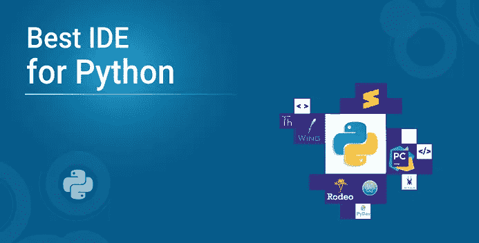
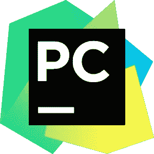
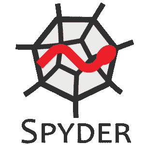

# Python 的顶级 ide 和代码编辑器

> 原文：<https://medium.com/edureka/best-ide-for-python-b8d31aa0a1c8?source=collection_archive---------0----------------------->

Best IDE for Python — Edureka

每当我们在任何领域开发新事物，无论是住房、电信、it，甚至游戏；我们总是希望将所有的必需品整合到一个单一的开发项目中，创造一个满足所有需求的环境。IDE 或**集成开发环境**也是这些项目之一，创建这些项目是为了将编写、调试、测试和执行软件代码的任务绑定在一起。对于所有 Python 爱好者来说，这里有一篇文章可以帮助你选择“最适合 Python 的 IDE”。

让我们快速浏览一下这里为大家总结的所有内容:

1.  ***什么是 IDE？***

***2。什么是 IDE？***

***3。ide 和代码编辑器的区别***

***4。IDE 的特性***

***5。Python 的十大最佳 ide***

*   **PyCharm**
*   **Spyder**
*   PyDev
*   **竞技表演**
*   **崇高的文字**
*   **翼**
*   **埃里克 Python**
*   **原子**
*   **托尼**
*   **闲置**

6.如何为 Python 选择最好的 IDE？

我们开始吧:)

# 什么是 IDE？

IDE 代表集成开发环境。它是一个 GUI(图形用户界面),程序员在这里编写代码并生产最终产品。IDE 基本上统一了软件开发和测试所需的所有基本工具，这反过来帮助程序员最大化他的产出。有些 ide 是通用的，这意味着它们可以支持多种语言。比如 Sublime Text，Atom，Visual Studio 等。特定于语言的 ide 支持特定的语言。当你犯语法错误时，它们也能帮助你理解。例如:Python 的 Pycharm，Java 的 Jcreator，Ruby/Rails 的 RubyMine。

在理解 ide 和代码编辑器之间的区别时，人们普遍感到困惑。因此，让我们进一步指出它们之间的区别。

# ide 和代码编辑器的区别:

IDE 是一个完整的环境，您可以在其中编写、编译、调试或测试代码。另一方面，代码编辑器或文本编辑器是您可以编写代码的平台。代码编辑器应该支持的唯一功能是编辑文本。IDE 本身在其工具包中包含一个代码编辑器。

既然代码编辑器和 IDE 之间的区别已经很清楚了，那么让我们继续来看看 Python 的最佳 IDE 应该有哪些特性。

# IDE 的功能:

一个通用的 IDE 应该包含以下内容:

> **代码编辑器**:提供一个代码编辑器来编写和操作源代码。代码编辑器可以是独立的应用程序，也可以集成到 ide 中。
> 
> **语法突出显示:**该功能用于用不同的颜色和字体标记基础语言的语法。
> 
> **自动完成代码:**旨在最大限度地减少时间消耗，自动完成功能完成或建议程序员需要出现什么变量、参数或代码位。
> 
> **调试器:**调试器是测试和调试源代码所需的工具。
> 
> 编译器:编译器是将源代码从一种语言翻译成另一种语言的组件。编译器通常执行预处理、词法分析、代码优化和代码生成任务。
> 
> **语言支持:**ide 可以是特定于语言的，也可以支持多种语言。这种选择依赖于用户选择并接受他所选择的 IDE。

# Python 的十大最佳 ide

Python 的一些最佳 ide 是:

# PyCharm:

PyCharm 由捷克公司 JetBrains 开发，是 Python 特有的 IDE。PyCharm 是一个跨平台的 IDE。因此，用户可以根据自己的需求下载任何 Windows、Mac 或 Linux 版本。老实说，PyCharm 被认为是 Python 最好的 IDE 之一，也是使用最广泛的。

除了通用功能之外，PyCharm 还提供了其他功能，如:

*   允许在文件之间快速切换的专用项目视图
*   与 Django、Flask 和 web2py 一起促进 Web 开发
*   PyCharm 配备了 1000 多个插件，因此程序员可以编写自己的插件来扩展它的功能
*   它提供两个版本供下载，免费的*社区版、*和付费的*专业版*。程序员可以根据自己的需求下载相应的版本

# Spyder:

Spyder 是 Pierre Raybaut 在 2009 年开发的一款**开源**、**跨平台** IDE。它主要是为数据分析师和科学家设计的，被认为是用 Python 编写的强大的科学开发 IDE。

*   Spyder 集成了许多科学 Python 库，即 SciPy、NumPy、Matplotlib、Pandas 等。
*   关于其科学用途，Spyder 为编辑、分析和数据探索提供了高级支持
*   它还允许静态代码分析，其中在不实际执行代码的情况下执行分析
*   该 IDE 的特性可以通过其插件系统和 API 进一步扩展。

# PyDev:

PyDev 最初由 Alex Totic 于 2003 年创建，然后由 Fabio Zadrozny 担任其主要项目负责人。它基本上是一个开源的第三方包，作为 Eclipse 的插件，支持 Python 开发。

PyDev 有许多特殊功能，例如:

*   远程调试器(可以调试没有在 Eclipse 中启动的文件)
*   代码折叠(选择性地隐藏或显示代码部分)
*   Python 2.x 和 3.x 语法

# 竞技表演:

Rodeo 是一个由 Yhat 开发的**开源** Python IDE。内置专门用于机器学习和数据科学。

*   Rodeo 使得加载数据和比较数据变得非常方便
*   它还允许数据实验
*   它配有 Python 教程来指导用户
*   提供备忘单作为参考资料
*   文件和包搜索变得非常方便

# 崇高的文本:

Sublime-Text 是一个用 C++和 Python 开发的跨平台 IDE。除了 Python 之外，它还支持其他语言。这个 IDE 的特性可以使用插件来增强。

它提供各种功能，例如:

*   “转到任何地方”功能，允许快速访问文件、符号或行
*   它的命令面板为键盘调用提供了可靠的匹配
*   基于 Python 的插件 API
*   允许同步编辑
*   偏好可以是特定于项目的

# 机翼:

这个 IDE 是由 Wingware 创建的。这是一个轻量级的 IDE，旨在允许快速编程。有三种型号，即:

*   **Wing Pro** —专业人士付费版
*   **Wing Personal** —面向学生和发烧友的免费版本
*   **Wing 101** —初学者的简化免费版

Wing 提供特殊功能，例如:

*   自动多进程和子进程调试
*   远程调试过程
*   模块浏览器
*   重构
*   自动完成也适用于非 Python 文件

# 埃里克·派森:

Eric 是用 Python 写的，是免费软件。它的源代码可以免费获得，任何人都可以研究和重新创建。

提供一些质量特性，例如:

*   可格式化的窗口布局
*   可格式化的语法-突出显示
*   代码折叠
*   配备了一个类浏览器
*   对单元测试的内置支持
*   对 Django 的内置支持

# 原子:

Atom 是一个使用 web 技术构建的开源免费 IDE。Atom 基于 GitHub 构建的电子框架，而 GitHub 是用 CoffeeScript 或更少的语言编写的。

Atom 的具体特性包括:

*   启用对第三方包和主题的支持，以便格式化编辑器
*   Atom 的 APM 允许安装和管理软件包
*   为除 Python 之外的许多语言提供支持，如 C、C++、Java、HTML 等
*   异常报告包

# 托尼:

Thonny 是为初学者开发的 IDE。它为程序员提供一步一步的帮助。

具有许多功能，例如:

*   提供了单独的窗口来执行函数调用
*   行号可供用户跟踪每一行
*   用户操作日志是可用的，以便在将来帮助用户
*   没有断点的语句单步执行

# 空闲:

IDLE 完全是用 Python 编写的，它是 Python 的默认实现。它的名字可能是为了纪念巨蟒小组的创始人之一埃里克·艾多尔。由于其简单性，该 IDE 被认为非常适合教育行业。

IDLE 还提供了一些显著的功能，例如:

*   具有语法突出显示的 python shell 的可用性
*   多窗口文本编辑器
*   程序动画或步进(指一次执行一行代码)
*   断点可用于简化调试

现在你已经对 Python 的重要 ide 有了一个概念，让我们继续选择最适合你的 ide。

# 如何为 Python 选择最好的 IDE？

在为 Python 选择最佳 IDE 时，请始终牢记以下几点:

*   程序员的专业水平(初学者、专业人员)
*   使用 Python 的行业或部门的类型
*   购买商业版本或坚持免费版本的能力
*   正在开发的软件种类
*   需要与其他语言集成

一旦决定了这些要点，程序员就可以很容易地根据给定的特性在前面讨论的 ide 中进行选择。

至此，您已经完成了这篇关于“Python 的最佳 IDE”的文章。我希望这足以让你明白一切必要的东西。

确保你尽可能多地练习，恢复你的经验。

如果你想查看更多关于人工智能、DevOps、道德黑客等市场最热门技术的文章，那么你可以参考 [Edureka 的官方网站。](https://www.edureka.co/blog/?utm_source=medium&utm_medium=content-link&utm_campaign=python-ide)

请留意本系列中的其他文章，它们将解释 Python 和数据科学的各个方面。

> *1。*[*Python 中的机器学习分类器*](/edureka/machine-learning-classifier-c02fbd8400c9)
> 
> *2。*[*Python Scikit-Learn Cheat Sheet*](/edureka/python-scikit-learn-cheat-sheet-9786382be9f5)
> 
> *3。* [*机器学习工具*](/edureka/python-libraries-for-data-science-and-machine-learning-1c502744f277)
> 
> *4。* [*用于数据科学和机器学习的 Python 库*](/edureka/python-libraries-for-data-science-and-machine-learning-1c502744f277)
> 
> *5。*[*Python 中的聊天机器人*](/edureka/how-to-make-a-chatbot-in-python-b68fd390b219)
> 
> *6。* [*Python 集合*](/edureka/collections-in-python-d0bc0ed8d938)
> 
> *7。* [*Python 模块*](/edureka/python-modules-abb0145a5963)
> 
> *8。* [*Python 开发者技能*](/edureka/python-developer-skills-371583a69be1)
> 
> *9。* [*哎呀面试问答*](/edureka/oops-interview-questions-621fc922cdf4)
> 
> *10。* [*一个 Python 开发者的简历*](/edureka/python-developer-resume-ded7799b4389)
> 
> 11。[*Python 中的探索性数据分析*](/edureka/exploratory-data-analysis-in-python-3ee69362a46e)
> 
> *12。* [*蛇与蟒蛇的游戏*](/edureka/python-turtle-module-361816449390)
> 
> *13。* [*Python 开发者工资*](/edureka/python-developer-salary-ba2eff6a502e)
> 
> *14。* [*主成分分析*](/edureka/principal-component-analysis-69d7a4babc96)
> 
> *15。*[*Python vs c++*](/edureka/python-vs-cpp-c3ffbea01eec)
> 
> *16。* [*刺儿头教程*](/edureka/scrapy-tutorial-5584517658fb)
> 
> *17。*[*Python SciPy*](/edureka/scipy-tutorial-38723361ba4b)
> 
> *18。* [*最小二乘回归法*](/edureka/least-square-regression-40b59cca8ea7)
> 
> *19。* [*Jupyter 笔记本小抄*](/edureka/jupyter-notebook-cheat-sheet-88f60d1aca7)
> 
> *20。* [*Python 基础知识*](/edureka/python-basics-f371d7fc0054)
> 
> *21。* [*Python 模式程序*](/edureka/python-pattern-programs-75e1e764a42f)
> 
> *22。*[*Python 中的*](/edureka/generators-in-python-258f21e3d3ff) 生成器
> 
> *23。* [*Python 装饰器*](/edureka/python-decorator-tutorial-bf7b21278564)
> 
> *24。**[*Python 中的套接字编程是什么*](/edureka/socket-programming-python-bbac2d423bf9)*
> 
> **25。*[*Python 中使用 Kivy 的移动应用*](/edureka/kivy-tutorial-9a0f02fe53f5)*
> 
> *26。 [*十大最佳学习书籍&练习 Python*](/edureka/best-books-for-python-11137561beb7)*
> 
> **27。* [*机器人框架与 Python*](/edureka/robot-framework-tutorial-f8a75ab23cfd)*
> 
> **28。* [*蟒蛇游戏中使用 PyGame*](/edureka/snake-game-with-pygame-497f1683eeaa)*
> 
> *29。 [*Django 面试问答*](/edureka/django-interview-questions-a4df7bfeb7e8)*
> 
> *三十。 [*十大 Python 应用*](/edureka/python-applications-18b780d64f3b)*
> 
> *31。[*Python 中的哈希表和哈希表*](/edureka/hash-tables-and-hashmaps-in-python-3bd7fc1b00b4)*
> 
> **32。*[*Python 3.8*](/edureka/whats-new-python-3-8-7d52cda747b)*
> 
> **33。* [*支持向量机*](/edureka/support-vector-machine-in-python-539dca55c26a)*
> 
> **34。* [*Python 教程*](/edureka/python-tutorial-be1b3d015745)*
> 
> **35。*[*Python Spyder*](/edureka/spyder-ide-2a91caac4e46)*

**原载于 2019 年 6 月 4 日*[*https://www.edureka.co*](https://www.edureka.co/blog/best-ide-for-python/)*。**