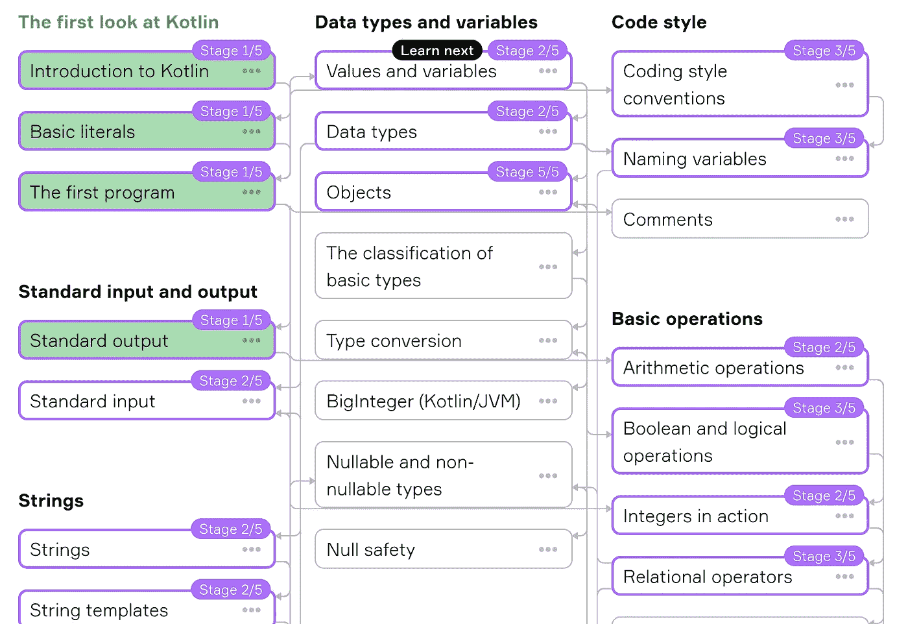
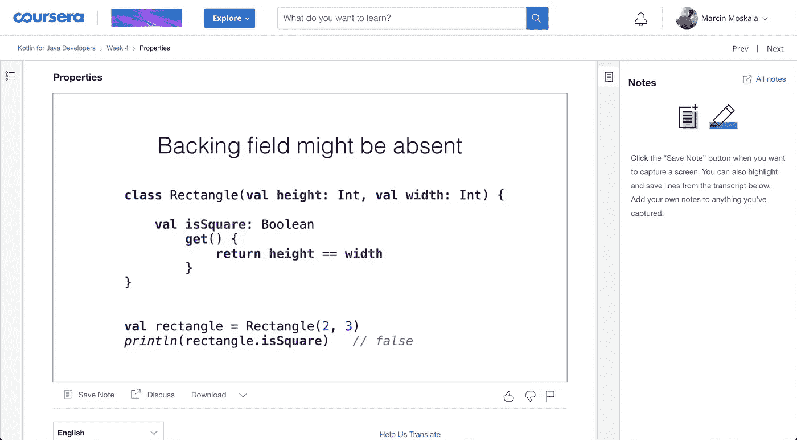
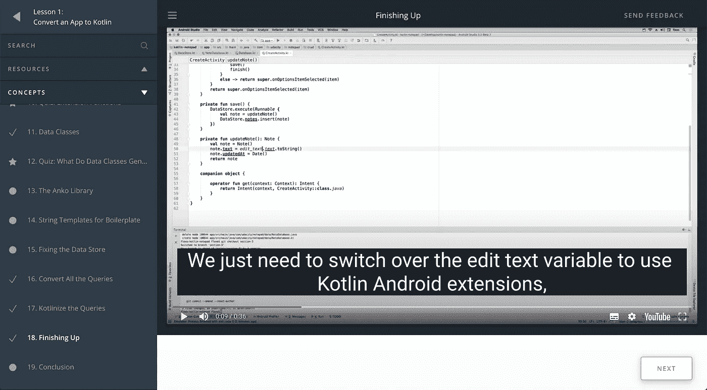
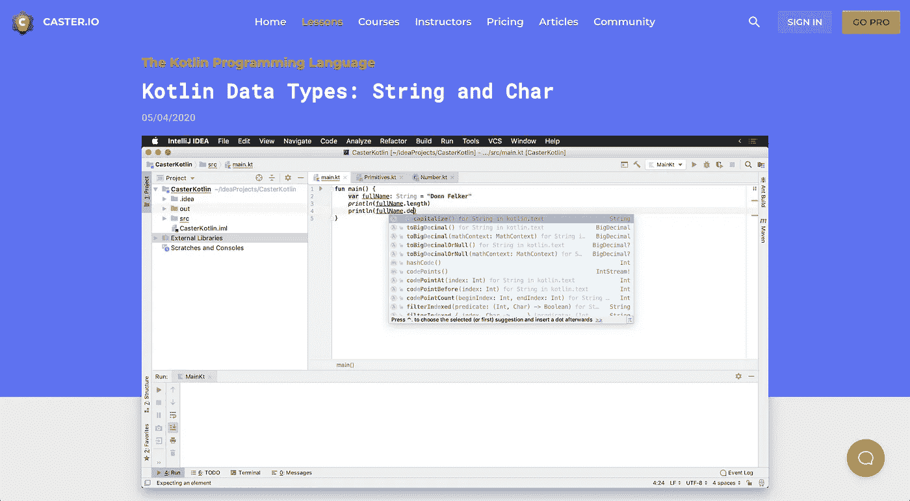
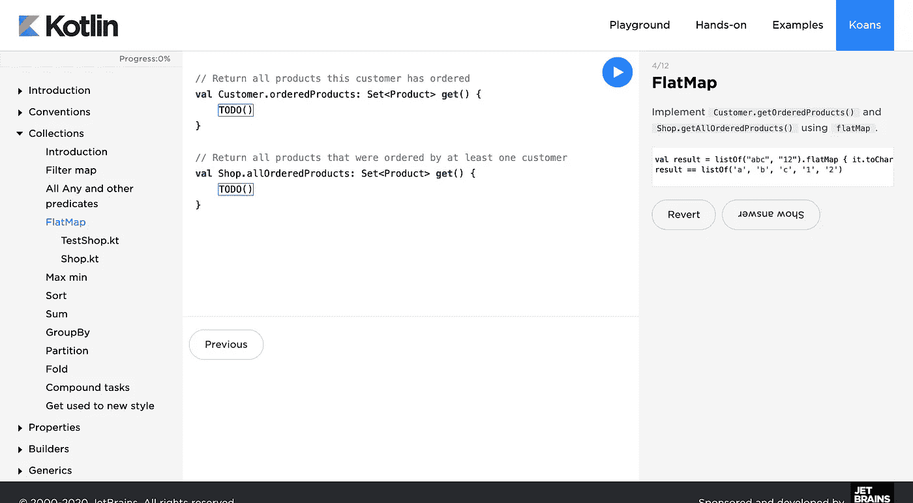

# 最佳科特林免费在线课程

> 原文：<https://blog.kotlin-academy.com/best-kotlin-free-online-courses-5838cb7063c6?source=collection_archive---------1----------------------->

至于很多语言，网上有很多教科特林的免费课程。其中许多是由 JetBrains 或 Google 制作的，他们对我们学习 Kotlin 感兴趣，但也有一些是由社区成员制作的。让我们看看如何免费学习 Kotlin。

# JetBrains 学院

通过小的挑战和一步一步解释概念的页面来教授 Kotlin、Java、算法、Python 等等。我最近了解了 JetBrains 学院，我对它非常着迷。提供了大量精美的主题，全部免费。至少现在是这样，所以我们应该尽可能地利用它；)

 [## JetBrains 学院:准备成为专业人士

### JetBrains 学院只有英文版吗？hyperskill.org 的 JetBrains 学院内容，如主题和…

www.jetbrains.com](https://www.jetbrains.com/academy/) 

# Svetlana Isakova 和 Andrey Breslav 在 Coursera 上为 Java 开发人员编写的 Kotlin

如果这些名字对你来说很熟悉，这可能不是巧合。他们都是科特林团队的成员。Andrey Breslav 实际上是 Kotlin 项目负责人和初始设计师，Svetlana Isakova 目前是 JetBrains 开发人员，倡导教授 Kotlin。他们的课程设计得很好，提供了许多有用和重要的见解。这绝对是我的第一推荐。

 [## 面向 Java 开发人员的| Coursera

### 从 JetBrains 学习面向 Java 开发人员的 Kotlin。Kotlin 编程语言是一种现代语言，它为您提供了…

www.coursera.org](https://www.coursera.org/learn/kotlin-for-java-developers?) 

# 由谷歌制作的 Udacity 课程

谷歌与 Udacity 的合作产生了许多优秀的免费在线课程，主要围绕 Android 教授概念。这些课程中有两门是教授科特林语的。

第一个是由**亚伦·萨拉赞**和**何塞·涅托·卢比奥**为安卓开发者设计的**科特林。对于那些熟悉 Android 的人来说，这是一门坚实的课程。它展示了如何将一个用 Java 开发的 Android 应用程序移植到 Kotlin。**

 [## 面向 Android 开发者的 Kotlin

### 在本课程中，Aaron Sarazan 是 Capital One 的首席软件工程师，也是 Kotlin 的主要倡导者，他演示了…

www.udacity.com](https://www.udacity.com/course/kotlin-for-android-developers--ud888) 

另一个课程是**由**阿列克斯·海克奇**、**肖恩·麦克奎蓝**和**阿塞尔·沙马**为程序员开设的**科特林训练营。这是一门非常好的课程，不是专门针对 Android 的，即使你不是 Java 开发人员，你也应该能够掌握。

 [## 科特林程序员训练营

### Kotlin 是一种开放源代码的现代编程语言，它让开发人员可以同时使用面向对象和函数式编程语言…

www.udacity.com](https://www.udacity.com/course/kotlin-bootcamp-for-programmers--ud9011) 

# Donn Felker 在 Caster.io 上发表的 Kotlin 编程语言

一门新课程，我还没看过，但看起来很有前途，我认识这位老师——唐恩·费尔克——他是一位伟大的教育家。在许多短视频中，它一步一步地展示了 Kotlin 的所有功能，从基础到高级。

 [## 科特林编程语言

### 在本课程中，您将从头开始学习 Kotlin 编程语言。主题包括但不限于…

caster.io](https://caster.io/courses/kotlin-programming-language) 

# 科特林·考恩斯

最后一门课程不是传统的课程，而是一套练习和讲解，教授必要的概念。斯维特拉娜·伊萨科娃。这是练习科特林和加深知识的好方法。你可以在网上或使用 IntelliJ Edu 插件做这些练习。

 [## 科特林·考恩斯

### Kotlin Koans 是一系列练习，帮助您熟悉 Kotlin 语法。每个练习都是作为…

kotlinlang.org](https://kotlinlang.org/docs/tutorials/koans.html) 

# Kt 呢。学院？

显然，我们现在不提供免费的在线课程，除了[我们教授许多科特林概念的文章](https://blog.kotlin-academy.com/)。[我们的课程主要面向公司。尽管如此，我们很乐意帮助传播关于如何学习科特林的不同方法的知识，因为我们的使命是教授科特林。](https://kt.academy/workshop)