# 2021 年机器学习的最佳笔记本电脑

> 原文：<https://medium.com/edureka/best-laptop-for-machine-learning-a4a5f8ba5b?source=collection_archive---------0----------------------->

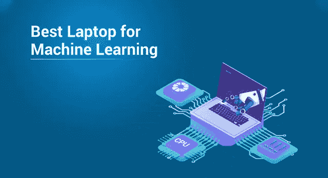

Best Laptop For Machine Learning — Edureka

随着机器学习和深度学习在各个领域的兴起。无论是知名的 MNC 还是任何创业公司。对机器学习的需求是存在的，公司通常不会太注意这样一个事实，即软件开发人员和支持人员使用的任何普通笔记本电脑都不适合机器学习。所以，让我们开始，找出**最适合机器学习的笔记本电脑**。

*   影响便携性的因素
*   最低要求
*   机器学习的最佳笔记本电脑
*   构建定制 PC

# 影响便携性的因素

为了找到机器学习的最佳笔记本电脑，便携性是任何人在笔记本电脑中寻找的关键因素之一，否则，如果便携性不是问题，那么你可以选择定制 PC，我将在本文的后面部分讨论这一点。

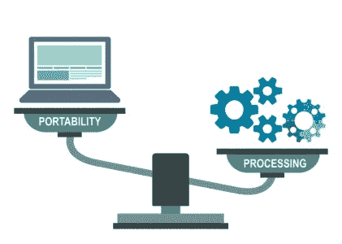

处理能力越高，笔记本电脑就越重。这可能意味着很多事情。

*   **更多的内存**导致**更多的重量**
*   **更多的电池**导致**更多的重量**
*   **更大的屏幕**尺寸导致**更重**
*   功率越高，电池寿命越短。

# 最低要求

在为机器学习购买最好的笔记本电脑之前，你必须看看对笔记本电脑的最低要求。如果您正在构建一台定制的 PC，这也会很有用。

**RAM:** 最少需要 **16 GB** ，但是我建议如果可以的话使用 32 GB RAM，因为训练任何算法都需要一些繁重的工作。少于 16 GB 会在多任务处理时导致问题。

**CPU:** 建议使用**英特尔酷睿 i7 第七代**以上的处理器，因为它更强大，性能更高。

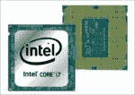

**GPU:** 这是作为深度学习最重要的方面，深度学习是机器学习的一个子领域，需要神经网络工作，并且计算量很大。处理图像或视频需要大量的矩阵计算。GPU 支持这些矩阵的并行处理。如果没有 GPU，这个过程可能需要几天或几个月。但是有了它，你最好的用于机器学习的笔记本电脑可以在几个小时内完成同样的任务。

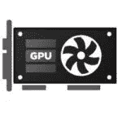

**英伟达**已经开始为笔记本电脑制作 [**GeForce 10 系列**](https://www.nvidia.com/en-us/geforce/products/) 。这些是最好的 GPU 之一，选择一个适合你的价格范围。虽然他们也有 RTX 20 系列，但是太贵了。你也可以选择 [**和【镭龙】**](https://www.amd.com/en/graphics/radeon-rx-graphics) 。

**存储:**最少需要 **1TB** **HDD** ，因为数据集每天都在变得越来越大。如果您的系统配有 **SSD** ，建议最低配置为 **256 GB** 。同样，如果您的存储较少，您可以选择云存储选项。在那里你甚至可以得到高 GPU 的机器。

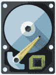

操作系统:大多数人选择 Linux，但是 Windows 和 MacOS 都可以运行虚拟 Linux 环境，你也可以在这些系统上工作。

# 机器学习的最佳笔记本电脑

## [**张量本**](https://lambdalabs.com/deep-learning/laptops/tensorbook)

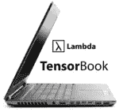

当谈到机器学习和深度学习目的时，Lambda Labs 的 TensorBook 将是我的 **#1** 选择，因为这款笔记本电脑是专门为此目的设计的。

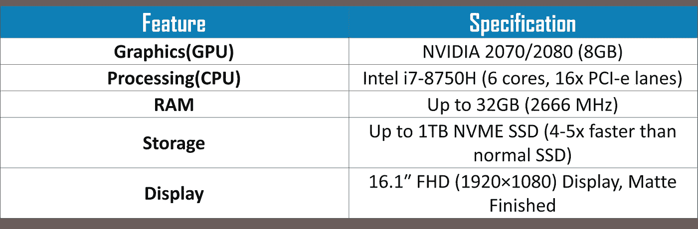

**优点:**专为深度学习打造，预装深度学习库。

缺点:除了定价之外，什么都没有。

## [**苹果 MacBook Pro 15】**](https://www.apple.com/shop/buy-mac/macbook-pro)

多任务处理和机器学习的最佳笔记本电脑之一。对于不想转移到另一个平台的苹果粉丝来说，这是一个很好的选择。

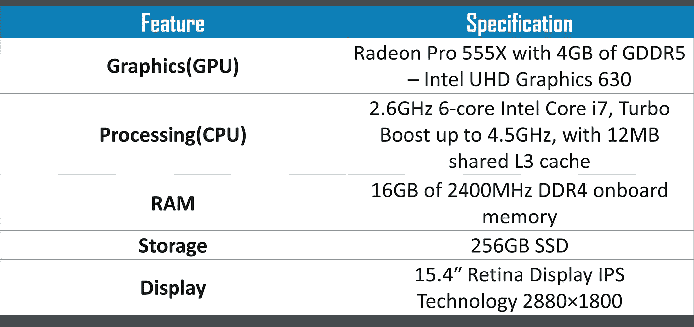

**优点:**绚丽的视网膜显示屏(2880×1800)

**缺点:**太贵，RAM 不可升级。

## [**华硕 ROG Strix GL702VS**](https://www.asus.com/Laptops/ROG-GL702VS/)

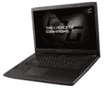

这是一台不寻常的笔记本电脑，从外面看，它就像任何其他重型游戏笔记本电脑。它采用了 AMD 最优秀的桌面硬件，而且价格低得惊人。

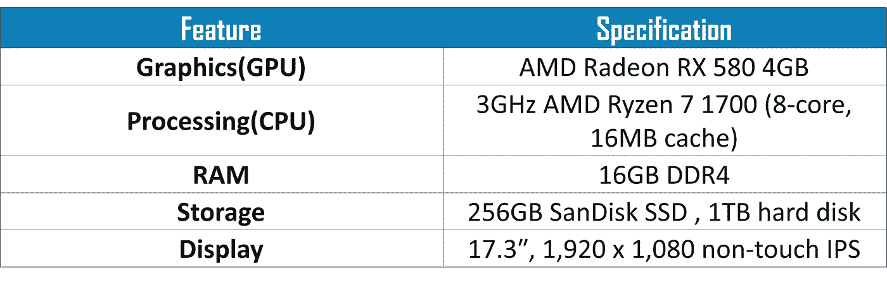

**优点:**物超所值，卓越的性能和出色的散热管理，物超所值

缺点:电池可以更好

## [**华硕 ROG 西风 S**](https://www.asus.com/Laptops/ROG-Zephyrus-S-GX531/)

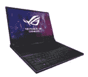

华硕 ROG Zephyrus S GX531GX 是一款令人惊叹的 15 英寸游戏笔记本电脑，具有超极本的纤薄设计，但集成了强大的 GPU 组件。

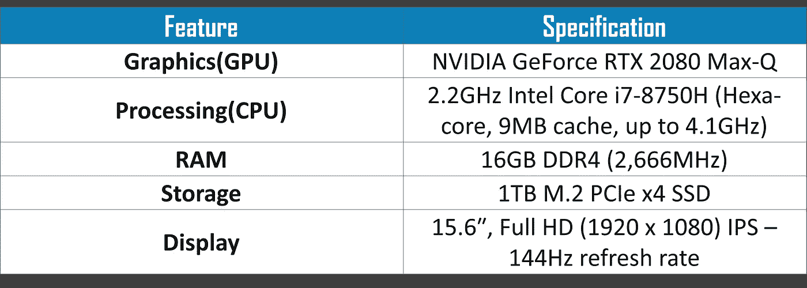

**优点:**功能强大、纤薄设计、卓越性能、创新散热

缺点:很贵，屏幕不是 HDR 的。

## [**戴尔 XPS 15 9560**](https://www.dell.com/en-in/shop/laptops-2-in-1-pcs/xps-15/spd/xps-15-9560-laptop)

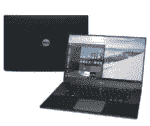

戴尔 XPS 15 是一款非常灵活的笔记本电脑，尽管表面上看起来像是一款普通的高端笔记本电脑。它非常强大，但在同类产品中电池续航时间异常长。

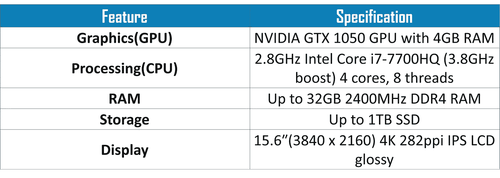

**优点:**快速、惊人的电池续航时间、4k 显示屏

**缺点:**价格昂贵，笨重，没有网络摄像头

## [**雷蛇之刃 15**](https://www.razer.com/gaming-laptops/razer-blade)

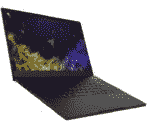

Razer Blade 是您可以获得的用于机器和深度学习的最佳笔记本电脑之一。它基本上检查所有的框，为它处理你的项目和一些更多。性能一流。

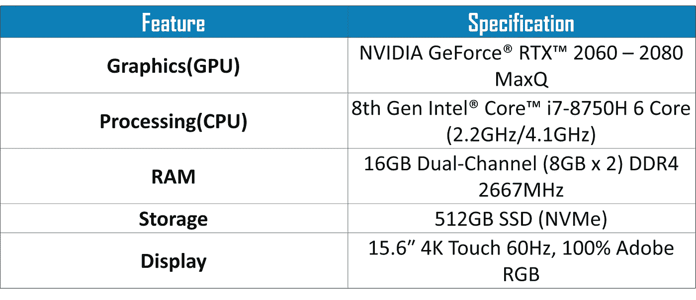

**优点:**卓越的性能，卓越的制造质量，轻巧便携的设计

缺点:价格昂贵

## [**微星 GS65**](https://www.msi.com/Laptop/GS65-Stealth-Thin-8RF)

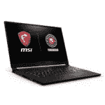

MSI GS65 再次成为一款轻薄的游戏笔记本电脑，面向在深度神经网络上工作的高级用户。

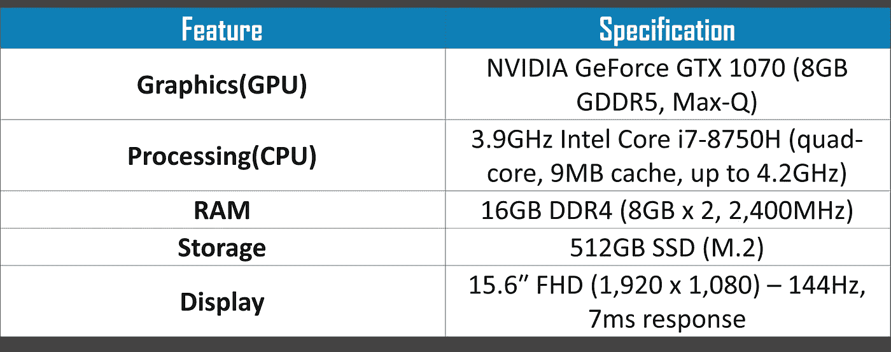

**优点:**有吸引力，微妙的设计，华丽，快速显示，卓越的性能，有效的热管理

**缺点:**底部发热，即将到来的生物识别登录，糟糕的原生音频

## [**宏碁掠夺者(Helios 300 和 Triton 700)**](https://www.acer.com/ac/en/US/content/predator-series/predatorhelios300)

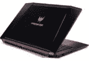

Helios 和 Triton 700 都是性能和速度惊人的笔记本电脑。Triton 是最新的，也是最贵的。但即使是赫利俄斯也能做你的工作。

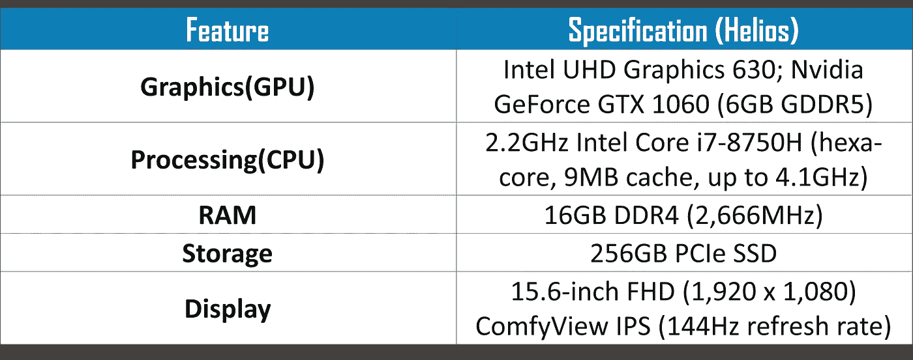

优点:对于一台价格适中的笔记本电脑来说，它的性能非常出色。它也有足够的空间来存储数据。

缺点:屏幕显示可以更好。

## [**戴尔外星人 15**R4](https://www.dell.com/en-in/shop/laptops-2-in-1-pcs/new-alienware-15-gaming-laptop/spd/alienware-15-laptop)

最便宜的笔记本电脑之一，如果不是多任务处理，也可以完成工作。对于不能花太多钱买新笔记本电脑的学生来说是个好主意。

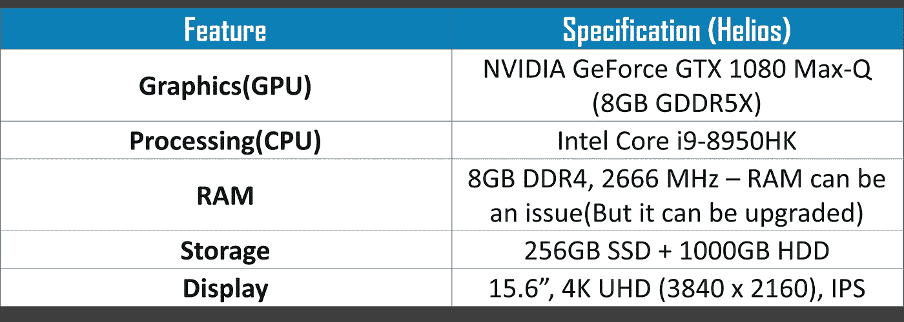

优点:便宜，完成工作。

**缺点:**更多的内存和性能。

## [技嘉 Aero 15X](https://www.gigabyte.com/in/Laptop/AERO-15X--i7-8750H#kf)

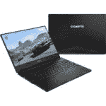

Gigabyte Aero 15X 是一款出色的笔记本电脑，可用于游戏以外的任务，如机器学习，同时保持其出色的电池续航时间，比以前的版本更加多功能。

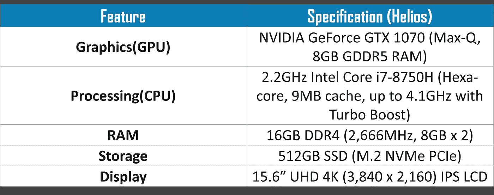

**优点:**出色的性能，梦幻般的电池续航时间，华丽的屏幕，充足的端口

**缺点:**下巴摄像头，性价比不高。

# 构建定制 PC

如果便携性不是问题，您可以构建一台定制的 PC。有很多地方可以构建定制 PC。这是少数几台可以在 [iBuyPower](https://www.ibuypower.com/) 上定制的电脑之一。也可以**自己组装一个**。只要确保您检查了最低要求框，您就可以开始了。

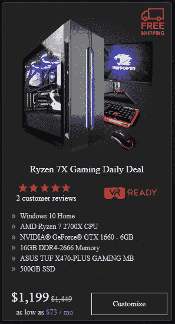

如果你不想花那么多钱，你可以使用 GPU 的云支持。在这里你可以选择 AWS 或者微软 Azure。出于分析目的，Azure 在某些方面更便宜也更好。但是我会建议你省钱买 GPU，因为从长远来看它会更便宜。

至此，我们结束了寻找机器学习最佳笔记本电脑的探索。我希望你已经决定了根据你的预算买哪一台笔记本电脑。如果你不是一个游戏玩家，不要在显示器或 GPU 上花费太多。用中档或者便宜的笔记本电脑。

如果你想查看更多关于人工智能、DevOps、道德黑客等市场最热门技术的文章，那么你可以参考 [Edureka 的官方网站。](https://www.edureka.co/blog/?utm_source=medium&utm_medium=content-link&utm_campaign=best-laptop-for-machine-learning)

请留意本系列中的其他文章，它们将解释深度学习的各个其他方面。

> 1. [TensorFlow 教程](/edureka/tensorflow-tutorial-ba142ae96bca)
> 
> 2. [PyTorch 教程](/edureka/pytorch-tutorial-9971d66f6893)
> 
> 3.[感知器学习算法](/edureka/perceptron-learning-algorithm-d30e8b99b156)
> 
> 4.[神经网络教程](/edureka/neural-network-tutorial-2a46b22394c9)
> 
> 5.什么是反向传播？
> 
> 6.[卷积神经网络](/edureka/convolutional-neural-network-3f2c5b9c4778)
> 
> 7.[胶囊神经网络](/edureka/capsule-networks-d7acd437c9e)
> 
> 8.[递归神经网络](/edureka/recurrent-neural-networks-df945afd7441)
> 
> 9.[自动编码器教程](/edureka/autoencoders-tutorial-cfdcebdefe37)
> 
> 10.[受限玻尔兹曼机教程](/edureka/restricted-boltzmann-machine-tutorial-991ae688c154)
> 
> 11. [PyTorch vs TensorFlow](/edureka/pytorch-vs-tensorflow-252fc6675dd7)
> 
> 12.[用 Python 进行深度学习](/edureka/deep-learning-with-python-2adbf6e9437d)
> 
> 13.[人工智能教程](/edureka/artificial-intelligence-tutorial-4257c66f5bb1)
> 
> 14.[张量流图像分类](/edureka/tensorflow-image-classification-19b63b7bfd95)
> 
> 15.[人工智能应用](/edureka/artificial-intelligence-applications-7b93b91150e3)
> 
> 16.[如何成为一名人工智能工程师？](/edureka/become-artificial-intelligence-engineer-5ac2ede99907)
> 
> 17.[问学](/edureka/q-learning-592524c3ecfc)
> 
> 18. [Apriori 算法](/edureka/apriori-algorithm-d7cc648d4f1e)
> 
> 19.[马尔可夫链与 Python](/edureka/introduction-to-markov-chains-c6cb4bcd5723)
> 
> 20.[人工智能算法](/edureka/artificial-intelligence-algorithms-fad283a0d8e2)
> 
> 21.[tensor flow 中的对象检测](/edureka/tensorflow-object-detection-tutorial-8d6942e73adc)
> 
> 22.[12 大人工智能工具](/edureka/top-artificial-intelligence-tools-36418e47bf2a)
> 
> 23.[人工智能(AI)面试问题](/edureka/artificial-intelligence-interview-questions-872d85387b19)
> 
> 24. [Theano vs TensorFlow](/edureka/theano-vs-tensorflow-15f30216b3bc)
> 
> 25.[什么是神经网络？](/edureka/what-is-a-neural-network-56ae7338b92d)
> 
> 26.[模式识别](/edureka/pattern-recognition-5e2d30ab68b9)
> 
> 27.[人工智能中的阿尔法贝塔剪枝](/edureka/alpha-beta-pruning-in-ai-b47ee5500f9a)

*原载于 2019 年 7 月 4 日 https://www.edureka.co***。**