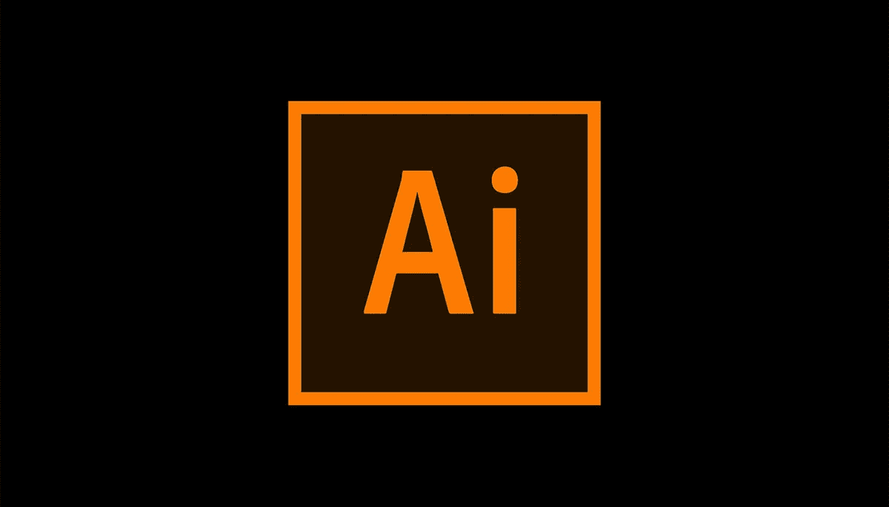
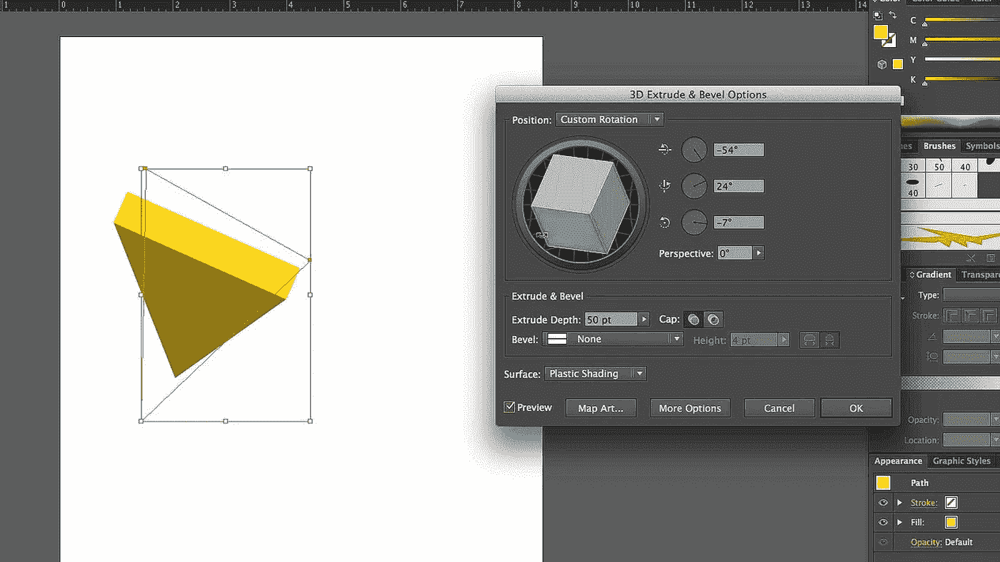

# 10+最佳插画初学者教程—在线学习插画

> 原文：<https://medium.com/quick-code/best-online-tutorials-to-learn-illustrator-196cf2f67b98?source=collection_archive---------0----------------------->

## 学习 Adobe Illustrator，在 2021 年用最好的 Illustrator 教程为初学者创建宏伟的插图

Adobe Illustrator 是行业标准的矢量图形应用程序，允许您为印刷、web、交互式、视频和移动设备创建徽标、图标、草图、排版和复杂的插图。

# 1.[插画 CC 2018 大师班](https://click.linksynergy.com/deeplink?id=Fh5UMknfYAU&mid=39197&u1=quickcode&murl=https%3A%2F%2Fwww.udemy.com%2Fillustrator-cc-masterclass%2F)

掌握 Adobe Illustrator CC，通过这一面向所有级别的深入培训。在本课程中，您将:

*   设计标志
*   创建矢量插图
*   将照片变成矢量艺术品
*   矢量化和彩色手绘草图
*   为 web 和印刷准备图形
*   设计信息图
*   以创造性的方式处理文字
*   掌握高级 Illustrator 工具和技巧
*   学习有用的键盘快捷键和最佳实践
*   用提供的练习文件练习你所学的一切
*   在每章的结尾用小测验来测试你的知识

本课程将从最基础的开始，比如如何画圆形和矩形，一直到制作复杂的插图、标志、名片等等。有了 Illustrator CC MasterClass，您将学习在 Illustrator 中做任何事情的最佳方式，这样您就可以确信在任何情况下使用哪种工具或功能。

# 2.[插画师 2020 基础培训](https://linkedin-learning.pxf.io/c/1137078/646189/8005?u=https%3A%2F%2Fwww.linkedin.com%2Flearning%2Fillustrator-2020-essential-training&subId1=quickcode)

本课程讲授适用于任何工作流程的核心概念和技术，包括数字和印刷出版物。

在本课程中，您将学习如何:

*   了解 Illustrator 2020 的基本要素，包括画板、工作区、图层和形状。
*   使用样本和渐变填充等工具为作品精确着色。
*   合并和清理路径。
*   使用文字和效果，利用 CC 库，并导出您的作品。

您将学习如何使用 Illustrator 绘图工具进行选择、绘制和构建复杂的形状，以及使用色板和渐变填充等工具为作品精确着色。

您还将学习如何将图稿组织成组和层，合并和清理路径，处理文字和效果，利用 CC 库，以及导出您的作品。

# 3.[绝对初学者的 Adobe Illustrator】](https://www.eduonix.com/adobe-illustrator-for-absolute-beginners/UHJvZHVjdC0zMjMyMDA=)

通过真实世界的例子学习掌握 Adobe Illustrator

在本课程中，您将学习如何:

*   使用和管理面板。
*   创建自定义工作区和工具栏。
*   使用画板创建文档。
*   用图层组织您的文档。
*   了解 Adobe Illustrator 的快捷方式。
*   创造各种形状。
*   用钢笔工具画画。
*   使用文字、颜色、渐变、图案和特殊效果来增强您的作品。
*   将 illustrator 与其他 Adobe 应用程序配合使用。
*   为打印和数字交付的输出做好准备。

本课程从头开始设计，旨在帮助将 Adobe Illustrator 细分为易于理解的部分。

您将了解到使用 Illustrator 的各种快捷方式，以及它能为您做多少事情。

您还将了解可以使用 Illustrator 处理的所有不同类型的项目，以及最终完成数字创作后如何准备印刷工作

本课程结束时，您将了解 Illustrator 的所有细节，以及如何最大限度地利用 Illustrator。

该课程还附带了许多不同的项目来帮助你开始，以及你可以处理的图像。

# 4. [Adobe Illustrator CC 2018 —基础培训](https://click.linksynergy.com/deeplink?id=Fh5UMknfYAU&mid=39197&u1=quickcode&murl=https%3A%2F%2Fwww.udemy.com%2Fadobe-illustrator-course%2F)

学习 Adobe Illustrator CC 平面设计，标志设计，并通过这个深入，实用，易于遵循的课程更多！轻松使用 Adobe Illustrator 从头开始设计自己的图形。您将:

*   像专业人士一样浏览 Adobe Illustrator CC。
*   自己设计图形，没有任何经验。
*   向初学者介绍高级形状和图标。
*   学习 Illustrator 的所有关键技能:形状、文本、蒙版、效果和导出。
*   掌握高级插画工具和技巧。
*   为打印、web 或其他设计项目导出项目。
*   让你的想法成真。

无论您是 Illustrator 的新手，还是已经使用过但需要更多指导的用户，本课程都将帮助您自信、舒适地使用行业标准的矢量图形应用程序。

在 Adobe Illustrator CC 中设计您自己的徽标、图标、字符、纹理、基于文本的图形和完整的插图！

这个课程是为完全的初学者设计的，有练习文件和有趣的项目让你采取行动。在整个 Illustrator CC 课程中，您将设计自己的专业真实项目，并激发您做更多事情！在本课程中，您将学习:

*   首先了解 Adobe Illustrator 工作空间和工具
*   开始创造你自己的形状和线条
*   使用钢笔和曲率工具来改善您的设计
*   使用笔画、铅笔和画笔提升您的图形
*   使用形状生成器工具加快工作流程
*   对齐和分布对象，以创建惊人的背景和纹理
*   向项目中添加文本并设置其样式
*   使用遮罩和复合形状创建美丽的图形
*   利用特效和先进的技术获得创意
*   了解颜色以及如何像专业人士一样使用它
*   为任何类型的项目保存和导出您的项目

# 5. [Adobe Illustrator:掌握基础知识](https://click.linksynergy.com/deeplink?id=Fh5UMknfYAU&mid=39197&u1=quickcode&murl=https%3A%2F%2Fwww.udemy.com%2Fadobe-illustrator-training%2F)

在 Adobe Illustrator 中学习强大的插图技术，掌握数字绘画和图形设计的新技能！通过本课程，您将:

*   从头开始学习 Adobe Illustrator
*   只学习你实际会用到的工具和技术

贯穿这一系列课程的每一课，插图画家:掌握基础知识，学生们被介绍到这个强大的矢量图像创建程序，这是一个专业设计师的主食无处不在。

熟悉 Illustrator 的用户界面后，您将逐步了解使用 Illustrator 中强大的工具创建复杂的矢量形状是多么简单。

# 6. [Adobe Illustrator CC 教程——专家授课培训](https://click.linksynergy.com/deeplink?id=Fh5UMknfYAU&mid=39197&u1=quickcode&murl=https%3A%2F%2Fwww.udemy.com%2Fadobe-illustrator-cc-tutorial%2F)

在本 Adobe Illustrator CC 培训课程中，Infinite Skills 将带您了解 Adobe 矢量图形软件中为您提供的许多工具和技术。

本教程是为初学者设计的，不需要以前的插画经验就可以从本培训中获得最大收益。本课程从快速浏览界面开始，以便您熟悉本视频教程中显示的工具的位置。然后，您可以直接使用这些工具，同时学习如何控制您的界面以及选择和操作 Illustrator 对象。随着课程的进展，

*   你将学习如何使用形状、填充和描边、锚点和路径，以及如何管理矢量形状。
*   您将使用文字，添加效果，学习使用图层管理您的设计，使用图像和蒙版，并从作者自己的经验中学习提示、技巧和技术。
*   它涵盖了如何根据设计的最终用途来保存和打印设计。

一旦您完成了对 Adobe Illustrator CC 的全面概述，您将会对可用的工具以及如何将它们应用到您自己的矢量图形项目中感到满意。工作文件包含在这个基于计算机的 Illustrator CC 培训课程中。

# 7. [Adobe Illustrator CC 2018 —高级培训](https://click.linksynergy.com/deeplink?id=Fh5UMknfYAU&mid=39197&u1=quickcode&murl=https%3A%2F%2Fwww.udemy.com%2Fadobe-illustrator-cc-advanced-training%2F)

在这个 Adobe Illustrator 高级课程中，我们将学习图形设计制作的高级技术。本课程带给你的是:

*   加快您的工作效率和工作流程
*   高级锚点和钢笔工具技巧
*   掌握线条和笔画
*   设置字体、颜色的永久默认值
*   能够一劳永逸地关闭断字
*   为 InDesign 文档制作精美的图表和图形
*   你将学会快速调整颜色，渐变网格&如何将它们融合在一起

本课程是对 Illustrator 的更高级的研究。它不是为 Illustrator 新手设计的。本课程面向已经了解 Illustrator 基础知识的人。如果你已经知道什么是锚点，以及如何调整它，这个课程就是为你准备的。他的课程特点是:

*   本课程将提高您的工作效率和工作流程。它是基于项目的，所以你将学习工具和技巧来创造一些真正漂亮的当前设计风格。
*   您将学习高级锚点和钢笔工具技巧。有一个关于掌握线条和笔画的非常有趣的部分。你将学会快速绘制手绘草图并对其进行矢量化和着色的方法。
*   您将在 Illustrator 中掌握深度和透视，创建半平面演示。您将获得字体、颜色的永久默认设置，并了解如何一劳永逸地关闭断字功能。

您将能够为 indesign 文档制作漂亮的图表和图形。有一个色彩掌握部分，在那里你将学会快速调整颜色，渐变网格&如何将它们融合在一起。一旦你完成了课程中的变换、扭曲和混合部分，你的创造力将会翻倍。有一整节致力于学习如何加速你的个人工作流程&如何加速 Illustrator 并让它超快运行。

# 8. [Adobe 插画师 CS5(初级、中级&高级)](https://click.linksynergy.com/deeplink?id=Fh5UMknfYAU&mid=39197&u1=quickcode&murl=https%3A%2F%2Fwww.udemy.com%2Fadobe-illustrator-cs5-beginning-intermediate-advanced%2F)

Adobe Illustrator CS5 印刷和网页设计教程。涵盖所有级别:初级、中级和高级。本课程的特点是:

*   这些插画师 CS5 教程还包括现实世界的任务，以帮助您实践您的新技能。
*   在这个课程中，你将学习设计网站、小册子、名片、传单和任何其他印刷品或屏幕设计。你会喜欢的。
*   这插画 CS5 教程为基础的课程涵盖了所有水平的 Adobe Illustrator CS5。任何人都可以学习所有级别。

# 9.[所有 Adobe Illustrator 工具的终极指南](https://click.linksynergy.com/deeplink?id=Fh5UMknfYAU&mid=39197&u1=quickcode&murl=https%3A%2F%2Fwww.udemy.com%2Fadobe-illustrator-cs6-cc-pen-tool-paintbrush-tutorial-graphic-design%2F)

80 多个 Adobe Illustrator 工具一步一步地解释。钢笔工具，实时上色工具，渐变终于解释了！

本课程的所有讲座都组织得很好，足够简单易懂，足够详细，可以真正学到一些东西。它不仅涵盖了所有的 Illustrator 工具，还涵盖了业内资深人士使用的大量最佳实践。本课程为您带来:

*   80 多种工具和数百种选项来定制这些工具
*   深入研究最需要的插图工具，如钢笔工具、画笔工具或渐变网格
*   数十种隐藏宝石的综合指南，让你真正脱颖而出
*   大量的实际例子让你不仅能理解它是如何工作的，还能理解它为什么工作

本课程真正展示了 Illustrator 工具之间的差异，以及每种工具中的所有潜在选项。最后，你可以掌握世界上最重要的设计课程之一，如果你不喜欢这门课程，你可以随时退款。

> 加入我们的 [Facebook Messenger](https://www.messenger.com/t/1493528657352302) 和 [Telegram](https://t.me/freecoursesupdate) 来接收新的免费课程的更新。

# 10. [Adobe Illustrator CS6 教程——专家授课培训](https://click.linksynergy.com/deeplink?id=Fh5UMknfYAU&mid=39197&u1=quickcode&murl=https%3A%2F%2Fwww.udemy.com%2Flearning-adobe-illustrator-cs6%2F)

学习创造惊人的艺术作品。适用于各种水平的 Illustrator 用户的实用实践教程。所有参加本课程的学生都将获得可验证的结业证书。

本教程首先介绍 Illustrator 界面，并解释矢量艺术。一旦您对基本导航有所了解，本课程将带您快速应用 Illustrator 工具进行选择、颜色管理、形状、填充、描边以及锚点和路径。

在本课程中，您将了解:

*   创建和管理基于矢量的形状
*   使用钢笔工具
*   使用效果和层
*   使用遮罩和图像

本课程分为几个简单易懂的部分，即使是 Illustrator 初学者也能理解。

完成这个基于视频的 Adobe Illustrator CS6 教程后，您将完全理解矢量和光栅艺术之间的区别，以及如何使用 Illustrator CS6 中提供的各种工具创建高质量的矢量图像。工作文件包括在内，让您也可以工作。

# 11.[僵尸用 Adobe Illustrator(初学者也一样)](https://click.linksynergy.com/deeplink?id=Fh5UMknfYAU&mid=39197&u1=quickcode&murl=https%3A%2F%2Fwww.udemy.com%2Fteaching-zombies-adobe-illustrator%2F)

学插画不应该这么好玩。加入我们，我们教僵尸土坯插画师。您将了解 Adobe Illustrator 中用于绘图的所有基本工具。

Adobe Illustrator 可能是最难学的绘画和插图程序之一，因为它与传统艺术和许多其他艺术应用程序有很大不同。所以让我们变得有趣吧！在这个课程中，一个年轻的易受影响的僵尸将被带走，并让他通过所有的插图的基础和工具。

在本课程中，您将了解:

*   通过创建僵尸的新手臂来绘制形状
*   线条和笔画绘制僵尸一个新的笼子
*   梯度和透明度，使僵尸一些药
*   钢笔工具通过绘制僵尸的大脑冰棒

# 12. [UI &使用 Adobe Illustrator CC 的网页设计](https://click.linksynergy.com/deeplink?id=Fh5UMknfYAU&mid=39197&u1=quickcode&murl=https%3A%2F%2Fwww.udemy.com%2Fui-web-design-using-adobe-illustrator-2017%2F)

使用 Adobe Illustrator CC 构建专业的网页和应用程序设计。在本课程中，您将学习:

*   使用 Illustrator 达到专业水平。
*   如何建立线框？
*   如何构建站点地图
*   如何设计一个响应式网站？
*   专业的工作流程和快捷方式。

在本课程中，您将学习如何在 Adobe Illustrator CC 中设计专业网站。您将从 Illustrator 的基础知识开始，逐步构建专业的 UI 设计。

本课程并不涵盖如何编写网站代码，而是侧重于专业用户界面设计师在工作中使用的设计流程。这是一门基于项目的课程，面向刚接触应用和网页设计的学生。

> 感谢您阅读本文。我们策划了更多主题的顶级教程，您可能想看看:

 [## 7 个最佳 Figma 初学者教程——在线学习 Figma

### 用 2021 年最好的 Figma 初学者教程学习 UI/UX 设计的 Figma。

medium.com](/quick-code/top-online-tutorials-to-learn-figma-for-ui-ux-design-4e9c6721a72d)  [## 10+最佳初学者素描教程——在线学习素描

### 学习素描矢量图形编辑与 2021 年初学者的最佳素描教程

medium.com](/quick-code/top-tutorials-to-learn-sketch-for-ui-and-ux-design-ddb0cd7e8a9b)  [## 10+最佳 InDesign 初学者教程—在线学习 InDesign

### 了解如何使用 Adobe InDesign Tool 和 2021 年面向初学者的最佳 InDesign 教程

medium.com](/quick-design/top-tutorials-to-learn-indesign-fc0b2f516fd2) 

> 你喜欢邮报吗？
> 
> 给我鼓掌👏！你可以给 clap 50 次，让更多的人发现和知道这个帖子，当然，不要忘记分享。
> 
> 让我们看看掌声！

披露:我们与本文中提到的一些资源有关联。如果你通过本页的链接购买课程，我们可能会得到一小笔佣金。谢谢你。