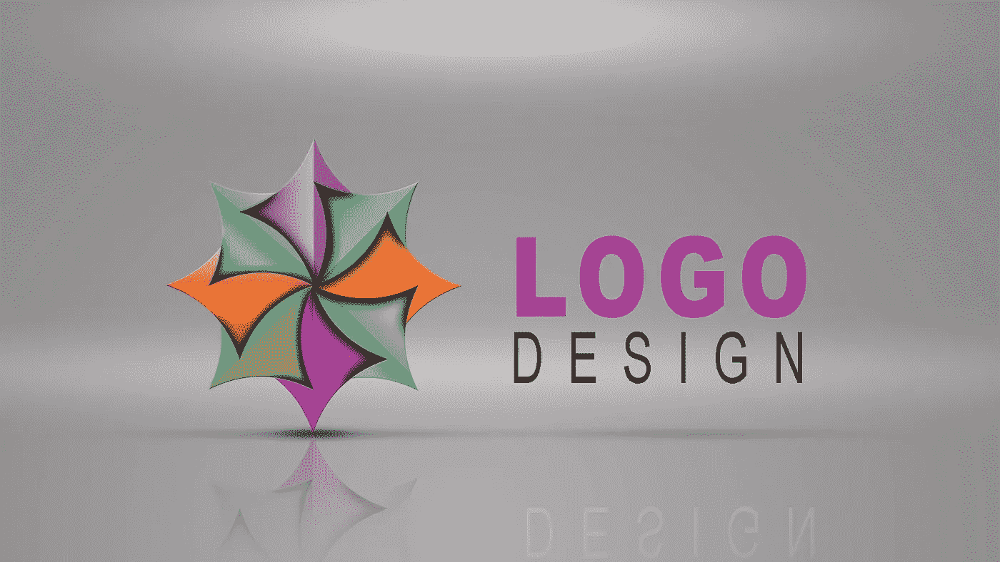
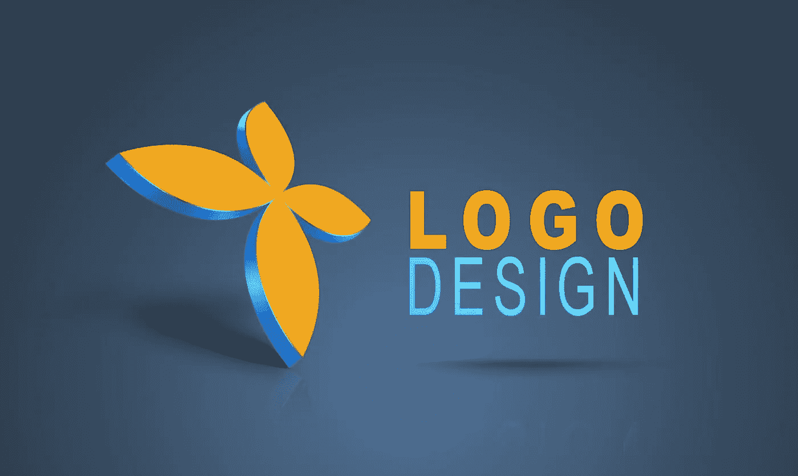

# 10 个最适合初学者的标志设计教程——在线学习标志设计

> 原文：<https://medium.com/quick-code/best-online-tutorials-to-learn-logo-design-ae3ad84ec111?source=collection_archive---------0----------------------->

## 学习如何设计一个标志与 2021 年最佳标志设计初学者教程

创造一个令人惊叹的标志是一个好标志设计师的标志。要成为优秀的标志设计师，你必须从最好的资源中学习。为了帮助你，我们在网上收集了最好的标志设计教程。开始学习标志设计与这些最好的在线标志设计课程，创造惊人的组合。我们还有一系列免费的[标志设计课程](https://coursesity.com/free-tutorials-learn/logo-design)，可以帮助你开始标志设计学习。

## 1.[Adobe Illustrator 中的标志设计——面向初学者&超越](https://coursesity.com/r/site/logo-design-in-adobe-illustrator-for-beginners-beyond)

在本课程中，您将:

*   深入了解色彩心理学，影响观众。
*   构建一个令人敬畏的情绪板，以进一步发展和完善标志的想法。
*   学习如何像专业人士一样开发标志设计草图。
*   在草图阶段发现最好的材料。
*   发现如何开发一个具有深刻和丰富意义的标志。
*   在 Illustrator 中准备草图，以便进行最佳描摹。
*   发现适合屏幕和印刷的颜色模式。
*   掌握 Illustrator 中的每个主要工具来编织杰作。
*   提高 Illustrator 及其功能的能力，以说明几乎任何事情。
*   掌握万能笔工具，开发惊人的符号设计。
*   专业的内核和准备类型的终极美学。
*   专业地与符号结合。
*   放置标语，这样它们在公司名称的映衬下看起来很棒。
*   学习如何在脑海中设计视错觉。
*   了解如何专业地给标志上色，以及如何充分利用少数几种颜色。
*   了解如何通过几次鼠标点击来应用简单而有效的效果。
*   了解如何组织徽标设计文件。
*   学会专业地向客户展示你的标志设计作品。
*   学习如何处理标志设计的反馈和修改以及完成。
*   获取您可以用于自己业务的电子邮件模板。
*   了解如何为你的标志设计定价，让你的技能获得最大收益。
*   了解不同的标志设计格式及其优点。

在这个课程中，从开始到结束的整个专业标志设计过程涵盖了从草图，字体，字符放置，符号开发，色彩应用等等。您还将了解内部提示和技巧，以及在独家展示中对标志设计类型的全面介绍。

你只需要免费下载 Adobe Illustrator、一支铅笔和一张纸就可以开始了。从这里开始，你将踏上设计令人惊叹的标志之旅。

# 2.[设计你的第一个标志](https://linkedin-learning.pxf.io/c/1137078/646189/8005?u=https%3A%2F%2Fwww.linkedin.com%2Flearning%2Fdesign-your-first-logo&subId1=quickcode)

标志是你品牌的视觉表现，是你在众多竞争者中脱颖而出的标志。

在本课程中，您将了解:

*   你需要从零开始建立一个强大的，令人回味的标志。

本课程将教你从零开始为你自己、你的小企业、你的公司或你的活动建立一个强有力的、引人入胜的标志所需的技能。

你会发现如何产生想法；选择正确的字体、形状和颜色；并为您的目的地选择文件格式，无论是名片、网站还是社交媒体档案。

# 3.[徽标设计变得简单:在 PowerPoint 中创建自己的徽标](https://click.linksynergy.com/deeplink?id=Fh5UMknfYAU&mid=39197&u1=quickcode&murl=https%3A%2F%2Fwww.udemy.com%2Fcourse%2Flogodesignmadeeasy%2F)

这个初学者课程充满了方便的提示和技巧，所以你可以在几分钟内开始创建自己的标志。

在本课程中，您将学习如何进行 oto:

*   在 PowerPoint 中创建自己的专业徽标。
*   使用这些技巧在 PowerPoint 中进行任何其他设计

在这门初学者课程中，你将设计几个徽标，展示 PowerPoint 提供的所有令人惊叹的功能。

课程结束时，你将学会所有必要的基础和技术，所以你可以在几分钟内开始创建自己的标志和设计。

# 4.[标志设计大师班:学标志设计+插画](https://click.linksynergy.com/deeplink?id=Fh5UMknfYAU&mid=39197&u1=quickcode&murl=https%3A%2F%2Fwww.udemy.com%2Fbecome-a-professional-logo-designer%2F)

您将学习如何:

*   使用自由写作、思维导图和词汇联想对徽标设计进行头脑风暴
*   使用钢笔/铅笔和纸绘制标志设计草图
*   应用标志设计原则
*   制作高质量的标志设计
*   撰写标志设计创意简报
*   实现一个标志设计客户想要的标志设计
*   通过创建一个组合找到标志设计的工作
*   在标志设计中运用有效的色彩

使用 Adobe Illustrator 设计、创建和导出各种格式的优质徽标。在这门课程中，你将学习如何成为一名专业的标志设计师。通过查看公司标志和学生标志来了解标志设计原则，然后将这些原则应用到自己的标志设计工作中。你将获得对标志设计和标志设计行业有价值的见解。本课程指导你在与客户会面后进行头脑风暴、绘制草图和设计徽标。您还将了解标志设计创意简报和合同，以及创建标志设计组合的重要性。
您将学习各种插画技术来创作高质量、漂亮的标志。

掌握 logo 设计今天就开始建立你的投资组合和客户名单。为你的品牌或他人设计你自己的标志。应用相关的颜色、字体和设计原则来创建一个令人惊叹的独特的标志设计组合。

# 5.[成功自由职业标志设计生涯的完整指南](https://click.linksynergy.com/deeplink?id=Fh5UMknfYAU&mid=39197&u1=quickcode&murl=https%3A%2F%2Fwww.udemy.com%2Fbe-a-successful-logo-designer%2F)

通过本课程，您可以:

*   开始标志设计生涯
*   了解如何以简单的方式使用 Adobe Illustrator
*   了解如何设计专业标志

本课程旨在教你关于标志设计以及如何从简单的设计中赚钱。在这门课程中，你不仅会学到如何设计标识，还会学到如何成为一名自由设计师。通过学习新技能，为自己进入标志设计的新职业做好准备。
您将学习如何:

*   简单使用 Adobe Illustrator。
*   设计任何类型的标志
*   从头开始设计好的标志
*   寻找自由职业者标志设计项目

你将在这门课上学到的技能非常有价值，将帮助你成长为一名设计师。一个会持续一生的天赋。设计天赋不是天生的。每个人都可以学习如何设计。

本课程将从标志设计的基础开始指导你。你不需要任何设计背景，因为它会告诉你正确和适当的方式来设计一个很酷的标志。

Adobe Illustrator 中的练习非常简单。这些是为绝对的初学者设计的。所有你需要的是一个程序的基本知识，所以你可以在未来设计更复杂的标志和插图。

10 Best Logo Design Tutorials

# 6.[Adobe Illustrator 中的标志设计—中级](https://click.linksynergy.com/deeplink?id=Fh5UMknfYAU&mid=39197&u1=quickcode&murl=https%3A%2F%2Fwww.udemy.com%2Flogodesignintermediate%2F)

在本课程中，您将:

*   开发更先进的标志设计
*   开发一个具有专业审美和平衡的标志
*   了解专业的内核技术
*   如何分隔和测量标志设计元素
*   如何专业地看待 logo 类型
*   获得水平标尺使用和项目符号点的知识

在这第二个系列中，它将涵盖:关键标志原则，字体选择策略，精确和专业的字距调整，测量，间距和平衡，隐藏意义的应用和所有有价值的负空间标志-这将业余爱好者从专业人士中分离出来！
你还将深入研究全面的案例研究，在这些案例研究中，你可以从头到尾地研究项目，从客户调查问卷到完成的标志，包括情绪板、思维导图、全面的草图绘制、精确的草图绘制，直到 Illustrator 中的数字化。

# 7.[精通标志设计——20 个项目循序渐进](https://click.linksynergy.com/deeplink?id=Fh5UMknfYAU&mid=39197&u1=quickcode&murl=https%3A%2F%2Fwww.udemy.com%2Fmastering-logo-designing-20-projects-step-by-step%2F)

在本课程中，您将学习:

*   如何创建优质标志
*   如何掌握素描艺术
*   如何创建并展示作品集
*   使用 Adobe Photoshop 创建出色的设计

如果你正在寻找学习新技能或成为专业标志设计师赚取被动收入，或者你想开始新的爱好，可以为你带来收入！掌握标志设计课程是给你的。
在本课程中，您将学习:

*   如何创建任何一种标志设计从基础到高级，在一步一步的方法。
*   标志设计技巧
*   快速学习 Adobe Photoshop 的技巧，以便像专业人士一样直接进行设计和工作。

草图是标志的关键，当然这个软件会帮助你把草图变成完美的设计。20 个项目足以让你开始成为一名专业的标志设计师，你需要做的只是按照说明和实践这些标志设计。

您还将学习品牌标识包装技术，包括:
什么是品牌、身份和标志如何创建标志、品牌身份集、指南、如何包装最终交付物、有哪些云解决方案可用于与客户分享内容和维护变化。
运用这些技能，创建自己的作品集，并开始在不同的市场上销售你的创意作品。

## 8.[Adobe Illustrator 中的标志设计大师](https://click.linksynergy.com/deeplink?id=Fh5UMknfYAU&mid=39197&u1=quickcode&murl=https%3A%2F%2Fwww.udemy.com%2Fcourse%2Flogo-design-mastery-in-adobe-illustrator%2F)

学习标志设计理论，创意过程，如何与客户合作&掌握 Adobe Illustrator 工具。

在本课程中，您将学习:

*   不同的标志设计类别和风格
*   如何在标志设计中运用黄金比例，理解黄金比例理论
*   如何为你的客户或你的投资组合展示你的商标
*   寻找新标志设计客户的几种方法
*   在开始一个标志设计过程之前应该问什么问题
*   标志设计中的充分创意和头脑风暴过程
*   如何在客户批准您的徽标后导出和发送您需要的大量文件
*   如何使用颜色和选择你的调色板
*   正确的字体配对以及如何处理排版

最初，本课程将回顾强势标志设计的特征，并通过真实世界的公司带你了解这些特征。

接下来，您将回顾 Illustrator 中所有最常用的工具，包括宽度、形状生成器、偏移路径、渐变工具以及使用图层蒙版等。

此外，学习如何快速将你的想法写在纸上，然后将这些粗略的想法转化为我们可以向客户展示的真正可行的设计。最后，本课程将介绍投资组合构建的基础知识，以及寻找客户和获得客户推荐的几个地方和步骤，这样你就可以开始构建自己的设计业务了。

# 9.[标志设计:技法](https://linkedin-learning.pxf.io/c/1137078/646189/8005?u=https%3A%2F%2Fwww.linkedin.com%2Flearning%2Flogo-design-techniques-3&subId1=quickcode)

你将学习如何创造自己的设计，重要的是能够识别最成功的例子背后的组件和设计技术，从耐克的 swoosh 到可口可乐的丝带。

在本课程中，您将学习如何:

*   一个成功的标志取决于良好的字体选择和简单的形状或简单形状的组合。
*   使用相同的构造技术在 Adobe Illustrator 中创建相似的徽标。

你将了解成功的标志如何依赖于良好的字体选择和简单的形状或简单形状的组合。

它展示了流行徽标的示例，然后演示了如何使用相同的构造技术在 Adobe Illustrator 中创建类似的徽标。

该课程将理论与强调简单性和可读性的具体技术相结合:这些原则是世界上最好的标志设计的基础。

# 10.[印刷标志:标志设计的印刷和字体](https://click.linksynergy.com/deeplink?id=Fh5UMknfYAU&mid=39197&u1=quickcode&murl=https%3A%2F%2Fwww.udemy.com%2Ftypographic-logos-typography-and-lettering-for-logo-design%2F)

了解创建您自己的基于自定义类型的徽标的整个过程。通过本课程:

*   你将能够想出一个主意，创建缩略图草图，并完善你的设计成一个完成的基于类型的标志
*   您将能够下载视频中创建的工作文件，以便近距离观看。

学习和改进基于字体的标志设计是你设计生涯中最重要的投资之一。在本课程中，我们将回顾创建基于类型的徽标的整个过程，从想法到实现。

在本课程中，您将:

*   了解创建徽标所需的数字和模拟工具
*   使用传统和非传统的工具来创建你的标志
*   改进设计的特殊技术
*   如何构建字体和整体结构
*   草图设计缩略图
*   创建一个干净的矢量设计
*   实施色彩理论、阴影和添加 3D 效果
*   如何在 Photoshop 和 Illustrator 中添加纹理

作为奖励，您还将获得:

*   在 Illustrator 26 Photoshop 中使用的 26 种位图纹理
*   画笔为您自己的设计添加纹理
*   矢量半色调渐变的集合
*   矢量格式的成品“印刷标志”设计。

> 感谢您阅读本文。我们策划了更多主题的顶级教程，您可能想看看:

 [## 10+最佳初学 Photoshop 教程——在线学习 Photoshop

### 2021 年最佳 Photoshop 初学者教程，学习如何使用 Photoshop CC

medium.com](/quick-design/best-online-tutorials-to-learn-photoshop-68c0de7e53c7)  [## 面向初学者的 10+最佳平面设计教程——在线学习平面设计

### 2021 年，学习平面设计的基础知识及其与最佳初学者平面设计教程的合作

medium.com](/quick-code/top-tutorials-to-learn-graphic-design-fb0f732d892f)  [## 10+最佳 InDesign 初学者教程—在线学习 InDesign

### 了解如何使用 Adobe InDesign Tool 和 2021 年面向初学者的最佳 InDesign 教程

medium.com](/quick-design/top-tutorials-to-learn-indesign-fc0b2f516fd2) 

> 你喜欢邮报吗？
> 
> 给我鼓掌👏！你可以给 clap 50 次，让更多的人发现和知道这个帖子，当然，不要忘记分享。
> 
> 让我们看看掌声！

披露:我们与本文中提到的一些资源有关联。如果你通过本页的链接购买课程，我们可能会得到一小笔佣金。谢谢你。