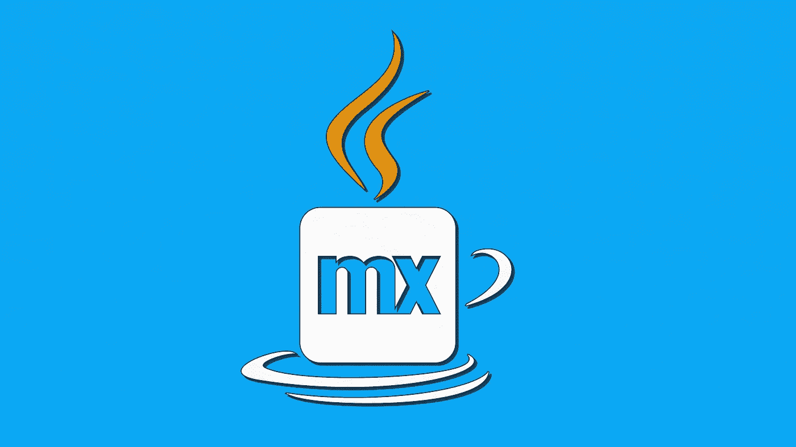
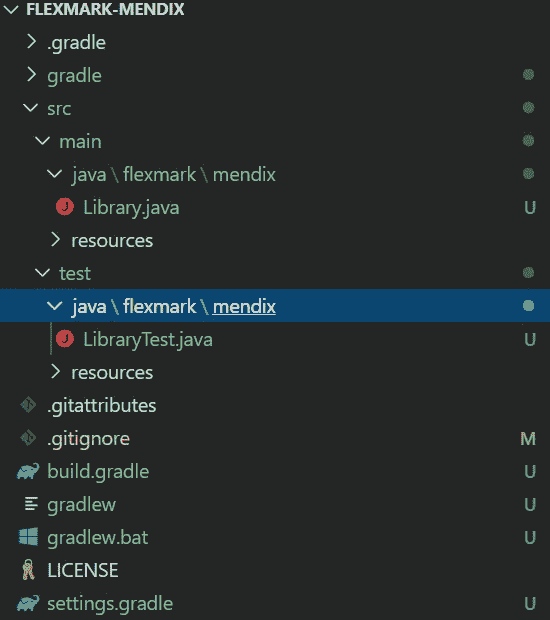
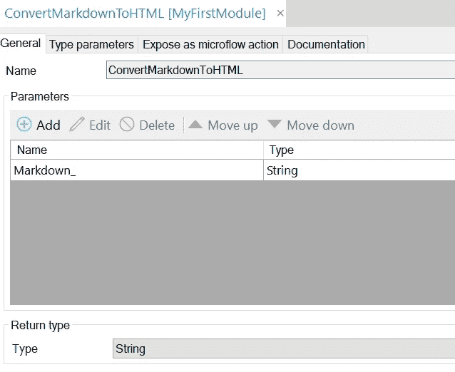

# 我向 Mendix 添加 java 依赖项的最佳实践

> 原文：<https://medium.com/mendix/best-practice-for-adding-a-java-dependency-to-mendix-c10069fa1a10?source=collection_archive---------1----------------------->



# 我和 Mendix 的旅程始于四年多前。由于我的 Mendix 项目的性质，我不得不多次使用第三方 java 库，基于两年前的经验，我写了一篇关于管理 Mendix 模块的 java 依赖关系的博文。从那以后，我对这个过程有了更多的了解，想和大家分享一下。

这篇博文的目的是记录我在向 Mendix 项目添加 java 库方面的经验和最佳实践，并看看如何在实际例子中应用它们。

激动吗？我们走吧！

# 最优方法

> *在我看来，向 Mendix 添加第三方依赖的最佳方式是首先建立一个单独的纯 java 项目(使用 gradle 或 maven ),该项目包含依赖并提供一个易于使用的接口。然后使用一个影子插件生成一个所谓的* fat *jar，其中包含所有的依赖项，并将其导入到您的 Mendix 项目中。*

这在一定程度上与我之前的博客文章中的信息相同。然而，正如您将从下面的列表中看到的，通过稍微做些不同的事情，使用这种方法的好处可以大大扩展。以下是使用上述过程的优势列表:

1.  **自动处理传递依赖。**几乎每个 java 库都有它依赖的其他 java 库。一个一个地下载它们很麻烦，容易出错，而且不可维护。Gradle 和 maven 都支持开箱即用的依赖性管理。他们将为您计划使用的库找到并下载正确的依赖项。此外，因为所有的依赖项都在一个 jar 中，所以任何不再需要的依赖项都会在构建时自动删除，从而使更新过程变得容易，这与许多 Mendix 模块不同，在这些模块中，开发人员需要在升级时手动删除未使用的或旧的依赖项。
2.  **避免传递依赖的版本冲突。**不幸的是，基于 [OSGI](https://en.wikipedia.org/wiki/OSGi) 的 Mendix java 类加载器不能处理一个依赖的多个版本。如果您尝试使用的库需要加载依赖项的特定版本，而 Mendix 运行时或另一个 Mendix 模块正在使用同一依赖项的不同版本，则这可能是一个阻塞问题。由于 shadow 插件，这种依赖关系可以被隐藏，从而使类加载器能够同时加载它们。
3.  孤立地了解 java 库。使用一个你不熟悉的第三方库本身就够难的了。试图在大型 Mendix 项目的背景下做到这一点要困难一千倍。如果有些东西不工作，很难说错误是来自库、java 代码、Mendix 和 java 之间的集成还是 Mendix 应用程序本身。另外，当您每次都必须启动 Mendix 运行时，测试和调试会更加复杂和耗时。
4.  **编码到你想要的界面。**很多时候 java 库会有复杂的接口要用。这毕竟是 java，所以为了做像函数调用这样简单的事情，你可能需要检查通常的嫌疑人列表:工厂、构建者和管理者，直到你有了一个可以实际调用该方法的对象。最好将这种复杂性隐藏起来，构建一个简单的适配器/facade，它具有您想要和需要的接口。一个额外的好处是，您可以用第三方库替换另一个库，而不必接触 Mendix 应用程序。
5.  **轻松设置单元测试，作为回归套件。这一点非常重要，我想在这个列表中重复十遍。当一个复杂的应用程序出现问题时，很难确定故障的确切位置。因此，通过一些测试，您可以非常容易地检查问题是出在第三方库还是您的 Mendix 逻辑中的其他地方。进行测试的另一个很好的理由是减少与修改代码或将库升级到新版本相关的风险。理论上，你可以在 Mendix 中实现这一点，但是与 gradle 或 maven 相比，这要复杂得多，耗费大量资源和时间，并且更难集成到你的构建过程中。**
6.  **单独版本控制。这是一个小问题，但是我更喜欢将依赖关系保存在单独的存储库中。另外，您可以使用不同的版本控制(git)系统，因为您不受 Mendix (svn)的限制。git 已经为 gradle 和 maven 忽略列表提供了很好的模板。**

# 逐步指南

为了使上面的最佳实践更有基础，让我们回顾一下添加具体的第三方库的步骤。一个 markdown 解析器[https://github.com/vsch/flexmark-java](https://github.com/vsch/flexmark-java)怎么样？Mendix Market Place 中关于 markdown 转换的一个[模块](https://marketplace.mendix.com/link/component/1289)现在已经使用了 7 年，并且使用了不再维护的废弃库，因此这将是一个不错的升级。

目标是在 Mendix 项目中使用这个库将一些 markdown 文本转换成 HTML。最终结果应该是这样的:[https://markdowncoverter-sandbox . MX apps . io](https://markdownconverter-sandbox.mxapps.io)

# 先决条件

🟣:我将在本指南中使用格雷尔。Maven 也可以做同样的事情。

**Gradle v5.5** :按照官方教程[https://gradle.org/install/](https://gradle.org/install/)安装即可。较新或较旧的版本也应该工作，但这是本教程中使用的版本。

它是一个命令行工具，负责依赖性管理、隐藏和构建。

# 步骤 1:初始化项目

在空目录中创建新的 git 项目。然后打开命令行窗口，键入:

`gradle init`

这将启动设置 gradle 项目的过程。按照说明仔细选择，我推荐以下选项，但您可能有其他偏好:

*   项目类型:3:库(不需要主方法)
*   语言:3: java
*   构建脚本:1: groovy
*   测试框架:1: JUnit4

一旦`init`命令完成，它将生成一个类似于以下内容的项目文件结构:



我们将使用的一些重要位置是:

*   src \ main —这是 java 代码的位置
*   src \ test —这是测试代码所在的地方
*   build.gradle —定义依赖项、插件等

# 步骤 2:通过 gradle 添加依赖项

做到这一点最简单的方法是前往 Maven 存储库并搜索您想要添加的依赖项。比如这是 flexmark 依赖[https://mvn repository . com/artifact/com . Vlad sch . flex mark/flex mark-all/0 . 62 . 2](https://mvnrepository.com/artifact/com.vladsch.flexmark/flexmark-all/0.62.2)。在这个页面上有一个代码片段，其中包含可以用来将这个依赖项添加到 gradle 项目中的命令。

`compile group: 'com.vladsch.flexmark', name: 'flexmark-all', version: '0.62.2'`

复制这段代码，并将其添加到`dependencies`下的`build.gradle`文件中。您可以删除 gradle 自动添加的其他编译依赖项，它们只是一个示例，但是请确保保留测试依赖项，否则测试将无法工作。

# 步骤 3:编写并实现第三方库的接口

最后，是时候写一些代码了。您可以使用任何编辑器或 IDE，但我发现 IntelliJ 与 gradle 一起工作最为可靠。这一点很重要，因为如果不解析类路径来找到梯度依赖，您的代码将无法编译，并将抛出许多错误(并且没有自动完成)。

下面是一个将 markdown 转换成 HTML 的简单接口和一个实现它的类(我主要是从[这里](https://github.com/vsch/flexmark-java/blob/master/flexmark-java-samples/src/com/vladsch/flexmark/java/samples/BasicSample.java)复制过来的)。

```
package flexmark.mendix;import com.vladsch.flexmark.html.HtmlRenderer;
import com.vladsch.flexmark.parser.Parser;
import com.vladsch.flexmark.util.ast.Node;
import com.vladsch.flexmark.util.data.MutableDataSet;public interface MarkdownToHTMLConverter { // main method
    String convert(String markdown); // factory method
    static MarkdownToHTMLConverter create() {
        return new FlexmarkConverter();
    }
}class FlexmarkConverter implements MarkdownToHTMLConverter { @Override
    public String convert(String markdown) {
        MutableDataSet options = new MutableDataSet();
        Parser parser = Parser.builder(options).build();
        HtmlRenderer renderer = HtmlRenderer.builder(options).build();
        Node document = parser.parse(markdown);
        String html = renderer.render(document);
        return html;
    }
}
```

注意，类和接口通常不应该在同一个文件中，我这样做只是为了简洁。

# 步骤 4:编写单元测试

因为这是一个库项目，所以它没有主类。检查某个东西是否工作的最简单的方法是编写一个测试。这实际上是完美的，因为它迫使我们编写测试，我们可以在将来任何时候进行更改时使用这些测试来验证一切都正常工作。

出于本文的目的，我将添加一个简单的测试。对于生产使用，确保您的测试涵盖了您计划使用的库的所有方面，并且有真实的输入。但是不要走极端，我们的目标不是测试库本身，因为它可能已经被很好地测试过了。

```
package flexmark.mendix;import org.junit.Assert;
import org.junit.Test;public class MarkdownToHTMLConverterTest { @Test public void basicTest() {
        MarkdownToHTMLConverter converter = MarkdownToHTMLConverter.createConverter();
        Assert.assertEquals("<p>This is <em>Sparta</em></p>\\n", converter.convert("This is *Sparta*"));
    }}
```

点击绿色小*运行*按钮，即可从 IntelliJ 启动测试。如果测试通过，下一步就是打包(构建)这个库，这样它就可以被导入到我们的 Mendix 项目中。

# 第五步:建造一个胖罐子

这个特性不是 gradle 自带的，所以首先我们需要安装一个 gradle 插件。

将以下代码片段添加到`plugins`下的`build.gradle`文件的顶部(java 上方)

`id 'com.github.johnrengelman.shadow' version '5.1.0'`

这将插件添加到项目中，并让我们使用 gradle 的新命令。在命令行窗口中键入:

`gradle shadowJar`

这将生成一个 jar 文件，包含`build\\libs\\`下的所有依赖项。每当您对代码或依赖项进行更改时，都需要重复这个过程。

# 第六步:跟踪

[隐藏](https://stackoverflow.com/questions/49810578/what-is-a-shaded-jar-and-what-is-the-difference-similarities-between-uber-jar-a#:~:text=If%20your%20uber%20JAR%20is,packages%20within%20the%20uber%20JAR.))是在字节代码级别重命名 java 包的过程，以允许在一个 java 应用程序中使用两个同名的包。这样做通常是为了避免包的两个不同版本之间的版本冲突。在 gradle 中，可以通过在`build.gradle`文件的底部添加以下代码片段来隐藏包。

`shadowJar { relocate 'org.apache', 'flexmark.mendix.org.apache' }`

这将把所有以`org.apache`开始的 java 包重命名为`flexmark.mendix.org.apache`。要确认重命名是否有效，请使用类似 7-zip 的 zip 检查器检查 jar 文件内容。

为了将来的证明，最好隐藏所有的依赖项，甚至那些今天可能不会引起问题的依赖项。通过添加多个`relocate`行，可以隐藏多个依赖项。

🔴不幸的是，隐藏不能处理依赖于反射的库，所以如果你遇到了类加载问题，可能需要取消隐藏那些有问题的库。

# 步骤 7:使用 Mendix 中的库

将 fat jar 从`build\\libs\\`复制到您的 Mendix 项目目录的`userlib`文件夹中。

然后创建一个 Mendix Java 动作，以便可以从微流中调用 Java 库。参数和返回值的数量和类型将根据使用情况而变化。设计好的 java 动作可能需要一篇单独的博客文章。这里我只提一招:

以下划线结尾命名参数。这防止了一个已知的 Mendix 问题，即如果参数名是一个保留字，它将在 java 中以后缀形式出现。下划线阻止了这种情况的发生，并且在微流中调用 java 操作时实际上是不可见的。



最后，从 java 操作中调用在步骤 3 中编码的接口。因为我们使用一个外观来隐藏第三方库的复杂性，所以这部分通常只有一两行。

```
import flexmark.mendix.MarkdownToHTMLConverter;// LINES OMMITED FOR BREVITY@java.lang.Override
	public java.lang.String executeAction() throws Exception
	{
		// BEGIN USER CODE
		MarkdownToHTMLConverter converter = MarkdownToHTMLConverter.create();
		return converter.convert(Markdown_);
		// END USER CODE
	}
```

分步指南到此结束。你可以在 https://github.com/gajduk/flexmark-mendix[找到完整的源代码。](https://github.com/gajduk/flexmark-mendix)

# 包裹

向 Mendix 添加 java 库可能会非常棘手。简单的往 userlib 文件夹里扔东西肯定会惹上麻烦。多年来，我遇到了许多问题，这些问题促使我开发了上面描述的过程。

虽然我的过程还远非完美，所以如果你有任何改进的建议，请通过 Mendix slack 或电子邮件联系我，这将是一个很好的学习机会。

您添加第三方依赖项的流程是什么？

我希望你喜欢这篇博文，并且它能帮助你更容易地使用 java 依赖项。

*最初发表于* [*安德烈·加杜克的博客*](https://www.notion.so/gajduk/Best-practice-for-adding-a-java-dependency-to-Mendix-e2ee2b5776c145f99f8e9fc77f2b62b6) *。*


*来自发布者-*

如果你喜欢这篇文章，你可以在我们的 [*媒体页面*](https://medium.com/mendix) *或我们自己的* [*社区博客网站*](https://developers.mendix.com/community-blog/) *找到更多类似的内容。*

*希望入门的创客可以注册一个* [*免费账号*](https://developers.mendix.com/meetups/#meetupsNearYou) *，通过我们的* [*学苑*](https://academy.mendix.com/link/home) *获得即时学习。*

有兴趣加入我们的社区吗？你可以加入我们的 [*slack 社区频道*](https://join.slack.com/t/mendixcommunity/shared_invite/zt-hwhwkcxu-~59ywyjqHlUHXmrw5heqpQ) *或者那些想更多参与的人，看看加入我们的* [*聚会*](https://developers.mendix.com/meetups/#meetupsNearYou) *。*