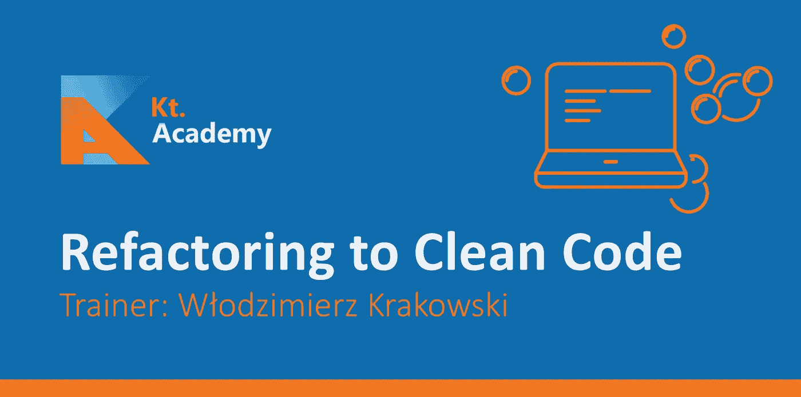
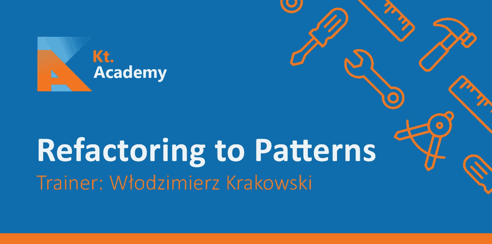
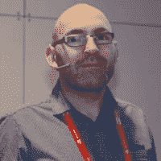

# 最佳实践课程

> 原文：<https://blog.kotlin-academy.com/best-practices-courses-529a6cf532eb?source=collection_archive---------5----------------------->

卡帕头。学院不仅仅是教科特林。我们在教授最佳实践方面也很棒。你可能听说过我们的[高效科特林课程](http://kt.academy/workshop/effectiveKotlin)，但最近沃德克·克拉科夫斯基加入了我们的培训师团队和[他的工作室](http://kt.academy/workshop?trainer=wlodek#workshops-offer):

woodek 是处理和重构代码的专家。他也是一名优秀的培训师和著名的演讲者。

如果您对我们提供的服务感兴趣，请填写表格或通过 contact@kt.academy 直接联系我们

祝编码愉快，

马尔钦·莫斯卡扎