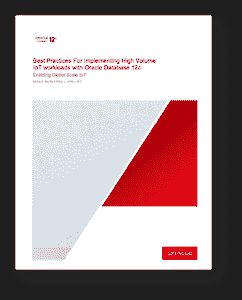

# 使用 Oracle 数据库处理物联网工作负载的最佳实践

> 原文：<https://medium.com/oracledevs/best-practices-for-iot-workloads-with-oracle-database-315aeceb0d7c?source=collection_archive---------0----------------------->

在过去的几年里，智能设备的使用量迅速增长。从手机和平板电脑到智能仪表和健身设备，一切都可以连接到互联网并共享数据。你只需跟随 [@MarkRittman](https://twitter.com/markrittman) 和他远程烧开水壶的经历，就能看到你家里有多少设备可以连接到互联网。

随着所有这些智能设备的出现，数据库接收和处理数据的频率和数量都在大幅增加。这种场景通常被称为物联网或物联网。

一些人认为物联网工作负载需要 NoSQL 数据库，因为所需的接收速率超过了传统关系数据库的能力。这根本不是真的。

但是，如果我们看一些更多的行业示例，您会很快意识到这些类型的工作负载实际上已经存在很长时间了。

电信业每秒处理数千万条呼叫详细记录(cdr)或连接的制造设备，生产线上的每台机器都发送关于当前正在工作的组件的信息。如果我们看看这些领域中的行业领先公司是如何管理其工作负载的，我们会发现他们都在使用 Oracle 数据库。

考虑到这一点，我开始与 Cecilia Gervasio Grant、Weifeng Shi 和我的老板 [Juan Loaiza](https://www.oracle.com/corporate/executives/juan-loaiza.html) 一起工作，以定义一套[最佳实践或管理技术](http://www.oracle.com/technetwork/database/in-memory/overview/twp-bp-for-iot-with-12c-042017-3679918.html)来促进物联网工作负载。我们利用了多年来与领先的电信、金融机构、零售商等打交道的经验。提出切实可行的建议，并分享真实的代码示例和性能数据。

在整篇文章中，我们使用了一个简单的类比，即某人去杂货店购物，来帮助解释推荐的每种调优技术背后的推理。例如，如果你知道你要去买很多东西，你会马上买一辆大车，而不是选择一个小篮子。数据库也是如此。您希望分配一个具有较大初始区段的大文件表空间，以便能够高效地接收和存储大量数据。

您也永远不会一次选择一个项目，然后在选择列表中的下一个项目之前付款，这类似于在 Oracle 数据库中插入一行，然后提交。取而代之的是，您将遍历商店，收集您的列表上的所有商品，然后去结帐一次，这就是为什么我们建议在数据库中使用数组 insert，然后是 commit。

我们希望您会发现本文中概述的建议非常有用，并希望了解您是否在您的物联网或高容量接收工作负载中使用了这些或其他技术。