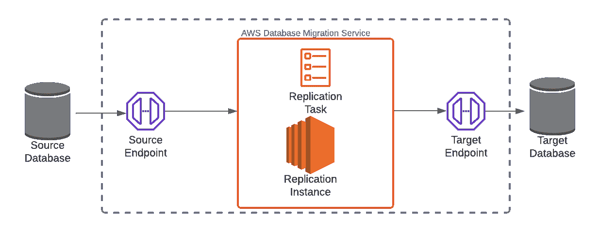
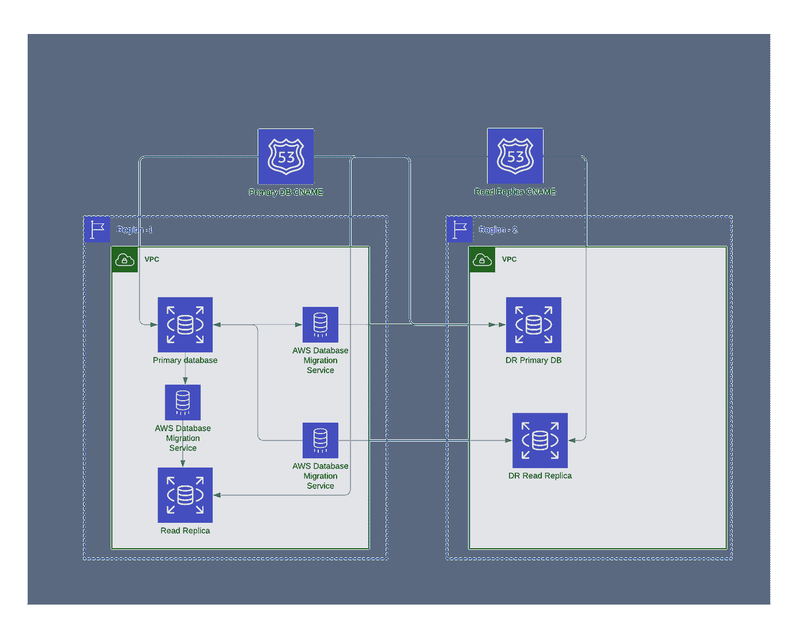

# 将 AWS DMS 用于 SQL Server 复制的最佳实践

> 原文：<https://medium.com/capital-one-tech/best-practices-for-using-aws-dms-for-sql-server-replication-570d72a45832?source=collection_archive---------3----------------------->

## 如何设置 Amazon RDS SQL server 持续复制

几年来，Capital One 一直在经历云转型，这一旅程[在去年我们的数据中心退出](https://aws.amazon.com/solutions/case-studies/capital-one/)时达到高潮。2018 年，我在 Capital One 的团队开始了我们自己的云之旅，将我们的应用程序分解为基于云原生解决方案的多个服务。当时，我们的产品之旅已经到了一个阶段，将我们的数据库从运行在 EC2 实例上迁移到 Amazon RDS 是有意义的。

对于高可用性和灾难恢复，我们需要一个读取副本和跨区域复制，但 Amazon RDS 不支持 MS SQL Server 2012 中的相同区域读取副本和跨区域复制，我们当时使用的是这两种复制。缺少现成的复制解决方案增加了设计的复杂性。为了找到解决方案，我们集思广益，选择了 [AWS 数据库迁移服务](https://aws.amazon.com/dms/)(亚马逊 DMS)。

***为什么现在讲这个故事？*** 并不是每个人都在同一个地方与自己云游。许多公司仍在从较老的技术和遗留平台迁移，包括这种服务器类型。我们在三年前解决了这个问题，但认为在迁移曲线的早期阶段与公司分享这个问题可能会有所帮助。在本文中，我将讨论我和我的团队为 SQL server 跨区域复制开发的 Amazon 数据库迁移服务的一些最佳实践，这些实践可能对您自己的组织有用。

# Amazon 数据库迁移服务入门的基本概念

[AWS 数据库迁移服务](https://aws.amazon.com/dms/)是一种 web 服务，旨在将数据从一个数据存储迁移到另一个数据存储。Amazon DMS 可用于在同构(例如 Oracle 到 Oracle)和异构(例如 Oracle 到 SQL Server)端点之间移动数据。Amazon DMS 也支持多种数据源，并不局限于数据库。基本上，DMS 由以下组件组成:

1.  复制实例
2.  端点
3.  工作

让我们一个一个地检查这些组件。

## AWS DMS 复制实例

复制实例是一个托管的 Amazon 弹性计算云，复制任务在其上运行。多个复制任务可以在单个实例上运行。实例类型的选择基于迁移中的表数量以及计划在单个实例上运行的并发复制任务的数量。

## AWS DMS 端点

如上图所示，我们有一个源和目标[端点](https://docs.aws.amazon.com/dms/latest/userguide/CHAP_Endpoints.html)。端点在数据存储和复制实例之间建立连接。连接信息通常包括端点类型、DB 引擎、服务器名称、加密和凭证等。

## 亚马逊 DMS 任务

[复制任务](https://docs.aws.amazon.com/dms/latest/userguide/CHAP_Tasks.html)设置定义了实际的迁移过程。迁移类型选项包括完全加载、完全加载+变更数据捕获和仅变更数据捕获。

# 针对 Amazon RDS SQL 服务器的持续复制解决方案

对于我们的 2018 年用例，我们创建了四个运行在 SQL Server 2012 上的 Amazon RDS 实例，平均分布在两个地区。Amazon DMS 复制任务设置为从一个区域的主实例复制到另一个区域的实例，以实现跨区域复制/读取复制。我们开始使用 DMS，一切都很好。

*从此以后，每个人都幸福地生活着，尽管也许不完全诚实。—*

# *结束了*

*不完全是。:)*

*除了童话，没有什么值得去实现的事情是如此容易。一旦我们的基础设施启动并运行，我们开始观察到同一区域中的实例被 100%复制(表和行)。然而，在跨区域实例中，我们观察到行数不匹配。我们的日志和事务数据库差了大约 100K 行。当我们试图解决这个延迟问题时，我们学到了一些东西。下面是我们在这个过程中学到的一些最佳实践，我想与大家分享一下。*

**

# *最佳实践# 1——测试你的飞行地点*

*构建一个测试环境来完善您的迁移策略。在决定最终方法之前，我们的测试环境对于模拟类似生产的负载、测试服务器配置和迁移策略非常有价值。高容量、大型数据库需要在生产部署前进行全面的性能和延迟测试。*

# *最佳实践#2 —正确使用您的服务器*

*选择合适的基础架构有助于避免迁移任务中的性能瓶颈。具有正确计算和内存选项的复制服务器至关重要。数据库/表的大小在决定单台复制服务器上运行的并行任务的数量方面起着关键作用。将大型数据库复制任务隔离到运行在多 AZ 配置上的服务器。*

# *最佳实践#3 —为迁移准备源和目标数据库*

*Amazon DMS 使用[变更数据捕获](https://docs.microsoft.com/en-us/sql/relational-databases/track-changes/about-change-data-capture-sql-server?view=sql-server-ver15)在 Microsoft SQL Server 中进行持续复制。在完全负载迁移期间，任务会对源数据库执行完全扫描。减少源数据库的负载可以提高性能。将源数据库设置为自动缩放，并设置一个大得多的最大大小限制，有助于避免数据库空间问题。删除在目标数据库上争用写空间的进程。在对目标数据库进行完全加载之前，关闭备份，更改数据捕获、触发器和外键约束。对于正在进行的复制，它们可以在以后打开。*

# *最佳实践#4 —监控迁移任务*

*主机、复制服务器和表的指标可用。[表统计数据](https://aws.amazon.com/premiumsupport/knowledge-center/table-statistics-aws-dms-task/)提供了关于装载的行数的信息。结合 Amazon CloudWatch 指标来验证源和目标之间的行的查询有助于完善迁移策略。*

# *最佳实践#5 —调整 LOB 模式设置*

*[LOB](https://docs.aws.amazon.com/dms/latest/userguide/CHAP_Tasks.LOBSupport.html) 代表大型双星。我们的数据库储存了大量的图像。管理 LOB 设置帮助我们提高了性能。受限 LOB 模式有用户指定的限制。完全 LOB 模式没有特定的限制，但可能会导致相当大的性能问题。一个合适的解决方案是选择结合了两者优点的内联 LOB。这方面的一个例子可以在这里看到。*

# *结论*

*如果您正在将 Microsoft SQL Server(早于 2016 年)迁移到 Amazon RDS，AWS 数据库迁移服务是一个值得考虑的跨节点复制解决方案。我希望这五个使用 AWS DMS for SQL Server 复制的最佳实践能够帮助您完成服务器迁移之旅！*