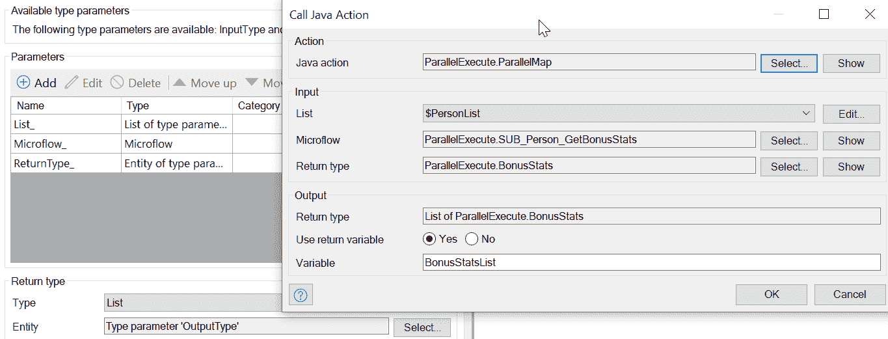

# 在 Mendix 中编写自定义操作的最佳实践

> 原文：<https://medium.com/mendix/best-practices-for-writing-custom-actions-in-mendix-87ae768d424?source=collection_archive---------3----------------------->

# 在我在 Mendix 工作的四年中，我编写了许多 Mendix 模块。这些模块中有许多包含 java(脚本)动作作为其接口的一部分。在某些情况下，这些动作是模块的主要接口点。这其中的原因应该是任何在 Mendix 中开发过的人都知道的。首先，动作支持[类型参数](https://docs.mendix.com/refguide/java-actions#2-2-1-entity-type)，允许用户为输入和输出参数分配类型。接下来，动作支持将微(纳)流作为参数传递，这是在 Mendix 中进行[回调](https://www.mansystems.com/blog/mendix-design-patterns-callback)的最安全方式之一。最后但并非最不重要的一点是，自定义动作可以作为本地活动添加，并带有自己的图标。

以下是我制作的公开模块的完整列表:

*   Templator —文档(PDF)生成【https://marketplace.mendix.com/link/component/114043 
*   网页推送通知[https://marketplace.mendix.com/link/component/114331](https://marketplace.mendix.com/link/component/114331)
*   打印布局[https://marketplace.mendix.com/link/component/114153](https://marketplace.mendix.com/link/component/114153)
*   完美的滚动条[https://marketplace.mendix.com/link/component/105048](https://marketplace.mendix.com/link/component/105048)
*   分页符[https://marketplace.mendix.com/link/component/114178](https://marketplace.mendix.com/link/component/114178)
*   本土休息[https://marketplace.mendix.com/link/component/112178](https://marketplace.mendix.com/link/component/112178)
*   并行执行[https://marketplace.mendix.com/link/component/116433](https://marketplace.mendix.com/link/component/116433)
*   https://marketplace.mendix.com/link/component/105038
*   动态页面标题[https://marketplace.mendix.com/link/component/115773](https://marketplace.mendix.com/link/component/115773)

由于动作是许多 app store 模块的主要使用方式，所以在设计好的动作上投入一些时间和思想是值得的。这里是我为任何正在编写 java(脚本)动作的人准备的十一种最佳实践，无论是在项目中使用还是作为可重用模块的一部分。

由于动作是许多 app store 模块的主要使用方式，所以在设计好的动作上投入一些时间和思想是值得的。这里有**11 个最佳实践**，我为任何正在**编写 java(脚本)动作**的人准备的，无论是在项目中使用还是作为可重用模块的一部分。

# 1.使用描述性的参数名称，并以下划线作为后缀

参数的名称应该是描述性的，而不是多余的。这是命名的一般建议，在这里也适用。所以要避免像对象、参数、数据这样的名字。请记住，动作参数不仅在 Mendix 中被调用时使用，在 java(脚本)代码中也作为变量名使用。当参数名是相应语言(如 Object)中的保留字时，这会引起一个小问题。为了解决这个问题，Mendix 会在代码中的变量名后面加上 Parameter1 等等。在较新的 Mendix 版本中，这一点已被重新处理，这实际上使问题变得更糟。现在，相同的操作代码可能在较旧的 Mendix 版本上运行良好，但在较新的 Mx 版本上无法编译，因为生成变量名的方式不同。

通过使用一个下划线后缀，我所知道的所有与保留字的冲突都可以被消除，并且实际上在调用动作时是不可见的，如下面的截图所示。完美！

# 2.添加新动作，而不是更改签名。

我们都经历过。即使是最周密的行动也需要改变。这些改变中的一些将不可避免地涉及改变[签名](https://en.wikipedia.org/wiki/Type_signature)，例如，因为添加了新的参数或者返回类型被改变。这是非常具有破坏性的，因为整个项目中所有相应的动作调用都需要更新。

旧的操作应该在内部调用新的操作，并为新的参数传递一个默认值，或者忽略一个返回值(如果添加了一个的话)。确保给这两个操作一个逻辑名称，也许旧的操作应该在某处包含单词 deprecated。接下来描述避免过多签名改变的补充实践。

# 3.将标志、枚举和整数设置捆绑到一个“选项”对象中。

很多时候，一个动作会有几个标志或不同的设置，可以调整，因此需要以某种方式公开。最好将所有这些捆绑成一个单独的对象参数，通常称为选项、设置或配置。

通过使用“选项”对象，可以同时解决多个问题:1)添加新设置不会改变签名；2)默认值可以在对象中定义，不污染常量空间；3)每个旗帜的文档都有一个清晰的位置，而不会淹没动作对话框；4)动作参数列表可以更短，使得调用动作更快更干净(记住每个参数都必须显式设置)。

并行执行应用商店模块中的“选项”对象示例。

# 4.总是使用 facade，而不是直接调用第三方库。

这是为所有使用 jar 文件或 javascript 模块形式的第三方依赖的人准备的。我写了一篇单独的[详细的博客文章](https://www.notion.so/Best-practice-for-adding-a-java-dependency-to-Mendix-e2ee2b5776c145f99f8e9fc77f2b62b6)，介绍了这方面的最佳实践。通过使用 facade，我们避免了硬耦合，并使得交换库没有太多麻烦成为可能。此外，最好使用特定于语言的依赖管理和构建工具，比如 java 的 maven 或 gradle，javascript 的 npm 或 webpack。这些工具提供了对可传递依赖关系的简单管理、对构建过程的测试集成以及对所需平台的打包。

# 5.指导用户使用构建器模式构建对象层次结构

在某些情况下，动作的参数不是一个简单的数字，也不是一个只有几个参数的对象。相反，需要一个完整的对象层次结构，并且它必须以动作所期望的特定方式相关联。这在设计时是不可能实现的，所以需要一种巧妙的方法来指导用户构建正确的层次结构和设置正确的关联。

对于中等规模的层次结构，也就是一到两个关联，我更喜欢使用[构建器模式](https://en.wikipedia.org/wiki/Builder_pattern)来帮助用户准备数据。构建器模式允许用简单的步骤构建复杂的层次结构，一次一步。此外，每个步骤都使用通常只能从其他步骤获得的类型进行约束。在一个理想的世界中，有可能完全[阻止一些构建器对象](https://forum.mendixcloud.com/link/ideas/2221)的手动实例化，从而迫使用户使用一个动作来创建它们。

我的“Web 推送通知”模块中使用的构建器模式示例。在步骤 1 中，使用 java 动作构造一个通知对象。然后，在步骤 2 中，创建一个 *NotificationAction* 对象，并将其与一个*通知*相关联，但不是直接这样做，而是使用一个 java 动作，它需要一个*通知*对象作为参数。这样就不会混淆步骤顺序，不会在步骤 1 之前调用步骤 2，也不会忘记设置关联。

# 6.尽可能使用最具体、最具约束性的类型。

这是另一个一般性建议，也适用于行动，并且与前面的最佳实践紧密相关。使用布尔值代替字符串“是”或“否”。在适当的地方使用枚举和日期来代替字符串。避免重载空值或其他特殊值来传递信息，而是使用特定的类型或枚举。例如，如果响应是一个错误消息或 null(顺便提一下，这是个糟糕的想法，参见 11 ),那么使用一个带有布尔值“HasError”和错误消息的对象来代替。

# 7.只对那些不能在 Mendix 中完成的事情使用代码。

如果一件事可以用门迪克斯做，那就用门迪克斯做。尤其是对于检索和/或改变对象。在 Mendix 中，从操作中间调用流来进行本地检索比构建 XPath 并用代码进行检索要容易和安全得多。

当更改对象属性时，请记住重命名属性不会自动重命名对相应代理上的 getter/setter 方法的现有调用。所以，再次强调，只有在别无选择的情况下，才能在 Mendix 中使用代码。

# 8.不要给 Mendix 运行时和核心方法增加不必要的耦合。

避免代码与 Mendix APIs 耦合，尤其是对于 java 动作。Mendix 经常对运行时和核心方法进行修改，只是[在 Mendix 8 版本](https://docs.mendix.com/releasenotes/studio-pro/8.0#breaking-changes)中看到这个庞大的列表。所以为了避免麻烦，除非绝对必要，否则不要依赖 Mendix 运行时库或核心方法。很明显，一些耦合是不可避免的，这里的目标是将其限制到绝对最小。

如果你遵循其他的最佳实践，这一个应该是自然的。一个额外的好处是，如果您决定将这一部分从 Mendix 转移到一个单独的服务器上，那么依赖关系的减少将使这部分功能的迁移变得更加容易。

# 9.验证微流参数的参数数量和类型。

这仅在使用微流作为参数时适用。不幸的是，Mendix 仍然不允许在动作中使用时限制参数数量和类型。在实现之前，下一个最好的事情是在运行时检查输入和输出类型。这不是小事，请检查并行执行模块，以获得一个良好的实现，其中也包括继承。

# 10.使用 json 作为与动作通信的中介。

构建器模式已经作为处理中等大小的对象层次结构的一种方式被提及。但是大型对象层次结构怎么办？在这种情况下，最好求助于 json。这使得用户可以完全自由地使用导出/导入映射将自己的实体图映射到 json 或从 JSON 映射出来。Mendix 天生支持映射，这意味着它们具有类型安全性，并允许轻松重命名实体、关联和属性。这与任何此类重命名都会导致编译错误的代码形成对比。

为了更进一步，我建议使用 [JSON 模式](https://json-schema.org/)来验证传入/传出的 JSON。使用 json 的一个好处是，它使操作更容易测试。不需要为每个测试用例构建对象层次结构，只需粘贴一个测试 json。

# 11.让异常传播，而不是吞下它们。

如果异常发生在代码内部，最好让它传播到 Mendix。然后，动作的调用者可以决定如何最好地处理它。很少有一个[好的理由来接受例外](https://www.overops.com/blog/swallowed-exceptions-the-silent-killer-of-java-applications/)。

有时，用更简单的错误消息重新抛出一个异常，并在错误之外的级别记录实际消息可能会很有用。例如，“NumberFormatException in line 192 *”*与“Amount 不是有效数字”相比，信息量要少得多。

我希望你喜欢阅读这篇文章，它能帮助你设计更好的 Mendix 代码动作！

最初发布于[https://www . ignition . so/gaj Duk/Best-practices-for-writing-custom-actions-in-Mendix-b 08105 DD 2 Fe 241 F5 b 460 f 23 CBD ab 2 e 69](https://www.notion.so/gajduk/Best-practices-for-writing-custom-actions-in-Mendix-b08105dd2fe241f5b460f23cbdab2e69)

*来自发布者-*

*如果你喜欢这篇文章，你可以在我们的* [*媒体页面*](https://medium.com/mendix) *或我们自己的* [*社区博客网站*](https://developers.mendix.com/community-blog/) *找到更多类似的内容。*

*对于希望入门的创客，您可以注册一个* [*免费账户*](https://signup.mendix.com/link/signup/?source=direct) *，并通过我们的* [*学院*](https://academy.mendix.com/link/home) *获得即时学习。*

*有兴趣加入我们的社区吗？你可以加入我们的* [*懈怠社区频道*](https://join.slack.com/t/mendixcommunity/shared_invite/zt-hwhwkcxu-~59ywyjqHlUHXmrw5heqpQ) *或者想更多参与的人，看看加入我们的* [*遇见 ups*](https://developers.mendix.com/meetups/#meetupsNearYou) *。*