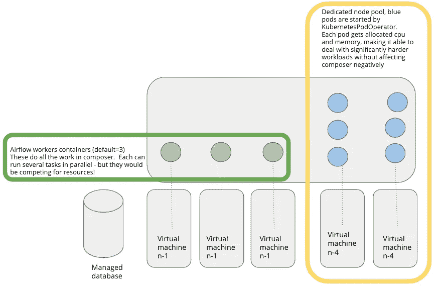
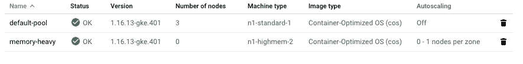
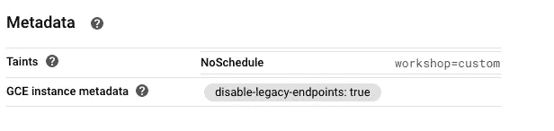
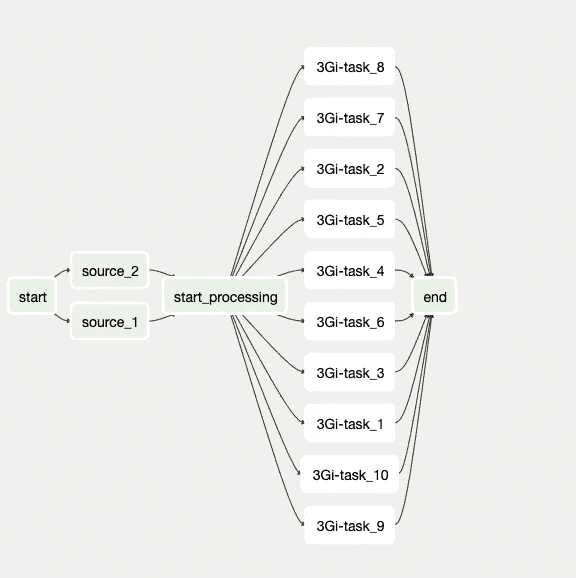
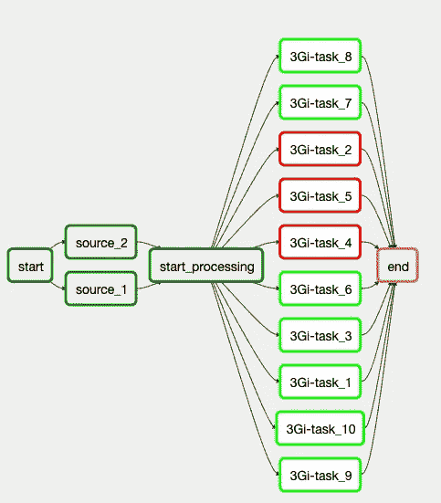
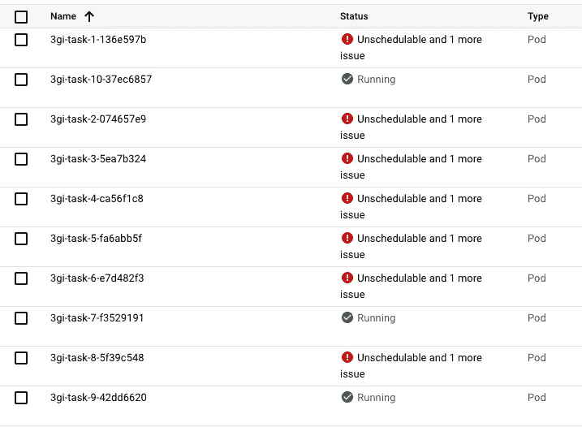
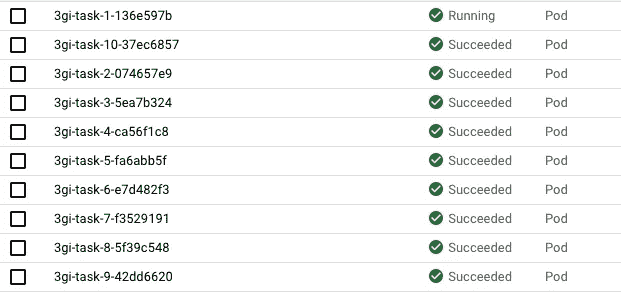

# Cloud Composer 中 KubernetesPodOperator 的最佳实践

> 原文：<https://medium.com/compendium/best-practises-for-kubernetespodoperator-in-cloud-composer-91760f848a39?source=collection_archive---------0----------------------->

在这篇文章中，我将通过例子介绍使用 KubernetesPodOperator 的最佳实践。我将分享 Dag 和 terraform 脚本，所以你应该很容易测试出来。

在谈论 Cloud Composer 时，我得到的相当多的问题是如何使用它来自动扩展作业操作。根据 cloud composer 为您提供的(当前)开箱即用设置，您可以实现的可扩展性非常有限。

例如，cloud composer 无法根据工作需求进行水平扩展，因此通常的做法是拥有足够的集群规模和配置来处理任何工作负载。当你想超越最初的设定时，挑战就出现了。假设您突然有了一个需要 10Gi 内存的作业，但是您的工作节点只有 n1 台机器？那么，你会以一种成本有效的方式做什么呢？

python 库和依赖性问题呢？如果在没有虚拟环境的情况下使用 python 操作符，很快就会变得混乱。

KubernetesPodOperator 是一个出色的操作者，它利用原生的 kubernetes 功能来执行工作，处理水平缩放和烘焙 docker 映像中的所有依赖项。你甚至不必使用 python——因为它都是集装箱化的！

我简化了下图中的架构:

Simplified illustration of composer internals

因此，通常您在 composer 中运行的任务是在绿点内运行的。一个绿点从任务队列中并行选取 x 个任务，因此如果您正在运行一个 cpu 繁重的工作负载，它可能也会影响 composer 中运行的其他作业。如果您正在运行一个内存特别大的任务，整个工作舱可能会被杀死，导致它正在处理的所有任务失败！

KubernetesPodOperator 允许我们在一个单独的节点池(机器)中以蓝点的形式产生进程，并为它们分配资源，这样它们就不会从“正常”的作业中获取资源。横向扩展是现成的，因为我们告诉 kubernets 要使用多少 cpu 和内存——如果 kubernets 没有足够的内存来放置蓝点，它将在节点池大小允许的情况下启动一个新的虚拟机，或者优雅地等待资源变得可用。

KubernetesPodOperator 最近越来越受关注，我想分享一些来之不易的经验——如果你愿意，可以说是最佳实践。

# 在 Composer 中运行窗格

至少有两个有效的运算符可以做到这一点:

## 1.KubernetesPodOperator

在当前 composer 群集中运行 pod

## 2.gkepodooperator

在任何 GKE 群集中运行一个 pod。请注意，这个操作符有一个关于 xcom 的已知错误，因此将它与 xcom 一起使用将不起作用。([https://stack overflow . com/questions/58349627/air flow-gkepodoperator-xcom-push-returns-none/59285712 # 59285712](https://stackoverflow.com/questions/58349627/airflow-gkepodoperator-xcom-push-returns-none/59285712#59285712))

> 我建议使用 KubernetesPodOperator，主要是因为 xcom 的 bug，google 对修复这个 bug 没什么兴趣。

# 创建单独的节点池来运行您的任务

创建单独的*自动扩展的*节点池来运行您的工作负载。如果你不这样做，你的 pod 会在 composer k8s 集群中运行，它们会争夺资源。因为 airflow-worker 的默认配置是请求 0 字节的内存(！idspnonenote)。)，气流-如果资源短缺，工人是第一个被驱逐的！

您还需要创建规则，防止 kubernetes 通过使用污点和容忍将 composer 核心服务迁移到您的新节点池。

原因很简单:工作负载会崩溃，如果在您有一个昂贵的节点池启动并运行时，意外地([这种情况发生在我身上](/@ael_78866/troubleshooting-cloud-composer-a2c074c69dcc))气流服务崩溃，那么 kubernetes 很有可能会将气流服务放在该节点上。这将阻止它的规模缩小，因为 kubernetes 不会自己关闭服务，把它放在别的地方！

# 指示作曲者将您的任务放在哪里

您需要明确地告诉 composer 您希望它在哪个节点池上运行，并放置正确的容差。如果不这样做，它将在默认节点池中运行，而 airflow 本身也在默认节点池中运行—这不是一个好主意！

由于这种配置可能很抽象，所以通常会在 dags 文件夹中创建一个包，并在其中添加引导代码，从而减少工作中的视觉干扰。

*上图:将语言代码移入包装以减少视觉噪音的示例*

# 始终指定资源请求！

这可能是要做的最重要的事情之一。如果在 utils 函数中包装 pod 创建，则可以基于资源请求动态选择节点池。(超过 5Gi 的内存分配给内存较大的节点池，而不到 5Gi 的内存分配给较便宜的节点池)

如果你不这样做，你会遇到自动伸缩的问题(kubernetes 会认为你的作业需要 0 个资源，并试图把所有的作业放在同一个节点上)和驱逐单元的问题(一旦你用完了资源)。

# 指定足够的启动时间

pod 的默认启动时间是 120 秒。如果作业的启动时间超过此时间，它将仅在 composer 中失败。kubernetes 调度程序仍然将 pod 放在它的池中，并且仍然会尝试启动它(并且可能会成功！)给你一些很难调试的案例。

我将举例说明:

Job illustration

我们有一个只有 1 个节点(n1-highmem-2)的节点池，有 2 个 CPU 和 13Gi。3Gi 任务每个都需要 120 秒才能完成

实际工作的结果

Result in composer

how it looks in GKE

如果我们现在看库伯内特斯，它看起来像这样。红色和绿色似乎有点同步…但是，kubernetes 调度程序还没有放弃！

那么发生了什么？

3Gi 任务每个都需要 3Gi 内存，需要 2 分钟才能完成。本例的启动时间设置为 60 秒。并发设置为 10，因此 composer 将尝试同时启动所有 10 个。Composer 能够启动 3 个作业，然后它必须等待…其余的作业在 composer 中失败。但是由于 kubernetes 调度程序的超时超过了 120 秒(实际上，kubernetes 调度程序并不关心经过了多少时间，它会在放弃之前尝试特定的次数。)—你可以看到这样的错误。相应地设置并发和启动时间(至少 600 秒)!

如果你在这个 [repo](https://github.com/ael-computas/gcp-cloud-composer-pod-operator) 里找，你可以找到这个帖子里用到的所有资料来源。通常我在与客户的研讨会上主持这个，所以它可能包含一些我没有详细介绍的额外内容。