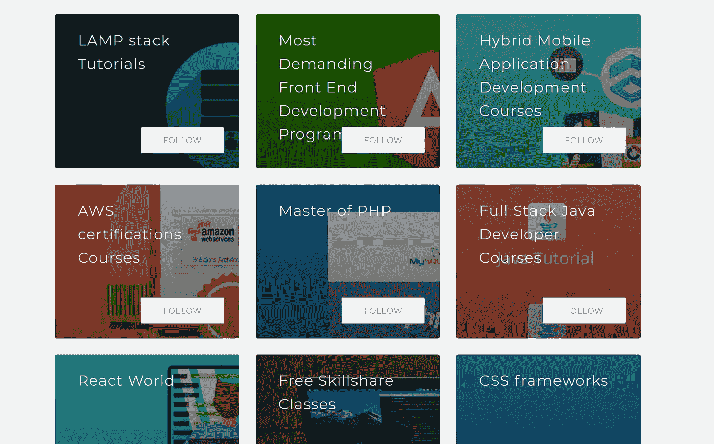
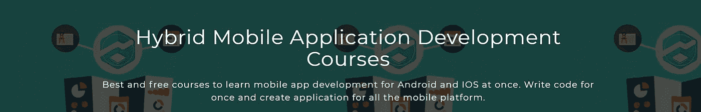
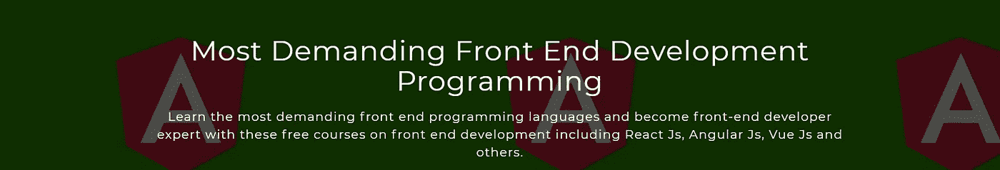
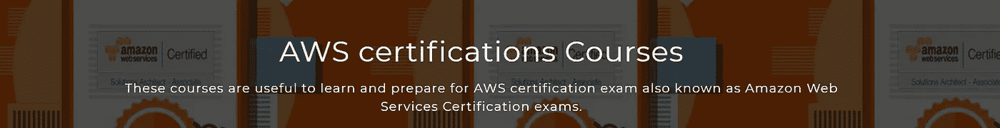

# 本月你应该关注的最佳编程课程集

> 原文：<https://medium.com/quick-code/best-programming-courses-collections-you-should-follow-this-month-99d7b5d5b2d9?source=collection_archive---------8----------------------->

## 通过免费在线课程，学习 React、Java、PHP、混合移动应用程序、AWS 等方面的开发

几个月前，我们推出了集合，从那时起，我们的成员已经创建了许多新的课程集合。我们分析并选择了一些最好的课程集。这些集合涵盖了所有不同类型的学习指南，包括前端开发、react 开发、全栈 Java 开发人员、PHP 开发人员课程、AWS 认证课程、混合移动应用程序开发课程等。

## 查看精选系列列表-

*   [反应世界](http://www.quickcode.co/course/collections/React-World/94)

Free courses to learn everything in React including React Js, Redux, React Native

*   [全栈 Java 开发者课程](http://www.quickcode.co/course/collections/Full-Stack-Java-Developer-Courses/95)

Free courses to learn Java. Begin from basics of Java and build the complete website using Java.

*   [PHP 硕士](https://www.quickcode.co/course/collections/Master-of-PHP/155)

Free online courses to learn everything in PHP from beginning to advanced level. Take these courses to gain expert knowledge of all PHP and related frameworks

*   [混合移动应用开发课程](http://www.quickcode.co/course/collections/Hybrid-Mobile-Application-Development-Courses/157)

Best and free courses to learn mobile app development for Android and IOS at once. Write code for once and create application for all the mobile platform.

*   [最苛刻的前端开发编程](http://www.quickcode.co/course/collections/Most-Demanding-Front-End-Development-Programming/158)

Learn the most demanding front end programming languages and become front-end developer expert with these free courses on front end development including React Js, Angular Js, Vue Js and others.

*   [灯组教程](http://www.quickcode.co/course/collections/LAMP-stack-Tutorials/159)

Free online courses to learn about LAMP stack that includes Linux, Apache, MySQL , PHP for beginners.

*   [AWS 认证课程](http://www.quickcode.co/course/collections/AWS-certifications-Courses/156)

These courses are useful to learn and prepare for AWS certification exam also known as Amazon Web Services Certification exams.

*   [免费技能分享课程](http://www.quickcode.co/course/collections/Free-Skillshare-Classes/29)

List of all the free online courses to learn web development, mobile development, programming, coding

如果您对新系列有任何想法，请[创建系列](https://www.quickcode.co/collections)或[联系我们](https://twitter.com/QuickCode17)。我们希望收到您的来信。最好的收藏也将有机会展示。