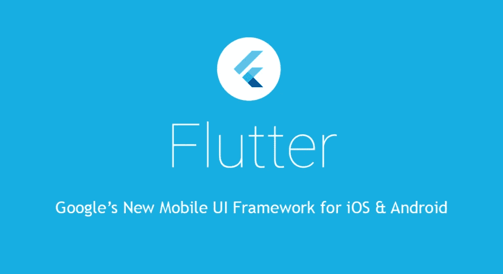
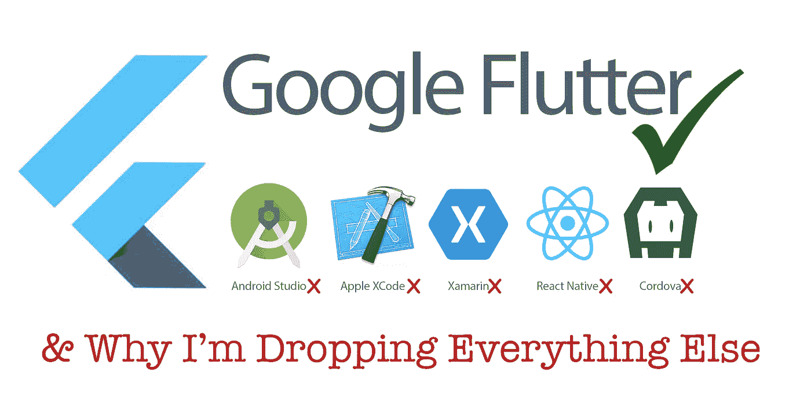

# 初学者的 10 个最佳颤振教程[2023 年 3 月]——在线学习颤振

> 原文：<https://medium.com/quick-code/best-video-tutorials-of-flutter-to-develop-application-for-android-ios-30909618f8e5?source=collection_archive---------0----------------------->

## 学习 Flutter，在 2023 年使用一个代码库和最好的 Flutter 初学者教程一起构建 Android 和 iOS 应用程序。

Flutter 是一个移动应用程序 SDK，包括一个框架、小部件和工具，为开发人员提供了一种简单高效的方法来在 Android 和 iOS 上构建和部署漂亮的移动应用程序。Flutter 是谷歌全新的移动用户界面框架，旨在为 iOS 和 Android 开发美观实用的界面。Flutter 应用程序是用一种叫做 Dart 的语言编写的，这是一种简单的客户机/服务器语言，你可以一路学习。

这些是你必须开始学习颤振发展的在线课程，从*最佳*颤振*课程*开始。

## 1.[带 Dart 的完整 2022 颤振研发训练营](https://coursesity.com/r/site/the-complete-2020-flutter-development-bootcamp-with-dart)

***课程评分:4.7 分(总分 4609 分)***

在本课程中，您将学习:

*   使用 Flutter 构建漂亮、快速、原生质量的应用程序
*   成为一名成熟的 Flutter 开发者
*   仅用一个代码库构建 iOS 和 Android 应用
*   仅使用一种编程语言(Dart)构建 iOS 和 Android 应用
*   建立一个漂亮的应用程序组合来打动任何招聘人员
*   理解颤振发展的所有基本概念
*   精通发展最快的技术之一

这个课程是与 Google Flutter 团队合作正式创建的。这是最全面的颤振课程，涵盖了颤振发展的所有基本概念。

在本课程中，您将完全理解:

*   基本概念，例如有状态和无状态的窗口小部件，窗口小部件树，状态管理，动画，主题等等。
*   基本的 Dart 概念，例如列表、映射、枚举、循环、未来、流、混合、类等等。
*   面向对象编程(OOP)的概念:类型系统、变量、函数和方法、继承、类和协议。
*   控制结构:使用 If/ Else 子句、Switch 语句和逻辑来控制执行流程。
*   数据结构:如何使用集合，如列表和映射。
*   软件设计:如何组织和格式化代码以提高可读性，以及如何实现模型视图控制器(MVC)设计模式。
*   联网:如何进行异步 API 调用，从云中存储和检索数据，以及使用 JSON 格式进行服务器通信。
*   数据存储:如何使用 Firebase Cloud Firestore 作为 Flutter 应用程序的后端。
*   认证:如何为你的 Flutter 应用程序登录和注册用户。
*   状态管理:如何使用 setState、prop drilling、提升状态、回调和提供者包来管理应用程序状态。

## 2.[为移动开发者学习 Google Flutter】](https://linkedin-learning.pxf.io/c/1137078/646189/8005?u=https%3A%2F%2Fwww.linkedin.com%2Flearning%2Flearning-google-flutter-for-mobile-developers&subId1=quickcode)

Flutter 允许移动开发者创建适用于多种平台的高质量应用体验。

该课程包括:

*   简介和设置
*   UI 建筑
*   使用设备和 SDK APIs
*   构建和发布

本课程演示了如何使用 Flutter，包括如何设置 SDK 和模拟器；添加小部件、组件和导航。利用 APIs 构建、审查和部署代码；还有更多。

## 3.[Flutter&Dart——完整的 Flutter App 开发教程](https://www.eduonix.com/flutter-dart-the-complete-flutter-app-development-course/UHJvZHVjdC0zMjMyMDA=)

使用单一代码库构建 iOS 和 Android 应用程序—了解 Google 的 Dart 和 Flutter 移动开发框架。Flutter 是谷歌创建的新的跨平台移动开发框架，允许开发者构建 Android 和 iOS 应用。

## 4.[初露端倪:安卓手机应用开发](https://www.educative.io/courses/beginning-flutter-android-mobile-app-development?affiliate_id=5088579051061248)

本课程着重于为 Android 平台构建应用程序。

该课程包括:

*   颤振基础
*   建立您的联系人个人资料页面
*   颤动主题
*   MovieApp:从 REST API 获取数据
*   附录:安装和设置颤振

您将从探索 Flutter 的复杂性开始，逐步实现 Android 地址簿的联系人资料页面。

在课程的后半部分，您将学习使用 Flutter 主题来美化您创建的联系人资料应用程序。

为了完善您的颤振体验，您还将练习从远程应用程序编程接口(API)获取数据。您将使用嵌入课程中的实时编码环境将所学内容付诸实践。

完成后，您将可以创建自己的 Android 应用程序，并将其发布到谷歌 Play 商店。

## 5.[创建带有颤动的布局](https://pluralsight.pxf.io/c/1137078/424552/7490?u=https%3A%2F%2Fwww.pluralsight.com%2Fcourses%2Fcreating-layouts-flutter&subId1=quickcode)

在本课程中，您将学习开始使用 Flutter 构建专业且引人入胜的布局所需的一切。您将涵盖在 Flutter 中构建用户界面的基础知识，目标是 Android 和 iOS。

该课程包括:

*   构建基本布局
*   使用容器
*   使用行和列
*   管理和扩展屏幕上的空间
*   创建导航布局
*   使用 Cupertino 小部件
*   在布局中使用动画

在本课程中，使用 Flutter 创建布局，您将获得利用 Flutter 小部件来构建专业布局的能力。

首先，您将学习如何使用容器、行和列。接下来，您将了解如何使用 ListView 和 GridView 扩展屏幕空间。

最后，您将探索如何使用 Cupertino 库来定位 iOS 设备并在您的应用程序中使用英雄动画。

当你完成本课程后，你将拥有创建引人入胜的用户界面所需的技巧和知识。

## 6.[使用 Flutter 构建原生移动应用](https://www.udacity.com/course/build-native-mobile-apps-with-flutter--ud905)

在本课程中，您将学习如何使用 Flutter 为 iOS 和 Android 设备快速开发高质量的交互式移动应用程序。无论您是刚刚开始移动应用程序开发，还是对其他移动应用程序框架有经验，您都会喜欢 Flutter 支持的高速开发和高质量应用程序。

与谷歌指导者一步一步地合作，在一个代码库中构建一个应用程序，该应用程序可以编译为原生 ARM 代码，并在 iOS 和 Android 上都具有高性能。了解如何利用 Flutter 的反应式框架、有状态热重装和集成工具进行快速开发。使用丰富的可组合小部件、内置动画和分层的可扩展架构定制您的应用。

## 7.[学扑&飞镖打造 iOS &安卓应用](https://click.linksynergy.com/deeplink?id=Fh5UMknfYAU&mid=39197&u1=quickcode&murl=https%3A%2F%2Fwww.udemy.com%2Fcourse%2Flearn-flutter-dart-to-build-ios-android-apps%2F)

用于构建原生 iOS 和 Android 应用的 Flutter SDK 和 Flutter 框架的完整指南。

***课程评分:4.7 分(总分 12090 分)***

在本课程中，您将学习使用谷歌地图、设备摄像头、认证等功能，为 Android 和 iOS 构建引人入胜的原生移动应用。使用 Flutter，你只需编写一次代码，就可以将你的应用程序同时上传到苹果应用商店和谷歌游戏。

在本课程中，您将涉及以下主题:

*   macOS 和 Windows 的详细设置说明
*   对 Flutter、Dart 和窗口小部件背后的概念的全面介绍
*   内置部件概述以及如何添加自己的部件
*   调试提示和技巧
*   带有选项卡、侧抽屉和基于堆栈的导航的页面导航
*   状态管理解决方案
*   处理和验证用户输入
*   通过发送 Http 请求将你的 Flutter 应用连接到后端服务器
*   用户认证
*   添加谷歌地图
*   使用本机设备功能，如摄像头
*   添加漂亮的动画和页面过渡
*   如何将您的应用发布到应用商店

## 8.[飞镖和颤振:完整的开发者指南](https://coursesity.com/course-detail/dart-and-flutter-the-complete-developers-guide)

关于使用 Flutter 和 Dart 构建移动应用程序，您需要了解的一切，包括 RxDart 和动画。

***课程评分:4.6 分(总分 2526 分)***

在本课程中，您将学习:

*   用 Flutter 构建漂亮的多屏应用
*   了解在 Flutter 应用程序中加载和维护数据的不同方法
*   使用 Dart 创建和发布开源项目
*   了解如何构建支持离线的应用程序，并以令人难以置信的效率加载数据
*   理解阅读数量惊人的 Flutter 文档的最佳方法
*   使用 SQLite 在用户的物理设备上存储长期数据
*   掌握流并理解反应式编程以创建 Flutter 应用程序

本课程旨在让学生了解 Dart 语言及其主要功能，包括通过离线存储功能在用户设备上长期存储信息**。**

您还将了解如何优化网络请求以提高移动网络的性能，用复杂的动画取悦用户**，**通过多屏导航展示应用的功能浏览数量惊人的 Flutter 文档

本课程将教你如何通过使用 RxDart 掌握流的反应式编程。实现 Google 官方 Flutter 团队倡导的高级设计模式。通过表单验证处理用户输入**。**学习构建开源 Dart 包并分发给其他开发者

Best Flutter Courses and Tutorials

## 9. [Flutter & Dart —完整的 Flutter App 开发教程](https://click.linksynergy.com/deeplink?id=Fh5UMknfYAU&mid=39197&u1=quickcode&murl=https%3A%2F%2Fwww.udemy.com%2Fflutter-dart-the-complete-flutter-app-development-course%2F)

使用单一代码库构建 iOS 和 Android 应用程序—了解 Google 的 Dart 和 Flutter 移动开发框架。

本课程旨在让您可以立即开始学习 Dart 编程语言(与 Flutter SDK 一起用于构建原生 iOS 和 Android 应用程序)和 Flutter 框架，并制作跨平台的移动应用程序。

我将带你一步一步地学习高清视频教程，并通过制作真实世界的应用程序(如地震、身体质量指数、天气、聊天应用程序等)来积累你的飞镖和颤振编程知识。

您将从头开始学习关于通用 Dart 编程语言的所有知识。即使你以前从未编程过，你也可以用 Flutter SDK 编写并理解所有你需要的编程概念，来开始构建健壮的、制作精美的 iOS 和 Android 应用。

本课程结束时，您将能够流利地使用 Dart 编程，并准备好制作自己的应用程序或开始作为 Dart & Flutter 应用程序开发人员的自由职业工作。

从初学者到飞镖和颤振 iOS 和 Android 移动开发者。即使你是 rockstar 程序员，但想学习 Dart 和 Flutter，这也非常适合你。

所以在课程结束时，你会完全明白:

*   面向对象编程(OOP)的概念:类型系统、变量、函数和方法、继承、类、抽象类和接口。
*   控制结构:使用 If/ Else 子句、Switch 语句和逻辑来控制执行流程。
*   数据结构:如何使用集合，比如列表和映射。
*   软件设计:如何组织和格式化代码以提高可读性，以及如何实现模型视图控制器(MVC)设计模式。
*   网络:如何进行异步 API 调用，从远程服务器存储和检索数据，以及使用 JSON 格式进行服务器通信。
*   地图:如何制作位置感知应用
*   Firebase 和实时数据库—构建可快速轻松扩展的动态实时应用

## 10.[颤振—初学者课程](https://click.linksynergy.com/deeplink?id=Fh5UMknfYAU&mid=39197&u1=quickcode&murl=https%3A%2F%2Fwww.udemy.com%2Fflutters-beginners-course%2F)

学习 Flutter 移动编程。

了解如何使用 google 的新移动框架 Flutter 创建快速且令人惊叹的移动应用程序。在本课程中，您将快速学习如何在没有任何经验的情况下使用 Flutter 构建应用程序。强烈建议您理解 Dart 编程语言，请参阅我的 Dart 编程教程。

## 11.[颤振—中间](https://click.linksynergy.com/deeplink?id=Fh5UMknfYAU&mid=39197&u1=quickcode&murl=https%3A%2F%2Fwww.udemy.com%2Fflutter-intermediate%2F)

学习 Flutter 移动编程。

这不是一个初学者的课程，你应该对 Dart 语言和 Flutter 的初学者理解都有扎实的掌握。这门课继续了我的初学者课程。在本课程中，您将学习一些更复杂的 flutter 小部件，以及使用图表、导航和路由，以及从构建自己的到使用 Redux 的状态管理。我强烈建议你在尝试这门课程之前，先学习我现有的飞镖和颤振课程。

Top Flutter Tutorials for Beginners

## 12.[完整的颤振和燃烧基础开发者课程](https://click.linksynergy.com/deeplink?id=Fh5UMknfYAU&mid=39197&u1=quickcode&murl=https%3A%2F%2Fwww.udemy.com%2Fflutter-development%2F)

使用谷歌全新的移动用户界面框架构建令人惊叹的无服务器 Android 和 iOS 应用。

本课程是专门为刚刚开始从事 flip 和 Mobile 开发的人设计的，他们希望构建一个功能齐全、能够真正发挥作用的应用程序。您将了解如何将应用程序绑定到 Firebase 服务，以使其真正做到无服务器。

在此过程中，您还将了解到一些 *Firebase* 服务:

*   Cloud Firestore — NoSQL 云数据库
*   Firebase 存储—原始云文件存储
*   Google 登录身份验证—加上为 GitHub、脸书、电子邮件等添加登录选项。
*   firebase Functions(firebase Functions)——编写大量我们的应用程序可以用来安全处理请求的云函数

## 13.[学旋舞——初学者课程](https://click.linksynergy.com/deeplink?id=Fh5UMknfYAU&mid=39197&u1=quickcode&murl=https%3A%2F%2Fwww.udemy.com%2Flearn-flutter-beginners-course%2F)——【免费课程】

构建 Android 和 iOS 应用程序，只需要一个简单的框架。

初学者课程的旋舞，本课程将教你如何创建一个非常实用和简单的方式应用程序，因为每一个讲座都附带完整的编码屏幕和相应的代码在笔记本电脑。

> 感谢各位阅读本文。我们已经策划了更多主题的顶级教程，你想看看吗:

 [## 10+适合初学者的最佳 Kotlin 教程-在线学习 Kotlin

### 学习 2022 年最好的初学者 Kotlin 教程为 android 开发 Kotlin

medium.com](/quick-code/top-tutorials-to-learn-kotlin-android-development-for-beginners-fad63af16996)  [## 面向初学者的 10+最佳 Android 开发教程—在线学习 Android 开发

### 了解如何创建一个 android 应用程序与最好的在线 android 开发教程初学者在 2022 年

medium.com](/quick-code/top-online-tutorials-to-learn-android-oreo-app-development-bb0203163f14)  [## 面向初学者的 10+最佳 Swift 教程—在线学习 Swift

### 学习 Swift，在 2022 年成为拥有适用于初学者的最佳 Swift 教程的高级移动开发人员

medium.com](/quick-code/top-tutorials-to-learn-ios12-swift-4-ed1c934535e4) 

> **更新**:我们已经创建了最新版本的顶级教程[学习飘动](http://blog.coursesity.com/best-flutter-tutorials?utm_source=botsfloor&utm_medium=referral&utm_campaign=mediumPost&utm_term=learn-flutter)。请随时查看本年度最佳的扑动教程。

*爆料:如果你通过本页链接购买课程，我们可能会收取小额会员佣金。谢谢你。*