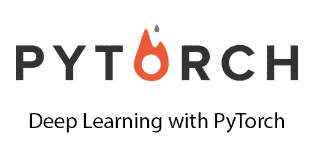
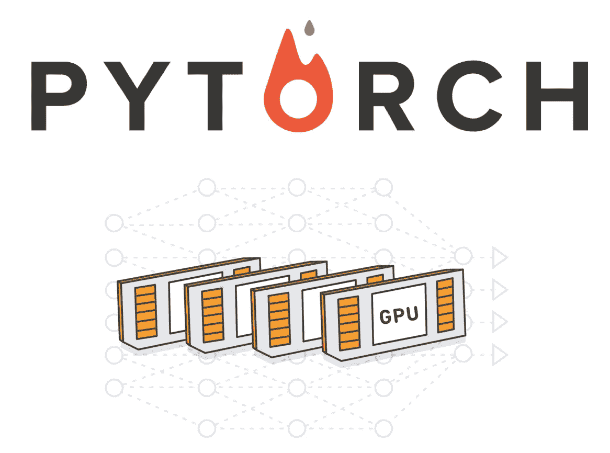
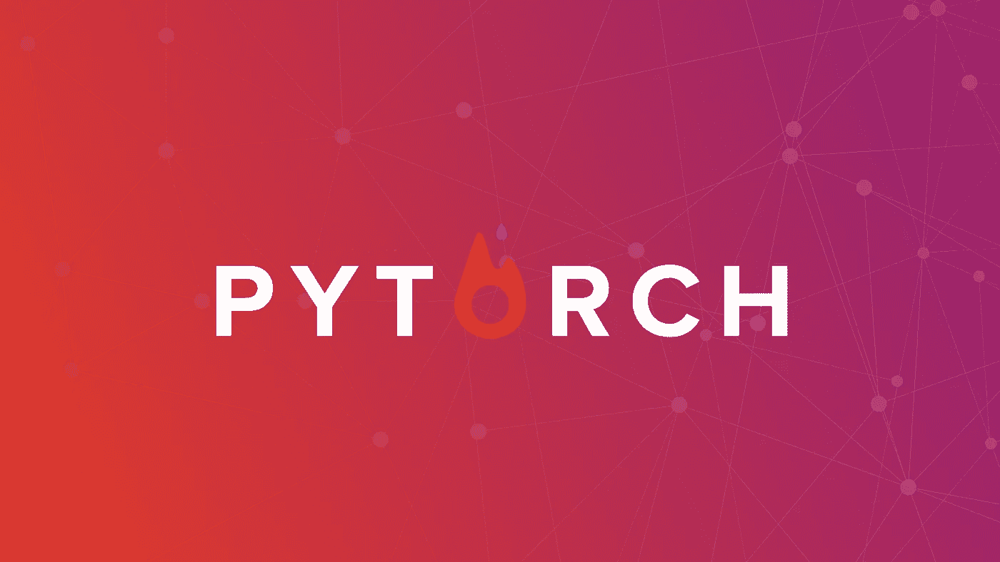

# 8 个最佳 PyTorch 初学者教程[2023 年 3 月]——在线学习 PyTorch

> 原文：<https://medium.com/quick-code/best-video-tutorials-on-pytorch-machine-learning-library-developed-by-facebook-b757e5939a41?source=collection_archive---------0----------------------->

## 用 2023 年最好的 Pytorch 初学者教程学习机器学习的 Pytorch。

除了 tensorflow，还有一个新的非常有趣的深度学习框架——脸书开发的 pytorch。

深度学习支撑着当今许多重要且日益重要的应用，从面部识别到自动驾驶汽车，再到医疗诊断等等。

# 1.[Python 中的现代深度学习](https://click.linksynergy.com/deeplink?id=Fh5UMknfYAU&mid=39197&u1=quickcode&murl=https%3A%2F%2Fwww.udemy.com%2Fdata-science-deep-learning-in-theano-tensorflow%2F)

使用 Tensorflow、Theano、Keras、PyTorch、CNTK、MXNet 等现代库进行构建。在 AWS 上用 GPU 训练更快。

这门课是我的第一门课《Python 中的深度学习》的继续。您已经知道如何用 Python 构建人工神经网络，并且您有一个即插即用的脚本，可以用于 TensorFlow。神经网络是机器学习的主要内容之一，它们总是 Kaggle 竞赛中的顶级竞争者。如果你想通过神经网络和深度学习来提高自己的技能，这就是适合你的课程。

在本课程中，您将学习批处理和随机梯度下降，这两种常用的技术允许您在每次迭代中只对少量数据样本进行训练，从而大大加快训练时间。

你还将学习动量，这有助于你通过局部极小值，防止你对自己的学习速度过于保守。您还将了解 AdaGrad、RMSprop 和 Adam 等适应性学习速率技术，这些技术也有助于加快您的训练速度。

您将了解到更多的现代技术，如退出正则化和批量归一化，我们将在 TensorFlow 和 Theano 中实现这些技术。课程不断更新，更先进的正规化技术将在不久的将来到来。

在本课程中，我们将从基础开始，这样您就能确切地理解发生了什么——什么是张量流变量和表达式，以及如何使用这些构建模块来创建神经网络？我们还将看看一个历史更久、非常受深度学习欢迎的图书馆——the ano。有了这个库，我们还将检查基本的构建模块——变量、表达式和函数——以便您可以满怀信心地在 ano 中构建神经网络。

Theano 是今天所有现代深度学习库的前身。今天，我们有太多的选择。Keras，PyTorch，CNTK(微软)，MXNet(亚马逊/阿帕奇)等。在本课程中，我们将涵盖所有这些内容！挑选一个你最喜欢的。

因为 TensorFlow 和 Theano 的主要优势之一是能够使用 GPU 加速训练，所以我将向您展示如何在 AWS 上设置 GPU 实例，并比较 CPU 与 GPU 在训练深度神经网络方面的速度。

有了这些额外的速度，我们将查看一个真实的数据集——著名的 MNIST 数据集(手写数字的图像)，并与各种基准进行比较。这是研究人员想问问题时首先要看的数据集，“这个东西有用吗？”

这些图像是深度学习历史的重要组成部分，今天仍然用于测试。每个深度学习专家都应该对它们了如指掌。

本课程的重点是“如何构建和理解”，而不仅仅是“如何使用”。任何人在阅读一些文档后都可以在 15 分钟内学会使用 API。这不是“记住事实”，而是通过实验“自己去看”。它将教你如何将模型中发生的事情可视化。

## 2.[使用 PyTorch 的深度神经网络](https://coursera.pxf.io/c/1137078/1213622/14726?u=https%3A%2F%2Fwww.coursera.org%2Flearn%2Fdeep-neural-networks-with-pytorch&subId1=BotTutorials)

课程将教你如何使用 Pytorch 开发深度学习模型。

在本课程中，您将学习如何:

*   解释和应用深度神经网络和相关机器学习方法的知识。
*   将 PyTorch 等 Python 库用于深度学习应用。
*   使用 PyTorch 构建深度神经网络

你将从 Pytorch 的张量和自动微分包开始。然后，每一节将涵盖不同的模型，从基础开始，如线性回归，逻辑/softmax 回归。

其次是前馈深度神经网络，不同激活函数的作用，归一化和漏失层。

然后卷积神经网络和转移学习将被涵盖。最后，将介绍其他几种深度学习方法。

# 3. [PyTorch 基础训练:深度学习](https://linkedin-learning.pxf.io/c/1137078/646189/8005?u=https%3A%2F%2Fwww.linkedin.com%2Flearning%2Fpytorch-essential-training-deep-learning&subId1=quickcode)

在这里，您将了解使用 PyTorch 进行深度学习的基础知识。

在本课程中，您将了解:

*   使用 PyTorch 的深度学习基础。
*   PyTorch 网络故障排除。

从一个有效的图像识别模型开始，它展示了不同的组件是如何配合并协同工作的——从张量、损失函数和自动签名，一直到 PyTorch 网络的故障排除。

# 4. [PyTorch 机器学习基础知识](https://www.awin1.com/cread.php?awinmid=6798&awinaffid=466009&clickref=quickcode&ued=https%3A%2F%2Fwww.edx.org%2Fcourse%2Fpytorch-basics-for-machine-learning)

本课程是两部分课程的第一部分，将向您传授 PyTorch 的基础知识。

在本课程中，您将学习如何:

*   在 PyTorch 中建立一个机器学习管道。
*   PyTorch 的火车模型。
*   加载大型数据集。
*   用 PyTorch 训练机器学习应用。
*   具备应用于深度学习的必备知识。用 PyTorch 合并和 Python 库，如 Numpy 和 Pandas。

本课程将教授您 Pytorch 的基础知识，同时提供您在构建深度学习模型之前所需的必要先决条件。

您将从 PyTorch 的一维和二维张量开始，您将学习张量类型和运算、py torch 的自动微分包以及与 Pandas 和 Numpy 的集成。

接下来是对数据集对象和转换的深入概述；这是 PyTorch 建设管道的第一步。

您将学习如何训练线性回归模型。您将回顾训练模型的基础知识，包括损失、成本和梯度下降等概念。

您将学习 PyTorch 的基础知识，包括如何使用 PyTorch 的线性类和自定义模块进行预测。然后用 PyTorch 确定损失和成本。最后，你将通过基本原理实现梯度下降。

您将通过 PyTorch 的内置功能训练一个线性回归模型，了解 PyTorch 的关键组件。

这将包括如何使用 optimizer 对象有效地训练 PyTorch 的定制模块，允许您以有效的方式训练任何模型。

您将引入数据加载器，使您在处理大量数据集时更加灵活。

您将学习在应用程序中保存您的模型和培训，例如超参数选择的交叉验证、提前停止和检查点。

您将了解如何在应用程序中将模型扩展到多个输入和输出维度，例如多元线性回归和多元输出线性回归。

您将学习线性对象的基础知识，包括它如何与不同维度和样本数量的数据进行交互。此外，您将学习如何在 PyTorch 中训练这些模型。

最后，你将回顾线性分类器，逻辑回归和使用不同损失函数的问题。

您将学习如何以多种方式在 PyTorch 中实现逻辑回归，包括使用定制模块和使用顺序方法。你将在期末专题中测试你的技能。

# 5.[py torch 基金会](https://pluralsight.pxf.io/c/1137078/424552/7490?u=https%3A%2F%2Fwww.pluralsight.com%2Fcourses%2Ffoundations-pytorch&subId1=quickcode)

本课程涵盖了在 PyTorch 中构建深度学习模型的许多方面，包括神经元和神经网络，以及 PyTorch 如何使用微分学来训练这样的模型，并在深度学习中创建动态计算图。

该课程包括:

*   PyTorch 机器学习入门
*   在 PyTorch 中使用张量
*   使用自动签名库处理渐变
*   构建动态计算图

在 PyTorch 基础课程中，您将能够利用 PyTorch 对动态计算图的支持，并将其与 TensorFlow 等其他流行框架进行对比。

首先，您将学习神经元和神经网络的内部结构，并了解激活函数、仿射变换和层如何在深度学习模型中结合在一起。

接下来，您将发现如何训练这样一个模型，即如何估计模型参数的最佳值。然后，您将看到梯度下降优化是如何智能地实现来优化这个过程的。

您将了解在此过程中可能使用的不同类型的微分，以及 PyTorch 如何使用 Autograd 来实现逆向模式自动微分。

您将使用不同的 PyTorch 构造，如张量、变量和梯度。最后，您将探索如何在 PyTorch 中构建动态计算图。

您将通过与 TensorFlow 中使用的方法进行对比来完善课程，tensor flow 是另一个领先的深度学习框架，以前只提供静态计算图，但最近增加了对动态计算图的支持。

完成本课程后，您将具备在 PyTorch 中构建深度学习模型的技能和知识，并利用动态计算图的力量。

# 6.【PyTorch 机器学习简介

学习基本的机器学习技术——从数据操作到无监督和有监督的算法。

在本课程中，您将学习:

*   关于监督学习，一类常见的模型构建方法。
*   PyTorch 中神经网络设计和训练的基础。
*   如何针对不同类型的问题域实现无监督学习方法？

学习基础机器学习算法，从数据清理和监督模型开始。

然后，继续探索深度和无监督学习。在每一步，通过将您的技能应用到代码练习和项目中来获得实践经验。

# 7.[用 PyTorch 实用深度学习](https://click.linksynergy.com/deeplink?id=Fh5UMknfYAU&mid=39197&u1=quickcode&murl=https%3A%2F%2Fwww.udemy.com%2Fpractical-deep-learning-with-pytorch%2F)

使用 PyTorch 加速您的深度学习，py torch 通过 python 优先的框架涵盖了深度学习的所有基础知识。

尽管许多课程在本质上非常数学化或过于实用，但本课程在这两者之间达成了谨慎的平衡，为你提供了深度学习的坚实基础，如果你对深度学习和/或应用深度学习领域的研究感兴趣，可以进一步探索。这是有目的地为任何没有强大的数学背景的人。对于那些有强大背景的人来说，这将加速你理解深度学习中不同模型的学习。

整个课程以 Python 笔记本的形式提供，这样您就可以跟随视频并复制结果。您可以练习和调整模型，直到您真正理解我们进行的每一行代码。

本课程使用了 100 多个定制的图表，这些图表是我花了数百个小时精心制作的，以便您可以清楚地看到从一个模型到另一个模型的转换，并全面理解这些模型。此外，创建了图表，以便您可以清楚地看到我将要教授的理论和您将要学习的代码之间的联系。

这不是一门非常强调深度学习背后的数学的课程。它的重点是让你先了解一切是如何工作的，这对你以后轻松地赶上数学是非常重要的。其中涉及到数学，但它们的唯一目的是增强你的理解，并为将来更深入的课程提供一个平缓的学习曲线。

# 8.Python erstellen 中的 py torch-6 Neuronale Netze einfach—[德语]

在本课程中，参与者将学习用 Python 轻松高效地编程神经网络，并在图形卡上训练它们。

该方法使用 6 个非常不同的示例进行解释，涵盖了最常见的网络类型:

1.  简单前馈网络
2.  基于卷积网络的手写识别和图像识别
3.  基于递归网络的姓名识别
4.  使用递归网络的密码生成
5.  游戏的强化学习

需要具备 Python 和神经网络理论方面的知识。后者包括它如何工作，卷积如何工作，什么是池层或 Softmax 如何工作。

> 感谢您阅读本文。我们策划了更多主题的顶级教程，您可能想看看:

 [## 15+最佳 Django 初学者教程——在线学习 Django

### 用 2021 年的最佳 Django 初学者教程学习 Django 进行 web 开发

medium.com](/quick-code/top-tutorials-to-learn-django-framework-for-python-beginners-fe1a9e315aa9)  [## 初学者的 7 个最佳灵药教程——在线学习灵药

### 2021 年，学习 web 应用程序开发的最佳入门教程

medium.com](/quick-code/the-best-tutorials-to-learn-elixir-for-beginners-3d805ebfe5d3)  [## 面向初学者的 15 门以上最佳 Python 课程——在线学习 Python

### 2021 年，学习 Python，为初学者提供更清晰、更有逻辑性的最佳 Python 教程

medium.com](/quick-code/top-tutorials-to-learn-python-programming-200a4283995f) 

披露:我们与本文中提到的一些资源有关联。如果你通过本页的链接购买课程，我们可能会得到一小笔佣金。谢谢你。