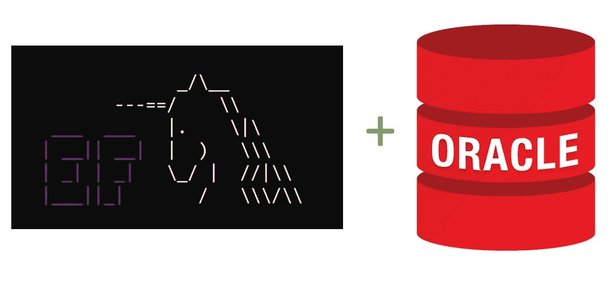

# 测试版:Oracle 实体框架核心 3.1

> 原文：<https://medium.com/oracledevs/beta-release-oracle-entity-framework-core-3-1-eb0b4d3c93b1?source=collection_archive---------2----------------------->

我很高兴地宣布 Oracle 实体框架核心(EF Core) 3.19.0 测试版将于 [NuGet Gallery](https://www.nuget.org/packages/Oracle.EntityFrameworkCore/3.19.0-beta1) 发布。这个测试版支持实体框架核心 3.1 的新变化。由于是测试版，在 NuGet Gallery 上搜索程序集时，请确保选中“包含预发布”框。

从 EF Core 2.x 升级到 Oracle EF Core 3.1 beta 和 EF Core 3.1 不需要修改 Oracle EF Core 应用程序代码。您应该能够将程序集放入现有的 Oracle EF Core 2.x 应用程序中，升级到 EF Core 3.1 和测试版，然后运行。

我的团队的开发工作集中在支持微软要求提供者作者对 EF Core 3.x 的修改。这些变化发生在提供商本身，例如 LINQ 如何转换为 Oracle SQL，以及保持与各种 Oracle 数据库版本的兼容性。该测试版支持 Oracle 数据库服务器 11.2.0.4 和更高版本，无论是在本地还是在云中。

这并不是说现有应用升级到 EF Core 3.x 时不会有问题。微软已经[记录了从 EF Core 2.x 迁移到 3.x](https://docs.microsoft.com/en-us/ef/core/what-is-new/ef-core-3.0/breaking-changes) 时发生的突破性变化。

Oracle EF Core 3.1 文档是 NuGet 包的一部分。解压缩软件包以检索 PDF 文件，或者在 NuGet 全局软件包目录中找到它。例如:

`C:\Users\<username>\.nuget\packages\Oracle.EntityFrameworkCore\3.19.0-beta1`

Oracle EF Core 3.1 文档通常涵盖自 Oracle EF Core 2.x 发布以来的变化。你可以在这里找到 Oracle EF Core 2.x 文档。

要提交反馈和错误，请发帖到[ODP.NET 论坛](https://community.oracle.com/community/database/developer-tools/windows_and_.net/odp.net)。在报告错误之前，请先查看“限制和已知问题”文档部分。

对于测试版，我们关注功能的完整性、兼容性和质量。目前没有计划生产的附加功能。产品发布时间取决于测试版的反馈。如果开发者没有发现很多问题，测试期可能会很短。我鼓励您尽早提交反馈。当报告错误时，简单和完整的测试用例是受欢迎的。

再来几个音符。这个测试版不支持。净 5。此外，EF Core 3.0 也不受支持，因为微软已经取消了对版本的支持。

试用测试版，让我们知道你的想法！