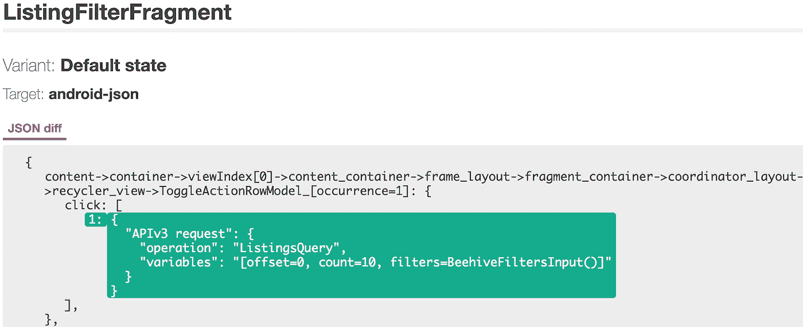

# Airbnb 更好的 Android 测试——第 3 部分:交互测试

> 原文：<https://medium.com/airbnb-engineering/better-android-testing-at-airbnb-1d1e91e489b4?source=collection_archive---------1----------------------->

在 Airbnb Android 测试系列的第三部分中，我们探索了一个我们为测试用户行为而构建的自动化系统。

# 交互测试

[本系列的第二部分](/airbnb-engineering/better-android-testing-at-airbnb-a77ac9531cab)介绍了我们的屏幕截图测试方法。作为我们的第一次集成测试，截图填补了我们测试策略中的一个漏洞，并在捕捉回归和改善我们的开发人员体验方面立竿见影。但是，虽然它们覆盖了我们应用程序的 UI 代码的大部分，但是它们没有提供对当用户与 UI 交互时运行的代码的正确性的洞察，例如点击处理。

这种“交互处理”代码可能包含复杂的逻辑，是常见的错误来源。它还代表了产品特性中很大一部分代码，因此对于高代码覆盖率来说，对它进行良好的测试是很重要的。

使用 Espresso 测试交互相当简单——可以手动强制点击，然后断言结果。然而，由于各种原因，这些测试是脆弱的:

*   视图是通过 id 或位置手动标识的，它们通常会随着产品更新而变化
*   可滚动列表中的视图必须滚动到
*   异步结果必须等待，这可能会导致剥落或需要额外的代码来正确处理

即使解决了这些问题，为页面上所有可能的交互手动编写测试也是乏味的，并且可能会排除一些小细节，比如传递的参数或发出的网络请求。

就像截图测试自动检测 UI 变化一样，我们构建了一个类似的系统来检测交互处理中的变化。然后，我们利用批准测试技术来自动更新我们的测试。这使得我们可以自动验证每个屏幕的行为，而无需编写任何传统的 Espresso 测试。

这背后的理念基于以下几点:

1.  由点击引起的所有变化都是可测量的，并且可以用文本描述来表示。
2.  活动层次结构中的所有视图都可以通过编程方式单击，并测量结果，从而允许我们生成一个报告，将每个视图映射到它的 onClick 行为。
3.  我们可以孤立地测试一个屏幕，并将其界面定义为可能影响其他屏幕的任何动作，比如启动一个新屏幕或返回一个结果。
4.  我们不需要链接屏幕的端到端测试，只要我们测试每个屏幕如何处理可能的输入(模拟状态和参数)并验证正确的输出(影响其他屏幕的动作)

我们的实现如下:

*   一个模型被展开，我们等待它的视角稳定下来。
*   我们遍历片段视图层次结构中的每个视图，并以编程方式单击它
*   每次点击后，我们记录下所有的动作，阻止它们真正发生
*   生成一个 JSON 文件，定义每个视图的结果
*   JSON 文件不同于检测交互的变化，就像我们检测截图一样

这种技术出奇的好，并且和截图测试有很多相似之处。事实上，我们可以重用已经构建好的基础设施来运行截图测试。让我们详细看看每一步。

# 视图布局

这重用了与截图测试相同的代码。我们有一个基本活动，它接受一个要测试的模拟列表，并遍历每一个，显示它并在它稳定后运行测试代码。

这个基本活动的子类处理测试的细节，比如截屏或者执行点击。

# 迭代视图层次结构

必须依次处理屏幕中的每个视图。为此，我们在视图树中进行深度优先搜索，并对每个视图进行操作。我们检查可点击和可长时间点击的视图，并在适用的情况下分别执行。这个过程有两个难点。

首先，支持 RecyclerViews 意味着我们需要以编程方式向下滚动屏幕以到达每个项目。这需要在继续深度优先搜索之前异步等待新视图被布局。

第二，每次点击都可能改变视图层次结构，所以我们不能立即继续测试下一个视图。例如，单击可以触发一个片段事务，显示一个对话窗口，或者展开某个视图组。相反，我们需要将视图层次结构重置为其初始状态，然后从层次结构中的前一个视图继续迭代。

测试的可靠性取决于我们在每次点击后准确地将应用程序重置为原始模拟视图的能力。这让我们可以顺利地继续测试每个后续视图。

为了支持这种重置，我们在单个活动中运行整个测试。每次点击后，我们删除所有片段，然后添加回一个新的模仿片段的实例。

如果 AlertDialog 显示为单击的结果，我们以编程方式关闭它。没有干净的方法可以做到这一点，相反，我们依靠反射来访问全局窗口管理器。

在每次点击之前，我们将遍历位置存储在视图层次结构中。视图重置后，测试从该点重新开始。这个遍历路径被表示为层次结构中每个视图组的子索引列表。

# 记录互动

每次点击后，测试“监听”产生的动作并记录下来。通常会导致两类操作:

*   Android 框架级别的结果，如片段事务或开始/结束活动
*   Airbnb 应用程序特定的事件，如提交 MvRX 状态的更改或执行网络请求

理想情况下，测试框架可以自动记录影响 Android 框架的任何结果，但是我们需要一种干净的方法来检测我们内部系统的任何变化。

# 检测框架结果

为了捕捉活动级别的结果，我们的测试活动简单地覆盖了来自其 ***活动*** 超类的所有可能的方法。比如我们覆盖 ***finish*** ， ***startIntent*** ，***onoptionsitems elected***。对这些方法的调用都被记录下来，并且 ***super*** 调用被阻塞，以避免副作用干扰测试(我们不希望点击实际上完成我们的活动！).我们还记录了调用函数所用的参数的详细信息，比如意图信息或包数据。

我们还检查是否在活动上设置了结果，所以我们一直等到交互结束，然后使用反射来检查活动的结果代码和结果数据的值。这允许我们的测试捕捉点击返回结果的变化。

为了检测片段事务，在测试活动中注册了一个***FragmentLifecycleCallbacks***，并递归地检测对片段堆栈的任何更改。它记录了片段堆栈在一切稳定后的结束状态。我们还记录了每个片段包含的参数，因此我们有每个片段从哪些参数开始的记录。

最后，我们使用反射来访问***WindowManagerGlobal***并检查由于点击而添加的窗口。如果它是一个 AlertDialog 或 BottomSheetDialog，我们可以获得关于它的信息，如标题、消息和按钮文本。我们还强制关闭对话框，以防止它们在测试过程中滞留。

# 检测对定制系统的更改

理想情况下，我们的交互测试框架还可以捕获定制系统中的任何变化，比如我们的网络层、数据库或日志记录。然而，我们希望避免将测试代码放到生产系统中，这是记录事件的幼稚方法。

相反，我们利用接口和依赖注入将测试交互记录从实际系统中分离出来。这是我们的方法。

*   创建一个知道如何向我们的测试运行者报告动作的界面
*   使用测试 Dagger 模块来覆盖每个依赖项的创建，并模拟它来调用交互报告接口。
*   使用 Dagger multi binding 将这些报告器接口收集到一个集合中，测试运行程序可以被注入其中。

一个经过深思熟虑的依赖注入图，结合多重绑定，对于它的良好运行是至关重要的。一旦它建立起来，它就非常强大，因为它允许我们测量和捕捉应用程序中每次点击与我们的服务交互的变化。

# 捕获非可视视图数据

除了记录点击交互的结果，我们的系统还可以帮助测试视图的非视觉行为。这些是在屏幕截图测试中无法捕获的数据，例如:

*   一个视图的 ***内容描述*** ，用于检查可访问性配置
*   WebView 或 ImageView 中加载的 url
*   视频视图的配置设置

为了支持这一点，视图迭代器回调每个视图，并给我们一个机会来检查它的类型，并向报告中添加关于它的任意信息。这使得它可以扩展为任何自定义视图或关于我们想要捕获的视图的数据。

# 知道互动何时结束

当一个视图被点击时，它可能会触发异步操作，比如一个片段事务、一个视图失效或者一些数据处理。我们不能让这些异步操作影响未来测试的稳定性，所以我们要么阻止它们(如果可能的话)，要么等待它们完成，然后为下一次点击重置视图。

这种空闲检测将在第 5 部分(几周之后)中详细讨论。

# JSON 报告输出

单击所有视图并捕获结果后，数据将被编译成报告。这份报告的最佳格式是主观的，并且有许多方式来呈现它。我们的格式如下:

这个 JSON 对象声明了屏幕上单个视图的行为。对于每个可点击的视图，完整的报告都会有一个这样的条目。

顶层 JSON 对象键标识层次结构中的视图。我们使用每个视图的父视图的视图 id 来构建一个链，这个链允许我们唯一地标识屏幕上的视图。

***片段 _ 容器- >协调器 _ 布局- >回收器 _ 视图->AccountDocumentMarqueeModel->链接 _ 文本***

我们还注意到这是 RecyclerView 中的 TextView。它位于 AccountDocumentMarqueeModel 中，AccountDocumentMarqueeModel 是表示项目视图的环氧树脂模型。类似这样的细节让开发人员可以很容易地判断出这个 JSON 在屏幕上指的是哪里。

最后，报告指出了当视图被点击时会发生什么。

这表示我们正在一个 MvRxActivity 中打开一个 UserProfileFragment，并且还记录了与它一起传递的参数和请求代码。

通过反复试验，我们想到了以下几点:

## 可读性

报告应该清楚地描述页面上的每个视图在被点击时做了什么。关键名称应该仔细选择，使意义直观。

虽然报告可以包含元数据，以帮助用户更容易地识别哪个视图受到了影响，但直觉上应该尽量减少这种情况，因为这会损害一致性。

例如，如果元数据包括 RecyclerView 项目的索引(以便于读取哪个项目发生了更改)，则如果添加了新项目，它可能会更改所有其他项目的索引，并导致报告发生较大变化。这样一来，可读性和一致性的目标就不一致了。

虽然可读性很重要，但它不应该以差异性或一致性为代价。理想情况下，报告中的项目只有在它的行为受到实际影响时才应该显示为已更改，否则报告会变得过于古怪和难以阅读。

## 差异能力

我们需要能够比较报告并轻松识别变化。我们使用 JSON 是因为有很好的 JSON 区分工具，可读性很好，并且很容易关联键/值对。

至关重要的是，每个视图都有一个标识符，这个标识符在视图层次结构中是唯一的，并且在分支之间是稳定的。这个标识符是与视图相关的变更集的关键，对关键的变更会导致混乱的差异。我们使用一个标识符来表示视图之上的层次结构中每个视图组的子视图。我们尽可能避免使用索引，因为当添加其他视图时，索引会发生变化——相反，我们使用视图 id。

如果一个差异显示某些东西发生了变化，我们需要让工程师能够容易地阅读差异并识别差异。如果这不容易，那么当差异可能代表真正的回归时，他们更有可能忽略差异。

## 一致性

报告应该在各个分支之间保持一致，只有当视图的 onClick 行为改变时才会改变。如果一个 PR 报告了一个交互差异，而实际上并没有发生行为变化，那么它会让用户不那么认真地对待这些报告，并可能导致错过真正的回归。

JSON diffs 比截图 diffs 更难阅读——截图在指示视觉差异方面相当明显，而 JSON diffs 可能需要一些研究来了解发生了什么变化(这就是为什么报告必须具有良好的可区分性)。

出于这些原因，一致性非常重要，我们已经做出了一些设计决策来优化它。例如，对 JSON 对象键进行排序，以避免可能导致动作顺序虚假变化的差异

我们遇到的一个一致性问题是，表示数据的文本(比如包或意图)可能在运行中不一致。

发生这种情况有两个主要原因。

1.  一个类不实现 ***toString()*** ，而是使用默认的实现，其中使用了它的 hashcode 表示——例如 ***Person@372c7c43*** 。为了解决这个问题，我们使用反射来基于类中的属性递归地生成一致的字符串表示。如果我们在原始的 ***toString()*** 中看到散列模式，或者如果对象是 Kotlin 数据类，我们就这样做。
2.  如果一个对象是一个整数，它可能代表一个 Android 资源值。虽然这些值对于单个构建是恒定的，但是表示同一资源的整数值可以随着其他资源的添加或移除而在不同的构建中发生变化。为了稳定这一点，我们使用(1)中基于反射的字符串表示在资源表中查找整数，如果有匹配，我们使用该资源名称(例如***r . string . title _ text***)，而不是整数值。

由于第(2)点，Kotlin 数据类的目标是自定义字符串表示，数据类通常用于传递参数，并且是我们看到字符串资源出现的主要地方。此外，由于他们的 toString()已经生成，不太可能是自定义的，所以用我们自己生成的表示替换它更安全。

# 各种动作是如何表现的

在上面的例子中，您看到了一个 JSON 报告，表明一个活动已经启动，包括其中包含的参数和标志。报告可以捕获我们想要的任何其他类型的数据，只要我们能够以编程方式定义它。下面是我们系统中的几个例子。

## 完成一项活动

我们捕获点击完成活动的时间，以及被设置为返回的任何结果数据。

## 发出日志

我们的内部日志系统使用基于模式的方法。我们注意到记录了哪些模式，记录了多少次。

## 查看属性

我们之前提到过，视图上的任意属性也可以被记录。这捕获了视图被点击时的非视觉信息，比如内容描述。

我们还捕获其他属性，比如图像上设置的 URL。

## 选择工具栏选项

如果我们的工具栏包含任何选项，这些都是点击。我们记录选项名称和 id，以及它之后可能触发的结果操作。

## 分割交易

所有片段都在报告中记录了它们的参数和生命周期状态，因此我们可以检测片段导航的变化。

## 网络请求已执行

点击产生的所有网络请求都会被记录下来。我们可以获得详细的信息，比如请求类型、参数、头部和主体。

## 更新视图模型状态

我们检测每个 ViewModel 状态的变化，并记录发生变化的确切属性和新值。

我们甚至可以明确地对列表和映射进行添加或删除。

总的来说，这个 JSON 系统允许我们尽可能详细地记录信息，这使得我们的测试非常全面。手动编写 Espresso 测试来断言这些相同的检查将是乏味的，甚至不切实际。相反，我们所有的数据都是自动生成的，通过一个漂亮的用户界面查看，只需一次点击就可以批准和更新更改。

# 使用不同的报告来查找更改

一旦我们有了我们的报告，我们实际上如何跟踪和报告变化呢？我们使用的系统几乎和截图测试一样，谢天谢地，Happo 也支持 JSON diffing。这意味着我们可以重用我们的 Happo 截图库来快照 JSON，将其上传到 AWS，并生成 Happo 报告。

JSON 快照与 UI 截屏相结合，创建一个表示分支行为的报告。Happo 的 web UI 显示了 JSON 和 UI 的差异，我们的 JSON 差异利用了 Happo 提供的所有现有工具，比如变更订阅和组件历史。

例如，下面是一个 PR 的报告，它更改了 ToggleActionRow 的行为，以对 ListingsQuery 发出 GraphQL 请求。我们已经自动捕捉到了行为变化，并可以清晰地呈现出来。

Interaction report JSON diff showing a new executed request that happened on click

此外，我们不需要对 CI 设置进行任何更改，因为这些只是添加到我们现有的 app instrumentation 测试套件中的额外 JUnit 测试。JSON 差异被添加到截图测试创建的现有 Happo 报告中。这将在关于我们的 CI 设置的后续文章中进一步解释，并显示该系统是如何容易扩展的。

# 未来可能的扩展

我们使用这种交互测试方法才几个月，但是到目前为止，它工作得很好，是自动生成集成测试的一个很有前途的解决方案。批准测试方法最大限度地减少了创建和更新测试的工作量，并允许它们比手工编写的测试更加详尽。

虽然我们首先关注的是捕捉常见的动作和唾手可得的成果，但我们还没有完全捕捉到屏幕上所有可能的交互行为。我们可以继续提高我们的测试覆盖率:

*   在视图层次结构中查找编辑文本，以编程方式更改文本，并观察结果
*   捕获 onActivityResult 回调的行为
*   记录片段设置或关闭时发生的事情(如网络请求或日志记录),并将其包含在最终报告中

# 下一步:测试视图模型逻辑

本文介绍了我们自动化交互测试的解决方案。这些测试在点击时捕获 ViewModel 行为，例如进行状态更改或执行请求，但这不能全面测试 ViewModel 的所有边缘情况。

在第 4 部分中，我们将看看如何使用单元测试来手动测试 ViewModel 中的所有逻辑，以及我们创建的 DSL 和框架来简化这个过程！

## 系列索引

这是关于 Airbnb 测试的七篇系列文章。

第 1 部分— [测试理念和模拟系统](/airbnb-engineering/better-android-testing-at-airbnb-3f5b90b9c40a)

第 2 部分— [使用 MvRx 和 Happo 进行截图测试](/airbnb-engineering/better-android-testing-at-airbnb-a77ac9531cab)

**第三部分(本文)**——[自动化交互测试](/airbnb-engineering/better-android-testing-at-airbnb-1d1e91e489b4)

第 4 部分— [单元测试框架视图模型](/airbnb-engineering/better-android-testing-at-airbnb-part-4-testing-viewmodels-550d929126c8)

第 5 部分— [我们自动化测试框架的架构](/airbnb-engineering/better-android-testing-at-airbnb-661a554a8c8b)

第 6 部分— [持续嘲讽的障碍](/airbnb-engineering/better-android-testing-at-airbnb-a11f6832773f)

第 7 部分— [测试生成和 CI 配置](/airbnb-engineering/better-android-testing-at-airbnb-eacec3a8a72f)

## 我们在招人！

想和我们一起在这些和其他大规模的 Android 项目上合作吗？Airbnb 正在全公司招聘几个 Android 工程师职位！有关当前空缺，请参见[https://careers.airbnb.com](https://careers.airbnb.com/)。