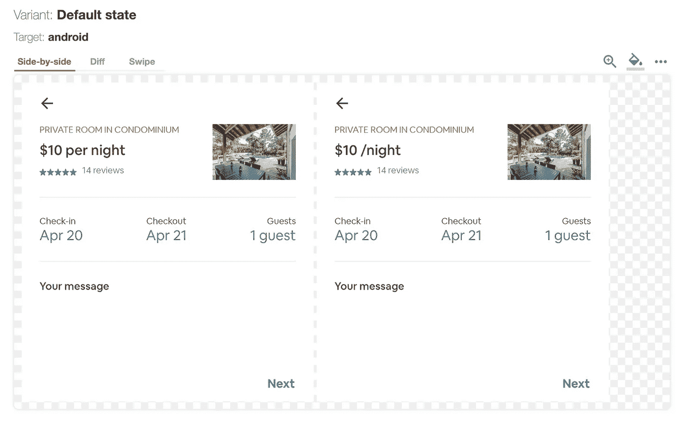
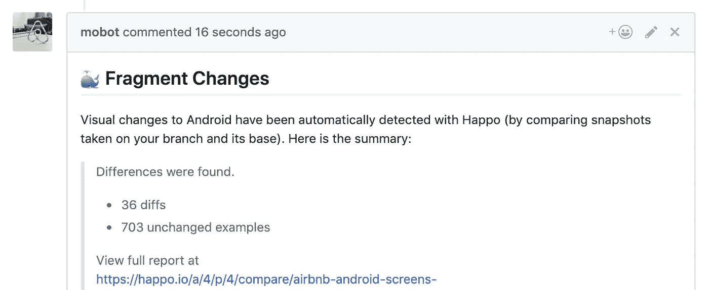

# Airbnb 更好的 Android 测试——第二部分:截图测试

> 原文：<https://medium.com/airbnb-engineering/better-android-testing-at-airbnb-a77ac9531cab?source=collection_archive---------1----------------------->

在我们 Airbnb Android 测试系列的第二部分，我们来看看如何使用截图测试来自动测试我们的片段 UI。

在[我们的第一篇文章](/airbnb-engineering/better-android-testing-at-airbnb-3f5b90b9c40a)中，我们看了 MvRx 模拟系统，以及在应用程序中打开任何屏幕或模拟的启动器。虽然这对手工测试来说很棒，但是模拟的最大好处是它们在自动化测试中释放的能量。为了利用这一点，我们从自动化截图测试开始，该测试检测提交之间的视觉变化。

这有助于发现一系列问题:

*   填充、颜色和样式更改
*   数据呈现方式的逻辑问题
*   如何显示边缘情况，如 null 或空数据
*   从右向左(RTL)布局回归
*   由库版本更改引入的更改，如新的 RecyclerView 或 ConstraintLayout 版本

手动测试所有这些需要很长时间，我们发现问题经常在我们的开发人员测试和 QA 过程中出现。特别是在复杂的屏幕上，很容易错过这些类型的回归。屏幕截图测试捕捉到了这些问题，此外，还添加了基本的健全性检查，以确保片段可以在不崩溃的情况下运行。对我们来说，这是最容易实现的目标，一旦我们有了模拟基础设施，添加它就相当容易了。

我们通过几个步骤实现了这一点:

1.  构建了一个 Android 库来截图一个活动并将位图上传到云存储
2.  利用 [Happo](https://happo.io/) 提供了一个网络用户界面来显示各个分支之间的位图差异
3.  设置我们的 CI 来截屏每个模拟，用 Happo 生成一个差异报告，并将结果发送回 PR

这些步骤中的每一步都提出了一系列独特的挑战。

# 截图库

捕捉一个截图是相当简单的，有很多库都是这样做的；然而，我们构建了自己的系统，因为我们有一些重要的需求。

首先，我们需要捕捉整个视图层次结构，而不仅仅是设备屏幕上可见的内容。我们广泛使用 RecyclerViews，这些视图不会将内容显示在屏幕之外，因此内容不会在正常的屏幕截图中被捕获。为了解决这个问题，我们手动测量 activity 视图，并允许它获得想要的高度。然后，我们强行布局。为了模拟真实的布局过程，我们还调用注册的布局监听器和预绘制监听器——这些监听器可能会请求另一个布局过程，在这个过程中，我们进行 case 循环，直到所有视图都被布局好。最后，我们将整个视图层次结构绘制到画布上，并保存到位图中。

另一个需求是最小化测试迭代中的视觉差异(即片状剥落)。本库有几种方法可以最小化这些差异:

*   禁用编辑文本光标，否则它会在计时器上闪烁
*   每个视图的焦点清晰，但可能设置不一致
*   使每个视图无效并请求布局，这对于清除度量缓存、可绘制状态以及确保每个视图将完全重绘自己是必要的
*   清除资源可绘制缓存，因为共享可绘制对象在以不同大小重绘时会导致不可预测的像素混淆。

我们的库将每个位图上传到云存储，并将所有的截图 URL 编译成一个报告，上传到 Happo。生成的 Happo 报告与 git SHA 相关联，Happo 可以将其与任何其他 SHA 报告进行比较，以发现跨分支的变化。

最后，因为我们必须处理成千上万的截图，所以我们的库必须尽可能的高性能。为了实现这一点，它使用协同程序同时处理和上传位图。

因为我们使用的是位图，所以内存异常是一个威胁。我们布局整个 RecyclerViews 的方法加剧了这种情况，这种方法可能会无限长。为了防止出现问题，我们将模拟数据中的列表截断为三项，但是仍然必须支持固有的长屏幕。通过有效地重用位图，并启用大堆，我们能够截屏长达 40，000 像素的视图。

我们对 AWS 和 Happo 都有不稳定的网络请求问题，这可能会超时或遇到我们无法控制的其他问题。用指数补偿将所有这些请求包装在重试逻辑中极大地增加了测试的稳定性。

结果是，对于每个模拟，我们都有一个相应的图像 url 来直观地表示它。位图的 md5 SHA 用作文件名，并且允许我们容易地检查两个图像是否相同。

# 哈波

Happo 是一个外部服务，我们利用它来运行位图比较。它提供了许多优秀的特性，例如

*   查看屏幕的位图历史记录，了解它是如何随时间变化的
*   当您关注的屏幕发生变化时，发送电子邮件提醒通知
*   UI 将差异标记为易变的，并存储起来以备将来比较
*   阻止 Github PR，直到差异报告被批准
*   一个 web 用户界面，用于查看报告中的所有屏幕截图，并识别跨报告的可视更改

A Happo screenshot diff showing a change in price per night styling

这里 Happo 显示了每晚价格显示方式的变化。diff 允许工程师检查他们的 PR 是否有预期的变更，并且代码评审员对 PR 做了什么有了更好的理解。在合并之前，任何意外的更改都很容易被发现并修复。

这种方法称为认可测试，有许多好处:

*   更新测试需要最少的努力。工程师只需要查看差异，并接受预期的变化。新报告将作为标准自动更新。
*   完整覆盖了 UI 呈现流程。不需要编写 UI 的手动测试。
*   UI 边缘案例的简单测试。这个系统可以根据我们的需要扩展以支持尽可能多的模拟变体。

# CI 设置

对于最终开发人员来说，将所有这些部分连接成一个内聚的测试体验需要做一些不平凡的工作。本系列文章的第 5–7 部分对此进行了详细描述。

简而言之，我们构建的测试框架自动查找应用程序中的每个 mock，将其加载到屏幕上，然后允许我们在其上运行我们的测试。这是以一种通用的方式完成的，它允许我们应用任何我们想要的测试验证——在这个例子中，是截图测试。

最终结果是每个 PR 运行一个阻塞作业来生成截图并进行比较。如果发现任何差异，将在 PR 上发布带有差异的评论和指向 Happo 报告的链接。

A Github PR comment indicating visual changed detected by Happo

这让作者和代码审查者都清楚 PR 导致了 UI 更改，并准确地显示了更改是什么。这对于捕捉回归和防止意外的代码变更有很大的帮助。

此外，开发人员不需要做任何额外的工作来为他们的片段设置截图测试。他们简单地将模拟定义添加到他们的片段类中(正如在[第 1 部分](/p/3f5b90b9c40a)中所解释的)，测试框架自动地挑选它们并生成截图。

# 附加测试

一旦我们建立了这个模拟测试系统，就很容易添加额外的检查:

*   我们设置 LeakCanary 仪器测试在每个模拟截屏时运行。这使得在测试结束后，如果片段、视图或者活动被泄露，自动检测和失败测试变得容易。
*   一旦我们的 Happo 库展示了整个活动，我们就对其运行 Espresso AccessibilityChecks 断言，以捕捉屏幕上常见的可访问性违规。
*   片段参数和状态通过一个进程运行，该进程模拟具有状态保存和重建的进程重建。这将检查它们是否可以打包和恢复而不会崩溃。我们还截屏了重建的结果，这样我们可以看到片段如何处理恢复保存的状态。

测试框架的奇妙之处在于，它为自动显示应用程序中的每个屏幕并在每个屏幕上运行动态生成的测试代码奠定了基础。这些额外的测试只需要几行代码就可以完成，并立即应用于应用程序的所有片段，不需要开发人员做额外的工作。随着我们纯粹从基础设施方面增加可测试性，产品工程师最初创建片段模拟的努力继续得到回报。

# 下一步:测试事件处理

在本文中，我们研究了如何测试屏幕的静态 UI 内容。然而，一个特性的大部分代码都是处理事件的，比如在屏幕间导航，更新状态，或者执行一个请求。

[在第 3 部分](/airbnb-engineering/better-android-testing-at-airbnb-1d1e91e489b4)中，我们将采用 UI 截图比较的想法，看看我们如何将它应用到交互测试中，以自动测试事件处理代码。

## 系列索引

这是关于 Airbnb 测试的七篇系列文章。

第 1 部分— [测试原理和模拟系统](/airbnb-engineering/better-android-testing-at-airbnb-3f5b90b9c40a)

**第二部分(本文)**——[用 MvRx 和 Happo 进行截图测试](/airbnb-engineering/better-android-testing-at-airbnb-a77ac9531cab)

第 3 部分— [自动化交互测试](/airbnb-engineering/better-android-testing-at-airbnb-1d1e91e489b4)

第 4 部分— [单元测试框架视图模型](/airbnb-engineering/better-android-testing-at-airbnb-part-4-testing-viewmodels-550d929126c8)

第 5 部分— [我们的自动化测试框架的架构](/airbnb-engineering/better-android-testing-at-airbnb-661a554a8c8b)

第 6 部分— [持续嘲讽的障碍](/airbnb-engineering/better-android-testing-at-airbnb-a11f6832773f)

第 7 部分— [测试生成和 CI 配置](/airbnb-engineering/better-android-testing-at-airbnb-eacec3a8a72f)

## 我们在招人！

想和我们一起在这些和其他大规模的 Android 项目上合作吗？Airbnb 正在全公司招聘几个 Android 工程师职位！有关当前空缺，请参见[https://careers.airbnb.com](https://careers.airbnb.com/)。