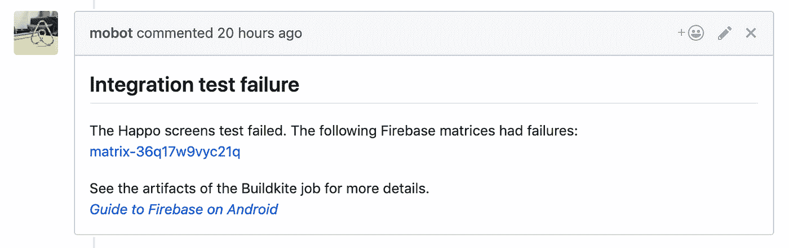
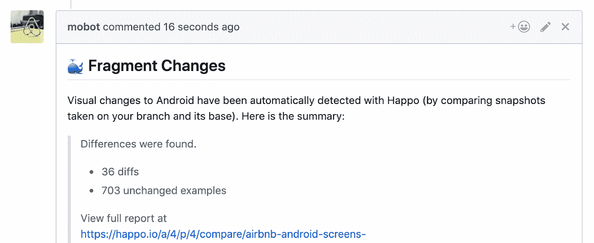

# Airbnb 更好的 Android 测试——第 7 部分:测试生成和 CI

> 原文：<https://medium.com/airbnb-engineering/better-android-testing-at-airbnb-eacec3a8a72f?source=collection_archive---------0----------------------->

在我们 Airbnb Android 测试系列的第七部分，也是最后一部分，我们将深入探讨我们的 CI 设置，并分享我们下一步的发展思路。

在以前的文章中，我们已经研究了 Airbnb 的产品架构，我们为其构建的模拟系统，以及这个生态系统如何使我们能够对我们的功能进行自动化测试。然而，一个值得注意的缺失部分是关于如何以及何时运行这些测试的讨论。

现在，我们将看看将我们所有的测试基础设施联系在一起的工具，以及我们如何设计它来为我们的工程师带来愉快的体验。

# 生成测试文件

正如本系列前面提到的，我们为片段定义了模拟数据，但是不需要我们的工程师编写普通的测试来测试这些模拟。相反，会生成测试文件。在这里，我们将仔细看看这在实践中意味着什么。

首先，我们使用 Kotlin 脚本来解析我们的应用程序目录，并提取所有 MvRx 片段的名称。

*   该脚本利用 Kotlin 编译器生成每个 Kotlin 文件的 AST，以便更容易检测片段类
*   通过 lint 规则，我们对片段实施了命名约定，这使得检测片段类变得更加容易
*   为了简单起见，我们收集了所有片段类的名称。如果一个片段不是 MvRx 片段，它将在测试运行时被跳过。

一旦我们有了片段类名，脚本使用 [KotlinPoet](https://github.com/square/kotlinpoet) 将一个 JUnit 测试文件写到我们的测试源目录，在 AndroidTest 文件夹中，这样一个测试构建将包括那些测试。最终生成的文件如下所示:

每个测试的名称都是基于片段的完全限定名，每个测试函数只是通过提供一个片段名来开始测试。运行测试的所有代码都存在于基类中，因此不需要包含在生成的文件中。有关这个基类和运行测试的活动的详细信息，请参阅上一篇文章。

这种代码生成方法有几个优点:

*   消除了为每个片段手动创建和维护测试的开销
*   使得将我们的测试工作分割成脚本能够分割的任何块变得很简单——这对于支持测试分片和确保测试的可伸缩性非常重要。一种简单的方法是在不可扩展的单一测试中运行所有的片段
*   使得添加新的测试类型变得很简单。当我们在截图测试之外添加交互测试时，我们所要做的就是在脚本中添加几行代码，为每个片段生成一个额外的函数

同样值得注意的是我们做出的一些设计决策:

*   因为我们的模拟框架使用定制的 DSL，所以脚本检测每个片段的所有模拟变体名称会更加复杂。相反，我们只是收集片段的名称。这意味着每个测试函数必须运行一个片段的所有模拟，而不是能够将每个模拟分割成它自己的测试。这通常是好的，但是对于具有许多模拟变体的片段来说，可能会导致更长的测试时间。为了解决这个问题，我们实现了一个基本的系统，用于将 mocks 分成不同的组，这个系统被设计成易于通过脚本进行解析。

*   该脚本对每个 Kotlin 文件的 AST 表示是有限的——它孤立地查看每个文件，不能遵循引用链。例如，如果一个属性是在另一个文件中定义的，我们就不容易看到它的类型。这意味着脚本需要做出一些可能容易出错的最佳猜测。在理想情况下，我们可以编译和运行整个应用程序，并以编程方式访问我们需要的任何信息——这将允许我们以有保证的方式收集所有 MvRx 片段和声明的模拟的详细信息(类似于 MvRx 启动器的工作方式)。然而，这将大大增加流程的复杂性和运行时间，而这两者都是我们努力减少的。实际上，Kotlin 脚本方法很好地满足了我们的需求，只需几秒钟就能运行。
*   JUnit 支持参数化测试，可以在运行时以编程方式声明这些测试。这几乎是我们生成测试的 Kotlin 脚本方法的完美替代，然而，参数化测试不能与测试分片一起工作，所以它会妨碍我们轻松扩展测试的能力。
*   类似地，一种简单的方法可以用来手动定义对片段进行分组的测试，比如从字母表的每个字母开始对所有片段进行测试。这在某种程度上是可行的，但是也不容易扩展，并且不能在分片之间均匀地分布测试。
*   可以构建一个定制的注释处理系统，其中用在编译时检测到的注释来注释片段，并用于生成测试文件。这种方法的准确性非常好，但是它也有一些缺点:1)需要样板文件来注释每个片段，而不是允许自动检测。2)注释处理器增加了编译时间。3)测试文件不能静态生成，它们依赖于编译

这个测试生成脚本在我们的 CI 测试作业开始时运行，因此在我们构建项目之前，测试源文件就存在于项目目录中。有关配置项配置的更多详细信息，请参见下面关于我们的配置项作业的部分。

总的来说，我们的脚本方法实现了以下目标:

*   以可接受的粒度和精确度，以编程方式检测片段及其模拟数据
*   支持测试的有效扩展，以及跨测试碎片的测试时间的公平分配
*   配置测试运行时，不会给 CI 作业增加太多时间
*   使我们能够轻松地添加新的测试类型
*   不会增加项目的复杂性
*   允许开发人员在为片段创建模拟时的最小开销
*   使我们能够只在受变更影响的片段上运行测试

# 集成测试的 CI 基础设施

我们的测试套件运行在每个 Github 对我们的应用程序库的 Pull 请求上。我们使用 Buildkite 来运行 CI，这使得我们可以很容易地为不同的测试类型添加尽可能多的独立管道——例如，单元测试和集成测试在不同的管道作业中运行，因此它们可以并行操作。因为本系列文章关注的是集成测试，所以我们只看一下管道是如何工作的。

在获取我们的应用程序库之后，我们首先运行上面解释的测试生成脚本。这将解析我们的项目以找到应该在测试中使用的片段和模拟，并在我们的 androidTest 目录中生成一个 JUnit 测试源文件。之前没有提到的是，这个脚本在测试中包含哪些片段方面也很聪明。

# 检测更改的片段

我们的管道将 PR 分支与它被合并到的分支进行比较，并检查哪些文件已经改变。然后，使用已更改的文件来确定哪些模块受到了更改的影响。我们的测试生成脚本使用这个来排除那些没有被变更影响的模块中的片段，允许我们只对那些行为已经被变更的片段运行变更。这使我们能够更快地运行测试，并节省 Firebase 成本。

如果采用这种方法，需要注意一些棘手的事情:

*   必须考虑模块依赖性。如果模块 A 包含一个被修改的文件，而模块 B 依赖于模块 A，那么我们必须确保模块 B 也包含在我们的测试中。这需要使用模块依赖图来确定变化。
*   外部依赖关系的改变也会影响模块。如果您更改了正在使用的库的版本，那么依赖于该库的所有模块都应该进行测试。为了简单起见，我们有一个单独的文件，其中声明了我们所有的依赖版本，如果对该文件有任何更改，我们就运行所有的测试。

# 处理 Firebase 停机

此时，我们已经生成了一个带有 Espresso 入口点的测试文件，用于测试受 PR 更改影响的片段。下一步是运行命令来构建应用程序 apk 并测试 apk，但是在继续之前，我们要进行健全性检查，以确保 Firebase 没有关闭。

我们的集成测试都在 Firebase 上运行，如果它因为某个事件而宕机，测试可能会失败。这对开发人员的生产力有一些负面影响:

*   开发人员对失败的原因和他们应该做什么感到困惑
*   对我们团队的大量求助请求

不幸的是，Firebase 经常不稳定，这对我们来说是一个问题，所以我们有一个自动化的方法来处理它。我们的管道使用[fire base status API](https://status.firebase.google.com/incidents.json)来检查 Firebase Test Lab 正在发生的事件，如果检测到事件，就向 PR 回发一条评论。该评论包括一个指向该事件的链接以及关于开发人员应该如何处理该事件的说明。

# 带侧翼的分片

现在，我们已经生成了测试文件，构建了 APK，我们已经准备好在 Firebase 上运行我们的测试了。有了 Firebase 的 gcloud 命令行支持，这相当简单，但这将在单个测试矩阵中连续运行所有测试。如果您有许多测试，这可能会花费很长时间，并且随着时间的推移不能很好地扩展。

令人欣慰的是，一个名为 [Flank](https://github.com/TestArmada/flank) 的伟大开源库可以帮助我们将测试分成碎片，在多个 Firebase 测试矩阵上并行运行。我们的完整测试套件需要大约两个小时的总测试时间，但是分割后只需要几分钟就可以运行(不包括安装和拆卸时间)。

Flank 的文档相当简单，所以我不会详细介绍我们的设置。我们的管道只是使用一个脚本来生成一个包含我们想要的配置的 flank.yml 文件，其余的由 flank 来处理。

需要注意的一点是，您选择的测试设备会对测试时间产生很大影响。对我们来说，仿真器比物理设备慢很多，所以我们只在物理设备上测试，以减少测试时间。此外，设备类型会极大地影响测试时间。我们最初使用谷歌 Pixel 进行测试，没有多想。后来对 Pixel 3 的实验表明，它的运行速度是我们测试的两倍。回想起来，这并不奇怪，但这是一个很好的提醒，提醒你要注意你使用的测试设备。

# 处理结果

一旦测试运行，我们在管道中的最后一个责任是将结果反馈给 PR。

## 失败

在测试失败时，一种简单的方法是，如果 Flank 出现任何错误，就让 CI 作业失败。然而，这使得最终开发人员很难了解失败的原因，然后他们不得不花时间深入 CI 日志，以找到正确的 Firebase 测试矩阵的链接——对于分片测试来说，这甚至更困难，因为不一定清楚哪些分片失败了。

自动化工具在这方面也有帮助，因此我们可以尽可能地减少开发人员的摩擦。我们的管道脚本执行以下操作:

*   将 Flank 的所有输出文件作为 Buildkite 工件上传，以便调试时可以轻松访问它们
*   解析 Flank 的 JUnit 报告，收集包含故障的测试矩阵列表
*   向 PR 回帖评论，并提供失败矩阵的链接

A PR comment links to Firebase Test Lab matrices that had test failures

这允许开发者直接从 PR 容易地访问 Firebase 故障。它还允许我们包含关于开发人员应该如何处理故障以及如何使用 Firebase 的文档链接，这在我们的贡献者数量持续增长时非常重要。

## 生成 Happo 报告

以前的文章深入讨论了我们使用 Happo 为截图和交互细节生成 diff 报告。这个 Happo 集成是作为我们 CI 工作的最后一个步骤完成的——脚本将测试中刚刚生成的 Happo 报告与主分支上的最新报告进行比较。如果有任何差异，我们会将评论和详细信息发回给 PR。

A Happo PR comment calls out visual changes that were detected

开发人员必须按照链接来检查 diff 结果，并在合并 PR 之前确认这些更改是有意的(有关这种批准测试方法的更多详细信息，请参见本系列的前几篇文章)。

值得一提的是，Happo 可以很好地处理分片测试。每个碎片上传自己的报告，Happo 将所有这些部分报告合并成一个代表所有碎片的最终报告。然而，一个复杂的问题是，当我们的测试只包括受变更影响的片段时，最终的报告将是不完整的。测试中不包括未更改的片段，因此 Happo 报告中没有这些片段，最终的 diff 会显示它们已被删除。

我们这里的解决方案是一个脚本，它从 master 获取最新的 Happo 报告，并使用未更改片段的列表将这些屏幕的详细信息复制到新报告中。这样做很好，但是有一个问题:我们必须确保主报告已经完全创建。如果 PR 最近被重新调整，那么为最近提交生成新的主报告的 CI 作业可能仍在运行，为了避免这种竞争情况，我们将这一步留到最后。

## 代码覆盖率报告

集成测试管道的最后一个职责是提取代码覆盖数据，并为 PR 计算代码覆盖报告。我们使用标准的 Jacoco 工具，它可以直接与 Flank 和 Firebase 集成。然而，由于我们在单独的管道中运行集成测试和单元测试，并且需要组合这些报告来获得绝对的覆盖数据，所以出现了一些复杂性。

一份覆盖报告被发回给 PR，以提高开发人员的意识。我们仍然处于构建代码覆盖工具的早期阶段，并希望随着时间的推移改进我们的功能。

## 公关评论

我在几个地方提到过，我们的 CI 渠道将评论反馈给 PR，以便向开发人员清楚地展示信息。这是通过我们构建的一个工具来完成的，这个工具可以让任何管道通过一个简单的 API 来发布评论。如果我们想要改变注释的内容，它处理更新注释，或者如果注释不再适用，它处理删除注释，这两者在推送新的提交和重新运行作业时都很重要。

这个工具建立在 Github 的 API 之上，用来创建和删除评论，并抽象出需要直接使用那个 API 的细节。此外，Github 没有提供一个简单的方法来更新评论，所以当我们想要“更新”它时，我们需要删除以前的评论并添加一个新的。为此，我们的工具要求每条消息都与一个字符串键相关联，并且它将 Github 注释 id 与 AWS 数据库中的这个字符串键相关联。这样，它可以查找该键可能已经存在的注释，并获得删除它所需的 id。

这个管理评论的工具对我们非常有帮助。它使我们的 CI 管道以一种清晰的方式向用户呈现信息变得简单，同时降低了管道本身的复杂性。

# 结束语

到现在为止，希望你已经很好地理解了我们测试 Android 代码的哲学，以及我们如何构建系统来使测试更容易和更全面。这些系统中的大多数都是在过去的一年中构建的，虽然我们对自己的进展非常满意，但我们始终关注着下一步。

## 未来的改进

我们现有的测试套件覆盖了很高比例的代码路径，但并不完美。我们正在计划改进它可以测试的用例的方法。幸运的是，我们的模拟架构使得在其上构建新的测试系统变得容易。

我们想探索的一些领域是:

*   深度链接处理的自动化测试
*   贯穿多个屏幕并触及生产 API 的端到端测试
*   支持利用模拟框架的手动定制 Espresso 测试
*   通过新的 [Jetpack 基准库](https://developer.android.com/jetpack/androidx/releases/benchmark)实现自动化性能基准测试
*   对测试其他公共代码路径的自动化支持，例如 EditText 输入和 onActivityResult 实现
*   测试优化的构建(R8/Proguard ),以捕捉只在生产中出现的问题

## 开源计划

我们为我们所做的测试工作感到自豪，并很高兴与大家分享！它被设计成与 MvRx 集成，因此是对开源库的自然扩展。我们正在发布这些测试框架，作为对 MvRx ( [从 2.0.0 alpha 版本](https://github.com/airbnb/MvRx/releases/tag/2.0.0-alpha1)开始)的补充，并期待来自社区的反馈和贡献。

## 系列索引

这是关于 Airbnb 测试的七篇系列文章。

第一部分— [测试哲学和模拟系统](/airbnb-engineering/better-android-testing-at-airbnb-3f5b90b9c40a)

第 2 部分— [使用 MvRx 和 Happo 进行截图测试](/airbnb-engineering/better-android-testing-at-airbnb-a77ac9531cab)

第 3 部分— [自动化交互测试](/airbnb-engineering/better-android-testing-at-airbnb-1d1e91e489b4)

第 4 部分— [单元测试框架视图模型](/airbnb-engineering/better-android-testing-at-airbnb-part-4-testing-viewmodels-550d929126c8)

第 5 部分— [我们自动化测试框架的架构](/airbnb-engineering/better-android-testing-at-airbnb-661a554a8c8b)

第 6 部分— [一致嘲讽的障碍](/airbnb-engineering/better-android-testing-at-airbnb-a11f6832773f)

**第 7 部分(本文)** — [测试生成和 CI 配置](/airbnb-engineering/better-android-testing-at-airbnb-eacec3a8a72f)

## 我们在招人！

想和我们一起在这些和其他大规模的 Android 项目上合作吗？Airbnb 正在全公司招聘几个 Android 工程师职位！有关当前空缺，请参见[https://careers.airbnb.com](https://careers.airbnb.com/)。