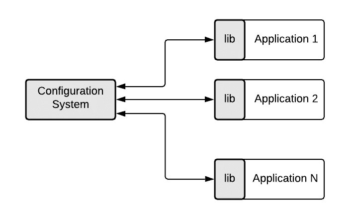
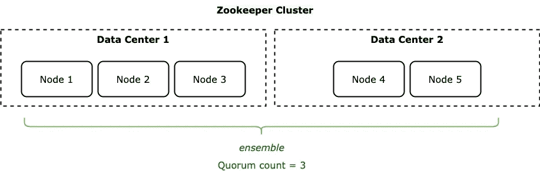

# 使用动态配置管理实现更好的应用

> 原文：<https://medium.com/walmartglobaltech/better-applications-using-dynamic-configuration-management-26c4bee5be3c?source=collection_archive---------1----------------------->


Image credits: [https://pixy.org/4864454/](https://pixy.org/4864454/)

# 介绍

开发应用程序时，它通常包含一个配置文件。在发布应用程序的竞争中，这些配置文件成为应用程序构建包的一部分。团队面临的最常见的问题是——一个配置属性的简单更改需要一个新的构建。开发人员说“这是一个简单的属性更改，我们不必为此运行整个回归套件”。QA 不同意，工程经理流汗，产品经理翻白眼。最后，团队再次运行整个回归套件，然后将构建提升到环境中。只为一个简单的属性改变。

让我们想象一个世界，其中应用程序配置的改变不需要新的构建，也不需要应用程序重启。在这样的世界里，存在着一个叫做“配置服务器”的组件。

# 什么是配置管理系统？

配置管理系统是负责管理应用程序配置的软件组件。生态系统中的应用程序使用这些配置来执行它们的职责。简单地说，任何配置管理系统的存在理由都是为其他服务提供存储和检索配置的能力。

在较高层次上，下图代表了一个配置管理系统。


Role of a configuration management system

软件生态系统中的多个应用程序与配置系统通信以检索配置。通信模式因系统而异。一些系统可能会公开 RESTful APIs，另一些系统可能会使用特定的协议进行全双工通信，还有一些系统甚至使用消息传递系统来广播配置更改事件。在组织内部开发配置管理系统是相当常见的。所以在你寻找开源解决方案之前，一定要弄清楚你的组织是否已经有了一个。

跨环境的配置系统应该是单一的。


所有环境(如开发、QA、试运行、UAT、生产)都应该使用相同的配置管理系统部署来存储它们的配置。团队应该避免配置管理系统的特定环境部署，以避免从一个环境到另一个环境的配置升级的开销。单一部署也降低了基础设施成本。

# 如何存储配置？

没有存储配置的行业标准。通常，配置存储为键值对，其中键是字符串，值的范围可以从简单的字符串到复杂的对象，如 JSON 或 YAML。将值的解释留给消费应用程序是一个好主意。配置系统应该足够灵活，可以接受任何给它的键值对。

# 如何储存秘密？

有时候团队可能不得不存储秘密信息，比如密码、API 密匙、秘密等。配置管理系统不是存储机密的正确选择。相反，它们应该存储在“秘密管理工具”中。好的秘密管理工具的几个值得注意的例子是 HashiCorp Vault、Azure Key Vault、AWS 密钥管理服务和 Google Cloud 的 Secret Manager。

在极少数情况下，团队在其生态系统中没有秘密管理工具，秘密可以被高度加密并存储在配置管理系统中。在这种情况下，应该注意不要将加密密钥存储在配置管理系统中。然而，这种方法是非常不鼓励的。

# 要查找的功能

**配置的动态更新**

配置管理系统应该能够在没有任何停机时间或服务中断的情况下对配置执行 CRUD 操作。

**变更的实时传播**

配置系统应该能够确保对配置的任何更新都应该随时可供应用程序使用。这可以通过多种方式实现。

一种方法是开发一个可以捆绑在每个客户端应用程序中的客户端库。这个客户端库应该公开一个从配置系统获取给定配置的最新值的接口。然而，这种方法带来了配置系统服务器上更高负载的额外成本。



另一种方法是使用消息系统，如 Kafka、RabbitMQ 等。在这种情况下，一旦配置更新，服务器就负责在消息传递系统上广播更新。客户端使用广播的消息将其本地缓存的值更新为最新值。这种方法的缺点是增加了消息传递系统的基础设施成本，客户端应用程序中需要更多的代码来使用更新。


**基于环境的定义**

配置系统应该能够基于环境直观地表示值。这允许按环境更好地划分值，并减少更新中的人为错误。例如:feature-flag 在生产中被打开，而它应该在 Stage 中被打开(这种情况会发生！).

**领袖选举和失败恢复**

配置系统应该对故障有弹性。因此，选择分布式配置系统，而不是容易成为 SPOF(单点故障)的系统。例如:Zookeeper 和 Redis 等系统可以轻松扩展到数千个节点，并足够智能地处理领导人选举和裂脑网络等接触问题。

**版本控制**

通过版本化来跟踪配置值有助于恢复配置值。如果配置更改导致现有功能中断，DevOps 团队可以快速将配置恢复到早期版本。在没有这个特性的情况下，团队到处寻找以前的值是很常见的，这个特性就是用这个值工作的。

**审计**

当由于配置更改而出现问题时，跟踪四个 W(什么、什么时候、谁、为什么)的能力就派上了用场。在法规遵从性至关重要的系统中，这也很方便。

# 选择

如果您需要设置配置管理系统，以下解决方案是一些流行且经过实战检验的可用选项。

1.  [阿帕奇动物园管理员](https://zookeeper.apache.org/)
2.  [Hashicorp 领事](https://www.consul.io/)
3.  [etcd](https://etcd.io/)
4.  [Redis](https://redislabs.com/ebook/part-2-core-concepts/chapter-5-using-redis-for-application-support/5-4-service-discovery-and-configuration/5-4-1-using-redis-to-store-configuration-information/)
5.  [Spring Cloud 配置服务器](https://cloud.spring.io/spring-cloud-config/reference/html/)
6.  公司专有解决方案

# 参考架构:动物园管理员

让我们把 Apache ZooKeeper 作为一个参考系统。我们将首先浏览 ZooKeeper 的架构和核心概念，然后继续看它作为配置管理系统的应用。

**动物园管理员架构**

ZooKeeper 运行在一个名为 ***ensemble*** 的服务器集群上，这些服务器共享你的数据状态。无论何时进行更改，在写入集合中服务器的法定数量(至少一半)之前，都不会被认为是成功的。ZooKeeper***quorum***是 ZooKeeper 集群运行所需的最小节点数。建议集合[由奇数个节点](https://stackoverflow.com/questions/58823341/why-is-it-recommended-to-create-clusters-with-odd-number-of-nodes)组成。


A simple Zookeeper ensemble



A more realistic *ensemble which avoids the ‘split brain’ issue*

一个 ***首领*** 在合奏团内被选举产生。来自客户端的所有写请求都被转发到一台服务器，称为 leader。其余的 ZooKeeper 服务器称为 ***追随者*** *。*

所有对 ZooKeeper 的写请求都被转发给 leader。领导者处理写请求，将它们转发给所有追随者，并等待追随者的 ack 响应。如果至少有一半的追随者回答，写作被认为是成功的。ZooKeeper 还保证来自同一个客户端的写操作将按照客户端发送的顺序进行处理。


ZooKeeper writes and replication

**数据模型和分层命名空间**

ZooKeeper 允许分布式进程通过一个共享的层次名称空间相互协调，该名称空间的组织方式类似于标准文件系统。名称空间由数据寄存器组成——在 ZooKeeper 的说法中称为***z 节点***——这些类似于文件和目录。与为存储而设计的典型文件系统不同，ZooKeeper 数据保存在内存中，这意味着 ZooKeeper 可以实现高吞吐量和低延迟。“znodes”由以“/”分隔的 Unicode 字符串的唯一绝对路径标识。


与标准文件系统不同，ZooKeeper 名称空间中的每个节点都可以有与其相关联的数据以及子节点。这就像有一个文件系统，允许一个文件也是一个目录。Znodes 维护一个数据结构，其中包括数据更改的版本号、ACL 更改和时间戳，以允许缓存验证和协调更新。每次 znode 的数据发生变化，版本号就会增加。例如，每当客户端检索数据时，它也会收到数据的版本。存储在名称空间中每个 znode 上的数据是以原子方式读写的。读取获取与 znode 相关的所有数据字节，写入替换所有数据。每个节点都有一个访问控制列表(ACL ),限制谁可以做什么。

## 担保

ZooKeeper 非常快，非常简单。但是，由于它的目标是为构建更复杂的服务(如同步)提供基础，所以它提供了一组保证。这些是:

*   顺序一致性—来自客户端的更新将按发送顺序应用。
*   原子性—更新要么成功，要么失败。没有部分结果。
*   单一系统映像—无论客户端连接到哪个服务器，它都会看到相同的服务视图。
*   可靠性—一旦应用了更新，它将从那时起持续存在，直到客户端覆盖更新。
*   及时性——保证系统的客户视图在一定的时间范围内是最新的。

# 作为配置管理系统的 ZooKeeper

## **结构化数据**

比方说，我们有一个名为“myapp”的应用程序，它的配置在一个属性文件中定义如下。

```
myapp.api.retry.enabled=true
myapp.api.retry.maxcount=3
myapp.api.retry.fallback=linear
```

要将这个配置移动到 ZooKeeper，我们需要将属性表示为 znodes，如下图所示。可以使用 ZooKeeper 命令行界面添加和更新这些属性。


Properties denoted as ZooKeeper znodes

一旦在 ZooKeeper 中创建了 znodes，所有感兴趣的客户端都需要查询以下属性(又名 znodes)。

```
/myapp/api/retry/enabled
/myapp/api/retry/maxcount
/myapp/api/retry/fallback
```

**环境特定配置**

扩展到环境感知，我们可以将环境名作为叶子节点添加到 znode 树中(如下图所示)。这允许我们重用整个配置树，并在最后添加特定于环境的值。


上面显示的 znodes 转换为以下属性

```
/myapp/api/retry/enabled/dev
/myapp/api/retry/enabled/qa
/myapp/api/retry/enabled/prd/myapp/api/retry/maxcount/dev
/myapp/api/retry/maxcount/qa
/myapp/api/retry/maxcount/prd/myapp/api/retry/fallback/dev
/myapp/api/retry/fallback/qa
/myapp/api/retry/fallback/prd
```

**在应用程序中查询配置**

ZooKeeper 支持大多数编程语言的[集成库](https://cwiki.apache.org/confluence/display/ZOOKEEPER/ZKClientBindings)(又名客户端绑定)。ZooKeeper 附带了 C、Java、Perl 和 Python 客户端绑定。支持 C#、Node.js、Scala、Go 等。可从社区获得。

客户端使用特定语言绑定与 ZooKeeper 通信。


Application — ZooKeeper integration using supported client libraries

1.  每个应用程序都应该包含绑定库，并且知道 ZooKeeper 服务器的列表。
2.  当应用程序需要获取配置时，它们应该调用 ZooKeeper 库中的`GET`方法。
3.  然后，zookeeper 库调用一个 ZooKeeper 服务器。如果目标服务器不可用，库将尝试下一个服务器。
4.  一旦收到响应，应用程序就可以使用响应值。
5.  当 ZooKeeper 中某个特定的配置值被更新或删除时，应用程序也可以利用 ZooKeeper `watch`接收更新。这可以通过客户端的持续轮询来减少 ZooKeeper 服务器上的负载。


Application — ZooKeeper integration leveraging ‘znode watch’ feature

# 结论

配置管理是管理应用程序的一个重要方面，特别是在现代、快节奏、面向客户的应用程序中。将配置从代码中分离出来是很重要的，这种分离可以确保配置可以用来控制生产中的代码行为。它甚至可以通过配置控制行为(例如用于服务请求的功能标志和引擎)来最小化在生产中推出新功能的风险。选择正确的配置管理系统可以为应用程序的发布周期增加显著的价值。