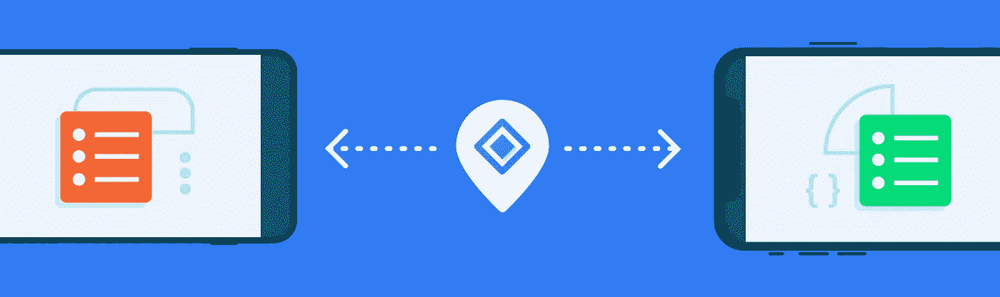
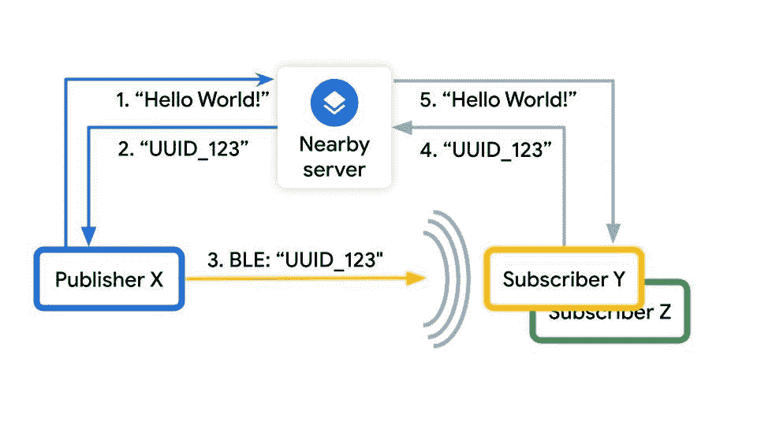

# 更好的谷歌附近的 API 的物理故事(第 1 部分，共 3 部分)

> 原文：<https://medium.com/androiddevelopers/better-physical-stories-with-googles-nearby-apis-280be707bbf9?source=collection_archive---------5----------------------->

作为 Google Play 服务的一部分，谷歌向那些希望通过将物理上的接近融入到他们的故事中来增强其最终用户体验的开发者提供附近 API。附近的 API 基于许多不同的技术，如蓝牙和 Wi-Fi。然而，您不需要了解这些技术中的任何一种就可以获得它们的所有好处。附近的 API 抽象掉了所有这些细节，留给你一个即插即用的界面，让你专注于应用的业务逻辑。

Nearby 专注于需要物理距离的开发者之旅。API 将这些物理通信分为三类:

*   [单向消息检测](https://developers.google.com/nearby/messages/overview)
*   [双向通信](https://developers.google.com/nearby/connections/overview)
*   使用[快速配对](https://developers.google.com/nearby/fast-pair/spec)进行设备配对

我们将教你如何使用这些选项和它们的好处。

我们将从*消息检测*开始，演示如何以及为什么您可以将[附近的消息 API](https://developers.google.com/nearby/messages/overview) 集成到您的应用程序中。然后，我们将带您浏览几个场景，在这些场景中，[near Connections API](https://developers.google.com/nearby/connections/overview)的*双向通信*功能可能会让您的应用受益。最后，我们将解释*设备配对*与[快速配对](https://developers.google.com/nearby/fast-pair/spec)及其对最终用户的好处。

因为 Nearby 是一个 Google Play 服务 API，它只能在带有[谷歌 Play 商店](https://play.google.com/store?&utm_source=na_Med&utm_medium=hasem&utm_content=Nov0520&utm_campaign=Evergreen&pcampaignid=MKT-EDR-na-us-1000189-Med-hasem-py-Evergreen-Nov0520-Text_Search_BKWS-id_100752_%7cEXA%7cONSEM_kwid_43700045371544949&gclid=Cj0KCQjwna2FBhDPARIsACAEc_VuoRETPMZbx6nqYga7yxX7E7larJfJwpAUNma5bgtA_1xB9k_zBRoaAvaeEALw_wcB&gclsrc=aw.ds)的 Android 设备上使用。

# 用附近的消息收回你的物理空间

## 附近系列的第 1 部分

移动技术使我们能够通过从用户体验中移除距离来重新定义距离。Gmail 和 Meet 等消息应用程序，以及 Docs 和 Sheets 等生产力应用程序，使人们能够实时聊天、聚会和协作，而不管他们在地球上的物理位置如何，也不管他们是否在地球上。

有些时候，让技术意识到物理上的接近可以让我们的体验更加神奇。以下是几个例子:

*   一群朋友注意到彼此的存在，可以在购物中心的美食广场一起享受即兴午餐
*   当超级购物者走进他们最喜欢的百货商店时，他们被提醒可以享受 15%的折扣，作为对他们业务的感谢。
*   一个本地新闻应用程序将本地媒体结合起来，捕捉不同的观点并进行实时合作。

考虑到这些关键的用户旅程，附近的消息 API 允许您的应用程序的感兴趣的用户在物理上非常接近时检测到彼此——无论用户是在 Android 还是 iOS 上。API 为您处理面向用户的权限请求:API 检查应用程序的权限并向用户请求权限，然后用户可以授予所需的权限。为了让 API 工作，发布消息的用户必须授予应用程序[蓝牙权限](https://developer.android.com/reference/android/Manifest.permission#BLUETOOTH)，希望接收消息的用户必须授予应用程序蓝牙和[位置权限](https://developer.android.com/reference/android/Manifest.permission#ACCESS_FINE_LOCATION)(注意，从 Android S 开始，用户不再需要授予位置权限来接收广播)。

API 将近距离定义为大约 100 米的半径，但允许大约 5 英尺的圆。

要在您的项目中使用附近的 API，请包含以下 Gradle 依赖项(始终使用最新版本的):

附近的消息 API 通过将设备分组为*发布者*或*订阅者*来工作:

*   *发布器*是一种发送广播消息向任何可能感兴趣的人宣布其存在的设备。
*   *订户*是对某些出版物表示出兴趣的设备。

比如我和我所有的朋友都是 ExampleApp 的狂热用户。我使用 ExampleApp 将我的午餐地点广播给我附近的任何一个朋友，他们都表示有兴趣听我的消息。

ExampleApp 将允许我朋友的设备检测来自我的设备的广播，因此尽管广播本身是无差别的，但 ExampleApp 负责通过仅提醒我的朋友我的活动来使其有用。

为了更好地理解 API 是如何实现其目标的，让我们来看看这些事务实际上是如何发生的。假设有三个设备，其中设备 X 是发布者，设备 Y 和 Z 是订阅者。这三个设备都在使用 ExampleApp。

1.  设备 X 发布消息(例如“Hello World”)。
2.  ExampleApp 设备 X 上的 App 将消息上传到附近的 Google 服务器，并收到一个随机的 UUID 作为响应(比如“Hello World”= > 123)。
3.  设备 X 开始 BLE 广告，广告该 UUID 直到发布停止。
4.  设备 Y 和 Z 检测到 BLE 广告。
5.  使用 Wi-Fi，设备 Y 和 Z 将 UUID 上传到附近的服务器。
6.  如果 UUID 和应用程序的签名完全匹配，谷歌附近的服务器就会返回原始信息。(附近的 API 提供了 app“签名”所以不用担心那部分。)
7.  ExampleApp 现在可以以任何创造性的方式使用 X 接近 Y 和 Z 的知识。

**图 1:附近的消息流**

您的用户不需要拥有 Google 帐户就可以使用附近的消息 API。然而，因为你的应用将使用谷歌附近的服务器，你需要一个[谷歌账户](https://accounts.google.com/signup/v2/webcreateaccount?continue=https%3A%2F%2Faccounts.google.com%2FManageAccount%3Fnc%3D1&flowName=GlifWebSignIn&flowEntry=SignUp)来注册你的应用。

一旦你创建了一个谷歌账户，你必须通过[谷歌开发者控制台](https://console.developers.google.com/flows/enableapi?apiid=copresence&keyType=CLIENT_SIDE_ANDROID&reusekey=true)完成获取 API 密钥的典型过程:

1.  转到[https://console.cloud.google.com/apis/credentials](https://console.cloud.google.com/apis/credentials)
2.  点击“ *+创建凭证*”并选择“ *API 密钥*
3.  复制创建的 API 密钥，并将其粘贴到 Android 项目的清单文件中

开发者现在可以使用`Nearby.getMessagesClient(this).publish(mMessage)`发布消息，其中 `message`代表你想要广播的`Message`。

如果你是一个*用户*，你不需要一个`Message`，只需要一个回叫来接收信息。

同一个应用程序可以既是发布者又是订阅者。例如，如果我和我的朋友都想在商场找到对方共进午餐，那么很有可能我们都在广播我们共进午餐的意图，同时又在倾听对方。

非常重要的一点是，一旦用户离开你的应用程序中提示他们使用附近功能的功能，就要停止发布和订阅，以节省电池和保护用户隐私。

要停止发布，请致电:

要停止订阅，请致电:

# 最佳实践

我们不建议使用附近的服务器来回发送消息(即使这是可能的)。

首先，“Hello World”消息没有加密，你不应该通过附近的服务器发布敏感信息。相反，一旦您通过附近的 API 验证了物理上的接近，您就可以转换到类似于[Firebase Cloud Messaging](https://firebase.google.com/docs/cloud-messaging)(FCM)的东西来继续通信。

其次，如果您持续使用附近的服务器作为消息服务，电池寿命可能会受到影响。

附近的消息 API 可以在前台模式或后台模式下运行。在后台模式下，电池消耗很少，因为当你打开屏幕时，API 只扫描几秒钟。然而，在前台模式下，API 将一直扫描，这意味着如果屏幕关闭并且附近的消息发现了信标，它最终会唤醒应用处理器，而这些唤醒是非常昂贵的，通常是正常电池消耗率的 2.5 倍至 3.5 倍。

因此，如上所述，一旦你与附近的消息建立了邻近关系，你应该过渡到像[Firebase Cloud Messaging](https://firebase.google.com/docs/cloud-messaging)(FCM)这样的服务，而不是依赖附近的消息进行持续的通信。

# 摘要

附近的消息 API 非常适合设备间的单向通信。它允许设备向感兴趣的人广播消息，API 可以在 Android 和 iOS 上使用。

有关如何利用附近消息 API 的更多信息，请访问我们的[文档](https://developers.google.com/nearby/messages/overview)和[示例](https://github.com/android/connectivity-samples/tree/main/NearbyMessagesDevices)。请继续关注本系列的第 2 部分，我们将讨论附近的连接 API。

查看本博客系列的第 2 部分，点击[查看更多内容。](/androiddevelopers/two-way-communication-without-internet-nearby-connections-b118530cb84d?source=user_profile---------1----------------------------)