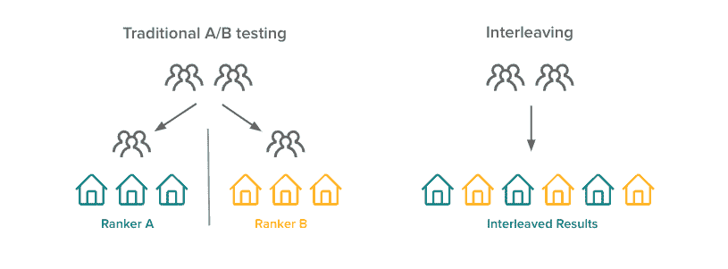
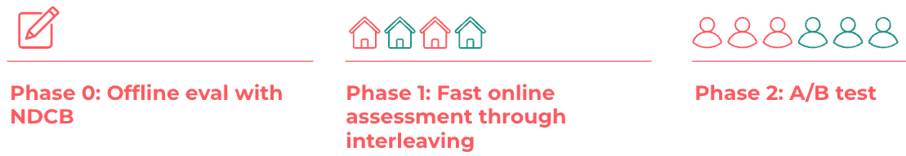
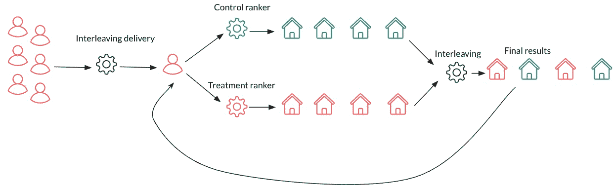
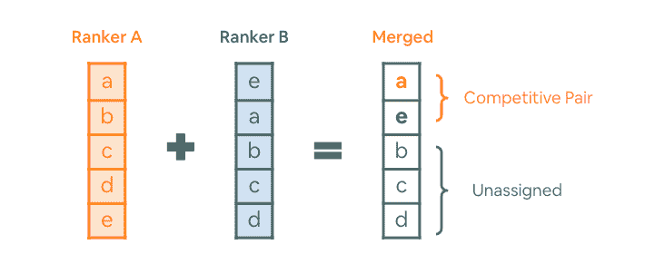
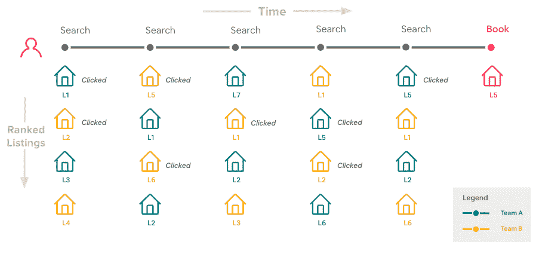
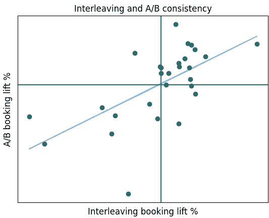

# 超越 A/B 测试:通过交错加速 Airbnb 搜索排名实验

> 原文：<https://medium.com/airbnb-engineering/beyond-a-b-test-speeding-up-airbnb-search-ranking-experimentation-through-interleaving-7087afa09c8e?source=collection_archive---------0----------------------->

介绍 Airbnb 交叉实验框架、用法和方法，以应对我们独特业务中的挑战

、[米歇尔·杜](/@michelle.du)、里德·安德森、[、](/@liweihe)

# 介绍

当用户在 Airbnb 上搜索住宿时，我们的目标是尽可能向他们展示最好的结果。Airbnb 的相关性团队积极致力于改善搜索排名体验，并帮助用户找到和预订符合他们偏好的房源。A/B 测试是我们在线评估的方法。我们的业务指标以转化为重点，客人旅行交易的频率低于其他电子商务平台。考虑到我们想要测试的想法的数量，这些因素导致实验带宽不足，并且存在开发更有效的在线测试方法的相当大的需求。

交错是一种在线排名评估方法[1–3]。在 A/B 测试中，用户被分成对照组和治疗组。每组中的那些人将持续暴露于来自相应排名者的结果。另一方面，交错混合了来自控制和处理的搜索结果，并将“交错”结果呈现给用户(图 1)。该机制允许由同一用户在两组之间进行直接比较，利用该机制，可以通过一组专门设计的度量来评估治疗分级器的影响。

在工程和数据科学领域构建框架都面临着一些挑战。在工程方面，我们需要扩展当前的 AB 测试框架，以支持交错设置，同时将 ML 工程师的开销降至最低。此外，我们的搜索基础设施是为单个请求搜索而设计的，需要显著扩展以支持交叉功能。在数据科学方面，我们设计了用户事件属性逻辑，这是衡量指标有效性的关键。

在 2021 年，我们建立了交错实验框架，并将其集成到我们的实验过程中，并在我们的搜索排序算法的开发中达到了 50 倍的灵敏度。进一步验证证实与 A/B 测试高度一致。我们已经在广泛的任务中使用交错技术，例如等级评估、超参数调整以及评估底层变化。这篇博文中详细介绍的系统设计和学习应该对希望提高实验敏捷性的读者有益。

图 1:A/B 测试 v.s .交错的图示。在传统的 A/B 测试中，用户被分成两组，并接受两种不同的评级。在交错中，向每个用户呈现来自两个排序器的混合结果。

# 搜索排序实验程序

通过交错，Airbnb 搜索排名实验使用三阶段程序来加快实验速度(图 2)。首先，我们用 NDCG(归一化的折扣累积收益)对排名器进行标准的离线评估。具有合理结果的排名器移动到具有交错的在线评估。得到有希望的结果的人继续参加 A/B 测试。

图 2:排序实验程序。为了实现快速迭代，我们使用交错来获得初步的在线结果

目前，我们将我们的搜索流量分成两部分，将绝大部分用于常规的 A/B 测试，其余的用于交叉实验。我们将交织业务分成桶(称为交织通道)，每个通道用于一个交织实验。每个交错实验占用常规 A/B 测试流量的大约 6%,以及运行长度的三分之一。在流量相同的情况下，我们实现了比 A/B 测试快 50 倍的速度。该团队现在可以在短时间内测试该想法的多种变化，并确定有前途的前进路线。

# Airbnb 交叉框架

如图 3 所示，交织框架控制实验流量，并生成交织结果返回给用户。具体来说，对于受到交错的用户，系统创建对应于控制和处理排序器的并行搜索请求，并产生响应。结果生成组件将两个响应与团队起草算法混合，将最终响应返回给用户，并创建日志记录。设计了一套度量标准来衡量影响。

图 3:交错系统概述。交织框架控制实验流量，并生成交织结果返回给用户

# 团队起草和竞赛配对

该框架使用*团队起草算法*来“交织”来自控制和处理的结果(我们称之为团队)。出于推广的目的，我们用两个团队 A 和 b 演示起草过程。算法的步骤如下:

1 抛硬币决定 A 队是否先走

2 从一个空的合并列表开始。重复以下步骤，直到达到所需的尺寸，

2.1 从两个排名者 A 和 B 的每一个中取还没有被选择的最高排名的结果(比如来自排名者 A 的列表 A 和来自排名者 B 的列表 e)。

2.2 如果两个列表不同，则选择列表 A 和 e，将 A 分配给 A，将 e 分配给 b。我们将(A，e)称为*竞争对*。按照步骤 1 中决定的顺序将该对添加到合并列表中

2.3 如果两个列表相同，则选择该列表，不要将其分配给任何团队。图 4 演示了这个过程。

图 4:解释了竞争对手的团队起草示例。在这里，我们假设 A 队先抛硬币。

*团队起草算法*使我们能够以公平的方式衡量用户偏好。对于每个请求，我们抛硬币来决定哪一组(控制组或治疗组)在排序*竞争性配对*时具有优先权。这意味着位置偏差被最小化，因为在一半的时间里，来自每个团队的列表在竞争对手对中的排名高于来自另一个团队的列表。

创建*竞争对*使得[方差减少](https://alexdeng.github.io/causal/sensitivity.html#vrreg)(一种通过提高点估计精度来加速实验的过程)更加直观，因为它对具有相同等级的项目进行重复删除，并且只给竞争对的印象而不是每个印象分配分数。在图 4 的例子中，排名者 A 和排名者 B 之间的比较简化为关于 *a* 是否优于 *e* 的公投。在这种情况下，不分配其他结果可以提高灵敏度。在两个排名者产生完全相同顺序的列表的极端情况下，传统的交错仍然会将点击与团队相关联，并给结果添加噪声；而对于竞争对，整个搜索查询可以被忽略，因为偏好正好为零。这使我们能够专注于灵敏度改进的真正差异。

此外，竞争对使我们能够更容易地将信用分配给下游的各种用户活动。与传统的交叉访问不同，传统的交叉访问主要是根据点击量来分配积分，而我们是根据预订量来分配积分的，这是一个下游活动。信用关联的灵活性使我们能够设计复杂的指标，而不必依赖点击信号。例如，我们能够定义度量标准来衡量预订在与配对中的某些类型的列表(例如，新列表)的竞争中获胜。这使我们能够进一步了解特定类别列表的排名变化是否在整体交错中发挥了作用。

为了在我们的交错方法中确定一个胜出的排名者，我们比较了目标事件上的*偏好裕度*(胜出团队的胜利裕度)，并对其应用单样本 t 检验以获得 p 值。验证研究证实，我们的框架产生的结果既可靠又稳定，假阳性率始终很低，实验之间的残留影响最小。

# 属性

*归因逻辑*是我们衡量框架的关键组成部分。如前所述，与网络搜索或流媒体网站相比，Airbnb 更独特的一个典型场景是，我们的客人可以在预订前发出多个搜索请求，他们预订的房源可能在不同的交叉团队中被查看或点击多次，这与主要目标是基于点击的转换的用例不同。

让我们用一个玩具的例子来演示这个概念。如图 5 所示，在整个搜索过程中，游客点击了预订的列表 3 次，每个排名者在他们的团队中都有该列表多次(2 次在团队 A，1 次在团队 B)。就这位客人而言，我们可以看到不同的归因方法如何得出不同的结论:

*   如果我们在第一次点击时将预订归于团队，我们应该将其分配给团队 B，并声明团队 B 是该客人的获胜者；
*   如果我们在最后一次点击时将预订归于团队，我们应该将其分配给团队 A，并声明团队 A 是客人的获胜者；
*   如果我们在每次点击预订时都将其归属，我们应该将它两次分配给团队 A，一次分配给团队 B，并最终宣布团队 A 是客人的获胜者。

图 5:访客旅程的简化示例。游客发起多次搜索，并在最终进行预订之前多次查看预订的列表。

我们创建了多种归因逻辑变体，并在大量交叉实验中对它们进行了评估，这些实验也将 A/B 运行作为“基础事实”。我们将我们的主要度量设置为在交错和 A/B 测试之间具有最佳一致性的度量。

# 与 A/B 测试一致

为了进一步评估交错和 A/B 测试之间的一致性，我们跟踪了合格的交错和 A/B 对，并确认这两者在 82%的时间内彼此一致(图 6)。这些实验也是高度敏感的，正如网飞等其他公司以前的工作所指出的那样。为了提供一个具体的例子，我们有一个排序器，它随机选取前 300 个结果中的一个列表，并将其插入到顶部的位置。只需要交错 0.5%的 A/B 运行时间和 4%的 A/B 流量，就可以得到与其相应的 A/B 测试相同的结论。

图 6:交错和 A/B 一致性。我们跟踪了合格的交错和 A/B 对，结果表明这两者在 82%的时间里是一致的

在大多数情况下，交错被证明与传统的 A/B 测试不一致，我们发现原因是集级优化。例如，一个排名器依赖于一个模型来确定它将多强烈地降级具有高主机拒绝概率的列表，并且该模型是给定当前页面的预订概率。交错打破了这种假设，并导致不准确的结果。根据我们的经验，我们建议涉及集合级优化的排序器应该根据具体情况使用交错。

# 结论

搜索排名质量是 Airbnb 用户找到他们想要的住宿的关键，有效地迭代算法是我们的首要任务。交错实验框架解决了我们的 A/B 测试带宽有限的问题，并提供了高达 50 倍的搜索排序算法迭代速度。我们进行了全面的验证，证明交错高度稳定，并且与传统 A/B 有很强的相关性。交错目前是我们实验程序的一部分，也是 A/B 测试前的主要评估技术。该框架为该公司开辟了一个新的在线实验领域，并可应用于其他产品表面，如推荐。

有兴趣在 Airbnb 工作吗？点击查看我们的开放职位[。](https://careers.airbnb.com/)

# 感谢

我们要感谢 Aaron Yin 对算法和指标实施的指导，感谢不断建议我们优化和扩展框架以支持更多用例，感谢 Chunhow Tan 对提高交错指标计算效率的宝贵建议，感谢 Tatiana Xifara 对实验交付设计的建议。

没有我们搜索后端团队的支持，这个系统是不可能实现的，特别是、朱、、夏尔马和班纳吉。我们从他们的设计建议和操作上的密切合作中受益匪浅。

我们还要感谢 Alex Deng、Huiji Gao 和 Sanjeev Katariya 对交错和本文的宝贵反馈。

# 参考

[1] JOACHIMS，t .使用点击链接数据优化搜索引擎。《ACM 知识发现和数据挖掘国际会议论文集》(KDD)。美国计算机学会，纽约，纽约州，132-142。2002.

[2] JOACHIMS，t .使用点击链接数据评估检索性能。在文本挖掘中。物理出版社/施普林格出版社，79-96 页。2003.

[3]f . RADLINSKI，m . kur up 和 t . JOACHIMS .点击链接数据如何反映检索质量。第 17 届 ACM 信息和知识管理会议论文集(CIKM’08)。美国计算机学会，纽约，纽约州，43-52。2008.

[4]拉德林斯基、菲利普和尼克·克拉斯韦尔。"在线检索评估的优化交叉存取."第六届 ACM 网络搜索和数据挖掘国际会议论文集。2013.

[5]霍夫曼、卡佳、西蒙·怀特森和马腾·德·里克。"从点击量推断偏好的概率方法."第 20 届 ACM 信息和知识管理国际会议录。2011.